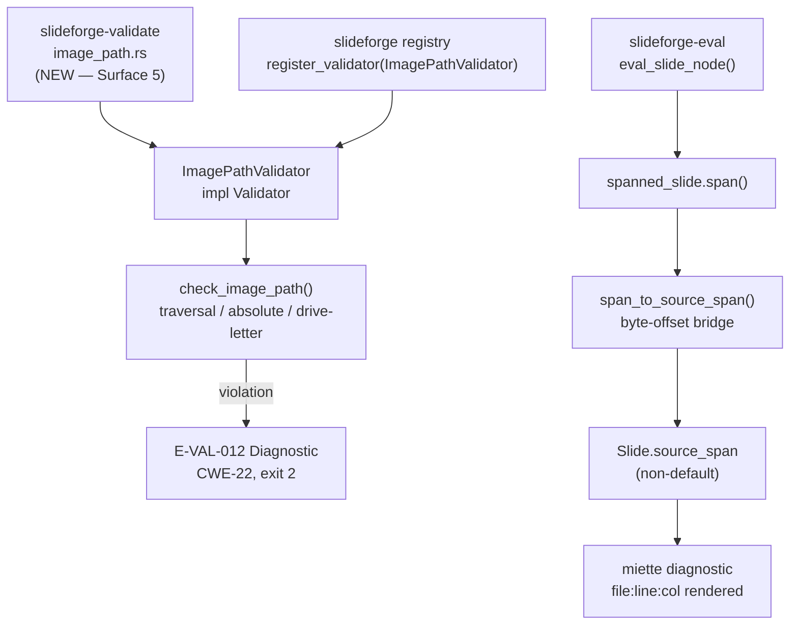
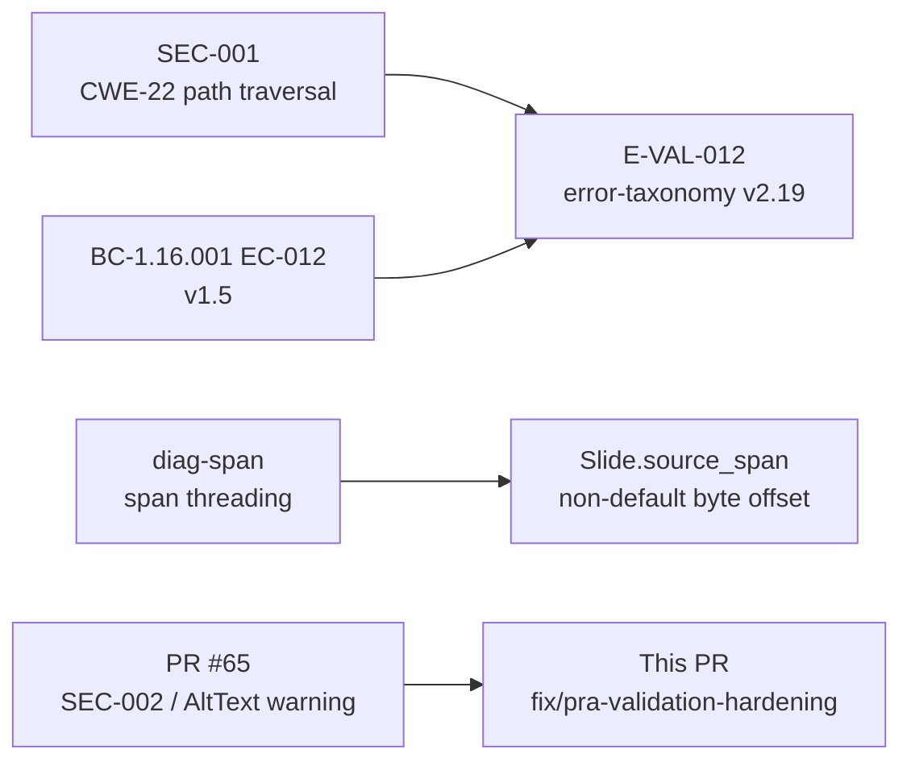
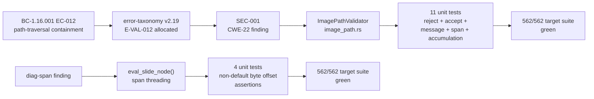

# fix(validate,eval): image-path traversal containment (E-VAL-012) + slide source-span threading (SEC-001, diag-span)

**Epic:** Wave 4 Follow-Up Validation Hardening
**Mode:** fix / security hardening
**Branch:** `fix/pra-validation-hardening` → `develop`
**Convergence:** CONVERGED — 3 commits; fmt + pedantic clippy (unwrap_used denied) + rustdoc -D warnings all green

---

## Summary

Two Wave-4 follow-up findings resolved in this PR:

- **SEC-001 (CWE-22, MED)** — New `ImagePathValidator` (Validator surface #5) in `slideforge-validate` rejects `ImageSpec.path` values that escape the source root: `..` traversal segments (segment-exact, not substring), absolute paths (`/` or `\`), and Windows drive letters. Emits new error code `E-VAL-012` (severity: error, exit 2 in strict mode). Allocated in error-taxonomy v2.19; traces to BC-1.16.001 EC-012. Registered in `slideforge/src/registry.rs` as Surface 5. Pre-emptive containment: no image disk I/O exists yet, so this guards future image loading before it lands.
- **diag-span** — The evaluator's `eval_slide_node` hardcoded `SourceSpan::default()`, causing validation diagnostics to render `file:'' line:0 col:0`. Now threads the real slide span (`spanned_slide.span()`) into `Slide.source_span` via the byte-offset bridge; miette resolves line:col from the byte offset at render time.

---

## Architecture Changes

---

## Story Dependencies

---

## Spec Traceability

---

## Findings Addressed

### SEC-001 — Image Path Traversal Containment (CWE-22, MED)

**Category:** Security / Input Validation
**CWE:** CWE-22 (Improper Limitation of a Pathname to a Restricted Directory)
**Severity:** MED (blocking under project security policy)
**Error code:** `E-VAL-012` (error-taxonomy v2.19, BC-1.16.001 EC-012 v1.5)
**Plugin surface:** Validator #5

**What was missing:** No validator existed to reject `ImageSpec.path` values that escape the source root. Future image-loading code would have been exposed to path traversal if this gap was not closed before disk I/O shipped.

**What ships:**
- `crates/slideforge-validate/src/image_path.rs` — new file, 713 lines
- `ImagePathValidator` struct implementing `Validator` trait
- `E_VAL_012 = "E-VAL-012"` public constant
- Three detection classes, applied in priority order:
  1. Windows drive letter prefix (`[A-Za-z]:`)
  2. Absolute path (`/` or `\` prefix)
  3. Traversal segment — path split on `/` and `\`, any component equal to exactly `".."`; a segment like `"..images"` is NOT a traversal segment
- Errors accumulate (no short-circuit) — all violations in a deck are reported
- Each violation carries the `ImageSpec`'s own `source_span` for diagnostic location
- Registered in `slideforge/src/registry.rs` via `register_validator(Box::new(ImagePathValidator))`

### diag-span — Slide Source-Span Threading

**Category:** Diagnostics / Developer Experience
**Severity:** MED (validation diagnostics were misleading/useless without location)

**What was wrong:** `eval_slide_node` called `SourceSpan::default()`, so all validation diagnostics that cited a slide location rendered as `file:'' line:0 col:0`.

**What ships:**
- `eval_slide_node` now calls `spanned_slide.span()` and routes through `span_to_source_span()` byte-offset bridge
- `Slide.source_span` carries a real byte-offset derived from the parse span
- miette resolves line:col from the byte offset at diagnostic render time
- Full `SourceMap` line:col remains a separately-documented deferred story (tracked separately); this PR closes the `default()` regression

---

## Test Evidence

| Suite | New Tests | Status |
|-------|-----------|--------|
| `slideforge-validate` `ImagePathValidator` — reject cases (traversal, absolute, drive-letter) | 7 | PASS |
| `slideforge-validate` `ImagePathValidator` — accept cases (safe relative paths) | 2 | PASS |
| `slideforge-validate` `ImagePathValidator` — message format + span equality + accumulation | 2 | PASS |
| `slideforge-eval` diag-span — non-default byte-offset assertions | 4 | PASS |
| **Target suite total** | **15 new** | **562/562** |

**Workspace:** 3428/3429. The single non-pass is the pre-existing flaky `slideforge-diagrams::cold_budget::test_cold_budget_under_200ms` (timing-sensitive; passes in isolation; tracked as draft STORY-080). This is NOT a regression introduced by this PR.

**Gates:**
- `cargo fmt --all -- --check`: green
- `cargo clippy --workspace --all-targets --all-features -- -D warnings` (pedantic, `unwrap_used` denied): green
- `RUSTDOCFLAGS="-D warnings" cargo doc --workspace --no-deps`: green

---

## Security Review

**Reviewer:** security-reviewer (Wave-4 follow-up pass)
**Finding:** SEC-001 (CWE-22, MED) — path traversal in future image loading
**Resolution:** Contained pre-emptively by `ImagePathValidator` before any disk I/O ships
**Residual risk:** None for the traversal attack vector. Full SourceMap resolution for diagnostic spans deferred to a documented follow-up story (non-security, DX only).
**OWASP:** A03:2021 (Injection / Path Traversal) — mitigated at the validation layer.

---

## Spec Artifacts (factory-artifacts branch)

These spec artifacts are already committed on `factory-artifacts` and consumed by this code PR:

| Artifact | Version | Change |
|----------|---------|--------|
| `error-taxonomy.md` | v2.19 | E-VAL-012 allocated (CWE-22, severity: error, exit 2) |
| `BC-1.16.001` | v1.5 | EC-012 added for path-traversal containment |

---

## Risk Assessment

| Dimension | Assessment |
|-----------|-----------|
| Blast radius | Narrow — new validator file + registry registration + eval span threading. No existing behavior changed. |
| Regression risk | Low — all existing tests remain green; 15 net-new tests added. |
| Performance impact | Negligible — validator iterates `deck.slides[*].blocks` once per build; no I/O. |
| Security posture | Improved — CWE-22 attack surface closed before image disk I/O ships. |
| Backward compatibility | None broken — new validator produces errors only for previously-rejected paths (traversal/absolute/drive-letter are invalid DSL values). |

---

## Pre-Merge Checklist

- [x] PR description matches actual diff
- [x] All target-suite ACs covered (562/562 green)
- [x] Security finding SEC-001 resolved and verified
- [x] diag-span regression closed
- [x] E-VAL-012 allocated in error-taxonomy v2.19 (factory-artifacts branch)
- [x] BC-1.16.001 EC-012 v1.5 committed (factory-artifacts branch)
- [x] `cargo fmt` clean
- [x] `cargo clippy` pedantic clean (unwrap_used denied)
- [x] `rustdoc -D warnings` clean
- [x] Workspace 3428/3429 (1 pre-existing flaky excluded, tracked STORY-080)
- [x] No AI attribution in commits
- [ ] CI checks passing (pending post-merge CI run)
- [ ] Dependency PRs merged (none — base is develop, previous fix PR #65 already merged)
