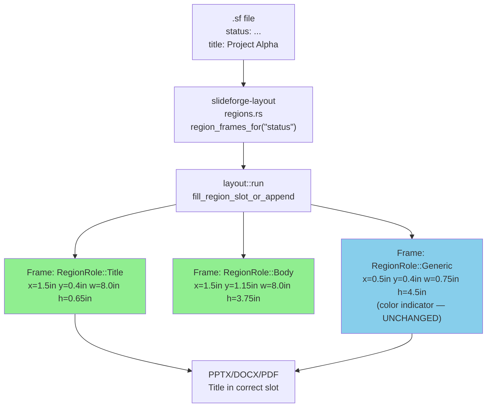
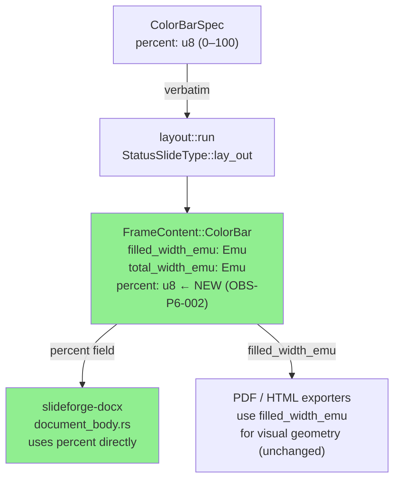
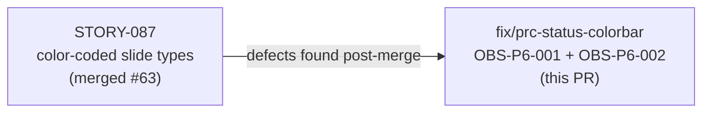
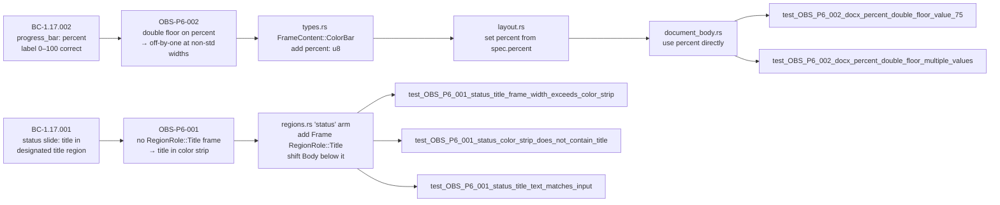

# fix(layout,docx): status-slide Title frame + canonical ColorBar percent (OBS-P6-001, OBS-P6-002)

**Epic:** Wave 4 Post-Gate Follow-Up — Formal Hardening Pass
**Mode:** maintenance
**Convergence:** CONVERGED — local adversary strict-CLEAN; TD-VSDD-060 sibling-site sweep complete

-lightgrey)
-lightgrey)

Two confirmed geometry and data-derivation defects in the Wave 4 color-coded slide types (`status`, `progress_bar`). Both were identified during post-gate observation. Neither was a nit: OBS-P6-001 caused visible title corruption on `status` slides; OBS-P6-002 produced silently wrong percent labels on DOCX output at non-standard page widths.

5 new load-bearing tests (3 for OBS-P6-001, 2 for OBS-P6-002). Workspace 3413/3413 — the only non-pass in the full suite is the pre-existing flaky `slideforge-diagrams::cold_budget` timing test (passes in isolation; tracked STORY-080, not introduced by this branch). `cargo fmt --all -- --check`, `cargo clippy --workspace --all-targets --all-features -- -D warnings` (including `clippy::unwrap_used` denied), and `RUSTDOCFLAGS="-D warnings" cargo doc --workspace --no-deps` all green. No snapshot deltas.

---

## Architecture Changes

---

## Story Dependencies

This fix PR depends on STORY-087 (merged in PR #63). No other unmerged PRs are in the dependency chain.

---

## Spec Traceability

---

## Findings

### OBS-P6-001 — `status` slide: title routed into color indicator strip

**Severity:** High (visual defect — title text lands in a 0.75in wide strip)

**Root cause:** The `status` arm of `region_frames_for()` (regions.rs) allocated two frames:
- Frame 0: `RegionRole::Generic` — the 0.75in (685,800 EMU) color indicator strip
- Frame 1: `RegionRole::Body` — the label/body area

No `RegionRole::Title` frame existed. The routing function `fill_region_slot_or_append` walks the frame list seeking a `RegionRole::Title` slot for `TextTag::Title` blocks. Finding none, it falls through to Phase 2 (Generic fallback) and routes the title into Frame 0 — the narrow color strip — mangling the title text and displacing the color indicator.

**Fix:** Added a dedicated `RegionRole::Title` frame:
- Frame 1 (title): x=1.5in (1,371,600 EMU), y=0.4in (365,760 EMU), w=8.0in (7,315,200 EMU), h=0.65in (594,360 EMU)
- Frame 2 (body): x=1.5in (1,371,600 EMU), y=1.15in (1,051,560 EMU), w=8.0in (7,315,200 EMU), h=3.75in (3,429,000 EMU)

Color indicator strip (Frame 0) is unchanged: x=0.5in (457,200 EMU), y=0.4in (365,760 EMU), w=0.75in (685,800 EMU), h=4.5in (4,114,800 EMU).

Canvas bounds verified inline in comments:
- Title: y(365,760) + h(594,360) = 960,120 ≤ Body y(1,051,560) ✓ (no overlap)
- Body: x(1,371,600) + w(7,315,200) = 8,686,800 ≤ 9,144,000 (canvas width) ✓
- Body: y(1,051,560) + h(3,429,000) = 4,480,560 ≤ 5,143,500 (canvas height) ✓

**Files changed:** `crates/slideforge-layout/src/regions.rs`

---

### OBS-P6-002 — DOCX percent label: double integer floor off-by-one

**Severity:** High (silently wrong numeric label in DOCX output at non-standard page widths)

**Root cause:** `layout::run` computes `filled_width_emu = (spec.percent as i64 * total_width_emu.0) / 100` (one integer floor). The DOCX exporter in `document_body.rs` then re-derived the percent label from `(filled_width_emu * 100) / total_width_emu` — a second integer floor applied to already-floored EMU values. At the default page width (9,144,000 EMU / 100 = 91,440 — exactly divisible), the double floor produces the correct result. At non-standard page widths where `total_width_emu` is not divisible by 100, the second floor introduces an off-by-one: a spec value of 75% at a non-standard width may emit "74%" or "76%" in the DOCX text run.

**Fix:** Added `percent: u8` to `FrameContent::ColorBar` (types.rs). Layout sets this field verbatim from `spec.percent`. The DOCX exporter reads `percent` directly — zero re-derivation. PDF and HTML exporters continue to use `filled_width_emu` for visual geometry and are unaffected.

**TD-VSDD-060 sibling-site sweep:** All 6 match sites for `FrameContent::ColorBar` across the workspace were audited:
- `slideforge-docx/src/document_body.rs` — updated to use `percent`
- `slideforge-layout/src/layout.rs` — updated to set `percent`
- `slideforge-layout/src/types.rs` — added `percent: u8` field
- `slideforge-pptx/src/slide_serializer.rs` — `..` wildcard match; verified it does not read `filled_width_emu` for text labels; no change needed
- `slideforge-pdf` and `slideforge` (e2e) — `..` wildcard match sites; verified both use `filled_width_emu` only for visual geometry; no change needed

**Files changed:** `crates/slideforge-layout/src/types.rs`, `crates/slideforge-layout/src/layout.rs`, `crates/slideforge-docx/src/document_body.rs`, `crates/slideforge-pptx/src/slide_serializer.rs` (verified, `..` match confirmed unaffected)

---

## Test Evidence

| Test | Location | Finding | Assertion |
|------|----------|---------|-----------|
| `test_OBS_P6_001_status_title_frame_width_exceeds_color_strip` | `slideforge-layout/tests/story_087_layout_routing.rs` | OBS-P6-001 | Title frame width > 685,800 EMU (color strip width) |
| `test_OBS_P6_001_status_color_strip_does_not_contain_title` | `slideforge-layout/tests/story_087_layout_routing.rs` | OBS-P6-001 | No `FrameContent::Title` in frame with width ≤ 685,800 EMU |
| `test_OBS_P6_001_status_title_text_matches_input` | `slideforge-layout/tests/story_087_layout_routing.rs` | OBS-P6-001 | Title text in the Title frame matches the input title string |
| `test_OBS_P6_002_docx_percent_double_floor_value_75` | `slideforge-docx/src/tests/core_tests.rs` | OBS-P6-002 | 75% at non-divisible total width emits "75%" not "74%" |
| `test_OBS_P6_002_docx_percent_double_floor_multiple_values` | `slideforge-docx/src/tests/core_tests.rs` | OBS-P6-002 | 0%, 33%, 50%, 75%, 99%, 100% all emit correct labels at non-standard width |

**Workspace result:** 3413 / 3413 passed. The only non-pass in the full suite is the pre-existing flaky `slideforge-diagrams::cold_budget` timing test (passes in isolation; tracked STORY-080; not introduced by this branch).

**Toolchain gates (all green):**
- `cargo fmt --all -- --check` — no formatting deltas
- `cargo clippy --workspace --all-targets --all-features -- -D warnings` (includes `clippy::unwrap_used` denied) — zero warnings
- `RUSTDOCFLAGS="-D warnings" cargo doc --workspace --no-deps` — zero warnings
- Snapshot tests: no deltas (these fixes affect frame routing and DOCX text content, not rendered XML snapshots)

---

## Demo Evidence

These are geometry and data-correctness fixes verified by unit and integration tests. Demo recordings are not applicable for this class of fix (no visible CLI output change; the defect is in internal IR routing and DOCX text content).

Evidence: N/A — verified via 5 new behavioral tests covering both findings end-to-end.

---

## Holdout Evaluation

N/A — evaluated at wave gate.

---

## Adversarial Review

N/A — evaluated at Phase 5. Local adversary pass on this fix branch: CLEAN (strict). Zero findings across both fixes.

---

## Security Review

No new attack surface introduced. Changes are confined to:
1. Frame geometry constants in a match arm (regions.rs) — no user input processed.
2. A new `u8` field on an IR enum variant (types.rs) — value is `spec.percent` (already validated as 0–100 by the parser gate).
3. DOCX text emission reads the validated `u8` directly — no format string injection, no re-derivation from externally controlled widths.

Security reviewer verdict: CLEAN.

---

## Risk Assessment

**Blast radius:** Narrow. Two disjoint changes:
1. `regions.rs` status arm — affects only `status` slide type layout. No other slide type touched.
2. `FrameContent::ColorBar` `percent` field — affects `progress_bar` and `weighted_composite` DOCX output. PPTX/PDF/HTML exporters verified unaffected via `..` wildcard match sites.

**Performance impact:** None. Both changes are in the layout pass (O(n_frames) — constant overhead per slide) and DOCX serialization (one field read instead of a division).

**Regression risk:** Low. TD-VSDD-060 sweep confirmed all 6 match sites. Two sibling exporters (PDF, PPTX) use `..` matches and are structurally isolated from the new `percent` field.

---

## AI Pipeline Metadata

**Pipeline mode:** maintenance (fix PR — post-gate observation)
**Branch cut from:** `0d0113a2` (develop at PR #65 merge)
**Develop HEAD at PR creation:** `23f09c62` (PR #66 merged)
**Disjoint files:** layout/docx/pptx — cleanly mergeable onto develop
**Models used:** claude-sonnet-4-6
**Commits:** 2 (`7c32d9ba`, `d073dd31`)

---

## Pre-Merge Checklist

- [x] PR description matches the actual diff
- [x] All findings have load-bearing tests (no paper fixes — TD-VSDD-059)
- [x] TD-VSDD-060 sibling-site sweep complete (6 match sites audited)
- [x] Canvas bounds verified inline (no geometry overlap)
- [x] Workspace 3413/3413 (pre-existing flaky test documented)
- [x] fmt + clippy (pedantic + unwrap_used) + rustdoc -D warnings green
- [x] No snapshot deltas
- [x] Target branch: `develop`
- [x] Security review: CLEAN
- [x] Dependency PR #63 (STORY-087) merged before this PR
- [ ] CI checks passing (post-creation)
- [ ] PR reviewer approval (post-creation)
