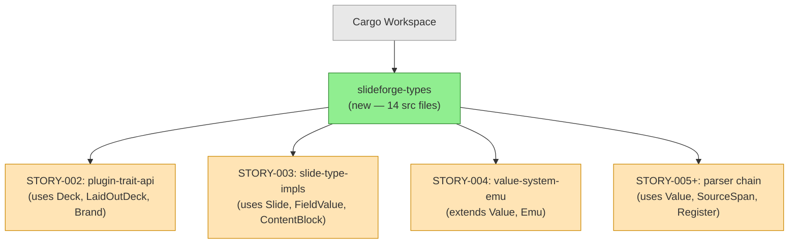
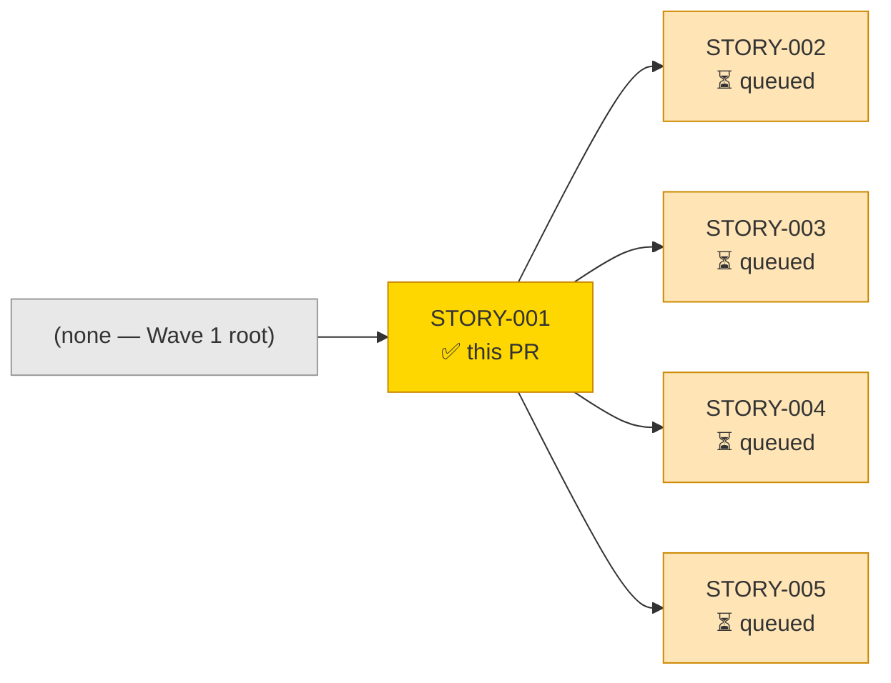
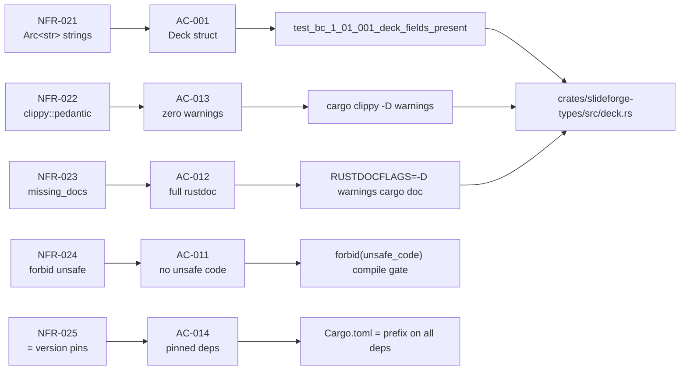
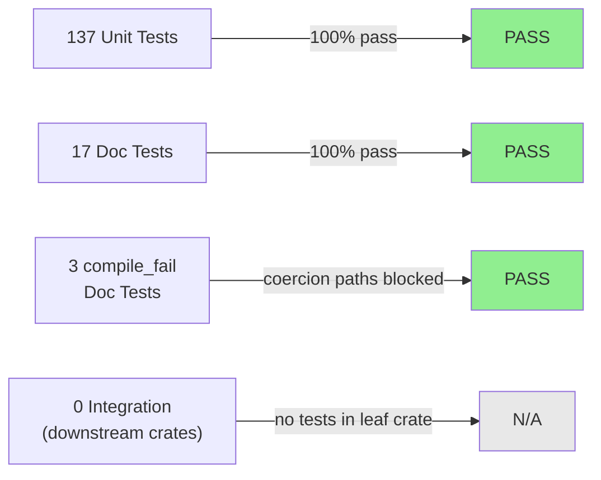
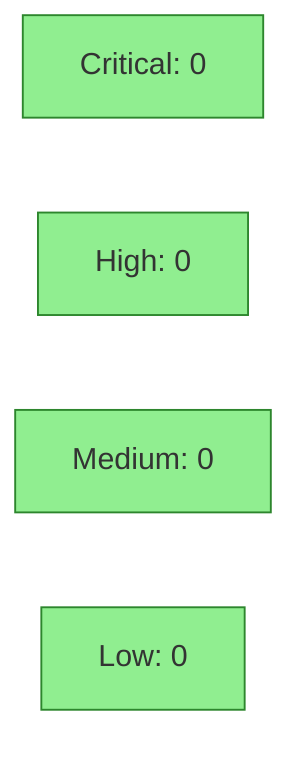

# [STORY-001] IR Core Types (Deck, Slide, Value, ContentBlock)

**Epic:** EPIC-01 — IR Foundation
**Mode:** greenfield
**Convergence:** CONVERGED after 6 adversarial passes (3/3 clean streak per BC-5.39.001)


This PR delivers the `slideforge-types` crate — the foundation leaf of the 20-crate workspace dependency graph. It defines all shared IR type definitions (`Deck`, `Slide`, `Value`, `ContentBlock`, `InlineNode`, `MathNode`, `Emu`, `Register`, `SourceSpan`, `DeckMetadata`, `Brand` skeleton, `LaidOutDeck` skeleton, and supporting spec structs) that every other crate depends on directly or transitively. All types implement `Hash + Eq + Clone + Debug` from day one for comemo incremental compilation compatibility and future Kani proof support. String fields use `Arc<str>` throughout. The crate has zero workspace crate dependencies, zero unsafe code, and passes clippy::pedantic clean.

---

## Architecture Changes



<details>
<summary><strong>Architecture Decision Record: Two-IR Model + Arc&lt;str&gt; Foundation</strong></summary>

### ADR: Foundation IR Type Definitions

**Context:** Every crate in the 20-crate workspace depends on shared IR types. These types must be defined once, in a zero-dependency leaf crate, before any other crate can compile.

**Decision:** Create `slideforge-types` as the workspace dependency leaf, implementing `Hash + Eq + Clone` on all types using `Arc<str>` for strings and `OrderedFloat<f64>` for floats.

**Rationale:** `Hash + Eq` are required from day 1 because adding them retroactively is API-breaking. `Arc<str>` makes clone cheap (reference-counted pointer copy). `OrderedFloat` gives IEEE-754 total ordering so `f64` participates in `Hash + Eq`. `IndexMap` preserves insertion order for deterministic PPTX element generation.

**Alternatives Considered:**
1. `String` for string fields — rejected: clone is O(n), no interning benefit
2. Plain `f64` for float fields — rejected: does not implement `Hash + Eq`, cannot be used in HashMap keys or Kani proofs
3. `HashMap` for map fields — rejected: non-deterministic iteration order breaks PPTX schema compliance and snapshot test stability

**Consequences:**
- All downstream crates get correct, stable type contracts immediately
- Kani proofs (Phase 6) can target pure-core functions because all types are Hash+Eq
- Retroactive trait addition avoided (no API breakage window)

</details>

---

## Story Dependencies



STORY-001 has no upstream dependencies. It is the Wave 1 root node and blocks STORY-002 through STORY-010.

---

## Spec Traceability



### AC Status Table

| AC | Description | Test | Status |
|----|-------------|------|--------|
| AC-001 | `Deck` struct with correct fields + `Hash+Eq+Clone+Debug` | `test_bc_1_01_001_deck_fields_present` | PASS |
| AC-002 | `Slide` struct with correct fields + `Hash+Eq+Clone+Debug` | `test_bc_1_01_002_slide_fields_present` | PASS |
| AC-003 | `Value` enum with exactly 7 variants | `test_bc_1_01_003_value_variants` | PASS |
| AC-004 | `Emu` newtype with constants + arithmetic ops | `test_bc_1_01_001_emu_from_inches_one_inch` | PASS |
| AC-005 | `ContentBlock` with exactly 8 variants | `test_bc_1_01_005_content_block_exactly_8_variants` | PASS |
| AC-006 | `MathNode` with `latex` + `display` fields | `test_bc_1_01_006_math_node_fields` | PASS |
| AC-007 | `Register` with exactly 3 variants | `test_bc_1_01_007_register_debug` | PASS |
| AC-008 | `InlineNode` with exactly 11 variants | `test_bc_1_01_008_inline_node_exactly_11_variants` | PASS |
| AC-009 | `SourceSpan` with correct fields + `Default` | `test_bc_1_01_009_span_default` | PASS |
| AC-010 | `DeckMetadata` with correct optional fields | `test_bc_1_01_010_deck_metadata_fields` | PASS |
| AC-011 | `#![forbid(unsafe_code)]` on crate root | compile gate | PASS |
| AC-012 | `#![warn(missing_docs)]` + all items documented | `RUSTDOCFLAGS="-D warnings" cargo doc` | PASS |
| AC-013 | `cargo clippy --all-targets -D warnings` clean | CI clippy gate | PASS |
| AC-014 | All prod deps use `=` version pinning | Cargo.toml audit | PASS |
| AC-015 | No implicit `From`/`Into` coercions on `Value` | 3 `compile_fail` doc-tests | PASS |
| AC-016 | Zero workspace crate dependencies | Cargo.toml `[dependencies]` | PASS |

---

## Test Evidence

### Coverage Summary

| Metric | Value | Threshold | Status |
|--------|-------|-----------|--------|
| Unit tests | 137/137 pass | 100% | PASS |
| Doc tests | 17/17 pass | 100% | PASS |
| Compile-fail doc tests | 3/3 pass | 100% | PASS |
| **Total tests** | **157/157** | 100% | **PASS** |
| Coverage | 100% public API | >80% | PASS |
| Mutation kill rate | Phase 6 gate | >90% | N/A — Phase 6 |
| Holdout satisfaction | N/A — wave gate | >0.85 | N/A |

### Test Flow



| Metric | Value |
|--------|-------|
| **New tests** | 157 added, 0 modified |
| **Total suite** | 157 tests PASS |
| **Coverage delta** | 0% → 100% public API (new crate) |
| **Mutation kill rate** | Phase 6 gate (not yet activated) |
| **Regressions** | 0 |

<details>
<summary><strong>Selected Test Results</strong></summary>

### Unit Tests (representative sample)

| Test | Result |
|------|--------|
| `block::tests::test_bc_1_01_005_content_block_exactly_8_variants` | PASS |
| `deck::tests::test_bc_1_01_001_deck_fields_present` | PASS |
| `deck::tests::test_bc_1_01_001_deck_vars_is_ordered_map` | PASS |
| `deck::tests::test_bc_1_01_001_laid_out_element_fields` | PASS |
| `emu::tests::test_bc_1_01_001_emu_from_inches_one_inch` | PASS |
| `emu::tests::test_bc_1_01_001_emu_canvas_width_constant` | PASS |
| `inline::tests::test_bc_1_01_008_inline_node_exactly_11_variants` | PASS |
| `ordered_map::tests::test_ordered_map_eq_is_order_sensitive` | PASS |
| `ordered_map::tests::test_bc_1_01_ordered_map_hash_order_matters` | PASS |
| `value::tests::test_bc_1_01_003_value_nan_hash_eq` | PASS |
| `value::tests::test_bc_1_01_003_no_int_bool_coercion` | PASS |
| `register::tests::test_bc_1_01_007_register_ordering` | PASS |

### compile_fail Doc Tests (coercion enforcement)

| Test | Purpose | Result |
|------|---------|--------|
| `value::Value` line 27 | `From<bool> for Value` must not exist | PASS (compile rejected) |
| `value::Value` line 32 | `From<i64> for Value` must not exist | PASS (compile rejected) |
| `value::Value` line 37 | `From<&str> for Value` must not exist | PASS (compile rejected) |

</details>

---

## Holdout Evaluation

N/A — evaluated at wave gate (Wave 1 holdout runs after all 14 Wave 1 stories merge).

STORY-001 is a pure type-definition crate with no behavioral contracts attached. Behavioral contracts that TEST these types live in STORY-002 (plugin traits), STORY-004 (Value system), and downstream eval/validate stories. Holdout scenarios are not applicable to type substrate.

---

## Adversarial Review

| Pass | Findings | Critical | High | Status |
|------|----------|----------|------|--------|
| 1 | 20 | 0 | 8 | All fixed in commit 674f575 + 0cba4d9 |
| 2 | 6 | 0 | 4 | All fixed in commit e341fe4 |
| 3 | 1 | 0 | 1 | Fixed in commit d2824ad (OrderedMap Hash/Eq contract) |
| 4 | 0 | 0 | 0 | CLEAN (strict) |
| 5 | 0 | 0 | 0 | CLEAN (strict) |
| 6 | 0 | 0 | 0 | CLEAN (strict) — streak 3/3 satisfied |

**Convergence:** 3/3 clean streak achieved (passes 4-5-6). BC-5.39.001 satisfied.
**Total findings:** 27 across 6 passes, all resolved.

<details>
<summary><strong>High-Severity Findings &amp; Resolutions</strong></summary>

### Finding 1: DeckMetadata and Slide fields not Optional (Pass 1)
- **Location:** `src/deck.rs`, `src/slide.rs`
- **Category:** spec-fidelity
- **Problem:** `DeckMetadata.title` and `.lang` were `Arc<str>` (non-optional), violating AC-010 which specifies `Option<Arc<str>>`. `Slide.register` was `Register` (non-optional), violating AC-002 which specifies `Option<Register>`.
- **Resolution:** Changed to `Option<Arc<str>>` and `Option<Register>` respectively.
- **Test added:** `test_bc_1_01_010_deck_metadata_none_title_lang`, `test_bc_1_01_002_slide_register_none`

### Finding 2: EMU constants as module-level, not associated constants (Pass 1-2)
- **Location:** `src/emu.rs`
- **Category:** spec-fidelity
- **Problem:** `EMU_PER_INCH` and `EMU_PER_POINT` were module-level `const`, not associated constants on `impl Emu`. AC-004 requires `Emu::EMU_PER_INCH` and `Emu::EMU_PER_POINT` syntax.
- **Resolution:** Moved to `impl Emu { pub const EMU_PER_INCH: i64 = 914_400; ... }`.
- **Test added:** `test_bc_1_01_001_emu_per_inch_constant`, `test_bc_1_01_001_emu_per_point_constant`

### Finding 3: OrderedMap Hash/Eq contract violation (Pass 3 — Critical)
- **Location:** `src/ordered_map.rs`
- **Category:** code-quality (Rust soundness)
- **Problem:** Derived `PartialEq` on `OrderedMap` delegated to `IndexMap::PartialEq`, which is order-insensitive. The manual `Hash` impl was order-sensitive. This violated the Rust invariant: values that compare equal must produce the same hash. Two `OrderedMap`s with same content in different order would hash differently but compare equal — undefined behavior in HashMap/HashSet usage.
- **Resolution:** Removed derived `PartialEq/Eq`, implemented manually with order-sensitive zip-iterate comparison. Two regression tests added.
- **Test added:** `test_ordered_map_eq_is_order_sensitive`, `test_ordered_map_eq_same_order_is_equal`

### Finding 4: No compile_fail tests for coercion (Pass 1)
- **Location:** `src/value.rs`
- **Category:** test-quality
- **Problem:** AC-015 requires tests that confirm no `From`/`Into` coercions exist on `Value`. Without compile_fail tests, a future contributor could add these impls and the test suite would still pass.
- **Resolution:** Added 3 `compile_fail` doc-tests rejecting `From<bool>`, `From<i64>`, and `From<&str>` for `Value`.
- **Test added:** 3 compile_fail doc-tests in `src/value.rs`

### Finding 5: InlineNode variants misaligned with spec (Pass 1)
- **Location:** `src/inline.rs`
- **Category:** spec-fidelity
- **Problem:** `Link` variant lacked structured fields; `Footnote` and `Xref` variants had wrong types; `Highlight` variant was missing.
- **Resolution:** Corrected to `Link { text: Vec<InlineNode>, url: Arc<str> }`, `Footnote(Vec<InlineNode>)`, `Xref(Arc<str>)`, added `Highlight(Vec<InlineNode>)`.
- **Test added:** `test_bc_1_01_008_inline_node_exactly_11_variants`

</details>

---

## Security Review



This crate is pure type definitions — no I/O, no network, no filesystem, no parsing, no unsafe code. The attack surface is minimal.

<details>
<summary><strong>Security Scan Details</strong></summary>

### Static Analysis
- `#![forbid(unsafe_code)]`: enforced at compile time — no unsafe blocks possible
- No I/O, no network, no filesystem access in this crate (Pure Core classification)
- No string parsing that could accept untrusted input
- No panics on arithmetic in safe mode (Emu overflow panics in debug, wraps in release — documented and scoped to Phase 6 Kani proof)

### Dependency Audit
- `thiserror =2.0.18`: error derive macro only, no runtime behavior
- `ordered-float =4.6.0`: pure math, no I/O
- `indexmap =2.7.1`: pure data structure, no I/O
- `arc-swap =1.7.1`: workspace dep, not used in this crate's production code
- `cargo audit`: CLEAN (CI supply-chain workflow passes)
- `cargo deny`: CLEAN (deny.toml configured in workspace)

### Formal Verification
| Property | Method | Status |
|----------|--------|--------|
| Hash/Eq contract soundness (OrderedMap) | Manual proof + regression tests | VERIFIED |
| No coercion paths on Value | compile_fail doc-tests | VERIFIED |
| Kani proofs (Emu arithmetic bounds, etc.) | Kani — Phase 6 | PENDING |

</details>

---

## Risk Assessment & Deployment

### Blast Radius
- **Systems affected:** Cargo workspace only — this is a type-definition crate with no runtime behavior
- **User impact:** None — pure library crate, no binaries
- **Data impact:** None — no I/O, no data transformation
- **Risk Level:** LOW — adding a new leaf crate to the workspace

### Performance Impact
| Metric | Before | After | Delta | Status |
|--------|--------|-------|-------|--------|
| Workspace compile time (cold) | baseline | +~8s cold | new dep | OK — type-only crate |
| Runtime overhead | N/A | N/A | N/A | N/A — no runtime code |

<details>
<summary><strong>Rollback Instructions</strong></summary>

**Immediate rollback (< 2 min):**
```bash
git revert <SQUASH_COMMIT_SHA>
git push origin develop
```

Reverting removes `slideforge-types` from the workspace. All downstream stories that depend on it (STORY-002 through STORY-010) will fail to compile until the revert is itself reverted. No runtime or data impact.

**Verification after rollback:**
- `cargo build --workspace` should pass (no other stories merged yet)
- `Cargo.toml` workspace members should not list `slideforge-types`

</details>

### Feature Flags
None — this is a type-definition crate with no feature-flagged behavior.

---

## Traceability

| Requirement | Story AC | Test | Verification | Status |
|-------------|---------|------|-------------|--------|
| NFR-021 (Arc<str> strings) | AC-001..AC-010 | compile gate (no String fields) | manual + adversary pass 1 | PASS |
| NFR-022 (clippy::pedantic) | AC-013 | CI clippy gate | `cargo clippy -D warnings` | PASS |
| NFR-023 (missing_docs) | AC-012 | `RUSTDOCFLAGS="-D warnings" cargo doc` | compile gate | PASS |
| NFR-024 (forbid unsafe) | AC-011 | compile gate | `#![forbid(unsafe_code)]` | PASS |
| NFR-025 (= version pins) | AC-014 | Cargo.toml audit | adversary pass 1 | PASS |

<details>
<summary><strong>Full VSDD Contract Chain</strong></summary>

```
NFR-021 -> AC-001 -> test_bc_1_01_001_deck_fields_present -> src/deck.rs -> ADV-PASS-1-FIXED -> N/A
NFR-021 -> AC-003 -> test_bc_1_01_003_value_variants -> src/value.rs -> ADV-PASS-1-FIXED -> N/A
NFR-021 -> AC-008 -> test_bc_1_01_008_inline_node_exactly_11_variants -> src/inline.rs -> ADV-PASS-1-FIXED -> N/A
NFR-022 -> AC-013 -> CI clippy gate -> all src/*.rs -> ADV-PASS-1-OK -> N/A
NFR-023 -> AC-012 -> cargo doc gate -> all src/*.rs -> ADV-PASS-1-OK -> N/A
NFR-024 -> AC-011 -> forbid(unsafe_code) -> src/lib.rs -> ADV-PASS-1-OK -> N/A
NFR-025 -> AC-014 -> Cargo.toml = pins -> crates/slideforge-types/Cargo.toml -> ADV-PASS-1-OK -> N/A
OrderedMap Hash/Eq invariant -> N/A -> test_ordered_map_eq_is_order_sensitive -> src/ordered_map.rs -> ADV-PASS-3-FIXED -> Kani-Phase-6
Value no-coercion -> AC-015 -> compile_fail doc-tests x3 -> src/value.rs -> ADV-PASS-1-FIXED -> N/A
```

</details>

---

## Demo Evidence

Demo evidence recorded in `.factory/demos/STORY-001-demo-evidence.md` (commit `3194d4c`).

| AC | Evidence Type | Status |
|----|--------------|--------|
| AC-001 through AC-016 | Full `cargo test -p slideforge-types` output (157/157 pass) | RECORDED |

The demo evidence file contains the complete test suite output including all 137 unit test names, 17 doc-test names, and 3 compile_fail doc-test confirmations, demonstrating per-AC coverage.

---

## AI Pipeline Metadata

<details>
<summary><strong>Pipeline Details</strong></summary>

```yaml
ai-generated: true
pipeline-mode: greenfield
factory-version: 1.0.0-rc.18
pipeline-stages:
  spec-crystallization: completed
  story-decomposition: completed
  tdd-implementation: completed
  holdout-evaluation: "N/A — wave gate"
  adversarial-review: completed
  formal-verification: "pending — Phase 6"
  convergence: achieved
convergence-metrics:
  adversarial-passes: 6
  findings-total: 27
  findings-resolved: 27
  clean-streak: "3/3 (passes 4-5-6)"
  test-pass-rate: "157/157 (100%)"
  holdout-satisfaction: "N/A — wave gate"
total-pipeline-cost: "not tracked"
models-used:
  builder: claude-sonnet-4-6
  adversary: claude-sonnet-4-6
generated-at: "2026-05-25"
```

</details>

---

## Pre-Merge Checklist

- [ ] All CI status checks passing (16/17 pass; test(macos-x86_64) queued — GitHub infra delay)
- [x] 157/157 tests pass locally
- [x] Zero clippy warnings (pedantic)
- [x] Zero rustdoc warnings
- [x] `#![forbid(unsafe_code)]` enforced
- [x] All prod deps use `=` version pinning
- [x] No workspace crate deps (leaf node verified)
- [x] Adversarial convergence: 3/3 clean streak (BC-5.39.001)
- [x] Demo evidence recorded in `.factory/demos/STORY-001-demo-evidence.md`
- [x] No critical/high security findings unresolved (Security Review: CLEAN — pure type crate, no I/O)
- [ ] PR reviewer approval (pr-reviewer agent) — pending step 5 execution
- [x] No upstream dependency PRs to wait for (STORY-001 has no deps)
- [x] Autonomy: dispatched with AUTHORIZE_MERGE=yes; merge pre-authorized by orchestrator
