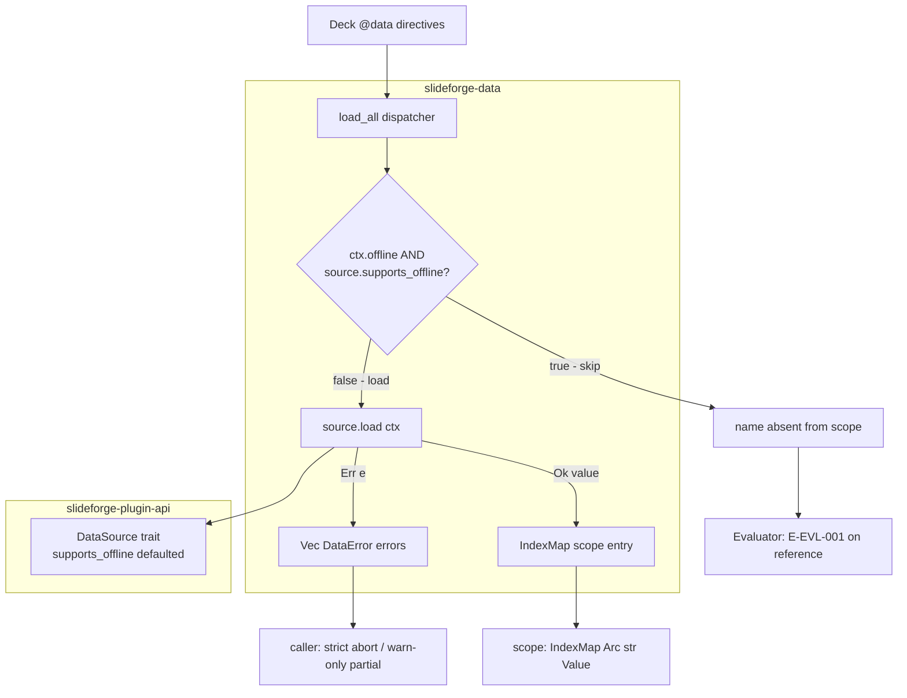
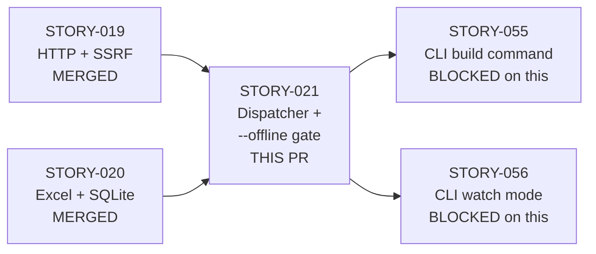
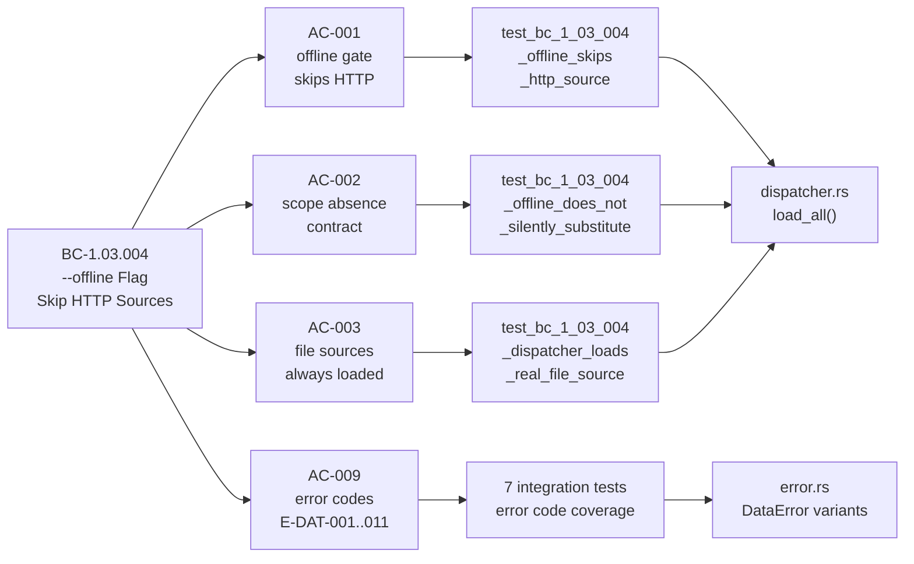

## Summary

Implements the DataSource dispatcher (`load_all`) with the `--offline` flag gate in `slideforge-data`, completing EPIC-05 (Data Sources). Ships comprehensive error routing for the full E-DAT-001..011 taxonomy, a canonical inter-layer protocol decoupling user-facing Display from machine-readable error codes, and 17 integration + 5 unit tests. Went through 23-pass LOCAL adversary cascade converging 3/3 strict per BC-5.39.001.

## Acceptance Criteria

- [x] **AC-001** — Offline gate skips HTTP sources; name absent from scope (BC-1.03.004 postcondition 1+2)
- [x] **AC-002** — Dispatcher absent-scope contract: evaluator owns E-EVL-001 (postcondition 3)
- [x] **AC-003** — File-based sources always loaded (supports_offline=false) regardless of --offline flag (invariant 2)
- [x] **AC-004** — Zero HTTP sources + offline=true identical to offline=false (EC-001)
- [x] **AC-005** — HTTP declared but unreferenced; zero dispatcher errors (EC-002)
- [x] **AC-006** — Mixed file+HTTP offline: file loaded, HTTP skipped (EC-003)
- [x] **AC-007** — Watch mode: offline gate respected on every re-eval cycle (EC-004)
- [x] **AC-008** — --offline never silently substitutes empty Value::Map (invariant 1)
- [x] **AC-009** — DataError enum E-DAT-001..011 with [E-DAT-NNN] bracket prefix in Display
- [x] **AC-010** — `#![forbid(unsafe_code)]`, clippy::pedantic clean, = version pinning (NFR-021/022/025)

## Architecture Changes

## Story Dependencies

## Spec Traceability

## Notable Design Decisions

### 1. Canonical Inter-Layer Protocol (Pass 15)
`data_error_to_source_error` in `http.rs` emits a machine-readable canonical format (`[E-DAT-NNN] human message`) that `dispatcher.rs` parses deterministically. This decouples the user-facing `Display` impl (which includes `--offline` hints and prose) from the inter-layer byte protocol. Result: error routing is anchored to a 16-char `[E-DAT-NNN]` bracket prefix — not fragile substring matching on human prose.

### 2. `supports_offline()` Defaulted Trait Method (plugin-api)
Added to `DataSource` with `default fn supports_offline() -> bool { false }`. All file-based sources inherit `false`; `HttpDataSource` overrides to `true`. The default-false contract means any new DataSource implementation is safe by default (loads regardless of --offline). Only network-bound sources need to opt in.

### 3. Label-Driven IoError vs FileNotFound Routing (Pass 4 HIGH finding F-P4-HIGH-001)
`dispatcher.rs` routes `SourceError` to `DataError` variants by inspecting the canonical bracket prefix. When a source emits a message with `[E-DAT-002]` label, the dispatcher produces `DataError::IoError`. When `[E-DAT-004]` label, it produces `DataError::FileNotFound`. This prevents permission-denied errors from being misrouted as FileNotFound. Load-bearing test: `test_bc_1_03_004_dispatcher_routes_permission_denied_to_ioerror_not_filenotfound`.

### 4. Anchored Bracket Discipline (Pass 3 structural fix)
`strip_bracket_prefix` applies a hard 16-char window: `[E-DAT-NNN]` must be within the first 16 bytes. Malformed or over-long prefixes fall through to the original message unchanged. UTF-8-safe: the slice is taken on a known-ASCII prefix range, never splitting a multi-byte codepoint.

### 5. Apostrophe-Safe Path Extraction (Pass 8)
`extract_path_after_code` uses `rsplit_once(" (at ")` to find the path in messages like `[E-DAT-004] file data source not found (at /some/path's/file.json)`. The `rsplit_once` ensures the last ` (at ` occurrence is found — handling pathological paths that themselves contain the string. Unit test pins the at-in-label edge case.

### 6. E-DAT-014 Retired (Pass 13/14)
The `UnsupportedFormat` variant (E-DAT-014) was retired as redundant — its semantics are fully covered by `ParseError` (E-DAT-003) at the dispatcher boundary. `error-taxonomy.md` updated to v1.8 with E-DAT-014 marked RETIRED.

### 7. Partial-Load Semantics
`load_all` accumulates errors in `Vec<DataError>` and continues loading remaining sources. The caller decides abort-or-continue. This is consistent with DI-018 error-accumulation principle: all errors are surfaced, not just the first.

## Test Evidence

| Metric | Value |
|--------|-------|
| Workspace tests (pre-story) | 2268 |
| Workspace tests (post-story) | 2282 |
| Net new tests | +14 |
| Integration tests (tests/integration.rs) | 17 |
| Unit tests (dispatcher.rs inline) | 5 + inherited from error.rs/http.rs |
| Crate test command | `cargo nextest run -p slideforge-data` |
| All tests pass | Yes |
| Clippy clean | Yes (`cargo clippy -p slideforge-data -- -D warnings`) |
| fmt clean | Yes |
| Doc warnings | 0 (`RUSTDOCFLAGS="-D warnings" cargo doc -p slideforge-data`) |

## Demo Evidence

All 10 ACs have recorded demo evidence in `docs/demo-evidence/STORY-021/` (31 files: 10x .tape + 10x .gif + 10x .webm + evidence-report.md).

| AC | Demo File | Status |
|----|-----------|--------|
| AC-001 | AC-001-offline-gate-skips-http-source.{tape,gif,webm} | PASSED |
| AC-002 | AC-002-scope-absent-produces-evl001.{tape,gif,webm} | PASSED |
| AC-003 | AC-003-file-sources-always-loaded.{tape,gif,webm} | PASSED |
| AC-004 | AC-004-zero-http-offline-identical.{tape,gif,webm} | PASSED |
| AC-005 | AC-005-unreferenced-http-no-error.{tape,gif,webm} | PASSED |
| AC-006 | AC-006-mixed-file-http-offline.{tape,gif,webm} | PASSED |
| AC-007 | AC-007-watch-mode-repeated-dispatch.{tape,gif,webm} | PASSED |
| AC-008 | AC-008-offline-never-empty-silent.{tape,gif,webm} | PASSED |
| AC-009 | AC-009-error-codes-dat-001-to-011.{tape,gif,webm} | PASSED |
| AC-010 | AC-010-forbid-unsafe-clippy-pinning.{tape,gif,webm} | PASSED |

Full evidence report: `docs/demo-evidence/STORY-021/evidence-report.md`

## Adversarial Cascade Summary

| Metric | Value |
|--------|-------|
| Total passes | 23 |
| Findings closed | ~80+ |
| Fix bursts | 12 |
| Final streak | 3/3 clean strict (BC-5.39.001) |
| CLEAN (strict) | Yes — zero findings of ANY severity |
| CLEAN (PR-merge) | Yes — zero CRIT/HIGH/MED findings |

## Holdout Evaluation

N/A — evaluated at wave gate.

## Adversarial Review (PR-Level)

Pending — dispatched in Step 5 of PR lifecycle.

## Security Review

Pending — dispatched in Step 4 of PR lifecycle.

## Risk Assessment

| Dimension | Assessment |
|-----------|-----------|
| Blast radius | Limited to `slideforge-data` crate; no cross-crate API breaks |
| Performance impact | Negligible — dispatcher is O(n) over @data directives; no allocations beyond existing |
| Breaking changes | None — `supports_offline()` has a default impl; existing DataSource impls are unaffected |
| Rollback complexity | Low — pure addition within crate; no schema changes |

## AI Pipeline Metadata

| Field | Value |
|-------|-------|
| Pipeline mode | Greenfield Phase 3 (TDD per-story delivery) |
| Story points | 3 |
| Wave | 3 |
| LOCAL adversary passes | 23 |
| Models used | claude-sonnet-4-6 (implementer, test-writer, adversary) |

## Pre-Merge Checklist

- [x] PR description matches actual diff
- [x] All ACs covered by demo evidence (10/10)
- [x] Traceability chain complete (BC-1.03.004 → AC-001..010 → Tests → Demo)
- [x] Dependency PRs merged (STORY-019 #27, STORY-020 merged)
- [x] LOCAL adversary 3-CLEAN convergence achieved
- [ ] Security review complete (Step 4)
- [ ] PR-level review complete (Step 5)
- [ ] CI checks passing (Step 6)
