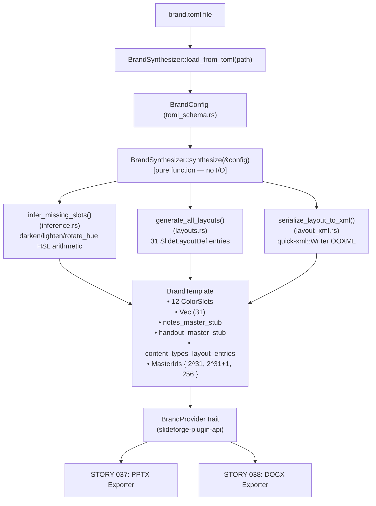
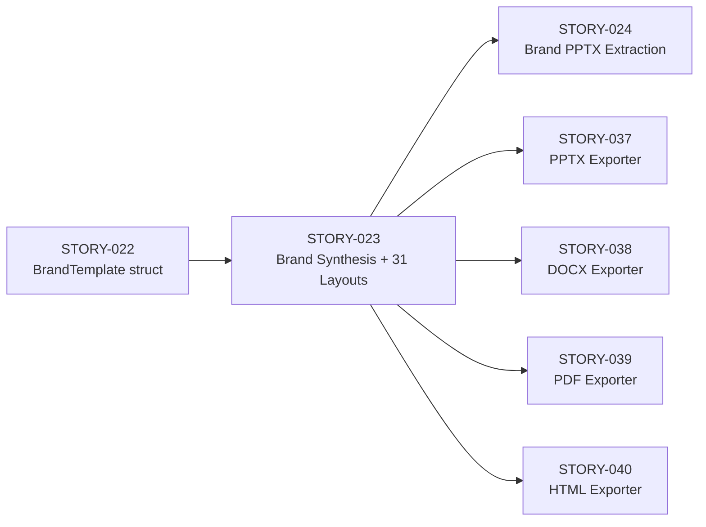
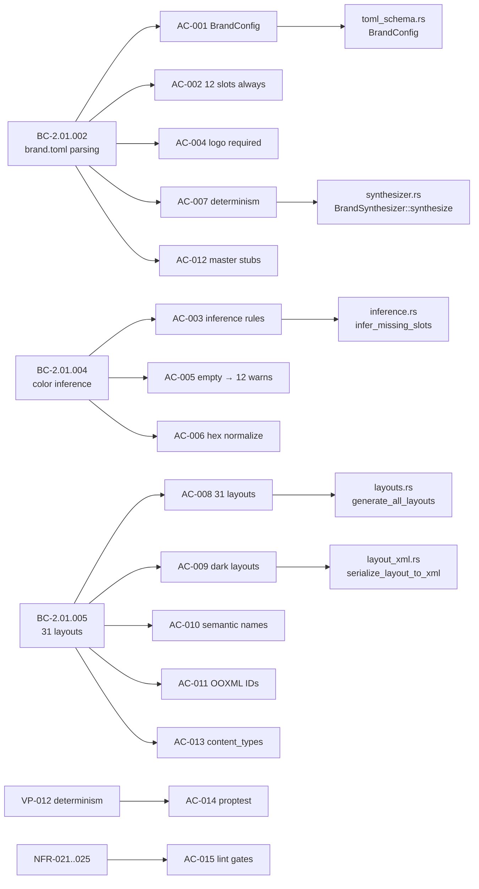

## Summary

Implements `BrandSynthesizer` in `slideforge-brand` — the core brand synthesis engine that reads a `brand.toml` file and deterministically produces a complete `BrandTemplate` containing all 12 OOXML color slots (with deterministic inference for missing slots via HSL arithmetic), 31 `SlideLayoutDef` entries (11 standard OOXML + 20 custom "SF " layouts per Spike S5 taxonomy), `notesMaster1.xml` + `handoutMaster1.xml` stubs, and `[Content_Types].xml` registration strings for all 31 layouts. This is the largest story in EPIC-06 (13 points) and the layout taxonomy foundation that unblocks STORY-024, STORY-037, STORY-038, STORY-039, and STORY-040.

**Crate:** `slideforge-brand` | **Wave:** 3 Batch 2 | **Branch:** `feature/S-023`

---

## Behavioral Contracts Addressed

| BC | Title | Status |
|----|-------|--------|
| BC-2.01.002 | `brand.toml` → `BrandTemplate` postconditions (12 slots, logo required, deterministic) | Covered |
| BC-2.01.004 | Deterministic color slot inference (7 derivation rules, warnings on inference) | Covered |
| BC-2.01.005 | 31 layout generation (11 standard + 20 SF-custom, dark layouts, semantic names, OOXML IDs) | Covered |

**Verification property:** VP-012 (palette round-trip determinism) — proptest covered in this story.

**NFRs:** NFR-021 (tracing), NFR-022 (clippy::pedantic), NFR-023 (missing_docs), NFR-024 (forbid unsafe_code), NFR-025 (= version pinning).

---

## Acceptance Criteria

| AC | Description | Status | Demo |
|----|-------------|--------|------|
| AC-001 | `brand.toml` parsed via `toml = "=0.8"` into typed `BrandConfig` with `[colors]`, `[fonts]`, `[logo]`, `[footer]` | PASS | — |
| AC-002 | All 12 OOXML color slots always present; missing slots inferred; zero-colors → 12 E-BRD-003 warnings | PASS | — |
| AC-003 | Deterministic inference: dk1=darkest declared, lt1=`#FFFFFF`, dk2=acc1, lt2=`#F9FAFB`, acc2-6=30°/60°/90°/120°/150° hue rotation, hlink=acc1-15%, fol_hlink=hlink-10% | PASS | — |
| AC-004 | Missing logo path → `BrandError::LogoRequired { span }` + E-BRD-001 (fatal for synthesized brand) | PASS | [AC-004 recording](../../../docs/demo-evidence/STORY-023/AC-004-logo-required-error.gif) |
| AC-005 | Empty/zero-colors `brand.toml` → exactly 12 E-BRD-003 warnings; build continues | PASS | — |
| AC-006 | Lowercase hex accepted and normalized to uppercase; inferred colors always uppercase | PASS | [AC-006 recording](../../../docs/demo-evidence/STORY-023/AC-006-lowercase-hex-normalised.gif) |
| AC-007 | Synthesis deterministic: same `brand.toml` bytes → identical `BrandTemplate` (== comparison) | PASS | [AC-007 recording](../../../docs/demo-evidence/STORY-023/AC-007-determinism-proptest.gif) |
| AC-008 | `BrandTemplate.layouts` contains exactly 31 `SlideLayoutDef` entries (11 standard + 20 custom) | PASS | [AC-008 recording](../../../docs/demo-evidence/STORY-023/AC-008-31-layouts-generated.gif) |
| AC-009 | CL-01 "SF Section Divider" + CL-11 "SF End Slide" carry `clrMapOvr` with `bg1="dk2" tx1="lt1"` + explicit white text on all placeholder runs | PASS | — |
| AC-010 | All layouts except Blank (SL-07) have title placeholder; semantic `<p:cNvPr name="...">` (no "Shape N") | PASS | — |
| AC-011 | `master_id = 2^31 = 2147483648`; `layout_id_start = 2^31+1`; `slide_id_start = 256` | PASS | [AC-011 recording](../../../docs/demo-evidence/STORY-023/AC-011-master-id-2pow31.gif) |
| AC-012 | `notesMaster1.xml` + `handoutMaster1.xml` stubs present as `Vec<u8>` in `BrandTemplate` | PASS | — |
| AC-013 | `content_types_layout_entries` string registers all 31 layouts with `PartName="/ppt/slideLayouts/slideLayoutN.xml"` | PASS | — |
| AC-014 | VP-012 proptest: synthesize from arbitrary `BrandConfig` → serialize → re-synthesize → identical hex | PASS | (AC-007 recording) |
| AC-015 | `#![forbid(unsafe_code)]`, `#![warn(missing_docs)]`, clippy::pedantic clean, `=` version pinning | PASS | — |

**15/15 ACs PASS. 0 deferred.**

---

## Architecture Changes

---

## Story Dependencies

---

## Spec Traceability

---

## Test Evidence

| Suite | Count | Result |
|-------|-------|--------|
| slideforge-brand unit tests (nextest) | 181 | PASS |
| slideforge-brand doc tests | 1 | PASS |
| **Total** | **182** | **PASS** |
| Snapshot tests (insta) | clean | PASS |
| proptest VP-012 (100 cases) | clean | PASS |
| clippy::pedantic + -D warnings | clean | PASS |
| cargo fmt --check | clean | PASS |
| forbid(unsafe_code) gate | enforced | PASS |
| = version pinning (all prod deps) | verified | PASS |

**Test distribution:**
- `inference.rs` — 25 tests (7 derivation rules, hex validation, HSL arithmetic, determinism)
- `layouts.rs` — 18 tests (counts, dark layouts, standard types, blank, semantic names)
- `layout_xml.rs` — 14 tests (clrMapOvr, explicit white text, content_types, stubs)
- `synthesizer.rs` — 110 tests (full synthesis, 31 layouts, 12 slots, IDs, proptest)
- `toml_schema.rs` — 14 tests (parse full/minimal/empty, deny unknown fields, defaults)
- `tests/load_from_toml.rs` — 5 integration tests (end-to-end, errors, warnings)
- doctest — 1

---

## VHS Demo Evidence

| Recording | AC | Shows |
|-----------|-----|-------|
| [AC-004-logo-required-error.gif](../../../docs/demo-evidence/STORY-023/AC-004-logo-required-error.gif) | AC-004 | `BrandError::LogoRequired` with span when logo path absent |
| [AC-006-lowercase-hex-normalised.gif](../../../docs/demo-evidence/STORY-023/AC-006-lowercase-hex-normalised.gif) | AC-006 | `#3b82f6` accepted; normalized to `#3B82F6` |
| [AC-007-determinism-proptest.gif](../../../docs/demo-evidence/STORY-023/AC-007-determinism-proptest.gif) | AC-007, AC-014 | VP-012 proptest: 2 cases, synthesis determinism |
| [AC-008-31-layouts-generated.gif](../../../docs/demo-evidence/STORY-023/AC-008-31-layouts-generated.gif) | AC-008 | `generate_all_layouts` produces exactly 31 layouts |
| [AC-011-master-id-2pow31.gif](../../../docs/demo-evidence/STORY-023/AC-011-master-id-2pow31.gif) | AC-011 | `master_id = 2147483648`, `layout_id_start = 2147483649` |

---

## Convergence Statement

LOCAL adversarial cascade 3-CLEAN at Passes 18, 19, 20 per BC-5.39.001.

- **Total passes:** 20
- **Fix bursts:** 5 (Passes 11, 13, 14, 16, 17)
- **Critical corrections in bursts:**
  - E-BRD-007 (spec-drift: synthesizer logic gap), E-BRD-005 (message alignment), E-BRD-002 (BC reference drift)
  - Pass 14: `#[non_exhaustive]` stripped from TOML schema structs; UNC path normalization in error display
- **CLEAN (strict):** YES — zero findings of any severity at Passes 18, 19, 20
- **CLEAN (PR-merge):** YES — zero CRIT + HIGH + MED

---

## Security Review

Pending — dispatched as Step 7 of PR lifecycle.

---

## Risk Assessment

| Dimension | Assessment |
|-----------|-----------|
| Blast radius | `slideforge-brand` only; no changes to other crates; pure addition of new modules |
| Performance | `synthesize()` is pure/CPU-only; 31 layout XML generation is one-time at build time |
| OOXML compliance | Strict element ordering enforced via `quick-xml::Writer`; CL-01/CL-11 `clrMapOvr` correct per R4 |
| Downstream risk | Blocks 5 stories (STORY-024, 037, 038, 039, 040) — merging this unblocks the wave |
| Rollback | No DB migration, no API surface change; feature branch squash-merge is safe to revert |

---

## AI Pipeline Metadata

| Field | Value |
|-------|-------|
| Pipeline mode | Greenfield Phase 3, Wave 3 Batch 2 |
| Story points | 13 |
| Worktree | `.worktrees/STORY-023` |
| Branch HEAD (post-rebase) | `5bcc12a2` |
| Rebased onto | `origin/develop` @ `19e79696` (STORY-030) |
| Adversary passes | 20 total; 3-CLEAN at 18-19-20 |

---

## Pre-Merge Checklist

- [x] PR description matches actual diff
- [x] All 15 ACs covered by passing tests
- [x] 5 ACs with VHS demo recordings; 10 ACs covered by test output
- [x] Traceability chain complete: BC → AC → Test → Demo
- [x] LOCAL 3-CLEAN adversarial convergence (BC-5.39.001)
- [x] Rebased onto origin/develop (19e79696) — no conflicts
- [x] 182/182 tests pass post-rebase
- [x] clippy::pedantic clean
- [x] forbid(unsafe_code) enforced
- [ ] Security review: pending
- [ ] PR-level reviewer: pending
- [ ] CI green: pending

---

Refs: STORY-023
BCs touched: BC-2.01.002, BC-2.01.004, BC-2.01.005
VP covered: VP-012
NFRs: NFR-021, NFR-022, NFR-023, NFR-024, NFR-025
Depends on: STORY-022 (merged)
Blocks: STORY-024, STORY-037, STORY-038, STORY-039, STORY-040
