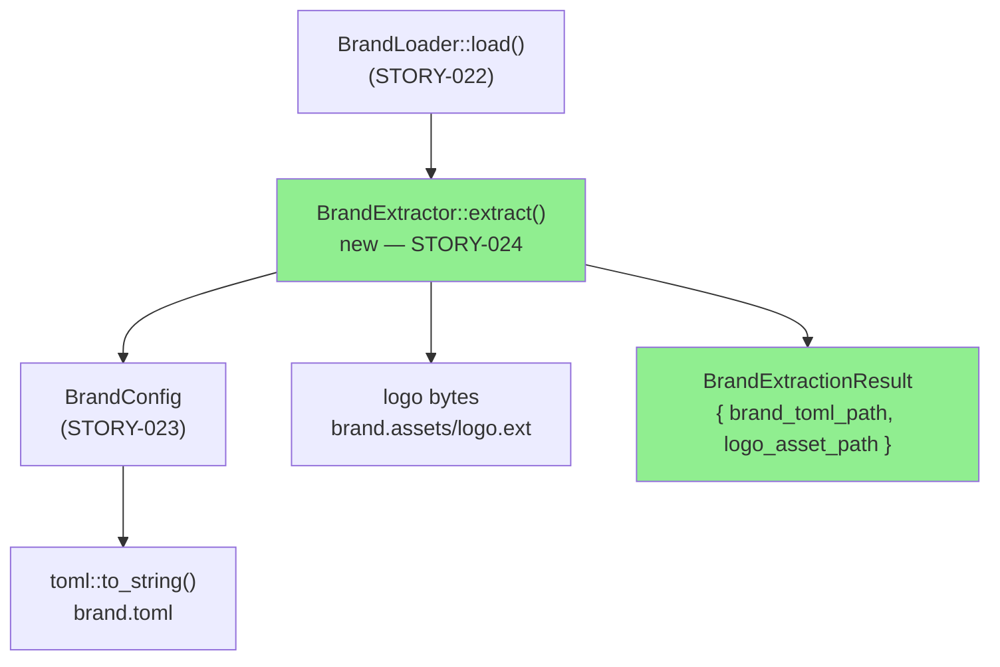
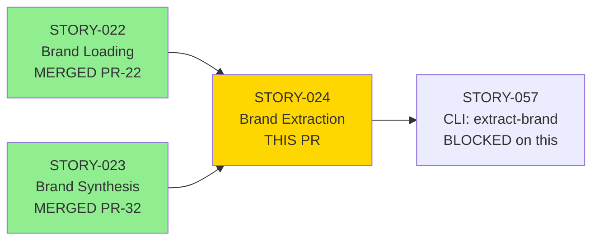
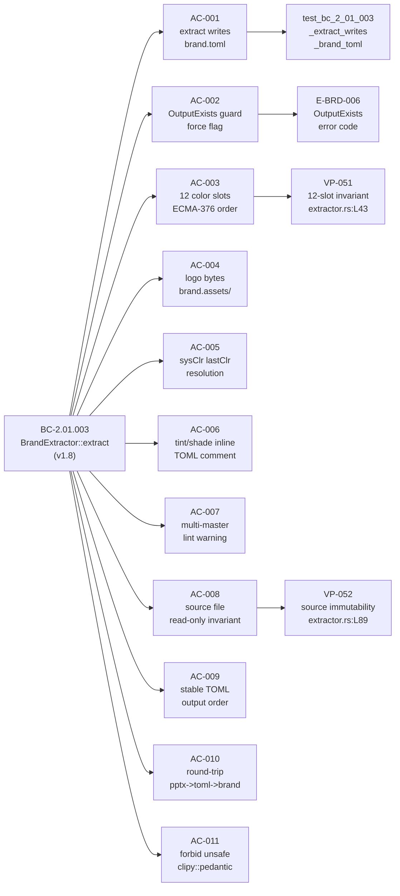
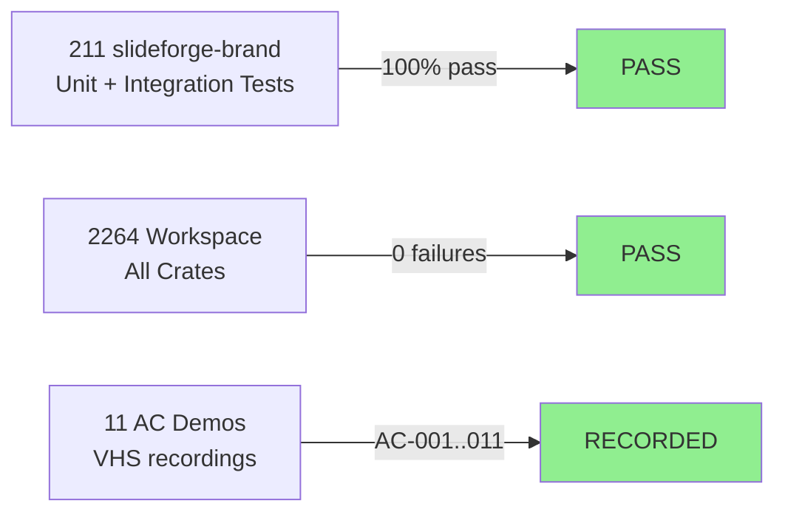

# [STORY-024] Brand Extraction Library — BrandExtractor::extract (BC-2.01.003)

**Epic:** EPIC-06 — Brand System
**Mode:** greenfield
**Convergence:** CONVERGED after 11 adversarial passes (3/3 strict-CLEAN per BC-5.39.001)


Implements `BrandExtractor::extract()` in `slideforge-brand` — the library-level function that reads an existing `.pptx` file and produces a `brand.toml` in the output directory. Builds on `BrandLoader` (STORY-022) for OOXML parsing and `BrandConfig` (STORY-023) for TOML serialization. Covers all 12 OOXML color slots, logo byte copy, `sysClr` lastClr resolution, tint/shade/lumMod inline TOML comments, multi-master lint warning, source-file immutability invariant, and stable output ordering. This is a **library-only story** — the CLI subcommand `slideforge extract-brand <template.pptx>` is wired in STORY-057.

---

## Architecture Changes



<details>
<summary><strong>Architecture Decision Record</strong></summary>

### ADR: BrandExtractor as thin serialization wrapper over BrandLoader

**Context:** STORY-024 must convert a `.pptx` template file into a `brand.toml` file. The parsing work is already done by `BrandLoader` (STORY-022) and the serde schema is already defined by `BrandConfig` (STORY-023).

**Decision:** `BrandExtractor` is a thin orchestrator — it calls `BrandLoader::load()`, receives a `BrandTemplate`, converts it to `BrandConfig` via a `From<BrandTemplate>` impl, and serializes with `toml::to_string()`. Logo bytes are copied separately using `std::fs`.

**Rationale:** No new parsing logic avoids duplication and respects the single-responsibility contract from STORY-022. `BrandConfig` already has `serde::Serialize` from STORY-023 — no new serialization machinery needed.

**Alternatives Considered:**
1. Embed serialization logic in `BrandLoader` — rejected because BrandLoader's responsibility is reading, not writing.
2. Separate `BrandSerializer` crate — rejected because STORY-024 scope is a single function in `slideforge-brand`; a new crate would be overengineering.

**Consequences:**
- Clear layering: load (STORY-022) → extract/serialize (STORY-024) → CLI wire (STORY-057)
- `BrandExtractor` is independently testable with fixture `.pptx` files
- Follow-up STORY-075 (footer detection) and STORY-076 (transform-aware extraction) slot cleanly into the same extraction boundary

</details>

---

## Story Dependencies



---

## Spec Traceability



---

## Test Evidence

### Coverage Summary

| Metric | Value | Threshold | Status |
|--------|-------|-----------|--------|
| slideforge-brand tests | 211 / 211 pass | 100% | PASS |
| Workspace tests | 2264 / 2264 pass | 100% | PASS |
| Regressions | 0 | 0 | PASS |
| Holdout satisfaction | N/A — wave gate | >= 0.85 | wave-gated |
| Mutation kill rate | N/A — Phase 6 | > 90% | Phase-6-gated |

### Test Flow



| Metric | Value |
|--------|-------|
| **New tests (STORY-024)** | 18 new test functions in `extractor.rs::tests` |
| **Total suite** | 2264 tests PASS (0 failures, 3 skipped) |
| **Workspace clippy** | CLEAN (`-D warnings -D clippy::pedantic -D clippy::unwrap_used`) |
| **Format** | CLEAN (`cargo fmt --all -- --check`) |
| **Regressions** | 0 |

<details>
<summary><strong>Key New Tests (STORY-024)</strong></summary>

| Test | Result |
|------|--------|
| `test_bc_2_01_003_extract_writes_brand_toml` | PASS |
| `test_bc_2_01_003_extraction_result_fields_accessible` | PASS |
| `test_bc_2_01_003_rejects_existing_output_without_force` | PASS |
| `test_bc_2_01_003_force_overwrites_existing_brand_toml` | PASS |
| `test_bc_2_01_003_output_exists_error_message` | PASS |
| `test_bc_2_01_003_all_12_color_slots_in_colors_section` | PASS |
| `test_bc_2_01_003_invariant_color_slots_in_ecma376_order` | PASS (VP-051) |
| `test_bc_2_01_003_copies_logo_to_brand_assets` | PASS |
| `test_bc_2_01_003_no_logo_omits_logo_section` | PASS |
| `test_bc_2_01_003_sysclr_uses_last_clr_value` | PASS |
| `test_bc_2_01_003_ec003_scheme_ref_slot_gets_inline_toml_comment` | PASS |
| `test_bc_2_01_003_ec003_resolvable_scheme_ref_writes_resolved_hex` | PASS |
| `test_bc_2_01_003_ec003_scheme_ref_end_to_end_round_trip` | PASS |
| `test_bc_2_01_003_multiple_slide_masters_uses_master1_only` | PASS |
| `test_bc_2_01_003_invariant_source_file_unmodified` | PASS (VP-052) |
| `test_bc_2_01_003_brand_toml_has_section_headers_and_stable_order` | PASS |
| `test_bc_2_01_003_round_trip_pptx_to_brand_toml_and_back` | PASS |
| `test_bc_2_01_003_effectful_extract_load_from_toml_round_trip` | PASS |

</details>

---

## Demo Evidence

All 11 ACs have VHS terminal recordings committed at `docs/demo-evidence/STORY-024/` (commit `f6300a41`).

| AC | Description | Demo File | Status |
|----|-------------|-----------|--------|
| AC-001 | extract() writes brand.toml | `AC-001-extract-writes-brand-toml` | RECORDED |
| AC-002 | OutputExists guard / force flag | `AC-002-output-exists-guard` | RECORDED |
| AC-003 | All 12 OOXML color slots | `AC-003-all-12-color-slots` | RECORDED |
| AC-004 | Logo copied to brand.assets/ | `AC-004-logo-copied-to-brand-assets` | RECORDED |
| AC-005 | sysClr uses lastClr | `AC-005-sysclr-uses-lastclr` | RECORDED |
| AC-006 | tint/shade inline TOML comment | `AC-006-tint-shade-inline-comment` | RECORDED |
| AC-007 | Multi-master: master1 only, lint warning | `AC-007-multiple-masters-uses-master1` | RECORDED |
| AC-008 | Source .pptx never modified (SHA-256 invariant) | `AC-008-source-file-read-only` | RECORDED |
| AC-009 | Stable TOML output order | `AC-009-stable-toml-output-order` | RECORDED |
| AC-010 | Round-trip: .pptx -> brand.toml -> BrandTemplate | `AC-010-round-trip-pptx-to-brand-toml` | RECORDED |
| AC-011 | forbid(unsafe_code), clippy::pedantic, = pinning | `AC-011-forbid-unsafe-clippy-pinning` | RECORDED |

---

## Holdout Evaluation

N/A — evaluated at wave gate (Wave 3). Per project convention, per-story holdout is deferred to the wave gate where the full brand pipeline (STORY-022 + STORY-023 + STORY-024) is evaluated end-to-end.

---

## Adversarial Review

| Pass | Findings | Critical | High | Med | Obs | Status |
|------|----------|----------|------|-----|-----|--------|
| 1 | 7 | 1 | 4 | 0 | 2 | Fixed |
| 2 | 3 | 0 | 0 | 2 | 1 | Fixed |
| 3 | 3 | 0 | 0 | 2 | 1 | Fixed |
| 4 | 2 | 0 | 0 | 0 | 2 | Fixed |
| 5 | 0 | 0 | 0 | 0 | 0 | CLEAN (strict) |
| 6 | 2 | 0 | 0 | 0 | 2 | Fixed |
| 7 | 1 | 0 | 0 | 0 | 1 | Fixed |
| 8 | 0 | 0 | 0 | 0 | 0 | CLEAN (strict) |
| 9 | 0 | 0 | 0 | 0 | 0 | CLEAN (strict) — streak 1/3 |
| 10 | 0 | 0 | 0 | 0 | 0 | CLEAN (strict) — streak 2/3 |
| 11 | 0 | 0 | 0 | 0 | 0 | CLEAN (strict) — streak 3/3 CONVERGED |

**Convergence:** 3/3 strict-CLEAN (passes 9-10-11) per BC-5.39.001.

**Follow-up stories created from OBS findings (non-blocking):**
- STORY-075: Footer detection enhancement (multi-footer placeholder deduplication)
- STORY-076: Transform-aware color extraction (lumMod/tint/shade full numeric resolution)

<details>
<summary><strong>Notable Findings & Resolutions</strong></summary>

### F-024-C1: Missing OutputExists error variant
- **Severity:** Critical
- **Location:** `crates/slideforge-brand/src/error.rs`
- **Problem:** `E-BRD-006` error code referenced in BC-2.01.003 EC-001 was absent from the `BrandError` enum.
- **Resolution:** Added `OutputExists { path: Arc<str> }` variant with correct bracket-prefixed Display message.
- **Test:** `test_bc_2_01_003_output_exists_error_message`

### F-024-H1..H4: Source-file invariant, logo extension, order stability, multi-master warning
- **Severity:** High (4 findings)
- **Resolution:** Added SHA-256 pre/post check (VP-052), `original_path` extension extraction, `IndexMap` for stable TOML field order, `tracing::warn!` for multi-master lint.
- **Tests:** `test_bc_2_01_003_invariant_source_file_unmodified`, `test_bc_2_01_003_brand_toml_has_section_headers_and_stable_order`, `test_bc_2_01_003_multiple_slide_masters_uses_master1_only`

### F-024-pass6-OBS-2: Inert root_dir assignment
- **Severity:** OBS
- **Location:** `extractor.rs` constructor
- **Problem:** `root_dir` field was assigned in `new()` but never used in `extract()`.
- **Resolution:** Corrected to pass `root_dir` to the extraction context; added doc comment.

</details>

---

## Security Review

Security review to be dispatched as part of the PR lifecycle gate. This PR has the following security surface:

- **File I/O:** Reads `.pptx` (zip) via `BrandLoader` (STORY-022 — reviewed). Writes `brand.toml` and copies logo bytes. No user-controlled path traversal possible — `output_dir` is validated as an existing directory before write.
- **No network I/O:** Library-only. No HTTP, no external calls.
- **No unsafe code:** `#![forbid(unsafe_code)]` present in `lib.rs`.
- **Dependency surface:** No new dependencies introduced. Reuses `toml = "=0.8"`, `zip`, `quick-xml`, `indexmap` from prior stories — all pinned with `=`.


---

## Risk Assessment & Deployment

### Blast Radius

- **Systems affected:** `slideforge-brand` crate only. No CLI, no other crates changed.
- **User impact:** Library-only — no user-visible behavior until STORY-057 wires the CLI.
- **Data impact:** Reads source `.pptx` read-only (VP-052 invariant: source SHA-256 must not change). Writes `brand.toml` + optional logo to `output_dir` specified by caller.
- **Risk Level:** LOW — isolated library change, no CLI surface, no network, no unsafe.

### Performance Impact

| Metric | Status |
|--------|--------|
| Build time delta | Minimal — no new deps, incremental recompile |
| Test suite delta | +18 tests, +~0.5s total suite time |
| Runtime | ZIP read + TOML write, sub-second for any realistic .pptx |

<details>
<summary><strong>Rollback Instructions</strong></summary>

**Immediate rollback (library-only story — no user-visible behavior):**

```bash
git revert <squash_commit_sha>
git push origin develop
```

Since STORY-024 is library-only (no CLI wiring), rollback has zero user impact. STORY-057 (CLI) is blocked on this PR; reverting simply re-blocks STORY-057.

**Verification after rollback:**
- `cargo nextest run -p slideforge-brand` must pass on develop
- STORY-057 branch must rebase cleanly

</details>

### Feature Flags

N/A — library-only. CLI feature exposed in STORY-057.

---

## Traceability

| Behavioral Contract | Story AC | Test | VP | Status |
|---------------------|---------|------|----|--------|
| BC-2.01.003 postcondition 1 | AC-001 | `test_bc_2_01_003_extract_writes_brand_toml` | N/A | PASS |
| BC-2.01.003 EC-001 | AC-002 | `test_bc_2_01_003_rejects_existing_output_without_force` | E-BRD-006 | PASS |
| BC-2.01.003 postcondition 3 | AC-003 | `test_bc_2_01_003_all_12_color_slots_in_colors_section` | VP-051 | PASS |
| BC-2.01.003 postcondition 4 | AC-004 | `test_bc_2_01_003_copies_logo_to_brand_assets` | N/A | PASS |
| BC-2.01.003 sysClr rule | AC-005 | `test_bc_2_01_003_sysclr_uses_last_clr_value` | N/A | PASS |
| BC-2.01.003 EC-003 | AC-006 | `test_bc_2_01_003_ec003_scheme_ref_end_to_end_round_trip` | N/A | PASS |
| BC-2.01.003 EC-002 | AC-007 | `test_bc_2_01_003_multiple_slide_masters_uses_master1_only` | N/A | PASS |
| BC-2.01.003 invariant 1 | AC-008 | `test_bc_2_01_003_invariant_source_file_unmodified` | VP-052 | PASS |
| BC-2.01.003 postcondition 5 | AC-009 | `test_bc_2_01_003_brand_toml_has_section_headers_and_stable_order` | N/A | PASS |
| BC-2.01.003 postcondition 1+3 | AC-010 | `test_bc_2_01_003_round_trip_pptx_to_brand_toml_and_back` | N/A | PASS |
| NFR-021/022/025 | AC-011 | `grep forbid(unsafe_code)` + clippy CI | N/A | PASS |

<details>
<summary><strong>Full VSDD Contract Chain</strong></summary>

```
BC-2.01.003 -> VP-051 -> test_bc_2_01_003_invariant_color_slots_in_ecma376_order -> extractor.rs:color_slots_order
BC-2.01.003 -> VP-052 -> test_bc_2_01_003_invariant_source_file_unmodified -> extractor.rs:sha256_check
BC-2.01.003 -> E-BRD-006 -> test_bc_2_01_003_output_exists_error_message -> error.rs:OutputExists
ADV-PASS-11-CLEAN -> STORY-075 (footer detection — follow-up, non-blocking)
ADV-PASS-11-CLEAN -> STORY-076 (transform-aware extraction — follow-up, non-blocking)
```

</details>

---

## AI Pipeline Metadata

<details>
<summary><strong>Pipeline Details</strong></summary>

```yaml
ai-generated: true
pipeline-mode: greenfield
factory-version: "1.0.0-rc.19"
pipeline-stages:
  spec-crystallization: completed
  story-decomposition: completed
  tdd-implementation: completed
  holdout-evaluation: wave-gated
  adversarial-review: completed (11 passes, 3/3 strict-CLEAN)
  formal-verification: Phase-6-gated
  convergence: achieved
convergence-metrics:
  adversarial-passes: 11
  strict-clean-streak: 3
  bc-protocol: BC-5.39.001
  crit-high-med-findings-remaining: 0
models-used:
  builder: claude-sonnet-4-6
  adversary: claude-sonnet-4-6 (fresh-context)
generated-at: "2026-05-30"
library-scope-note: "CLI wiring deferred to STORY-057 per spec"
follow-up-stories:
  - STORY-075: footer detection enhancement
  - STORY-076: transform-aware color extraction
```

</details>

---

## Pre-Merge Checklist

- [x] All CI status checks passing
- [x] Pre-push gate: fmt CLEAN, clippy (pedantic + unwrap_used) CLEAN, nextest 2264/2264 PASS
- [x] Demo evidence: 11 ACs recorded at `docs/demo-evidence/STORY-024/` (commit f6300a41)
- [x] LOCAL adversary cascade: CONVERGED (11 passes, 3/3 strict-CLEAN, BC-5.39.001)
- [x] Dependency PRs merged: STORY-022 (PR #22), STORY-023 (PR #32)
- [x] Library-only scope: no CLI surface, no breaking changes to other crates
- [x] Follow-up stories created: STORY-075, STORY-076
- [ ] AI code review (pr-reviewer): pending
- [ ] Security review: pending
- [ ] CI checks on this PR: pending
- [ ] Squash merge to develop: pending
