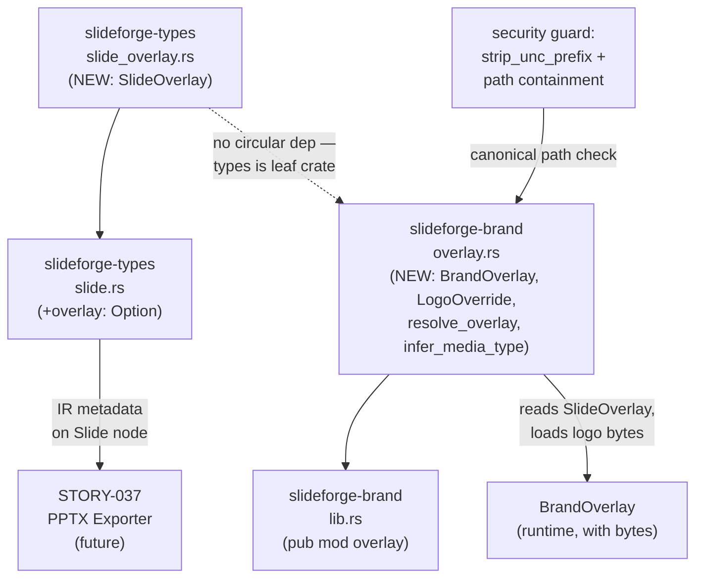
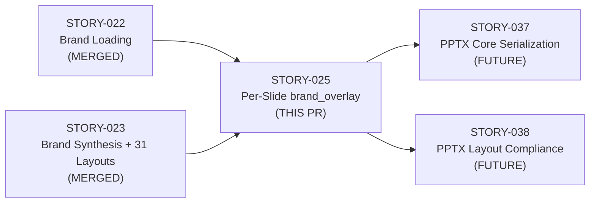
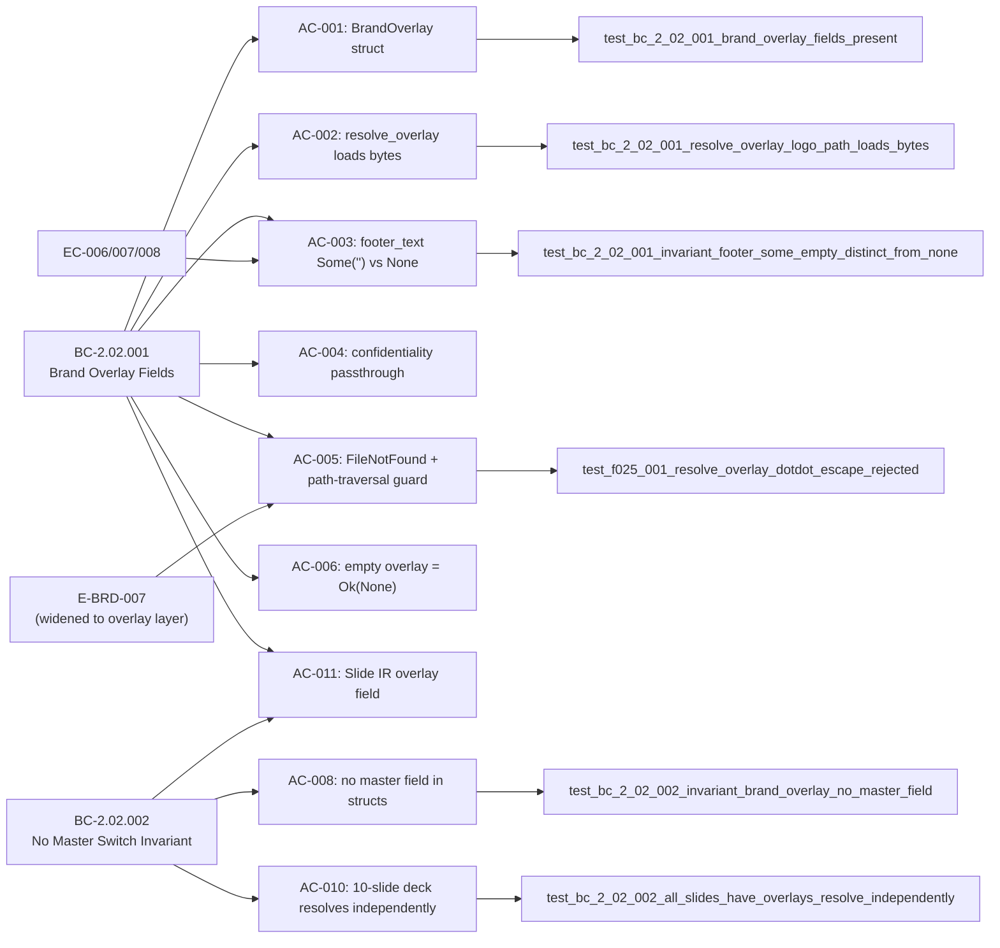

## STORY-025: Per-Slide `brand_overlay` — No Master Switch Invariant

**BC Trace:** BC-2.02.001 (v1.4) · BC-2.02.002 (v1.2) · E-BRD-007 (taxonomy v2.2) · EC-006/007/008  
**Crates:** `slideforge-brand` · `slideforge-types`  
**Epic:** EPIC-06 · Wave 3 · P1  
**LOCAL adversary convergence:** 11 passes · 3/3 strict-CLEAN (BC-5.39.001)

---

## Architecture Changes

**Key architectural decisions:**
- `SlideOverlay` lives in `slideforge-types` (leaf crate) — no circular dependency
- `BrandOverlay` lives in `slideforge-brand` with loaded logo bytes — separation of IR metadata vs runtime data
- Path-traversal containment guard in `resolve_overlay` mirrors the `synthesizer::load_from_toml` guard (E-BRD-007 widened to overlay layer)
- No `master_path` or `layout_idx` field anywhere in either type — compile-time enforcement of single-master invariant (DI-016)

---

## Story Dependencies

**Upstream dependency check:** STORY-022 (PR #27) and STORY-023 (PR #32) are both squash-merged to `develop`. No dependency blocks.

---

## Spec Traceability

---

## What Changed

### `slideforge-types` (new module)
- `crates/slideforge-types/src/slide_overlay.rs` — `SlideOverlay { logo_path, footer_text, confidentiality, span }` implementing `Hash + Eq + Clone + Debug`; `is_empty()` helper
- `crates/slideforge-types/src/slide.rs` — `overlay: Option<SlideOverlay>` field added to `Slide` IR
- `crates/slideforge-types/src/lib.rs` — `pub mod slide_overlay` added

### `slideforge-brand` (new module)
- `crates/slideforge-brand/src/overlay.rs` — `BrandOverlay`, `LogoOverride`, `resolve_overlay()`, `infer_media_type()`
  - Path-traversal containment: `../` dotdot escape rejected; symlink-outside-brand-dir rejected; empty `logo_path` string rejected with `LogoRequired`
  - `Some("") ≠ None` semantic preserved for `footer_text` throughout
  - Unknown file extensions resolve with `application/octet-stream` + `tracing::warn!` (not a hard error at the overlay layer)
- `crates/slideforge-brand/src/lib.rs` — `pub mod overlay` added

### `slideforge-eval` (documentation only)
- `crates/slideforge-eval/src/for_eval.rs` — deferral comment on `overlay: None` placeholder (AC-007/009/012 deferred to STORY-008/009 parser)

---

## Test Evidence

| Metric | Value |
|--------|-------|
| Workspace test count | **2299 tests run, 2299 passed, 3 skipped, 0 failures** |
| slideforge-brand tests | 455+ (brand + types combined) |
| clippy (pedantic + unwrap_used) | **CLEAN** |
| cargo fmt | **CLEAN** |
| RUSTDOCFLAGS="-D warnings" cargo doc | **CLEAN** |
| cargo build --workspace | **CLEAN** |

**Key test groups in `slideforge-brand`:**
- `test_bc_2_02_001_*` — AC-001 through AC-006, AC-011: field structure, resolve_overlay, footer semantics, confidentiality, FileNotFound
- `test_bc_2_02_002_*` — AC-008, AC-010: no-master-field invariant, 10-slide independent resolution
- `test_f025_001_*` — HIGH path-traversal containment: dotdot escape, symlink escape, legitimate in-dir logo, empty logo_path
- `test_f025_002_*` / `test_f025_003_*` — unknown extension warn + full MIME type coverage (png, jpeg, gif, svg, wmf, emf, extensionless, unknown)

**Known pre-existing test (leaky flag):** `synthesizer::tests::test_bc_2_01_002_ac012_handout_master_stub_present` — PASSES (listed as leaky by implementer for environmental sensitivity, not a regression).

---

## Demo Evidence

10 ACs demo'd via VHS terminal recordings. All files committed at `19dc6b59`.

**Location:** `docs/demo-evidence/STORY-025/`

| AC | Recording | Status |
|----|-----------|--------|
| AC-001 | `AC-001-brand-overlay-structs.{tape,gif,webm}` | PASSED |
| AC-002 | `AC-002-logo-bytes-loaded.{tape,gif,webm}` | PASSED |
| AC-003 | `AC-003-footer-some-empty-vs-none.{tape,gif,webm}` | PASSED |
| AC-004 | `AC-004-confidentiality-passthrough.{tape,gif,webm}` | PASSED |
| AC-005 | `AC-005-missing-logo-file-not-found.{tape,gif,webm}` | PASSED |
| AC-005 (security) | `AC-005-path-traversal-guard.{tape,gif,webm}` | PASSED |
| AC-005 (ext warn) | `AC-005-unknown-ext-warn.{tape,gif,webm}` | PASSED |
| AC-006 | `AC-006-empty-overlay-noop.{tape,gif,webm}` | PASSED |
| AC-008 | `AC-008-no-master-switch-invariant.{tape,gif,webm}` | PASSED |
| AC-010 | `AC-010-all-slides-resolve-independently.{tape,gif,webm}` | PASSED |
| AC-011 | `AC-011-slide-ir-overlay-field.{tape,gif,webm}` | PASSED |
| AC-013 | `AC-013-forbid-unsafe-clippy-clean.{tape,gif,webm}` | PASSED |

---

## Deferred / Out-of-Scope ACs

Three ACs require `slideforge-syntax` (parser) which does not yet exist. All deferrals are documented in `evidence-report.md` with blocking story references.

| AC | Reason | Blocking Story |
|----|--------|---------------|
| AC-007 | Duplicate `brand_overlay:` block → E-PAR-002 (parse-time) | STORY-008/009 |
| AC-009 | `brand_overlay: template "..."` syntax → parse error (parse-time) | STORY-008/009 |
| AC-012 | Duplicate `brand:` declaration → E-PAR-002 (parse-time) | STORY-008/009 |

**Production wiring:** `resolve_overlay()` integration into the PPTX output pipeline (AC-002 end-to-end) deferred to STORY-037.

---

## Security Review

**E-BRD-007 path-traversal containment guard (HIGH — addressed in this story):**

`resolve_overlay()` in `overlay.rs` implements the same two-layer containment guard as `synthesizer::load_from_toml`:

1. **Canonical path check:** `fs::canonicalize(resolved_path)` then verify the canonical path starts with `fs::canonicalize(brand_dir)`. Rejects `../` escape and symlinks pointing outside the brand directory → `BrandError::LogoOutsideBrandDir { path, brand_dir }`.
2. **Empty string guard:** `logo_path` of `Some("")` rejected with `BrandError::LogoRequired` before any filesystem access.
3. **Windows UNC prefix stripping:** `strip_unc_prefix` helper applied to both paths before prefix comparison (reused from synthesizer, consistent guard).

The guard was validated in LOCAL adversary pass 9 (finding F-025-001) and fixed in commit `a4d49b3a`. Tests: `test_f025_001_resolve_overlay_dotdot_escape_rejected`, `test_f025_001_resolve_overlay_symlink_escape_rejected`, `test_f025_001_resolve_overlay_in_dir_logo_accepted`, `test_f025_a_empty_logo_path_rejected_with_logo_required`.

**Other security surface:** No network access, no exec, no unsafe code (`#![forbid(unsafe_code)]` on both crates).

---

## LOCAL Adversary Convergence Summary

| Pass | Findings | Severity | Streak |
|------|----------|----------|--------|
| 1 | 3 | MED+LOW+OBS | 0/3 |
| 2 | 2 | LOW+OBS | 0/3 |
| 3 | 3 | HIGH+LOW+OBS | 0/3 |
| 4 | 3 | MED+LOW+OBS | 0/3 |
| 5 | 2 | LOW+OBS | 0/3 |
| 6 | 3 | HIGH+OBS+OBS | 0/3 |
| 7 | 4 | MED+OBS+OBS+OBS | 0/3 |
| 8 | 4 | HIGH+MED+OBS+OBS | 0/3 |
| **9** | 0 | — | **1/3** |
| **10** | 0 | — | **2/3** |
| **11** | 0 | — | **3/3 CONVERGED** |

CLEAN (strict): **yes** — zero findings of any severity on passes 9, 10, 11.

Notable fix during cascade: HIGH path-traversal containment guard (E-BRD-007) added to `resolve_overlay` at pass 3 finding, fixed in commit `a4d49b3a`.

---

## Risk Assessment

| Dimension | Assessment |
|-----------|-----------|
| Blast radius | Low — library-only story; no production pipeline caller yet (STORY-037 wires it) |
| Performance | No hot path; `resolve_overlay` called at build time, not per-render |
| Breaking changes | None — adds new fields and modules; `Slide.overlay` defaults to `None` |
| Security | Path-traversal addressed (HIGH finding, fixed); no network/exec surface |
| Reversibility | High — new modules, additive changes only |

---

## Holdout Evaluation

N/A — evaluated at wave gate (Wave 3 gate, post STORY-037 merge).

---

## Adversarial Review

LOCAL adversary cascade: 11 passes, 3/3 strict-CLEAN (BC-5.39.001 satisfied). PR-level adversarial review dispatched as part of this PR cycle.

---

## AI Pipeline Metadata

| Field | Value |
|-------|-------|
| Pipeline mode | Greenfield Phase 3 |
| Story points | 3 |
| Models used | claude-sonnet-4-6 (implementer, pr-manager) |
| LOCAL adversary passes | 11 (3/3 strict-CLEAN) |
| Pre-push gate | All 4 gates PASS (fmt, clippy, nextest, rustdoc) |

---

## Pre-Merge Checklist

- [x] PR description matches actual diff
- [x] All ACs covered by demo evidence (10 demos; 3 ACs explicitly deferred with blocking story refs)
- [x] Traceability chain complete: BC-2.02.001/002 → AC → Test → Demo
- [x] LOCAL adversary: 3/3 strict-CLEAN (BC-5.39.001)
- [x] Pre-push gate: fmt CLEAN, clippy CLEAN, nextest 2299/2299 PASS, rustdoc CLEAN
- [x] Path-traversal containment guard (E-BRD-007) implemented and tested
- [x] Dependency PRs merged (STORY-022 #27, STORY-023 #32)
- [x] `#![forbid(unsafe_code)]` on both crates
- [x] Zero `.unwrap()` in non-test code
- [ ] CI checks passing (post-push)
- [ ] AI code review (pr-reviewer) — PR-merge CLEAN
- [ ] Security review — PR-merge CLEAN
