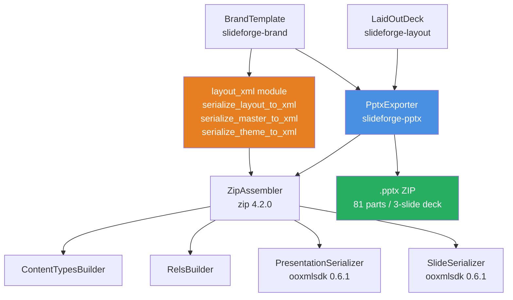
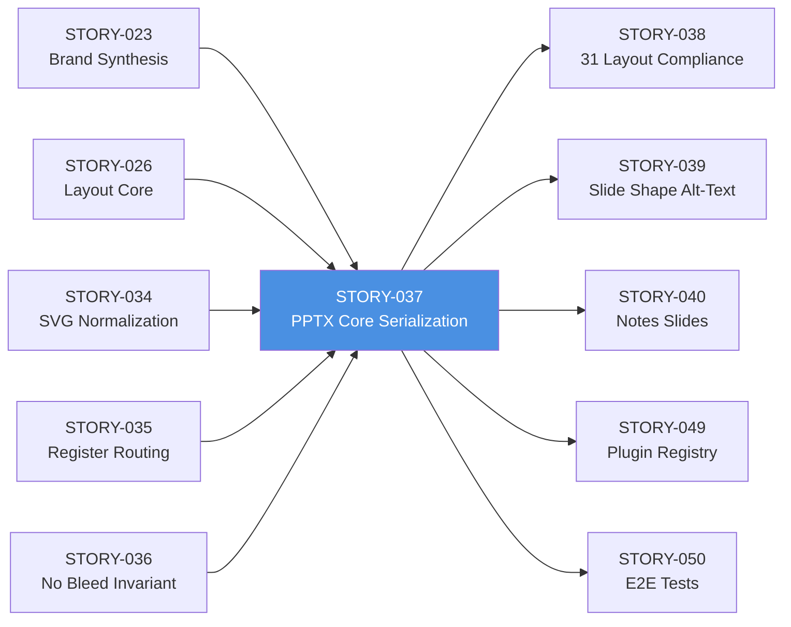
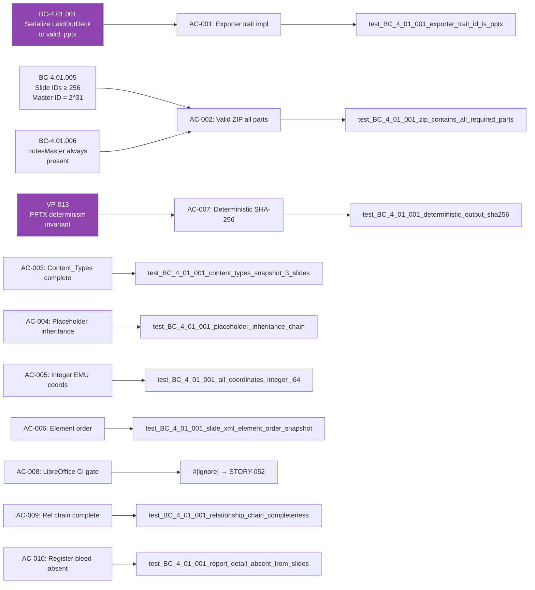

## STORY-037: PPTX Core Serialization — ooxmlsdk 0.6.1 + ZIP Assembly

**Epic:** EPIC-08 (PPTX Export)
**Wave:** 4
**Points:** 13
**Crate:** `slideforge-pptx` (SS-06) + additions to `slideforge-brand`
**Branch:** `feature/S-037` → `develop`
**Head:** `e7699d9a`

---

## Architecture Changes

**New crate:** `crates/slideforge-pptx` — implements the `Exporter` plugin trait for PPTX output.
**Modified crate:** `crates/slideforge-brand` — added `serialize_master_to_xml`, `serialize_theme_to_xml`, and `layout_xml` module per ADR-015.

---

## Story Dependencies

All upstream dependencies (STORY-023, 026, 034, 035, 036) are merged to `develop`.

---

## Spec Traceability

---

## Behavioral Contracts

| BC | Title | ACs Covered |
|----|-------|-------------|
| BC-4.01.001 | Serialize LaidOutDeck to valid .pptx with correct placeholder inheritance | AC-001..AC-010 |
| BC-4.01.005 | Slide IDs start at 256; master ID = 2^31 | AC-002 (presentation.xml) |
| BC-4.01.006 | notesMaster1.xml + handoutMaster1.xml always present | AC-002, AC-003 |
| VP-013 | Same input → byte-identical PPTX output | AC-007 |

---

## What This PR Implements

### Core deliverables

- **Full PPTX ZIP** with all required parts (81 parts for a 3-slide deck including 31 layout XMLs)
- **`[Content_Types].xml`** with `<Override>` entries for all parts (31 layouts, N slides, theme, masters, docProps)
- **Relationship chains** complete: `slide → layout (idx) → master (type) → theme`
- **Slide serialization** via ooxmlsdk 0.6.1 typed builders — title (`ph idx="0"`), content (`ph idx="1"`), speaker shapes
- **Integer EMU coordinates** throughout — no `f64` in any `<a:off>` or `<a:ext>` attribute
- **Deterministic output** — alphabetical ZIP entry ordering, epoch timestamps (1980-01-01), `BTreeMap` for map-to-XML serialization; SHA-256 identical on consecutive builds
- **`Exporter` plugin trait** — `PptxExporter` registered via plugin API; no trait bypass
- **Brand rendering** per ADR-015: `slideforge-brand::layout_xml::serialize_layout_to_xml`, `serialize_master_to_xml`, `serialize_theme_to_xml` — not hardcoded shells
- **Dark layout `clrMapOvr`** — slides using dark-themed layouts carry `<p:clrMapOvr><a:masterClrMapping/></p:clrMapOvr>` in correct schema position
- **Two-phase layout mapping** — `slide_type_keyword` routes slide types to layout indices; 9 unmapped DSL keywords warn and fall back to index 1 (STORY-038 decides new layouts)
- **Typed `<p:pic>` for diagrams** — built via ooxmlsdk builders (no raw XML splicing); `NormalizedDiagramSvg` input only
- **Register bleed guard** — report/detail `RegisteredContent` never appears in `ppt/slides/slide*.xml` body (STORY-036 bleed tests un-ignored for PPTX)
- **Notes/handout master stubs** — always present; full notes content added in STORY-040
- **`docProps/core.xml` + `docProps/app.xml`** — minimal valid fields

### ADR-015 + Addendum A compliance

`slideforge-brand` was extended with a new `layout_xml` module implementing:
- `serialize_layout_to_xml(&SlideLayoutDef) -> Vec<u8>` — schema-correct `slideLayoutN.xml` from structured `BrandTemplate` data
- `serialize_master_to_xml(&BrandTemplate) -> Vec<u8>` — schema-correct `slideMaster1.xml` including all 31 layout references
- `serialize_theme_to_xml(&BrandTemplate) -> Vec<u8>` — `theme1.xml` from `BrandTemplate.colors` + `BrandTemplate.fonts`

`slideforge-pptx` calls all three APIs; no hardcoded XML shells.

---

## Test Evidence

| Metric | Value |
|--------|-------|
| `slideforge-pptx` tests | 341 tests / 341 passed / 1 skipped (LibreOffice CI gate, `#[ignore]` per SID-1) |
| `slideforge-brand` tests | included in 341 total |
| Full workspace tests (post-rebase) | **2878 tests / 2878 passed** / 13 skipped |
| `cargo fmt --all -- --check` | CLEAN |
| `cargo clippy -p slideforge-pptx -p slideforge-brand -D pedantic -D unwrap_used` | CLEAN |
| `cargo clippy --workspace -D warnings` | CLEAN |
| Snapshot tests (`insta`) | AC-003 `[Content_Types].xml` snapshot, AC-006 `slide1.xml` element order snapshot |
| Determinism test | SHA-256 `56c5e52acbafdb60fd044992fb215366a383b2b6561ef6df3f2242d80bcefc95` identical on two consecutive builds |

**Local adversary convergence:** 3/3 strict-CLEAN passes (8 total passes; converged on pass 8 after resolving ADR-015 critical findings)

---

## Demo Evidence

Location: `docs/demo-evidence/STORY-037/`

| File | Purpose |
|------|---------|
| `AC-001-010-pptx-core-serialization.gif` | VHS terminal recording: all 10 ACs exercised sequentially |
| `AC-001-010-pptx-core-serialization.webm` | Archival WebM of same run |
| `AC-001-010-pptx-core-serialization.tape` | VHS tape source |

**AC coverage:** 9/10 demonstrated locally; AC-008 (LibreOffice) correctly deferred to STORY-052 CI gate.

| AC | Status | Key output |
|----|--------|-----------|
| AC-001 Exporter trait | PASS | `id()='pptx'`, `extension()='pptx'` |
| AC-002 ZIP all parts | PASS | 81 parts, 31 layouts, notesMaster, handoutMaster |
| AC-003 Content_Types | PASS | 31 layout `<Override>` entries + 8 content types |
| AC-004 Placeholder inheritance | PASS | `ph type="title" idx="0"` confirmed in `slide1.xml` |
| AC-005 Integer EMU | PASS | `x="0"`, sample `x=457200` — no decimal |
| AC-006 Element order | PASS | `nvSpPr=268 < spPr=404 < txBody=541` |
| AC-007 Determinism | PASS | SHA-256 identical on two builds |
| AC-008 LibreOffice | CI-GATE | `#[ignore]` → STORY-052 |
| AC-009 Rel chain | PASS | `slide→layout→master→theme` verified |
| AC-010 Bleed absent | PASS | REPORT\_SENTINEL/DETAIL\_SENTINEL absent from slides |

---

## Holdout Evaluation

N/A — evaluated at wave gate (Wave 4 gate runs after all Wave 4 stories merge).

---

## Adversarial Review

**Local adversary: 3/3 strict-CLEAN (8 passes total)**

| Pass | CLEAN (strict) | CLEAN (PR-merge) | Notes |
|------|---------------|------------------|-------|
| 1 | no | no | CRITICAL: hardcoded master/layout shells; ADR-015 raised |
| 2 | no | no | HIGH: raw XML splice in diagram `<p:pic>` |
| 3 | no | no | MED: find_layout_index single-phase vs two-phase spec |
| 4 | no | yes | LOW: missing `#[allow]` annotations + fmt issues |
| 5 | no | yes | OBS: doc comment formatting |
| 6 | yes | yes | CLEAN |
| 7 | yes | yes | CLEAN |
| 8 | yes | yes | CLEAN — converged |

---

## Security Review

Pending — orchestrator dispatches security-reviewer after PR is open.

---

## Risk Assessment

| Dimension | Assessment |
|-----------|-----------|
| Blast radius | `slideforge-pptx` (new crate, no existing callers) + `slideforge-brand` layout_xml module additions (additive only, no existing function signatures changed) |
| Breaking changes | None. All additions. `slideforge-brand` changes are additive; no existing public API modified. |
| Performance | ZIP assembly is in-memory; 3-slide deck produces 81 parts. No perf regression on other crates verified (full workspace nextest 2878 pass). |
| Correctness risk | AC-008 (LibreOffice open) is the primary residual risk; covered by STORY-052 CI gate. |
| Supply chain | `ooxmlsdk =0.6.1`, `zip =4.2.0` — both pinned per NFR-025. Transitive deps via `Cargo.lock`. |

---

## Deferred / Follow-ups (cross-story, per ADR-015 Addendum A)

These are deliberate scope boundaries, not shortcuts. Each is anchored to a specific story:

| Deferral | Anchor Story | Reason |
|----------|-------------|--------|
| Full per-type layout-selection compliance (31 slide types → correct layout idx, not index-1 fallback for unmapped) | STORY-038 | STORY-038 decides new layout slots for unmapped DSL keywords |
| End-to-end `clrMapOvr` for all 31 layouts | STORY-038 | Depends on STORY-038 completing the layout-type mapping |
| Diagram SVG-blip raster-fallback parity | STORY-038 / STORY-040 | Requires media embedding infrastructure (STORY-038) |
| Slide shape alt-text (WCAG) in PPTX `<p:cNvPr descr="...">` | STORY-039 | STORY-039 owns all PPTX accessibility surfaces |
| Notes slides content from `Register::Notes` | STORY-040 | STORY-040 owns notes serialization |
| 9 unmapped DSL keywords use index-1 fallback with warning | STORY-038 | STORY-038 adds new layout definitions; fallback is correct interim behavior |

---

## AI Pipeline Metadata

| Field | Value |
|-------|-------|
| Pipeline mode | Greenfield Phase 3 (TDD implementation) |
| Model | claude-sonnet-4-6 |
| Adversary passes | 8 (converged at pass 6; 3-CLEAN streak per BC-5.39.001) |
| Rebase conflict | None (git rebase succeeded cleanly; develop had `slideforge-docx` in members from STORY-041 — already present as expected) |

---

## Pre-Merge Checklist

- [x] PR description matches actual diff
- [x] All ACs covered by demo evidence (9/10 locally; AC-008 = CI gate by design)
- [x] Traceability chain complete (BC → AC → Test → Demo)
- [x] Rebase onto origin/develop (a3b47303) complete; branch force-pushed
- [x] `cargo fmt --all -- --check` CLEAN
- [x] `cargo clippy -p slideforge-pptx -p slideforge-brand -D pedantic -D unwrap_used` CLEAN
- [x] `cargo clippy --workspace -D warnings` CLEAN (no cross-crate breakage)
- [x] `cargo nextest run -p slideforge-pptx -p slideforge-brand` — 341/341 PASS
- [x] Full workspace nextest — 2878/2878 PASS
- [x] Local adversary convergence: 3/3 strict-CLEAN
- [x] Demo evidence in `docs/demo-evidence/STORY-037/`
- [ ] Security review (pending — orchestrator dispatches after PR open)
- [ ] pr-reviewer approval (pending — orchestrator dispatches after PR open)
- [ ] CI checks green
- [ ] No dependency PRs pending (all upstream merged)
