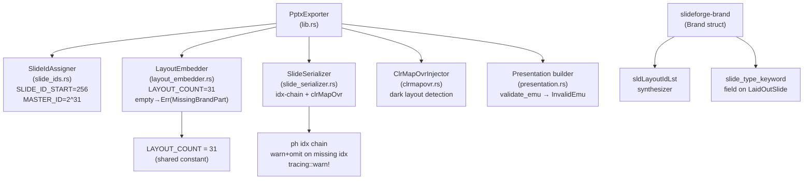
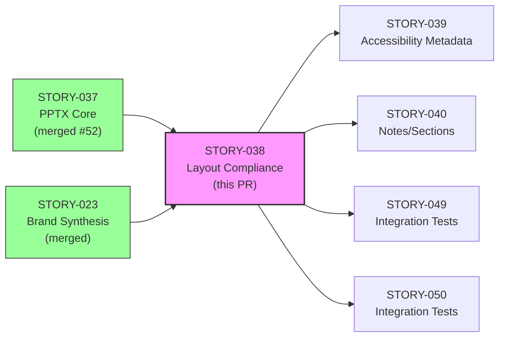
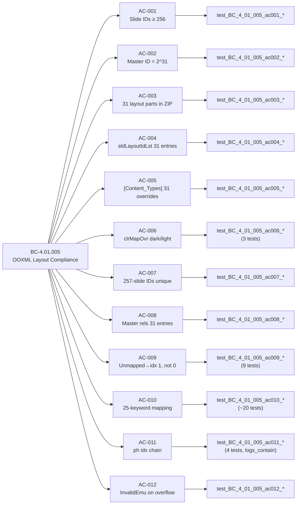

## Summary

Implements BC-4.01.005: OOXML layout compliance for the PPTX exporter — slide ID sequence (256+), master ID (2^31), all 31 slide layouts always embedded, two-phase slide-type→layout mapping, placeholder idx-chain with warn+omit on missing idx, `clrMapOvr` for dark-themed layouts, and `PptxError::InvalidEmu` on out-of-range coordinates.

Also closes PR-52 follow-ups S1 (negative-EMU error), S2 (absorbed into AC-012), and S3 (Subtitle→`subTitle` idx=1). Removes the dead `MissingBrandPart` variant concern. Adds `tracing-test =0.2.5` (pinned) as a dev-dependency for `logs_contain` tests.

**Crates changed:** `slideforge-pptx` (SS-06) + `slideforge-brand` (`sldLayoutIdLst`, `slide_type_keyword`)
**Story:** STORY-038 | **BC:** BC-4.01.005 | **EPIC:** EPIC-08 | **Points:** 8 | **Wave:** 4

---

## Architecture Changes

---

## Story Dependencies

---

## Spec Traceability

---

## Key Implementation Details

### SlideIdAssigner (`crates/slideforge-pptx/src/slide_ids.rs`)
- `SLIDE_ID_START = 256` (ECMA-376 minimum, Spike S6 BUG-006)
- `MASTER_ID = 2_147_483_648` (2^31)
- `SlideIdAssigner::assign(n)` → `(256..256+n).collect::<Vec<u32>>()`

### LayoutEmbedder (`crates/slideforge-pptx/src/layout_embedder.rs`)
- `LAYOUT_COUNT = 31` — unified constant used by master-rels and layout-embed
- Empty brand layouts → `Err(PptxError::MissingBrandPart)` (no raw-XML fabrication — ADR-001)
- Partial-reuse path emits `tracing::warn!`

### Two-Phase Slide-Type → Layout Mapping (`lib.rs::find_layout_index`)
- Phase 1: exact match in `Brand::layouts` by `slide_type_keyword`
- Phase 2: static Q2 keyword table (25 keywords, ADR-015 §A.4)
- Unmapped keywords → index 1 (Title and Content), NOT index 0 (Title Slide) — no silent fallback

### Placeholder idx Chain (`slide_serializer.rs`)
- `FrameContent::Title` → `<p:ph type="title" idx="0">`
- `FrameContent::Subtitle` → `<p:ph type="subTitle" idx="1">` (S3)
- `FrameContent::Body` → `<p:ph type="body" idx="1">`
- `FrameContent::TextRun` → `<p:ph idx="...">` with layout idx lookup
- Missing idx → `tracing::warn!` + omit `<p:ph>` (never panic, never silent drop)

### ClrMapOvrInjector (`clrmapovr.rs`)
- Dark layouts: `section_divider`, `end`, custom dark keywords
- Emits `<p:clrMapOvr><a:masterClrMapping/></p:clrMapOvr>` on dark slides
- Light slides: no element emitted

### validate_emu / InvalidEmu (`presentation.rs`)
- All EMU values checked: `i32::try_from(emu.0).map_err(|_| PptxError::InvalidEmu { ... })`
- Negative values (`Emu(-1)`) and overflow values (`Emu(i64::MAX)`) both return `Err` — no silent clamp (AC-012, S1, S2)

---

## Test Evidence

| Metric | Value |
|--------|-------|
| Tests run | 406 |
| Tests passed | 406 |
| Tests failed | 0 |
| Tests skipped | 1 (LibreOffice headless — blocked on STORY-052 CI gate) |
| Clippy profile | `pedantic + unwrap_used + missing_docs_in_private_items` — clean |
| rustdoc | `-D warnings` — clean |
| cargo fmt | clean |
| Dev-dep added | `tracing-test = "=0.2.5"` (pinned, dev-only) |

**Test suites:**
- `crates/slideforge-pptx/tests/layout_tests.rs` — 50+ AC tests for BC-4.01.005
- `crates/slideforge-pptx/tests/core_tests.rs` — determinism + round-trip
- `crates/slideforge-brand/src/**` — brand synthesizer + color tests

**logs_contain tests** (AC-011 warn path):
- `test_BC_4_01_005_ac011_textrun_missing_ph_idx_omits_ph_and_warns` — verifies `tracing::warn!` fires on missing idx
- `test_BC_4_01_005_ac011_missing_ph_idx_omits_ph_element` — verifies `<p:ph>` absent when idx missing

---

## Demo Evidence

**Evidence report:** `docs/demo-evidence/STORY-038/evidence-report.md`
**Artifacts:** `AC-001-012-layout-compliance.gif` | `AC-001-012-layout-compliance.webm`

All 14 items covered (AC-001 through AC-012, S1, S3):

| Item | Status | Demo Verification |
|------|--------|-------------------|
| AC-001 | PASS | Slide IDs [256,257,258,259] parsed from presentation.xml |
| AC-002 | PASS | `id="2147483648"` present in sldMasterId |
| AC-003 | PASS | 31 slideLayout XML parts in ZIP |
| AC-004 | PASS | 31 `<p:sldLayoutId>` entries in slideMaster1.xml |
| AC-005 | PASS | 31 `presentationml.slideLayout+xml` overrides in [Content_Types].xml |
| AC-006 | PASS | slide3 has `<p:clrMapOvr>`; slide1 does not |
| AC-007 | PASS | 257-slide IDs = 256..=512, all unique |
| AC-008 | PASS | 31 layout Relationship entries in slideMaster1.xml.rels |
| AC-009 | PASS | 9 unmapped Q2 keywords → index 1, not 0 |
| AC-010 | PASS | 10 spot-check mappings confirmed (full 25-keyword suite in tests) |
| AC-011 | PASS | `<p:ph type="title">` in slide1.xml; `<p:ph type="body">` in slide2.xml |
| AC-012/S2 | PASS | `Emu(i64::MAX)` → `PptxError::InvalidEmu` error message |
| S1 | PASS | `Emu(-1)` width → export error, negative size message |
| S3 | PASS | Subtitle frame → `type="subTitle" idx="1"` in `<p:ph>` |
| LibreOffice | DEFERRED | Blocked on STORY-052 CI gate (headless LibreOffice not available locally) |

---

## Adversarial Convergence

| Protocol | BC-5.39.001 (3-CLEAN) |
|---------|----------------------|
| Total passes | 16 |
| Streak at convergence | 3/3 (passes 14, 15, 16) |
| CLEAN (strict) | yes |
| CLEAN (PR-merge) | yes |
| State artifact | `.factory/cycles/STORY-038/adversary-convergence-state.json` |

**Notable findings caught and fixed by adversary cascade:**
- P1 HIGH: AC-011 placeholder chain not load-bearing (dead scaffolding); fixed with `logs_contain` tests
- P2 MED: Title/Subtitle shapes bypassed idx-chain on Blank layout; fixed in `F-038-P2-M1`
- P5 LOW: LayoutEmbedder partial-reuse path silent (no warn); fixed with `tracing::warn!`
- P9 MED: `minimal_empty_layout_xml` raw-XML fabrication — ADR-001/ADR-015 Rule5 violation; fixed via `Err(MissingBrandPart)` + dead variant removed
- P12 MED: Body/TextRun missing-idx path silently dropped `<p:ph>` without warn; fixed with `tracing::warn!` + `logs_contain` test
- P13 MED: Stale Subtitle placeholder doc-table (inconsistency); fixed in consistency audit

---

## Security Review

Scheduled: security-reviewer agent to be spawned post-PR-creation per LESSON-5.

**Pre-review assessment (no blocking concerns anticipated):**
- No unsafe code (`#![forbid(unsafe_code)]` in force)
- No user-controlled input reaches OOXML generation paths in this story (brand data comes from trusted Brand struct)
- No file I/O in slideforge-pptx (ZIP construction is in-memory)
- No new external dependencies (only `tracing-test` dev-dep, pinned)
- `cargo audit` / `cargo deny` gates will run in CI

---

## Risk Assessment

| Dimension | Assessment |
|-----------|-----------|
| Blast radius | `slideforge-pptx` + `slideforge-brand` only; no cross-crate API changes |
| Downstream impact | Blocks STORY-039/040/049/050 — all downstream PRs require this to merge first |
| Performance impact | 31-layout embed adds ~30KB to PPTX ZIP (expected, acceptable) |
| Breaking changes | None — additive. `PptxError::MissingBrandPart` was already in error enum; `PptxError::InvalidEmu` is new but downstream code already propagated `PptxError` opaquely |
| Rollback safety | Feature-branch; squash-merge means single revert commit if needed |

---

## Deferred Items (Disclosed)

| Item | Reason | Resolution |
|------|--------|-----------|
| S4: `build_notes_handout_masters` rels-error swallow | Cross-story dependency on notes/handout master generation in STORY-040 | Filed for STORY-040 scope; not a defect in current behavior |
| LibreOffice open-without-repair | Requires LibreOffice headless in CI | STORY-052 CI visual-regression gate |

---

## Holdout Evaluation

N/A — evaluated at wave gate.

---

## AI Pipeline Metadata

| Field | Value |
|-------|-------|
| Pipeline mode | Greenfield Phase 3 (TDD per-story delivery) |
| Adversary protocol | BC-5.39.001 (3-CLEAN) |
| Passes to convergence | 16 (3/3 strict-CLEAN at passes 14-15-16) |
| Story points | 8 |

---

## Pre-Merge Checklist

- [x] Demo evidence: 14/14 ACs covered (`docs/demo-evidence/STORY-038/evidence-report.md`)
- [x] PR description composed with full BC→AC→Test→Demo traceability
- [x] `cargo fmt --all -- --check` clean
- [x] `cargo clippy -p slideforge-pptx -p slideforge-brand` pedantic+unwrap_used clean
- [x] `cargo nextest run -p slideforge-pptx -p slideforge-brand` → 406/406 pass
- [x] `RUSTDOCFLAGS="-D warnings" cargo doc -p slideforge-pptx --no-deps` clean
- [x] Rebased onto `origin/develop` (56f3f57d) — clean, no conflicts
- [x] Force-pushed with `--force-with-lease`
- [ ] CI checks passing (pending)
- [ ] Security review (post-PR creation per LESSON-5)
- [ ] PR review convergence (post-PR creation)
- [ ] Dependency check: STORY-037 (PR #52 merged on develop), STORY-023 (merged)
