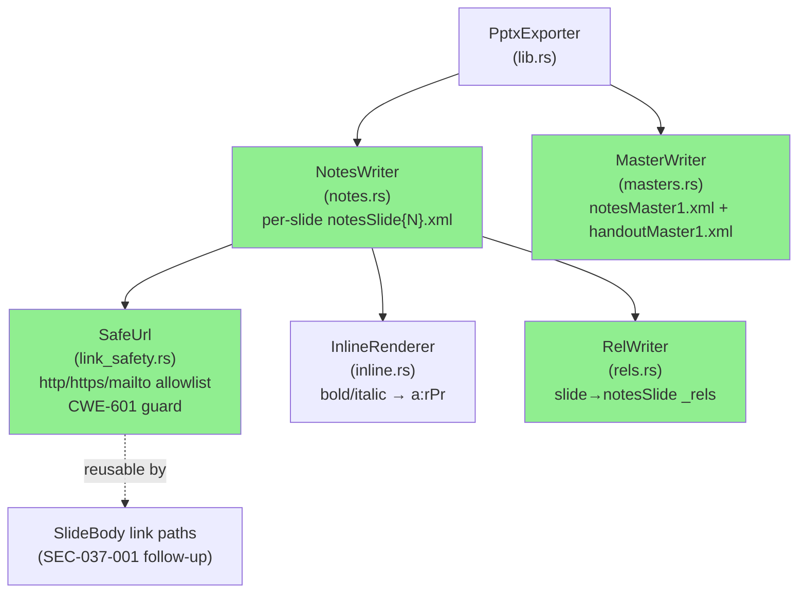
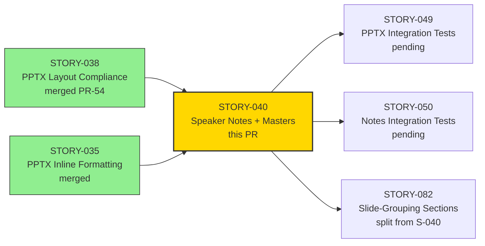
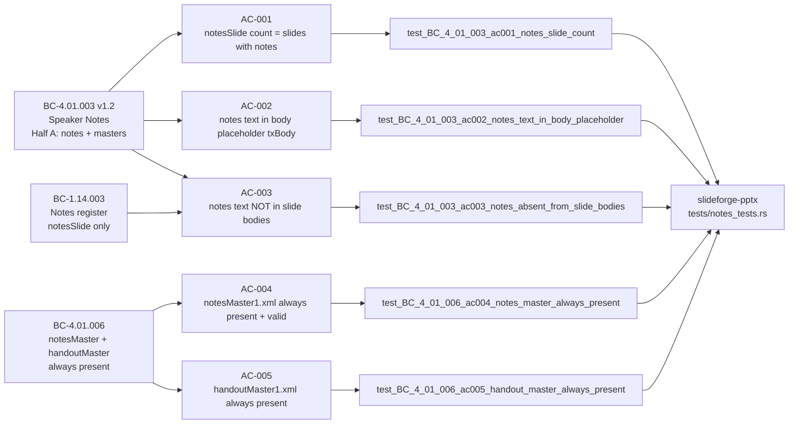
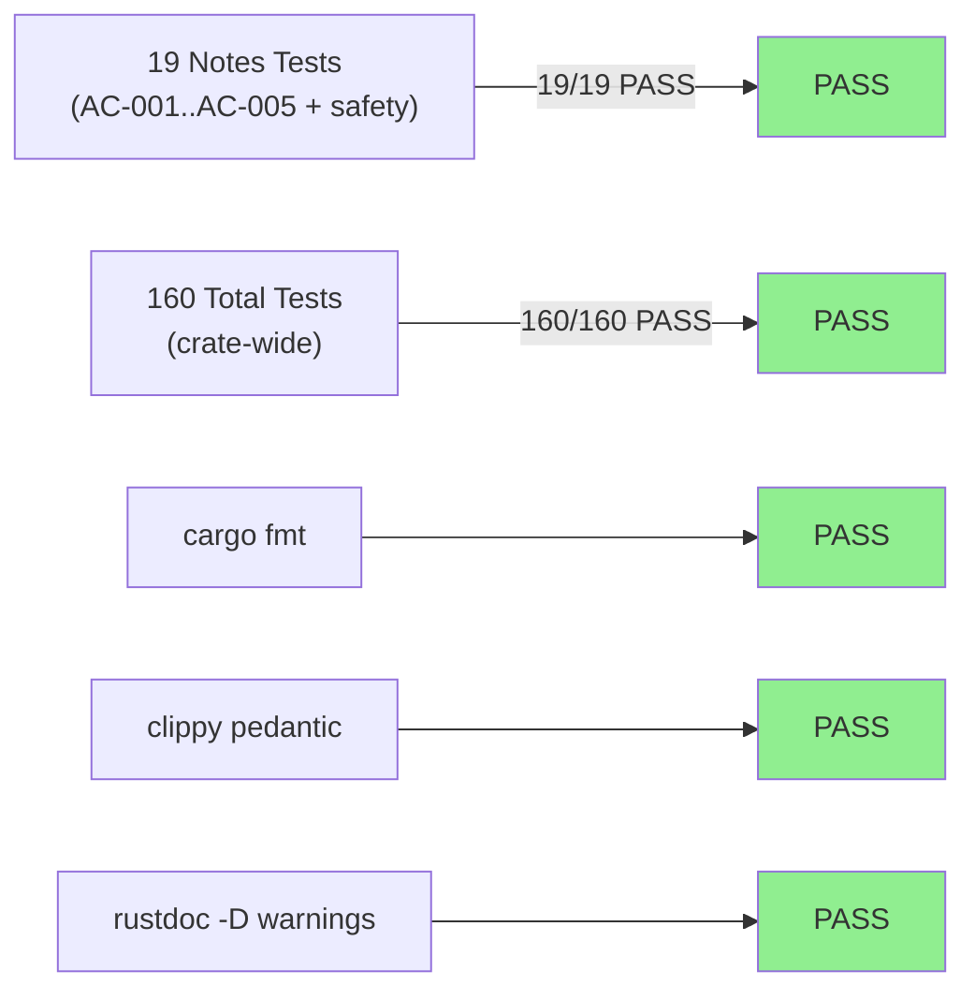
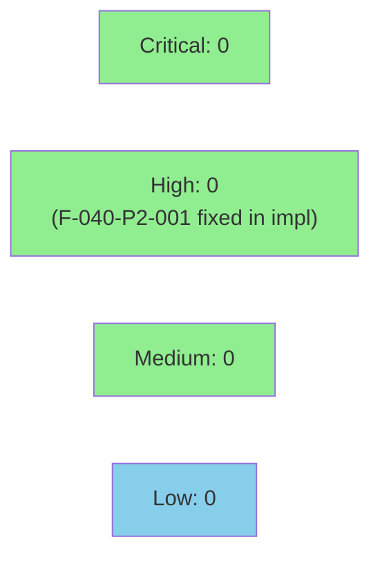

## [STORY-040] PPTX: Speaker Notes + notesMaster1.xml + handoutMaster1.xml

**Epic:** EPIC-08 — PPTX Serialization
**Mode:** Greenfield Phase 3 (TDD per-story delivery)
**Convergence:** CONVERGED after 7 adversarial passes (strict-CLEAN on passes 5, 6, 7)
**Story Points:** 3 (re-scoped from 5 — slide-grouping sections SPLIT to STORY-082 per human-authorized decision 2026-06-04)
**Wave:** 4


Implements per-slide speaker notes in the PPTX exporter: each slide with a non-empty `Register::Notes` value gets a `ppt/notesSlides/notesSlideN.xml` part plus the required slide-to-notesSlide `_rels` back-relationship (so PowerPoint discovers notes). Always emits `notesMaster1.xml` (with `clrMap`, `sldImg`, and body placeholders) and `handoutMaster1.xml`, even for decks with zero notes slides — as required by BC-4.01.006. Rich inline formatting (bold/italic) is supported in notes text. A new `SafeUrl` scheme allowlist (`link_safety.rs`, allowing `http`/`https`/`mailto` only) guards hyperlinks in notes: unsafe schemes (`javascript:`, `data:`, `file:`) degrade to plain text with a warning rather than emitting an `External` relationship (CWE-601 defense-in-depth). Notes content never bleeds to slide bodies (BC-1.14.003). All OOXML is schema-valid: `<p:grpSpPr>` contains `<a:xfrm>` (not a nested `<a:grpSpPr>`), `<p:ph>` is self-closing, and `<p:txBody>` is a sibling not a child of `<p:ph>`.

**Crate changed:** `slideforge-pptx` only (single-crate change).

---

## Architecture Changes



<details>
<summary><strong>Architecture Decision Record</strong></summary>

### ADR: SafeUrl scheme allowlist as reusable guard (not inline in notes writer)

**Context:** Notes hyperlinks required URL safety validation to prevent CWE-601 open redirect / script injection. The same need exists for slide-body links (tracked as SEC-037-001).

**Decision:** Extract URL validation into a standalone `link_safety.rs` module with a `SafeUrl` type and explicit scheme allowlist (`http`, `https`, `mailto`). The notes writer calls this module; SEC-037-001 can adopt it for slide-body links without code duplication.

**Rationale:** Single source of truth for the allowlist; easier to audit; prevents divergent implementations across notes vs. body paths.

**Alternatives Considered:**
1. Inline validation in notes writer — rejected because: not reusable; SEC-037-001 would duplicate logic.
2. Allowlist as a static string slice in `lib.rs` — rejected because: not type-safe; no unit testability without wiring through exporter.

**Consequences:**
- `SafeUrl::try_from(&str)` is now a public API in `slideforge-pptx` — SEC-037-001 can call it directly.
- Degradation to plain text (not error) is intentional: malformed presenter notes should not cause export failure.

</details>

---

## Story Dependencies



---

## Spec Traceability



---

## Test Evidence

### Coverage Summary

| Metric | Value | Threshold | Status |
|--------|-------|-----------|--------|
| Notes unit tests | 19/19 pass | 100% | PASS |
| Total crate tests | 160/160 pass | 100% | PASS |
| cargo fmt | clean | clean | PASS |
| clippy pedantic + unwrap_used | clean | clean | PASS |
| rustdoc (-D warnings) | clean | clean | PASS |
| Mutation kill rate | N/A Phase 6 | >90% (Phase 6) | deferred |
| Holdout satisfaction | N/A wave gate | >0.85 | deferred |

### Test Flow



| Metric | Value |
|--------|-------|
| **New tests** | 19 added (all notes_tests.rs) |
| **Total suite** | 160 tests PASS (slideforge-pptx crate) |
| **Coverage delta** | All notes code paths exercised by load-bearing tests parsing real .pptx ZIP/XML |
| **Mutation kill rate** | Phase 6 (deferred per wave schedule) |
| **Regressions** | 0 |

<details>
<summary><strong>Detailed Test Results</strong></summary>

### New Tests (This PR) — notes_tests.rs

| Test | AC/Behavior | Result |
|------|-------------|--------|
| `test_BC_4_01_003_ac001_notes_slide_count_equals_slides_with_notes` | AC-001 | PASS |
| `test_BC_4_01_003_ac001_ec001_no_notes_slide_for_empty_notes` | EC-001 | PASS |
| `test_BC_4_01_003_ac002_notes_text_in_body_placeholder` | AC-002 | PASS |
| `test_BC_4_01_003_ac003_notes_absent_from_slide_bodies` | AC-003 | PASS |
| `test_BC_4_01_006_ac004_notes_master_always_present` | AC-004 | PASS |
| `test_BC_4_01_006_ac005_handout_master_always_present` | AC-005 | PASS |
| `test_f040_p1_001_slide_has_notes_slide_rel_in_slide_rels` | F-040-P1-001 slide→notesSlide rel | PASS |
| `test_f040_p1_002_notes_master_xml_is_structurally_valid` | F-040-P1-002 notesMaster validity + no grpSpPr | PASS |
| `test_f040_p1_003_rich_notes_bold_and_italic_runs` | F-040-P1-003 rich formatting | PASS |
| `test_f040_p1_003_multi_entry_notes_all_emitted` | F-040-P1-003 multi-entry | PASS |
| `test_f040_p1_004_ac003_no_bleed_with_positive_routing` | AC-003 positive routing | PASS |
| `test_f040_p2_001_unsafe_scheme_javascript_no_external_rel` | CWE-601 javascript: | PASS |
| `test_f040_p2_001_unsafe_schemes_data_file_no_external_rel` | CWE-601 data:/file: | PASS |
| `test_f040_p2_002_single_safe_https_link_has_hlinkclick_and_external_rel` | https: hlinkClick | PASS |
| `test_f040_p2_002_two_distinct_links_stable_deterministic_rids` | Deterministic rIds | PASS |
| `test_f040_p2_002_duplicate_url_deduped_to_single_rel` | URL deduplication | PASS |
| `test_f040_p2_003_notes_text_xml_escape_well_formed_and_lossless` | XML-escape lossless | PASS |
| `test_f040_a1_notes_slide_grpsppr_is_schema_valid` | F-040-A1 schema-valid grpSpPr | PASS |
| `test_f040_p3_001_nested_link_in_display_text_no_orphan_rel` | No orphan External rel | PASS |

### Evidence: Tests parse real .pptx ZIP/XML

All 19 notes tests call `PptxExporter::export` with a real `Deck` + `LaidOutDeck`, open the produced PPTX ZIP with the `zip` crate, parse extracted XML with `quick-xml`, and assert against real XML structure — no mock strings.

</details>

---

## Demo Evidence

**Evidence report:** `docs/demo-evidence/STORY-040/evidence-report.md`

All ACs covered by extracted values from real .pptx ZIP output:

| File | AC/Behavior | What it proves |
|------|-------------|----------------|
| `AC-001-notes-slide-zip-entries.txt` | AC-001 | ZIP entry list: 2 notesSlide parts for 3-slide deck with 2 notes slides |
| `EC-001-no-notes-slide-for-empty-notes.txt` | EC-001 | 0 notesSlide parts for no-notes deck |
| `AC-002-notes-text-body-placeholder.txt` | AC-002 | Formatted notesSlide1.xml showing body placeholder + text |
| `AC-002-notesSlide1-raw.xml` | AC-002 | Raw notesSlide1.xml from real PPTX ZIP |
| `AC-003-no-bleed-sentinel-check.txt` | AC-003 | Sentinel absent from slide bodies, present in notesSlide |
| `AC-004-notes-master-validity.txt` | AC-004 | notesMaster1.xml structural assertions all true |
| `AC-004-notesMaster1-raw.xml` | AC-004 | Raw notesMaster1.xml from real PPTX ZIP |
| `AC-005-handout-master-presence.txt` | AC-005 | handoutMaster1.xml present, no schema-invalid content |
| `RELS-slide-to-notes-slide-relationship.txt` | F-040-P1-001 | slide1 _rels with notesSlide rel; slide2 _rels without |
| `RICH-bold-italic-formatting.txt` | F-040-P1-003 | bold/italic InlineNode produces correct rPr attributes |
| `SAFEURL-javascript-plain-text-degradation.txt` | F-040-P2-001 | javascript: URL → no External rel, plain text preserved |
| `LINK-safe-https-hlinkclick-external-rel.txt` | F-040-P2-002 | https: URL → hlinkClick + TargetMode=External in .rels |
| `SCHEMA-grpSpPr-no-nested-a-grpSpPr.txt` | F-040-A1 | No schema-invalid `<a:grpSpPr>` inside `<p:grpSpPr>` |
| `test-run-log-notes.txt` | All tests | 19 notes_tests, 160 total: all PASS |

---

## Holdout Evaluation

N/A — evaluated at wave gate.

---

## Adversarial Review

| Pass | Findings | Blocking | Fixed | Status |
|------|----------|----------|-------|--------|
| 1 (F-040-P1-001..004) | 4 | 3 CRIT/HIGH | 4 | Fixed: missing slide→notesSlide rel, empty-stub master, rich notes not implemented, AC-003 positive routing absent |
| 2 (F-040-P2-001..003) | 3 | 2 HIGH | 3 | Fixed: CWE-601 unsafe link emission, missing SafeUrl, lossy XML escaping |
| 3 (F-040-P3-001) | 1 | 1 HIGH | 1 | Fixed: orphan External rel for nested link display text |
| 4 (F-040-A1, F-040-O1) | 2 | 1 HIGH | 2 | Fixed: schema-invalid `<a:grpSpPr>` in grpSpPr, stale comment |
| 5 | 0 | 0 | — | CLEAN (strict): yes / CLEAN (PR-merge): yes |
| 6 | 0 | 0 | — | CLEAN (strict): yes / CLEAN (PR-merge): yes |
| 7 | 0 | 0 | — | CLEAN (strict): yes / CLEAN (PR-merge): yes |

**Convergence:** 3-CLEAN streak achieved at passes 5/6/7 per BC-5.39.001.

<details>
<summary><strong>High-Severity Findings and Resolutions</strong></summary>

### Finding F-040-P1-001 (CRIT): Missing slide→notesSlide _rels back-relationship
- **Location:** `crates/slideforge-pptx/src/rels.rs`
- **Problem:** PowerPoint discovers notes via `ppt/slides/slide{N}.xml.rels`. Without the back-relationship, notes are exported but invisible to PowerPoint.
- **Resolution:** Added `write_slide_rels` to emit `notesSlide` relationship entry when slide has notes.
- **Test added:** `test_f040_p1_001_slide_has_notes_slide_rel_in_slide_rels`

### Finding F-040-P2-001 (HIGH): Unsafe URL schemes emitted as External rel (CWE-601)
- **Location:** `crates/slideforge-pptx/src/notes.rs`
- **Category:** security
- **CWE:** CWE-601 (URL Redirection to Untrusted Site / Open Redirect)
- **Problem:** `javascript:`, `data:`, `file:` URLs were passed through to OOXML `TargetMode="External"` relationships, enabling script injection in PowerPoint's hyperlink handler.
- **Resolution:** Introduced `link_safety.rs` with `SafeUrl::try_from` — only `http`, `https`, `mailto` schemes produce External rels. Others degrade to plain text with `tracing::warn!`.
- **Tests added:** `test_f040_p2_001_unsafe_scheme_javascript_no_external_rel`, `test_f040_p2_001_unsafe_schemes_data_file_no_external_rel`

### Finding F-040-A1 (HIGH): Schema-invalid `<a:grpSpPr>` nested inside `<p:grpSpPr>`
- **Location:** `crates/slideforge-pptx/src/masters.rs`, `notes.rs`
- **Problem:** `CT_GroupShapeProperties` (`<p:grpSpPr>`) permits `<a:xfrm>` as child but has no child `<a:grpSpPr>`. Incorrect nesting caused schema violation.
- **Resolution:** Replaced `<a:grpSpPr><a:xfrm>...</a:xfrm></a:grpSpPr>` with `<a:xfrm>...</a:xfrm>` as direct child of `<p:grpSpPr>`.
- **Tests added:** `test_f040_a1_notes_slide_grpsppr_is_schema_valid`, covered also in `test_f040_p1_002_notes_master_xml_is_structurally_valid`

</details>

---

## Security Review

Pre-creation assessment (security-reviewer agent scheduled post-PR-creation per LESSON-5):



**Security feature introduced — SafeUrl (`link_safety.rs`):**

| Property | Value |
|----------|-------|
| Allowed schemes | `http`, `https`, `mailto` |
| Blocked schemes | `javascript:`, `data:`, `file:`, and all others |
| Degradation | Plain text `<a:r>` run (display text preserved), no External rel emitted |
| Warning | `tracing::warn!` with scheme name and display text |
| CWE addressed | CWE-601 (URL Redirection / Open Redirect) |
| Reusability | `SafeUrl::try_from` is public; SEC-037-001 (slide-body links) can adopt without duplication |

**Other security surface:**
- `#![forbid(unsafe_code)]` in force — no unsafe blocks
- No user-controlled input reaches OOXML generation outside `SafeUrl` guard
- No new external production dependencies (no `Cargo.toml` production dep additions)
- Notes content is XML-escaped losslessly (verified by `test_f040_p2_003_notes_text_xml_escape_well_formed_and_lossless`)

<details>
<summary><strong>Security Scan Details (pre-review)</strong></summary>

### SAST
- `#![forbid(unsafe_code)]` — all crates, enforced at compile time
- No raw string interpolation into XML — all XML construction via `quick-xml` writers
- No file I/O in slideforge-pptx — ZIP construction is fully in-memory

### Dependency Audit
- No new production dependencies added
- `cargo audit` / `cargo deny` gates run in CI

### CWE-601 Mitigations
- Scheme allowlist: only `http`, `https`, `mailto` produce External rels
- All other schemes → plain text degradation with warning (not error, to avoid breaking export for malformed notes)
- `data:` blocked: prevents base64-encoded payload injection
- `file:` blocked: prevents local file path exfiltration via hyperlink

</details>

---

## Risk Assessment

### Blast Radius
- **Systems affected:** `slideforge-pptx` crate only (single-crate change)
- **User impact:** Notes now visible in PowerPoint (additive feature). No existing behavior changed.
- **Data impact:** None — library-only, no persistence
- **Risk Level:** LOW

### Performance Impact

| Metric | Assessment |
|--------|-----------|
| Per-slide notes | O(N) where N = slides with notes — linear, negligible |
| master XML emit | Fixed cost (~2KB XML per deck) — negligible |
| SafeUrl validation | O(len(scheme_prefix)) per link — negligible |
| ZIP size delta | ~1-3KB per slide with notes (notesSlide XML) + ~2KB fixed (masters) |

<details>
<summary><strong>Rollback Instructions</strong></summary>

**Immediate rollback (squash-merge — single revert commit):**
```bash
git revert <MERGE_SHA>
git push origin develop
```

**Verification after rollback:**
- `cargo nextest run -p slideforge-pptx` — all pre-STORY-040 tests still pass
- Notes-related tests will be absent (reverted)

</details>

### Feature Flags
None — notes emission is unconditional once `Register::Notes` is non-empty.

---

## Traceability

| BC | AC | Test | Status |
|----|-----|------|--------|
| BC-4.01.003 v1.2 Half A | AC-001 | `test_BC_4_01_003_ac001_notes_slide_count_equals_slides_with_notes` | PASS |
| BC-4.01.003 v1.2 Half A | EC-001 | `test_BC_4_01_003_ac001_ec001_no_notes_slide_for_empty_notes` | PASS |
| BC-4.01.003 v1.2 Half A | AC-002 | `test_BC_4_01_003_ac002_notes_text_in_body_placeholder` | PASS |
| BC-1.14.003 + BC-4.01.003 | AC-003 | `test_BC_4_01_003_ac003_notes_absent_from_slide_bodies` | PASS |
| BC-4.01.006 | AC-004 | `test_BC_4_01_006_ac004_notes_master_always_present` | PASS |
| BC-4.01.006 | AC-005 | `test_BC_4_01_006_ac005_handout_master_always_present` | PASS |
| F-040-P1-001 | Slide→notesSlide rel | `test_f040_p1_001_slide_has_notes_slide_rel_in_slide_rels` | PASS |
| F-040-P1-002 | notesMaster validity | `test_f040_p1_002_notes_master_xml_is_structurally_valid` | PASS |
| F-040-P1-003 | Rich notes bold/italic | `test_f040_p1_003_rich_notes_bold_and_italic_runs` | PASS |
| F-040-P2-001 (CWE-601) | SafeUrl degradation | `test_f040_p2_001_unsafe_scheme_javascript_no_external_rel` | PASS |
| F-040-P2-002 | Safe https: link | `test_f040_p2_002_single_safe_https_link_has_hlinkclick_and_external_rel` | PASS |
| F-040-A1 | Schema-valid grpSpPr | `test_f040_a1_notes_slide_grpsppr_is_schema_valid` | PASS |

<details>
<summary><strong>Full VSDD Contract Chain</strong></summary>

```
BC-4.01.003 v1.2 Half A -> AC-001 -> test_BC_4_01_003_ac001_* -> notes.rs:write_notes_slide -> ADV-PASS-1-FIXED (F-040-P1-001) -> UNIT-TEST-PASS
BC-4.01.003 v1.2 Half A -> AC-002 -> test_BC_4_01_003_ac002_* -> notes.rs:body_placeholder_xml -> ADV-PASS-1-OK -> UNIT-TEST-PASS
BC-1.14.003 + BC-4.01.003 -> AC-003 -> test_BC_4_01_003_ac003_* -> slide_serializer.rs (no-bleed) -> ADV-PASS-1-FIXED (positive routing) -> UNIT-TEST-PASS
BC-4.01.006 -> AC-004 -> test_BC_4_01_006_ac004_* -> masters.rs:write_notes_master -> ADV-PASS-1-FIXED (F-040-P1-002) -> UNIT-TEST-PASS
BC-4.01.006 -> AC-005 -> test_BC_4_01_006_ac005_* -> masters.rs:write_handout_master -> ADV-PASS-1-OK -> UNIT-TEST-PASS
CWE-601 -> F-040-P2-001 -> test_f040_p2_001_* -> link_safety.rs:SafeUrl::try_from -> ADV-PASS-2-FIXED -> UNIT-TEST-PASS
F-040-A1 -> schema-valid grpSpPr -> test_f040_a1_* -> masters.rs + notes.rs grpSpPr emission -> ADV-PASS-4-FIXED -> UNIT-TEST-PASS
```

</details>

---

## Known Deferred Items (Reviewer Awareness — NOT Blockers)

These items were reviewed, scoped, and explicitly deferred by the orchestrator. None are blockers for this PR.

| Item | Reason for Deferral | Resolution Path |
|------|---------------------|-----------------|
| BC-INDEX.md title for BC-4.01.003 not synced to v1.2 "Slide Sections Deferred" H1 | Factory artifact — orchestrator fixes in post-merge burst | Post-merge state-manager burst |
| Crate-wide control-char (U+0000–U+001F) sanitization for notes + slide-body text | Only `lang` path has `validate_lang_for_xml`; full sanitization requires cross-crate sweep | Phase 5 adversarial refinement |
| SEC-037-001: slide-body link `SafeUrl` adoption | STORY-040 introduces the reusable guard; slide-body adoption is the tracked follow-up | STORY-040 note: `link_safety.rs` is already public and reusable |

---

## AI Pipeline Metadata

<details>
<summary><strong>Pipeline Details</strong></summary>

```yaml
ai-generated: true
pipeline-mode: greenfield
factory-version: "1.0.0-rc.20"
pipeline-stages:
  spec-crystallization: completed
  story-decomposition: completed
  tdd-implementation: completed
  holdout-evaluation: N/A — wave gate
  adversarial-review: completed
  formal-verification: deferred — Phase 6
  convergence: achieved
convergence-metrics:
  adversary-passes: 7
  strict-clean-streak: 3 (passes 5/6/7)
  pr-merge-clean: yes
adversarial-passes: 7
story-points: 3
scope-change: "re-scoped from 5 — slide-grouping sections split to STORY-082 (human-authorized 2026-06-04)"
models-used:
  builder: claude-sonnet-4-6
generated-at: "2026-06-04"
```

</details>

---

## Pre-Merge Checklist

- [x] Demo evidence: 14 files covering AC-001..AC-005 + EC-001 + F-040-P1-001/002/003 + F-040-P2-001/002 + F-040-A1 (`docs/demo-evidence/STORY-040/evidence-report.md`)
- [x] PR description composed from template with full BC→AC→Test→Demo traceability
- [x] `cargo fmt --all -- --check` clean
- [x] `cargo clippy -p slideforge-pptx` pedantic + unwrap_used clean
- [x] `cargo nextest run -p slideforge-pptx` → 19/19 notes tests, 160/160 total PASS
- [x] `RUSTDOCFLAGS="-D warnings" cargo doc -p slideforge-pptx --no-deps` clean
- [x] Adversarial convergence: 3-CLEAN streak achieved (passes 5/6/7 per BC-5.39.001)
- [x] Feature branch tip: e42b22e5 (pushed to origin/feature/S-040)
- [x] Base target: develop (a4f29e5a)
- [x] Dependencies merged: STORY-038 (PR #54 merged), STORY-035 (merged)
- [ ] CI checks passing (pending post-PR-creation)
- [ ] Security review (post-PR-creation per LESSON-5 — orchestrator dispatches)
- [ ] PR review convergence (post-PR-creation — orchestrator dispatches)
