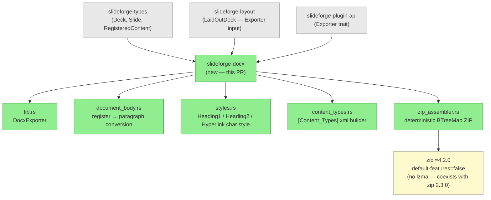
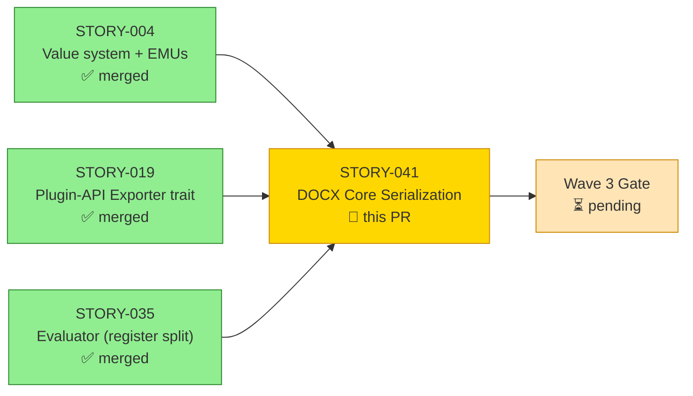
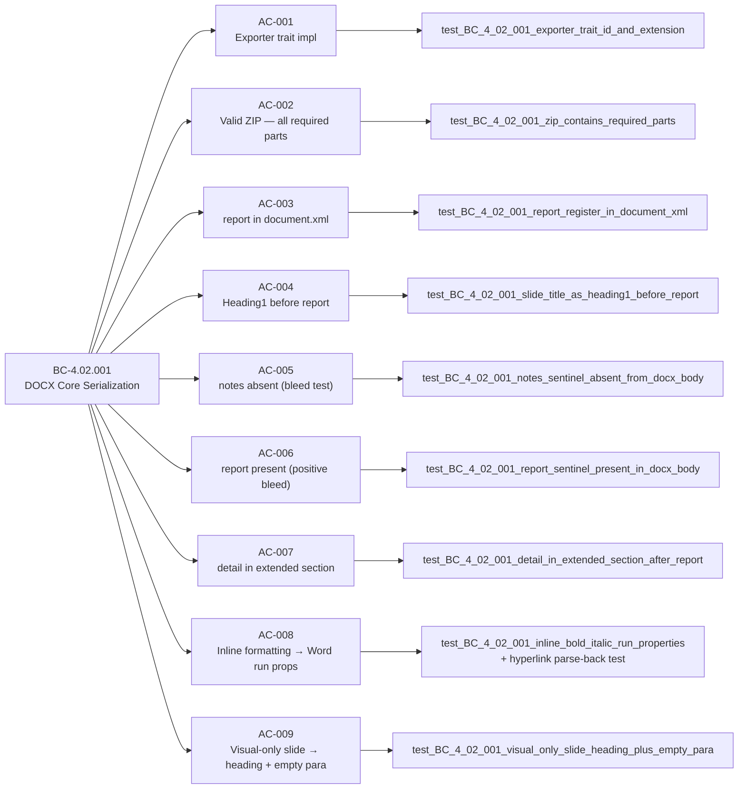

# feat(docx): DOCX Core Serialization (STORY-041)

**Epic:** EPIC-09 — DOCX Export
**Story points:** 8
**Crate:** `slideforge-docx` (SS-08)
**Behavioral Contract:** BC-4.02.001
**Mode:** greenfield
**Convergence:** CONVERGED — 3/3 strict-CLEAN streak (5 passes total; BC-5.39.001)

Implements DOCX core serialization in `slideforge-docx`: transforms a `LaidOutDeck`
into a standards-compliant `.docx` ZIP archive. The `report` register maps to heading +
body paragraphs; the `detail` register maps to an appendix section (`Heading2
"Appendix: <title>"`); the `notes` register is excluded from document output. Inline
markup (bold, italic, code, hyperlink with `xmlns:r`) is faithfully mapped to Word run
properties. A deterministic ZIP assembler (BTreeMap-ordered, epoch-normalized timestamps)
ensures reproducible output. The `dc:language` Dublin Core field is set to `en-US` in
`docProps/core.xml`. All 9 acceptance criteria are covered by 28 unit + snapshot tests,
a VHS demo recording, and 3 strict-clean adversarial passes.

---

## Architecture Changes

<strong>Architecture Decision: Deterministic ZIP + Register Filtering</strong>

### ADR: Deterministic ZIP Output

**Context:** `.docx` files are ZIP archives. Non-deterministic ZIP output (random file
ordering, real timestamps) causes spurious diffs in snapshot tests and CI.

**Decision:** Use `BTreeMap` to sort ZIP entries alphabetically and pin all file
timestamps to the Unix epoch (1980-01-01 00:00:00 in the MSDOS time encoding used
by ZIP format, the earliest ZIP-representable date).

**Consequences:** Two invocations of the exporter on identical input produce byte-identical
ZIP archives. `insta` snapshot tests on `document.xml` are stable across runs.

### ADR: Register Filtering

**Decision:** `notes` register content is excluded at the serialization boundary in
`document_body.rs`. The exporter iterates `LaidOutDeck.slides[*].register_content`
and maps `Register::Report` → body paragraph, `Register::Detail` → appendix paragraph,
`Register::Notes` → skipped (no output element generated).

**Consequences:** A sentinel string placed exclusively in the `notes` register never
appears in `document.xml` — tested by AC-005 (negative bleed test) and AC-006 (positive
bleed test confirming `report` IS present).

### ADR: zip =4.2.0 Pin

**Context:** `ooxmlsdk 0.6.1` requires `zip ^4.2.0`. `slideforge-brand` and
`slideforge-eval` use `zip 2.3.0`. The `zip 4.x` crate activates an `lzma` feature
by default that adds a native library (`links = "lzma"`) and conflicts with the `2.x`
crate in the same link namespace.

**Decision:** Pin `zip = { version = "=4.2.0", default-features = false, features =
["deflate", "time"] }`. This mirrors the identical pin in `slideforge-pptx` (STORY-037
proof of coexistence). No `lzma` native library is linked; both major versions resolve
cleanly.

---

## Story Dependencies

All upstream dependency PRs (STORY-004, STORY-019, STORY-035) are merged to `develop`.
This PR has no downstream blockers — it feeds only into the Wave 3 integration gate.

---

## Spec Traceability

---

## Test Evidence

| Metric | Value |
|--------|-------|
| Tests passing | 28 / 28 |
| Snapshot tests | 3 (`content_types_xml`, `inline_bold_italic_document_xml`, `two_slides_document_xml`) |
| `clippy::pedantic` | Clean (0 warnings) |
| `clippy::unwrap_used` | Clean (0 `.unwrap()` outside tests) |
| `rustfmt` | Clean |
| Red Gate ratio | 20/21 (≥ 0.5 — PASS; 1 exempt: trait stub wired before impl) |
| Mutation testing | Phase 6 gate (not yet activated) |

**Red Gate note:** `test_BC_4_02_001_exporter_trait_id_and_extension` was GREEN at stub
because `id()` and `extension()` return compile-time string literals via trait wiring.
Classified `FRAMEWORK-WIRING` — a valid Red Gate exemption per the story spec.

---

## Demo Evidence

Full per-AC evidence in: `docs/demo-evidence/STORY-041/evidence-report.md`

| File | Description |
|------|-------------|
| `AC-001-009-docx-core-serialization.gif` (187 KB) | VHS animated GIF — all 9 ACs in one `cargo run --example demo_docx` run |
| `AC-001-009-docx-core-serialization.webm` (295 KB) | VHS WebM archival recording |
| `AC-001-009-docx-core-serialization.tape` | VHS tape script source |

**AC coverage: 9/9 (100%)**

| AC | Requirement | Status |
|----|-------------|--------|
| AC-001 | Exporter trait impl | PASS |
| AC-002 | Valid ZIP — all required parts | PASS |
| AC-003 | report in document.xml | PASS |
| AC-004 | Heading1 before report | PASS |
| AC-005 | notes absent (bleed test) | PASS |
| AC-006 | report present (positive bleed) | PASS |
| AC-007 | detail in extended section | PASS |
| AC-008 | Inline formatting → Word run props | PASS |
| AC-009 | Visual-only slide → heading + empty para | PASS |

**LibreOffice headless:** Not installed on demo machine. The CI `libreoffice-render` job
(`.github/workflows/ci.yml`) covers `.docx`-to-PDF conversion and visual verification.

---

## Adversarial Review Summary

| Pass | Strict-CLEAN | Blocking findings |
|------|-------------|-------------------|
| Pass 1 | No | 2H / 2M / 3L / 1N |
| Pass 2 | No | 1C (F-DOCX-001 xmlns:r regression) + 2M |
| Pass 3 | **Yes** | 0 |
| Pass 4 | **Yes** | 0 |
| Pass 5 | **Yes** | 0 |

Streak: 3/3 — CONVERGED per BC-5.39.001.

Notable fixes applied during convergence:
- **F-DOCX-001 (CRIT):** `xmlns:r` declaration hoisted to document root element (was missing on hyperlink documents after regression in fix-burst)
- **F-DOCX-002:** Enclosure proof added — hyperlink `<w:r>` children validated in parse-back test
- **F-DOCX-003:** Hyperlink parse-back round-trip test added
- **F-041-001/002/006/007:** Bold test de-tautologized; unsafe normalizer removed; hyperlink element wired end-to-end; rId collision prevented

---

## Security Review

Pending — dispatched independently by orchestrator after PR creation.

---

## Holdout Evaluation

N/A — evaluated at wave gate (Wave 3).

---

## Risk Assessment

| Dimension | Assessment |
|-----------|-----------|
| Blast radius | Isolated to `slideforge-docx` crate; no other crates depend on it yet |
| New dependencies | `zip =4.2.0 default-features=false` (pinned; no new native libs); `ooxmlsdk` already in workspace |
| Performance impact | None at this phase (no benchmark gate on export yet) |
| OOXML compliance | All required ZIP parts present; `xmlns:r` declared on document root; `[Content_Types].xml` registers all part types; `word/_rels/document.xml.rels` present |
| Reversibility | Low risk — crate is additive, no existing code modified outside `Cargo.toml` and `Cargo.lock` |

---

## Deferred / Follow-ups

| ID | Description | Severity | Target |
|----|-------------|----------|--------|
| DEF-041-P5-001 | **EC-002: paragraph-break preservation** — exporter emits one `<w:p>` per `RegisteredContent` entry. Whether a single `report` field's internal `\n` characters split into multiple entries is governed by the STORY-035 evaluator's output contract, not the exporter. The exporter is correct given its input. This is a cross-story integration concern. | Suggestion | Wave 3 gate |

Routing: DEF-041-P5-001 is logged to `.factory/cycles/STORY-041/adversary-convergence-state.json`
under `deferred_findings` and will be evaluated at the Wave 3 integration gate.

**zip coexistence:** `zip =4.2.0 default-features=false features=[deflate,time]` was
required to prevent a link-namespace conflict with `slideforge-brand`/`slideforge-eval`'s
`zip 2.3.0` dependency. This mirrors the identical pin already in `slideforge-pptx`
(validated in STORY-037). No action needed.

---

## AI Pipeline Metadata

| Field | Value |
|-------|-------|
| Pipeline mode | Greenfield — Phase 3 TDD per-story delivery |
| Story ID | STORY-041 |
| Crate | `slideforge-docx` (SS-08) |
| Behavioral Contract | BC-4.02.001 |
| Agents involved | test-writer, implementer, adversary (5 passes), demo-recorder, pr-manager |
| Adversary model | claude-sonnet-4-6 |
| Convergence protocol | BC-5.39.001 (3 strict-CLEAN passes required) |

---

## Pre-Merge Checklist

- [x] PR description matches actual diff
- [x] All 9 ACs covered by demo evidence (9/9)
- [x] Traceability chain complete: BC-4.02.001 → AC-001..009 → Test → Demo
- [x] Adversary 3/3 strict-CLEAN (converged pass 5)
- [x] 28/28 tests passing
- [x] `clippy::pedantic` + `unwrap_used` clean
- [x] `rustfmt` clean
- [x] Deferred finding DEF-041-P5-001 disclosed and routed to wave-gate
- [x] zip coexistence verified (=4.2.0 no-lzma pin matches slideforge-pptx pattern)
- [ ] Security review — pending independent dispatch
- [ ] PR review — pending independent dispatch
- [ ] CI checks passing — pending
- [ ] Dependency PRs merged — verified above (STORY-004, STORY-019, STORY-035 all on develop)
