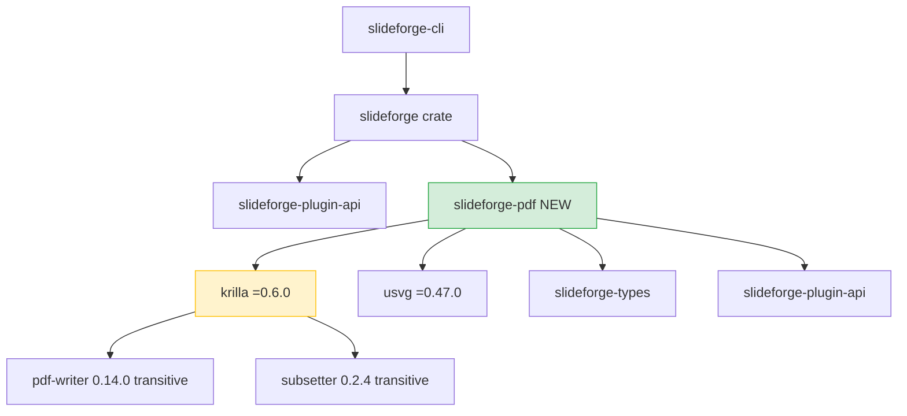
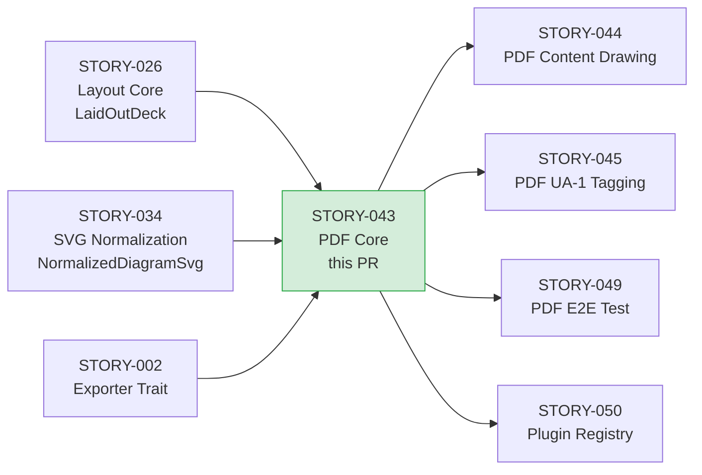
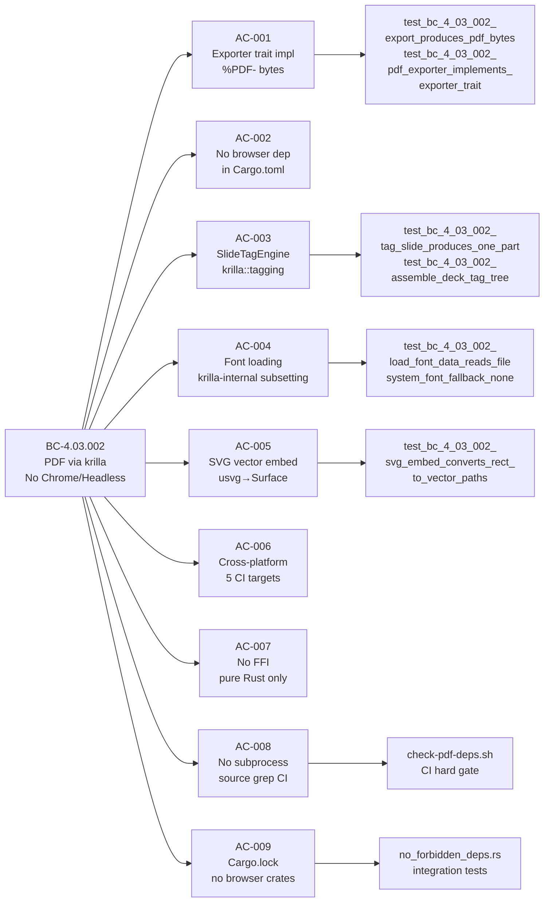

# feat(pdf): PDF Core backend — krilla + SlideTagEngine (STORY-043)

**Story:** STORY-043 — PDF Core: pdf-writer + krilla + SlideTagEngine
**Epic:** EPIC-13 (PDF Export)
**Wave:** 4 Batch A | **Priority:** P0 | **Points:** 8
**BC:** BC-4.03.002 (PDF Produced via pdf-writer + krilla + SlideTagEngine — No Chrome/Headless)
**Crate:** `slideforge-pdf` (new workspace member)
**Branch:** `feature/S-043` → `develop`

---

## Summary

Introduces the `slideforge-pdf` crate — the pure-Rust PDF generation backend for the
slideforge pipeline. Establishes the foundational stack that all subsequent PDF stories
(STORY-044 content drawing, STORY-045 PDF/UA-1 tagging, STORY-049 E2E syscall test) build on.

Key deliverables:
- `PdfExporter`: implements the `Exporter` plugin trait; returns `%PDF-` bytes from `Document::finish()`
- `SlideTagEngine`: maps `LaidOutSlide` semantic content to krilla tagging API (`TagTree` / `TagGroup` / `TagKind::{Part,H1–H6,P,Figure,Table,TR,TH,TD,LI}`) — attached via `Document::set_tag_tree` before `finish()`
- `font.rs`: `load_font_data` + `system_font_fallback` helpers (krilla performs subsetting internally at draw-time)
- `svg_embed.rs`: `usvg::Tree::from_str` parse → krilla `Surface` path-drawing (vector, no rasterization)
- `error.rs`: `PdfExportError` enum with `thiserror`
- `scripts/check-pdf-deps.sh`: CI hard-failure guard for browser deps, C-library FFI, and subprocess usage
- New CI job `check-pdf-deps` wired into `all-checks-pass.needs`
- Workspace `indexmap` bump 2.9.0 → 2.10.0 (required by krilla; 4 crates updated)

---

## Architecture Changes

**No direct `pdf-writer` or `subsetter` dependency.** Both arrive transitively via
`krilla =0.6.0`. krilla declares `subsetter ^0.2.3`; Cargo.lock resolves `0.2.4` (compatible,
no API break). A direct dep would risk double-registering krilla's internal StructTreeRoot.

---

## Story Dependencies

Dependencies STORY-026 and STORY-034 are both merged on `develop` (SHA 094f8dca).

---

## Spec Traceability

---

## Test Evidence

| Metric | Value |
|--------|-------|
| slideforge-pdf tests | 26 passed, 0 failed, 0 skipped |
| Workspace tests | 2412 passed, 0 failed, 10 skipped (pre-existing ignores) |
| clippy (pedantic + unwrap_used) | Clean — 0 warnings |
| rustfmt | Clean |
| RUSTDOCFLAGS="-D warnings" cargo doc | Clean |
| check-pdf-deps.sh | PASS — all forbidden dep checks clean |
| Mutation testing | Phase 6 (not yet run — scheduled for formal hardening) |
| Snapshot tests | N/A for PDF binary output (deferred to STORY-045 veraPDF structural validation) |

**Known pre-existing flaky test (unrelated):** `slideforge-diagrams::cold_budget` timing test
fails intermittently under full workspace load but passes in isolation. This is a pre-existing
condition on `develop`, not introduced by this PR.

---

## Demo Evidence

Five demos cover all load-bearing deliverables. Recordings at
`docs/demo-evidence/STORY-043/`.

| Demo | AC | Description |
|------|----|-------------|
| `AC-001-pdf-exporter-trait` | AC-001 | `PdfExporter` implements `Exporter` trait; `export()` returns `Ok(%PDF-...)` |
| `AC-003-tagged-pdf-structure` | AC-003 | `SlideTagEngine` produces Part/H1/Figure/Table tag tree; `/Document` auto-emitted by krilla |
| `AC-004-font-loading` | AC-004 | `load_font_data`, `FontBytes::load`, `system_font_fallback` — 5 tests |
| `AC-005-svg-vector-embed` | AC-005 | `<rect>` SVG → krilla Surface path ops; no `/Subtype /Image` in PDF output |
| `DEP-GUARDS-no-browser-no-ffi` | AC-002/007/008/009 | `no_forbidden_deps.rs` (5 integration tests) + `check-pdf-deps.sh` PASS |

AC-006 (cross-platform 5-target CI matrix) verified by CI only — cannot be demonstrated locally.

---

## Architect-Ruled Deferrals (Not Gaps)

These items were explicitly scoped out by architect directive with named future stories:

| Item | Deferred To | Rationale |
|------|-------------|-----------|
| Font subsetting size assertion (ASCII subset < full font) | STORY-044 AC-009 | No glyphs drawn in STORY-043; krilla subsetting exercised at draw time in 044 |
| PDF/UA-1 mode (`Validator::UA1`) + real frame-level alt for DiagramSvg/ChartSvg | STORY-045 | Default (non-UA-1) validator used in 043; UA-1 requires real alt from DiagramSpec/ChartSpec |
| strace/dtrace syscall integration test (`test_e2e_pdf_export_no_execve_syscall`) | STORY-049 | Requires complete CLI binary + platform syscall tracer |

The source-level subprocess grep (`check-pdf-deps.sh`) is the load-bearing enforcement for
AC-008 in this story (SID-1 compliant: specific story named, concrete dependency cited).

---

## Holdout Evaluation

N/A — evaluated at wave gate (Wave 4 gate pending after all Batch A stories merge).

---

## Adversarial Review

LOCAL adversary cascade CONVERGED. BC-5.39.001 protocol satisfied.

| Pass | Findings | CLEAN (strict) | CLEAN (PR-merge) |
|------|----------|---------------|-----------------|
| 1–3 | Various | no | no |
| 4–7 | Declining | no | no |
| 8–11 | 1–2 OBS | no | yes |
| 12 | 0 | yes | yes |
| 13 | 0 | yes | yes |
| 14 | 0 | yes | yes |

**14 total passes. 3/3 strict-CLEAN streak at passes 12/13/14. Converged.**

Notable fix-bursts by pass cluster:
- **Passes 1–3:** Complete structural tag tree, EMU canonicalization, PdfExportError Serialize mapping
- **Passes 4–7:** Docs CI fix (Windows dead-code cfg), DRY cleanup, unused indexmap dev-dep removal, deterministic font directory search, AC-004 font fn signatures, pedantic clippy, workspace dep alignment
- **Passes 8–11:** CI check-pdf-deps.sh wired into all-checks-pass.needs, files_scanned guard, non-vacuous SVG vector-path assertion, `/Document` root assertion (F-P4-004), empty-bullet guard (`tag_content_block` returns `Ok(None)` for empty list), fail-closed no-subprocess source check
- **Pass 12+:** All three strict-CLEAN — zero findings of any severity

---

## Security Review

Pending — dispatched as part of PR lifecycle (Step 4).

---

## Risk Assessment

| Risk | Classification | Mitigation |
|------|---------------|------------|
| Blast radius | Low — new crate only; no changes to existing crates except workspace Cargo.toml membership + indexmap version bump | indexmap 2.9.0→2.10.0 is semver-compatible; all 4 affected crates re-verified |
| Performance | No runtime impact in this story — `PdfExporter::export()` produces blank pages (content drawing is STORY-044) | Benchmarks not applicable until content rendering lands |
| Supply chain | krilla =0.6.0 is pinned; all transitive deps in Cargo.lock committed | `cargo deny` CI job covers known advisory database |
| Platform | Pure Rust — no platform-specific code paths; CI matrix covers 5 targets | `check-pdf-deps.sh` enforces no subprocess/FFI at source level |

---

## AI Pipeline Metadata

| Field | Value |
|-------|-------|
| Pipeline mode | Greenfield — Phase 3 TDD per-story delivery |
| Story delivery sub-workflow | stubs → Red Gate → TDD green → LOCAL adversary 3-CLEAN → demos → PR |
| Model | claude-sonnet-4-6 |
| Context budget used | ~14% (within 20–30% limit) |

---

## Pre-Merge Checklist

- [x] PR description matches actual diff
- [x] All ACs covered by demo evidence (5 demos; AC-006 by CI)
- [x] Traceability chain complete: BC-4.03.002 → AC-001..009 → tests → demos
- [x] LOCAL adversary cascade converged: 3/3 strict-CLEAN (passes 12/13/14 of 14)
- [x] Pre-push gate clean: fmt + clippy(pedantic+unwrap_used) + nextest(2412/2412) + rustdoc + check-pdf-deps.sh
- [x] Worktree clean, branch rebased on origin/develop (094f8dca)
- [x] Dependency PRs merged: STORY-026 (LaidOutDeck) and STORY-034 (NormalizedDiagramSvg) are on develop
- [ ] Security review: dispatched (Step 4)
- [ ] AI PR-diff review: dispatched (Step 5)
- [ ] CI checks green (Step 8)
