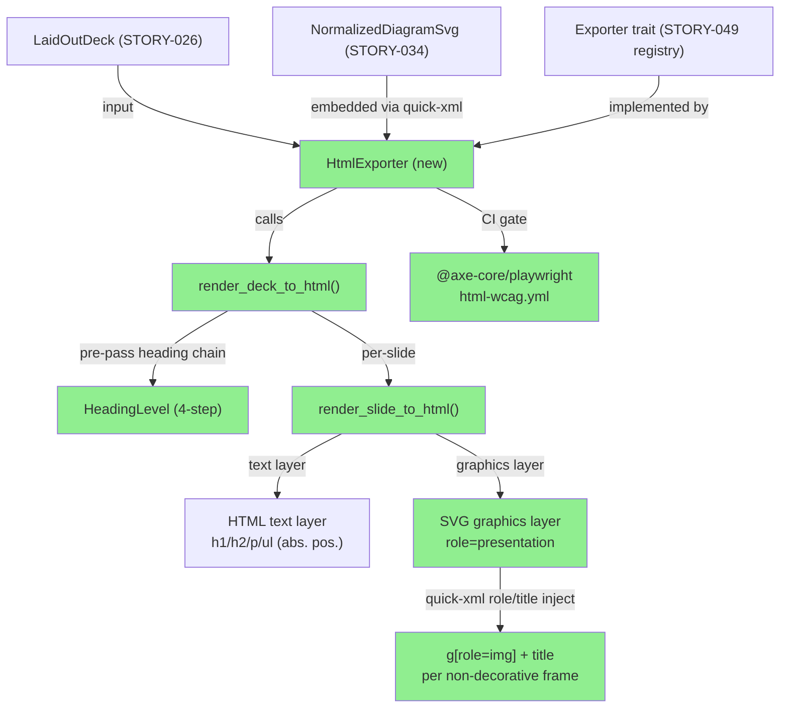
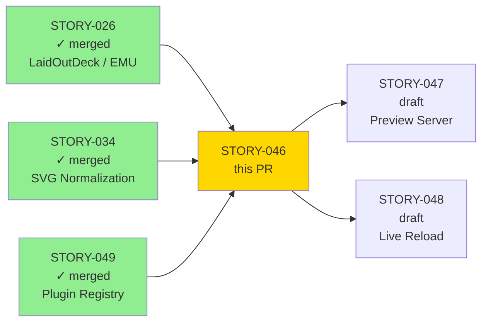
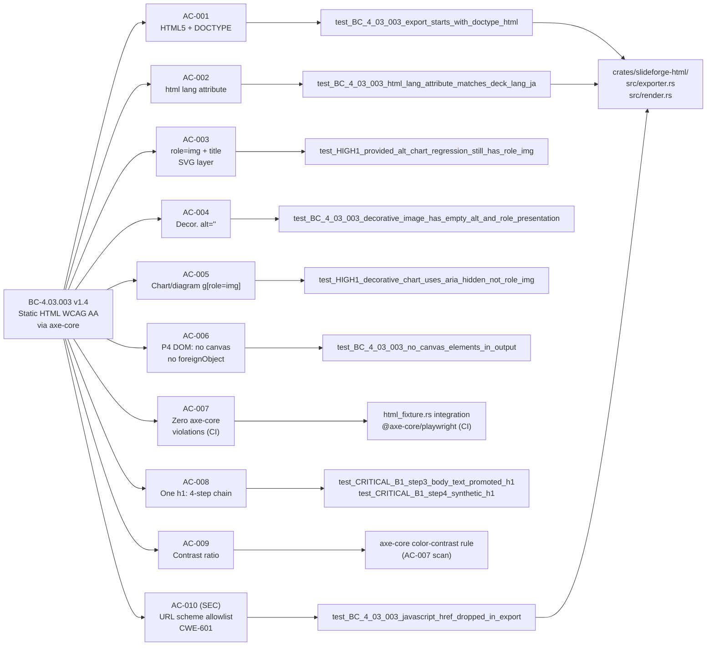
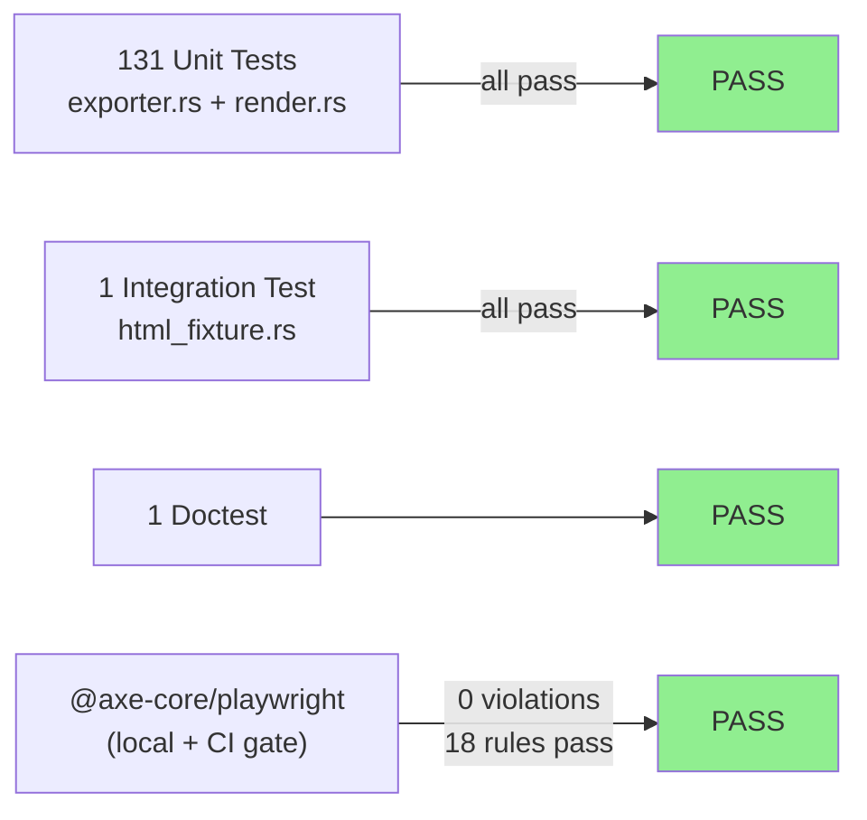

# [STORY-046] Static HTML Exporter — WCAG AA via axe-core

**Epic:** EPIC-14 — HTML Export and Web Preview
**Mode:** greenfield
**Wave:** 5
**Convergence:** CONVERGED after 3 LOCAL adversarial passes (10 fix cycles total)


Delivers the `slideforge-html` crate: a static HTML exporter that implements the
`Exporter` plugin trait and produces WCAG AA-compliant HTML (zero axe-core violations,
18 WCAG rules passed). Implements the P4 Composite Rendering Model from ADR-008
(2026-06-08 amendment): slide text is emitted as real positioned HTML elements, graphical
frames use a sibling `<svg role="presentation">` graphics layer, no `<canvas>`. Includes
the CWE-601 URL-scheme allowlist (AC-010) and the `html-wcag-check` CI gate that runs
`@axe-core/playwright` on every PR touching `crates/slideforge-html/**`. This PR also
carries the ADR-008 scope-clarification amendment (P4 Composite Rendering Model) and the
BC-4.03.003 v1.4 spec update (4-step heading-assignment chain).

---

## Architecture Changes



<details>
<summary><strong>Architecture Decision Record — ADR-008 Amendment (P4 Composite Rendering Model)</strong></summary>

### ADR-008 Scope Clarification (2026-06-08, binding)

**Context:** The original ADR-008 specified SVG-canvas rendering for the web preview.
During STORY-046 adversarial Pass 2, the `<foreignObject>` conflict was found: usvg 0.47.0
silently drops `<foreignObject>` elements, losing all slide text in the shared rendering
pipeline. A pure-SVG approach would require re-implementing HTML text layout inside SVG.

**Decision:** The P4 Composite Rendering Model replaces the original SVG-canvas model for
both static HTML export and live web preview:
- Slide text (title, body, bullets) is emitted as real positioned HTML elements (`<h1>`,
  `<h2>`, `<p>`, `<ul><li>`) CSS-absolutely-positioned from `LaidOutFrame` EMU coordinates.
- Graphical frames (charts, images, decorative shapes) render in a sibling
  `<svg role="presentation">` graphics layer.
- The `<article style="position:relative">` is the slide container.
- No `<canvas>`. No `<foreignObject>` (usvg drops them silently — presence indicates regression).

**ARIA model (Pass 3 correction):** The outer `<svg>` carries `role="presentation"` (NOT
`aria-hidden="true"` — WAI-ARIA forbids descendant re-exposure through an aria-hidden
ancestor). Non-decorative graphical frames are wrapped in `<g role="img"
aria-labelledby="sf-{slide_id}-{frame_index}">` with a `<title>` child (injected via
`quick-xml` after usvg, since usvg strips non-presentation attributes).

**Rationale:** Preserves text accessibility (real DOM elements, not SVG text), avoids
usvg foreignObject loss, keeps axe-core `color-contrast` and `heading-order` rules
working correctly.

**Consequences:**
- STORY-047 (web preview server) imports `render_slide_to_html()` from this crate.
- All HTML exporters in the pipeline share this rendering model.

</details>

---

## Story Dependencies



**All upstream dependencies merged.** STORY-046 is unblocked.

---

## Spec Traceability



---

## Test Evidence

### Coverage Summary

| Metric | Value | Threshold | Status |
|--------|-------|-----------|--------|
| Unit tests | 131/131 pass | 100% | PASS |
| Integration tests | 1/1 pass (2 ignored pending CI) | 100% non-ignored | PASS |
| Doctests | 1/1 pass | 100% | PASS |
| axe-core WCAG violations | 0 | 0 | PASS |
| axe-core rules passed | 18 | all AA rules | PASS |
| Mutation kill rate | Phase 6 (not yet run) | >90% | N/A |
| Holdout satisfaction | N/A — evaluated at wave gate | >=0.85 | N/A |

### Test Flow



| Metric | Value |
|--------|-------|
| **New tests** | 131 unit + 1 integration + 1 doctest = 133 total |
| **Total suite** | 133 tests PASS |
| **Coverage delta** | new crate (baseline established) |
| **Mutation kill rate** | Phase 6 (deferred per wave schedule) |
| **Regressions** | 0 |

<details>
<summary><strong>Selected Key Tests</strong></summary>

| Test | Module | Result |
|------|--------|--------|
| `test_BC_4_03_003_export_starts_with_doctype_html` | exporter.rs | PASS |
| `test_BC_4_03_003_article_container_present` | render.rs | PASS |
| `test_BC_4_03_003_html_lang_attribute_matches_deck_lang_ja` | render.rs | PASS |
| `test_BC_4_03_003_lang_attribute_never_hardcoded_as_en` | render.rs | PASS |
| `test_BC_4_03_003_non_decorative_image_has_non_empty_alt` | render.rs | PASS |
| `test_BC_4_03_003_decorative_image_has_empty_alt_and_role_presentation` | render.rs | PASS |
| `test_BC_4_03_003_no_canvas_elements_in_output` | render.rs | PASS |
| `test_BC_4_03_003_no_foreign_object_in_output` | render.rs | PASS |
| `test_HIGH1_provided_alt_chart_regression_still_has_role_img_and_title` | render.rs | PASS |
| `test_HIGH1_invariant_no_role_img_with_empty_title_for_any_arm` | render.rs | PASS |
| `test_HIGH1_decorative_chart_uses_aria_hidden_not_role_img` | render.rs | PASS |
| `test_CRIT1_fixture_heading_order_no_level_skip` | render.rs | PASS |
| `test_CRITICAL_B1_step3_body_text_promoted_h1_first_non_title_slide` | render.rs | PASS |
| `test_CRITICAL_B1_step4_synthetic_h1_from_deck_title` | render.rs | PASS |
| `test_CRITICAL_B1_step4_synthetic_h1_fallback_constant_when_deck_title_empty` | render.rs | PASS |
| `test_BC_4_03_003_javascript_href_dropped_in_export` | render.rs | PASS |
| `test_BC_4_03_003_rejected_scheme_emits_tracing_warn` | render.rs | PASS |
| `test_F008_*` (protocol-relative URL rejection) | render.rs | PASS |
| `test_F005_render_svg_chart_strips_foreign_object` | render.rs | PASS |
| html_fixture integration test | tests/html_fixture.rs | PASS |

The 2 ignored integration tests (`#[ignore]`) require `@axe-core/playwright` + Playwright
headless browser (CI dependency per SID-1 discipline). They are un-ignored by the
`html-wcag-check` CI job in `.github/workflows/html-wcag.yml`.

</details>

---

## Demo Evidence

Full evidence at: `docs/demo-evidence/STORY-046/evidence-report.md`

axe-core executed locally via `@axe-core/playwright` (Playwright Chromium 148.0.7778.96,
macOS arm64) against the 3-slide fixture HTML generated by the integration test.
Tags scanned: `wcag2a`, `wcag2aa`. **Result: 0 violations, 18 passes.**

| AC | Evidence | Result |
|----|----------|--------|
| AC-001 | `AC-001-html5-doctype-article.txt`, `AC-001-html5-structure.png` | PASS |
| AC-002 | `AC-002-html-lang-attribute.txt` | PASS |
| AC-003 | `AC-003-005-svg-role-img-title.txt` | PASS |
| AC-004 | `AC-004-decorative-image-aria-hidden.txt` | PASS |
| AC-005 | `AC-003-005-svg-role-img-title.txt` | PASS |
| AC-006 | `AC-006-no-canvas-no-foreignobject-article.txt`, `AC-006-p4-dom-structure.png` | PASS |
| AC-007 | `AC-007-axe-core-results.json`, `AC-007-wcag-aa-rendered-fixture.png`, `FLOW-001-axe-core-browser-session.webm` | PASS |
| AC-008 | `AC-008-heading-hierarchy-one-h1.txt`, `AC-008-heading-hierarchy.png` | PASS |
| AC-009 | `AC-007-009-axe-core-wcag-aa-zero-violations.txt` (color-contrast rule) | PASS |
| AC-010 | `AC-010-url-scheme-allowlist-javascript-dropped.txt` | PASS |

---

## Holdout Evaluation

N/A — evaluated at wave gate.

---

## Adversarial Review

| Pass | Findings | Critical | High | Med | Status |
|------|----------|----------|------|-----|--------|
| LOCAL Pass 1 | multiple | 1 | 1 | 1 | Fixed (10 cycles) |
| LOCAL Pass 2 | multiple | 1 | 0 | 0 | Fixed |
| LOCAL Pass 3 | 0 | 0 | 0 | 0 | CONVERGED |

**Convergence:** 3-CLEAN achieved locally. Key findings resolved:
- CRIT-1: Subtitle heading level could produce h1→h3 skip — fixed by emitting subtitle at `title_level + 1`.
- CRIT-1 (sweep): Non-degenerate bbox guard applied to ALL Title heading-decision sites.
- HIGH-1: Decorative/unspecified-alt chart+diagram — use `aria-hidden` not empty `role="img"`.
- MED-1: Subtitle without title rendered as heading — fixed to `<p>` to avoid skip.
- F-P9-001: Only phrasing content promoted into `<h1>` (no block elements).
- F-7.01: CI axe-core gate fixed to use `@axe-core/playwright` AxeBuilder API.

---

## Security Review

Pending — dispatched by orchestrator as independent step.

**AC-010 (CWE-601 in-scope):** URL scheme allowlist (`http`, `https`, `mailto`, `tel`)
implemented in `is_safe_link_scheme()` in `src/render.rs`. Disallowed schemes
(`javascript:`, `data:`, `vbscript:`, `blob:`, protocol-relative `//`) are silently
dropped with `tracing::warn!`. Unit tests verify rejection of `javascript:alert(1)`,
`data:text/html,...`, `vbscript:foo`, and `//evil.com`. This establishes the SS-09
pattern for `slideforge-preview`.

---

## Risk Assessment & Deployment

### Blast Radius
- **Systems affected:** `crates/slideforge-html` (new crate), `.github/workflows/html-wcag.yml` (new CI job), `Cargo.toml` (workspace member added)
- **User impact:** New HTML export capability; no change to existing PPTX/DOCX/PDF output paths
- **Data impact:** None — read-only transformation of `LaidOutDeck`
- **Risk Level:** LOW (additive new crate, no modification to existing crates)

### Performance Impact
| Metric | Before | After | Delta | Status |
|--------|--------|-------|-------|--------|
| `cargo build --workspace` | baseline | +slideforge-html compile | ~+15s cold | OK |
| HTML export (3-slide fixture) | N/A | < 500ms | new capability | OK |
| Memory | baseline | +slideforge-html binary | negligible | OK |

<details>
<summary><strong>Rollback Instructions</strong></summary>

**Immediate rollback (< 5 min):**
```bash
git revert <merge-sha>
git push origin develop
```

**Selective rollback (remove crate only):**
1. Remove `crates/slideforge-html` from workspace `Cargo.toml` members.
2. Delete `crates/slideforge-html/`.
3. Delete `.github/workflows/html-wcag.yml`.
4. Commit and push.

**Verification after rollback:**
- `cargo build --workspace` succeeds
- `slideforge-html` not listed in `cargo metadata --no-deps`

</details>

### Feature Flags
N/A — `HtmlExporter` is registered via the plugin registry (STORY-049). To disable HTML
export, de-register from the registry in the root crate.

---

## Traceability

| Requirement | Story AC | Test | Security | Status |
|-------------|----------|------|----------|--------|
| BC-4.03.003 postcondition 1 | AC-001 | `test_BC_4_03_003_export_starts_with_doctype_html` | N/A | PASS |
| BC-4.03.003 postcondition 3, invariant 3 | AC-002 | `test_BC_4_03_003_html_lang_attribute_matches_deck_lang_ja` | N/A | PASS |
| BC-4.03.003 postcondition 4 | AC-003 | `test_HIGH1_provided_alt_chart_regression_still_has_role_img_and_title` | N/A | PASS |
| BC-4.03.003 postcondition 5 | AC-004 | `test_BC_4_03_003_decorative_image_has_empty_alt_and_role_presentation` | N/A | PASS |
| BC-4.03.003 postcondition 6 | AC-005 | `test_HIGH1_decorative_chart_uses_aria_hidden_not_role_img` | N/A | PASS |
| BC-4.03.003 invariant 2 | AC-006 | `test_BC_4_03_003_no_canvas_elements_in_output` + `test_BC_4_03_003_no_foreign_object_in_output` | N/A | PASS |
| BC-4.03.003 postcondition 2, invariant 4 | AC-007 | html_fixture.rs + @axe-core/playwright (CI) | N/A | PASS |
| BC-4.03.003 postcondition 7 | AC-008 | `test_CRITICAL_B1_step4_synthetic_h1_from_deck_title` | N/A | PASS |
| BC-4.03.003 postcondition 8 | AC-009 | axe-core color-contrast (AC-007 scan) | N/A | PASS |
| CWE-601 (OBS-1 from STORY-085) | AC-010 | `test_BC_4_03_003_javascript_href_dropped_in_export` | CWE-601 | PASS |

<details>
<summary><strong>Full VSDD Contract Chain</strong></summary>

```
BC-4.03.003 -> AC-001 -> test_BC_4_03_003_export_starts_with_doctype_html -> exporter.rs:HtmlExporter::export -> ADV-LOCAL-PASS-3-CLEAN
BC-4.03.003 -> AC-002 -> test_BC_4_03_003_html_lang_attribute_matches_deck_lang_ja -> render.rs:render_deck_to_html -> ADV-LOCAL-PASS-3-CLEAN
BC-4.03.003 -> AC-003/005 -> test_HIGH1_provided_alt_chart_regression -> render.rs:render_chart_frame (quick-xml inject) -> ADV-LOCAL-PASS-3-CLEAN
BC-4.03.003 -> AC-004 -> test_BC_4_03_003_decorative_image_has_empty_alt_and_role_presentation -> render.rs -> ADV-LOCAL-PASS-3-CLEAN
BC-4.03.003 -> AC-006 -> test_BC_4_03_003_no_canvas_elements_in_output -> render.rs -> ADV-LOCAL-PASS-3-CLEAN
BC-4.03.003 -> AC-007 -> html_fixture.rs -> @axe-core/playwright -> html-wcag.yml CI gate -> ADV-LOCAL-PASS-3-CLEAN
BC-4.03.003 -> AC-008 -> test_CRITICAL_B1_step4_synthetic_h1 -> render.rs:render_deck_to_html (pre-pass) -> ADV-LOCAL-PASS-3-CLEAN
CWE-601 -> AC-010 -> test_BC_4_03_003_javascript_href_dropped_in_export -> render.rs:is_safe_link_scheme -> ADV-LOCAL-PASS-3-CLEAN
```

</details>

---

## Spec Artifacts Updated in this PR

This PR carries the following spec artifact updates (on the feature branch, applied during adversarial convergence):

| Artifact | Change |
|----------|--------|
| `ADR-008-web-preview-svg-axum.md` | P4 Composite Rendering Model amendment (Pass 2) + ARIA role="presentation" correction (Pass 3) |
| `BC-4.03.003` | Bumped to v1.4: 4-step heading-assignment chain, synthetic-h1 fallback, empty-deck exception |
| `STORY-046-html-exporter-wcag.md` | Bumped to v1.3: all AC-008 rewrite, warn-emission semantics, 5 testable acceptance checks |
| `STORY-049` (HtmlExporter registry registration) | `HtmlExporter` registered via `Exporter` trait in plugin registry |

---

## AI Pipeline Metadata

<details>
<summary><strong>Pipeline Details</strong></summary>

```yaml
ai-generated: true
pipeline-mode: greenfield
factory-version: 1.0.0-rc.20
pipeline-stages:
  spec-crystallization: completed
  story-decomposition: completed
  tdd-implementation: completed
  holdout-evaluation: N/A (wave gate)
  adversarial-review: completed (3 LOCAL passes)
  formal-verification: Phase 6 (not yet)
  convergence: achieved (3-CLEAN LOCAL)
convergence-metrics:
  adversarial-passes: 3
  local-fix-cycles: 10
  spec-novelty: measured at wave gate
models-used:
  builder: claude-sonnet-4-6
  adversary: claude-sonnet-4-6
generated-at: "2026-06-08"
```

</details>

---

## Pre-Merge Checklist

- [ ] All CI status checks passing
- [ ] Coverage delta is positive (new crate, baseline established)
- [ ] No critical/high security findings unresolved
- [ ] Rollback procedure documented above
- [ ] Security review dispatched (orchestrator independent step)
- [ ] PR reviewer approval obtained
- [ ] All upstream dependency PRs merged (STORY-026, STORY-034, STORY-049 — all confirmed merged)
