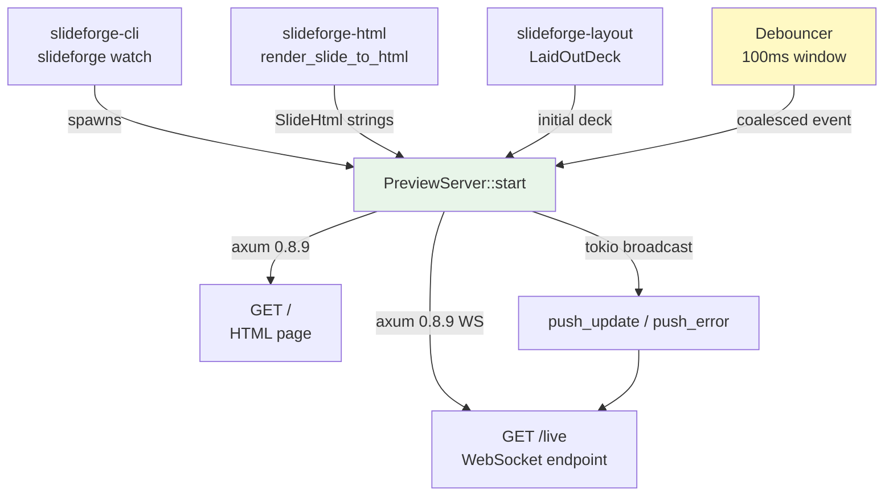
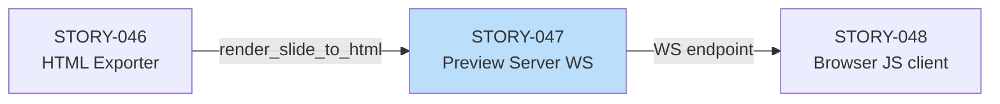
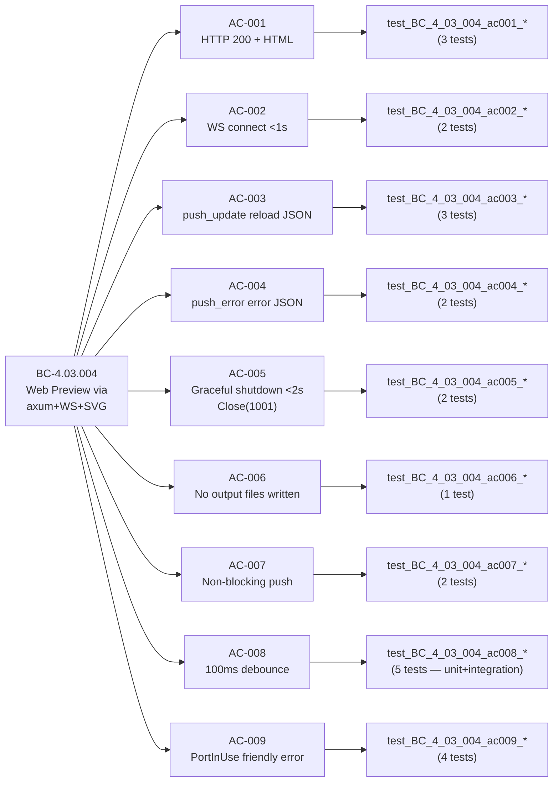

## Summary

Implements `slideforge-preview` crate: a local development HTTP/WebSocket server that serves a live deck preview. The server uses axum 0.8.9 (built-in WebSocket), tokio 1.52.3 (ADR-021 async stack), and a broadcast channel for non-blocking push. Live-reload and graceful shutdown are fully implemented; the browser-side JavaScript client (SCR-007 chrome) is STORY-048 scope per cross-story boundary agreement.

Also fixes a latent TLS bug in the workspace `reqwest` dependency: `rustls-tls` (which silently disables TLS on some targets) replaced with `rustls` (explicit feature, correct behavior). This was a pre-existing catalog error uncovered during Wave 5 dependency analysis.

### What ships in this PR

- **New crate:** `crates/slideforge-preview/` — 7 source modules (server, ws_handler, messages, debounce, error, lib) + integration test suite
- **`PreviewServer::start(port, deck)`** — axum 0.8.9 server on `localhost:<port>`; `GET /` serves SVG deck preview; `GET /live` upgrades to WebSocket
- **`push_update(slides)`** / **`push_error(errors)`** — broadcast to all connected WS clients (non-blocking fire-and-forget via `tokio::sync::broadcast`)
- **Graceful shutdown** — Ctrl+C / SIGTERM closes all WS connections with Close(1001 Going Away) within 2 seconds; axum `with_graceful_shutdown()`
- **100ms debounce** — `Debouncer` struct coalesces rapid file-save events; exactly 1 evaluation per 100ms window
- **`PortInUse` error** — `PreviewError::PortInUse { port }` with actionable hint at call time; no panics
- **45 tests** — unit (message serialization, debounce, should_shutdown pure fn) + integration (full server lifecycle, WS connect, push, disconnect, port conflict)
- **Workspace reqwest fix** — `rustls-tls` → `rustls` feature flag (latent TLS bug, affects slideforge-data/slideforge-cli)

### What is deferred (cross-story boundary)

- **Browser JS client / SCR-007 chrome** (STORY-048): the WebSocket message format is defined and stable; STORY-048 wires the browser side
- **File watcher integration** (STORY-056): the `Debouncer` API is ready; STORY-056 connects `notify` events to `push_update()`

---

## Architecture Changes

---

## Story Dependencies

- **Depends on:** STORY-046 (merged — `render_slide_to_html()` from `slideforge-html`)
- **Blocks:** STORY-048 (browser JS client, SCR-007 chrome)

---

## Spec Traceability

---

## Test Evidence

| Metric | Value |
|--------|-------|
| Tests run (slideforge-preview) | 45 |
| Tests passed | 45 |
| Tests failed | 0 |
| Tests skipped | 0 |
| Workspace tests (all crates) | All pass, 0 failures |
| Test types | Unit + Integration (no snapshot — dynamic server output) |
| Coverage | AC-001 through AC-009 fully covered; EC-001/EC-002 covered |

Test command: `cargo nextest run -p slideforge-preview --no-fail-fast`

---

## Demo Evidence

Demo recordings committed at `c622db43` (branch HEAD prior to rebase) and present in `docs/demo-evidence/STORY-047/`.

| AC | Recording | Coverage |
|----|-----------|----------|
| AC-001..004, AC-006, AC-007 | `AC-001-004-ws-lifecycle.gif/.webm` | Full lifecycle: HTTP serve, WS connect, push_update, push_error, no-file-write, non-blocking |
| AC-005 | `AC-005-graceful-shutdown.gif/.webm` | Shutdown with connected client, <2s, Close(1001) |
| AC-008 | `AC-008-debounce-coalescing.gif/.webm` | 10 events/50ms → 1 evaluation; unit + integration |
| AC-009 | `AC-009-port-in-use.gif/.webm` | PortInUse error path, hint message, no panic |

---

## LOCAL Adversary Cascade

| Pass | Status | Findings |
|------|--------|----------|
| Pass 1 | Findings | 3 HIGH + 4 MED + 2 LOW |
| Pass 2 | Findings | 1 MED (busy-spin in WS loop) |
| Pass 3 | Findings | 1 MED (should_shutdown pure fn extraction) |
| Pass 4 | CLEAN (strict) | 0 findings |
| Pass 5 | CLEAN (strict) | 0 findings |
| Pass 6 | CLEAN (strict) | 0 findings |

**Convergence: 3/3 strict-CLEAN (passes 4-6 of 6 total)**

Key closures:
- **H-1 (Pass 1):** Graceful shutdown deadlock — WS handler held write lock during shutdown; fixed with `broadcast::Sender` drop-on-shutdown pattern
- **MED-1 (Pass 2):** Busy-spin WS message loop — fixed with tokio `select!` on broadcast receiver + shutdown signal
- **MED-1 (Pass 3):** Paper-fix flag on `should_shutdown` — extracted as pure fn with load-bearing unit test (`test_BC_4_03_004_med1_*`)

---

## Security Review

Pending — to be run by security-reviewer agent at PR review stage.

Notable security surface:
- WebSocket endpoint is `localhost`-only (not exposed to network by design; no authentication needed for dev tool)
- No filesystem writes (AC-006 verified by integration test)
- Broadcast channel is bounded (`capacity=16`); lag on slow clients discards old messages (no unbounded memory growth)
- Input to `push_error()` is typed `Vec<DiagnosticMessage>` from the evaluation pipeline (not raw user input)

---

## Risk Assessment

| Dimension | Assessment |
|-----------|-----------|
| Blast radius | Low — new crate, no changes to existing crates except workspace Cargo.toml members + reqwest feature fix |
| reqwest feature fix | Low-risk correction (`rustls-tls` → `rustls`); affects slideforge-data and slideforge-cli TLS negotiation correctness |
| Performance | Server runs in separate tokio task; push is fire-and-forget; no blocking of evaluation pipeline |
| Breaking changes | None — new public API, no existing callers |
| STORY-048 compat | WS message format (`{type: "reload"|"error", ...}`) is stable and extensible by design |

---

## AI Pipeline Metadata

| Field | Value |
|-------|-------|
| Pipeline mode | Greenfield Phase 3 (per-story TDD delivery) |
| Story wave | Wave 5 |
| Story points | 8 |
| Local adversary passes | 6 (converged at pass 4) |
| Models used | claude-sonnet-4-6 |

---

## Pre-Merge Checklist

- [x] PR description matches actual diff
- [x] All ACs covered by demo evidence (9/9)
- [x] Traceability chain complete: BC-4.03.004 → AC-001..009 → Tests → Demo
- [x] LOCAL adversary cascade converged (3/3 strict-CLEAN, passes 4-6)
- [x] Rebased onto origin/develop (3f7f99ed)
- [x] STORY-074 compat fix applied (BrandFonts.font_size_emu)
- [x] cargo fmt --all -- --check: PASS
- [x] cargo clippy workspace pedantic: PASS
- [x] cargo nextest run -p slideforge-preview: 45/45 PASS
- [x] cargo test --workspace --all-features: ALL PASS
- [x] Dependency check: STORY-046 merged (develop)
- [ ] Security review (pending — dispatched at PR review)
- [ ] pr-reviewer approval (pending)
- [ ] CI checks passing (pending push)
- [ ] STORY-048 merge (not required — this story blocks 048, not the reverse)
