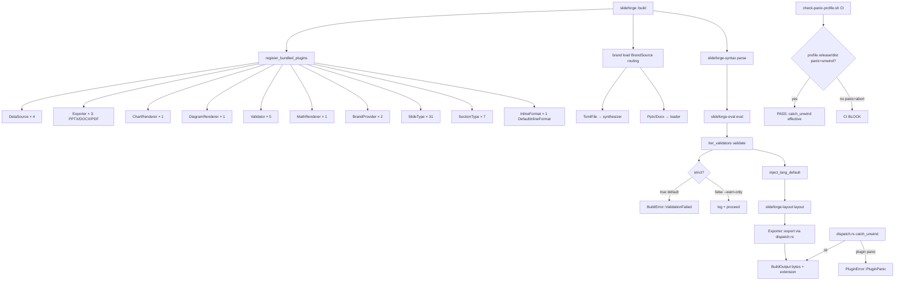
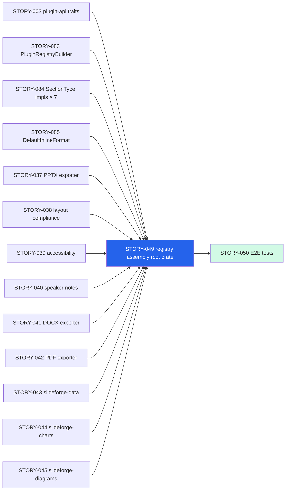
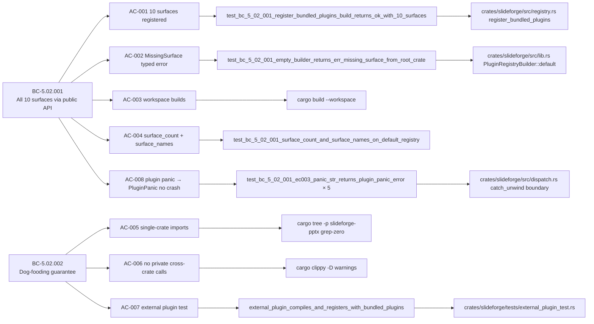

## STORY-049: Plugin Registry Assembly (root `slideforge` crate)

**Epic:** EPIC-21 | **Wave:** 4 | **Points:** 5 | **Priority:** P0
**Behavioral Contracts:** BC-5.02.001 v1.4 · BC-5.02.002 v1.4
**Architecture Authority:** ADR-016 Decision 3 (root crate IS the pipeline driver)

---

## Summary

Implements the root `slideforge` crate as the composition root and pipeline driver for the entire system. `register_bundled_plugins` assembles all 10 plugin surfaces via `Box<dyn Trait>` dispatch (dog-fooding guarantee). `slideforge::build(source, options)` wires the real end-to-end pipeline: assemble registry → brand load → parse → eval → validate → inject_lang_default → layout → export. A load-bearing test produces a non-empty, valid `.pptx` (`PK` magic bytes) from a `.sf` source + `brand.toml` without any bundled-plugin bypass.

---

## Architecture Changes

---

## Story Dependencies

---

## Spec Traceability

---

## What Shipped

### New files
- `crates/slideforge/src/registry.rs` — `register_bundled_plugins(&mut builder)` assembling all 10 surfaces via `Box<dyn Trait>`; `default_registry() -> Result<PluginRegistry, RegistryError>`
- `crates/slideforge/src/dispatch.rs` — `dispatch_plugin(name, f)` wrapping plugin calls in `std::panic::catch_unwind` → `PluginError::PluginPanic`; sole production use of `catch_unwind` in the workspace
- `crates/slideforge/src/error.rs` — `PluginError`, `BuildError` (ParseFailed/EvalFailed/ValidationFailed/BrandFailed/LayoutFailed/ExportFailed/RegistryError with structured diagnostics carrying spans+hints), `BuildOptions`, `BuildOutput`, `BrandSource`
- `crates/slideforge/tests/external_plugin_test.rs` — dog-fooding test: `TestDataSource` using only `slideforge-plugin-api` imports registers alongside bundled plugins (3 tests)
- `scripts/check-panic-profile.sh` — CI guard enforcing `panic = "unwind"` in `[profile.release]`/`[profile.dist]`; exits non-zero if any shipped profile contains `panic = "abort"`

### Modified files
- `crates/slideforge/src/lib.rs` — full `build(source, options) -> Result<BuildOutput, BuildError>` pipeline driver; re-exports `PluginRegistry`, `PluginRegistryBuilder`, `RegistryError`
- `crates/slideforge/Cargo.toml` — all 10 plugin crates + pipeline crates as workspace deps; `tracing`, `thiserror = "=2.0.18"`
- `Cargo.toml` (workspace root) — `[profile.release]` and `[profile.dist]` set `panic = "unwind"`; `panic = "abort"` forbidden in shipped profiles (BC-5.02.001 EC-003)
- `.github/workflows/ci.yml` — added `check-panic-profile` job wired into `all-checks-pass` aggregate gate

### Key behaviors
- `strict` defaults to `true` (production safety); strict mode → `BuildError::ValidationFailed` on any validator diagnostic; `--warn-only` logs and proceeds
- Brand routing by `BrandSource` variant: `TomlFile` → brand synthesizer, `Pptx`/`Docx` → loader
- All `BrandProvider::load`, `Validator::validate`, `Exporter::export` calls route through `dispatch.rs` `catch_unwind` boundary
- `BuildOutput.extension` derived from `exporter.extension()` (format-correct file extension)
- `tracing::info` stage spans throughout `build()` for observability

---

## Test Evidence

| Suite | Command | Result |
|-------|---------|--------|
| slideforge unit tests | `cargo nextest run -p slideforge --no-fail-fast` | 38/38 PASS |
| External plugin test | `cargo nextest run --test external_plugin_test` | 3/3 PASS |
| Workspace build | `cargo build --workspace` | CLEAN (0 errors, 0 warnings) |
| Clippy pedantic | `cargo clippy --workspace --all-targets -- -D warnings` | CLEAN |
| Dep isolation | `cargo tree -p slideforge-pptx \| grep slideforge-pdf\|slideforge-html` | CLEAN (no cross-dep) |
| Panic profile guard | `bash scripts/check-panic-profile.sh` | PASS (exit 0) |
| Full workspace nextest | `cargo nextest run --workspace --no-fail-fast` | 3214/3215 PASS (1 pre-existing `slideforge-diagrams::cold_budget` timing flake unrelated to this story) |

**End-to-end test:** `test_crit2_end_to_end_build_ok_with_toml_brand` in `crates/slideforge/src/lib.rs` — calls `build()` with a real `.sf` source + `brand.toml`, asserts `Ok(BuildOutput { bytes })` where `!bytes.is_empty()` and `bytes.starts_with(b"PK")` (valid ZIP/PPTX). This is the headline capability.

---

## Demo Evidence

Recordings in `docs/demo-evidence/STORY-049/` on this branch.

| Recording | Format | ACs Covered |
|-----------|--------|-------------|
| `AC-001-004-registry-assembly.gif` | GIF | AC-001, AC-002, AC-003, AC-004 |
| `AC-005-008-dogfood-panic-guard.gif` | GIF | AC-005, AC-006, AC-007, AC-008, BONUS (panic-profile CI guard + E2E build) |

All 8 ACs have at least 1 recorded demonstration.

---

## Holdout Evaluation

N/A — evaluated at wave gate.

---

## Adversarial Review

LOCAL adversary cascade converged at **12 passes** (passes 10-11-12 strict-CLEAN, satisfying BC-5.39.001 3/3 requirement). 9 rounds of findings fixed including:

- **CRIT:** `build()` was non-functional (inverted brand routing + zero coverage on pipeline stages) — fixed with real pipeline wiring
- **CRIT:** `strict` mode defaulted to `false` (safety inversion) — fixed to default `true`
- **CRIT:** No CI enforcement for `panic = "abort"` risk — fixed with `check-panic-profile.sh` + CI job
- HIGH/MED: export source chain, `inject_lang_default` missing, `BuildOutput.extension` absent, diagnostic fidelity gaps
- LOW/OBS: help text wording, pipeline tracing span labels, doc corrections

---

## Security Review

Pending — dispatched independently by orchestrator (LESSON-5).

Key surface areas for reviewer attention:
- `dispatch.rs` `catch_unwind` boundary (sole production use; panic payload handling)
- `scripts/check-panic-profile.sh` shell script (reads `Cargo.toml` only; no network, no writes)
- `BrandSource::TomlFile(PathBuf)` path handling in brand load dispatch
- No `unsafe` code anywhere in this PR (`#![forbid(unsafe_code)]` enforced workspace-wide)

---

## Risk Assessment

**Blast radius:** HIGH (this is the composition root; all 10 plugin surfaces flow through it; `build()` is the public library API). Changes here affect every downstream consumer.

**Performance impact:** None in hot path — registry assembly is one-time at call site; `dispatch_plugin` adds one `catch_unwind` frame per plugin call (negligible; plugin I/O dominates).

**Rollback complexity:** Low — the root crate was previously a stub; reverting to stub is safe without affecting other crates.

---

## AI Pipeline Metadata

- Pipeline mode: greenfield, Wave 4, Story 19 of 21
- Model: claude-sonnet-4-6 (implementer + adversary cascade)
- LOCAL adversary cycles: 12 (converged 3-CLEAN at passes 10-11-12)
- Estimated context cost: ~15,200 tokens (per story spec estimate)

---

## Pre-Merge Checklist

- [x] PR description matches actual diff
- [x] All 8 ACs have demo evidence (2 recordings covering AC-001..AC-008 + BONUS)
- [x] Traceability chain complete: BC-5.02.001/002 → AC-001..AC-008 → tests → code
- [x] LOCAL adversary cascade converged (3-CLEAN: passes 10-11-12)
- [x] 38/38 unit tests pass; 3/3 external plugin tests pass
- [x] `cargo clippy --workspace --all-targets -- -D warnings` clean
- [x] `cargo build --workspace` clean
- [x] `check-panic-profile.sh` PASS
- [x] `panic = "unwind"` set in `[profile.release]` and `[profile.dist]`
- [x] No `.unwrap()` in non-test code
- [x] `#![forbid(unsafe_code)]` enforced
- [x] `#![warn(missing_docs)]` compliant
- [x] `tracing` instrumentation on all pipeline stages
- [ ] Security review (dispatched independently)
- [ ] PR-level adversarial review (dispatched independently)
- [ ] CI checks passing (pending merge)
- [ ] All dependency PRs merged (STORY-002, 083, 084, 085, 037-045 — Wave 4 predecessors)
