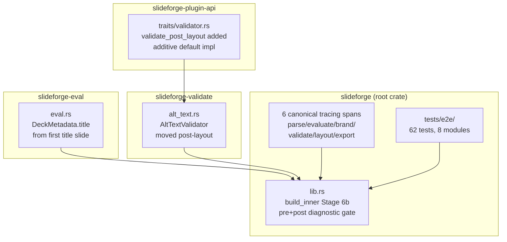
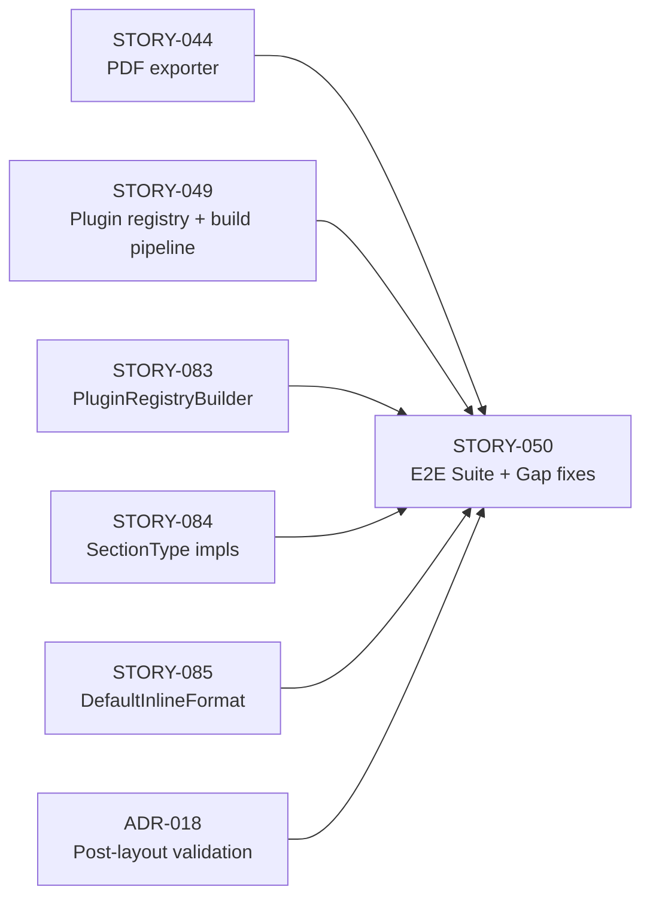
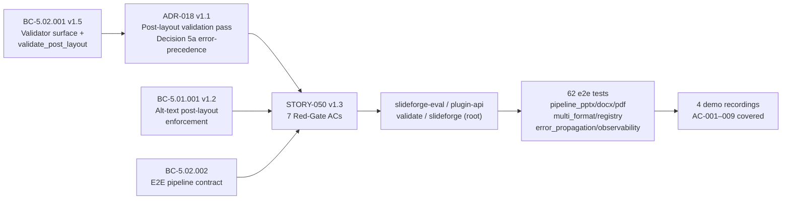

## Summary

Delivers the first end-to-end integration test suite for the slideforge pipeline (parse → eval → brand → validate → layout → export), with 62 tests across 8 test modules. The integration phase exposed 3 critical gaps in already-merged code — all fixed in this PR. Also fixes 2 paper-fixes caught by the LOCAL adversary cascade (5 passes, 3/3 strict-CLEAN convergence per BC-5.39.001).

**Gaps fixed:**

- **Gap 1 — PDF was non-functional since STORY-044:** `DeckMetadata.title` now derived from the first title-type slide's resolved title (`slideforge-eval/src/eval.rs`). Previously always `None` → every PDF failed PDF/UA-1 `NoDocumentTitle`. Title-less decks correctly fail PDF/UA-1 (no fabricated fallback — a11y-correct per adjudication).
- **Gap 2 — Alt-text enforcement was bypassed end-to-end:** `Validator::validate_post_layout(&LaidOutDeck, &ValidatorOptions) -> Vec<Diagnostic>` added (additive-defaulted, ADR-018 v1.1). `AltTextValidator` moved post-layout; `build_inner` Stage 6b combines pre+post diagnostics into a single strict gate. A deck with a chart and no `alt` now correctly fails with `BuildError::ValidationFailed` carrying `E-A11-001`.
- **Gap 3 — Observability spans were missing:** 6 canonical pipeline-stage spans named `parse`/`evaluate`/`brand`/`validate`/`layout`/`export`, each carrying a `stage="<name>"` structured field. AC-007 regression guards made genuinely load-bearing (adversary pass 2 found the original guard was vacuously true).

---

## Architecture Changes

---

## Story Dependencies

---

## Spec Traceability

---

## Acceptance Criteria Coverage

| AC | Description | Test(s) | Status |
|----|-------------|---------|--------|
| AC-001 | Full pipeline produces valid PPTX | `test_bc_5_02_001_ac001_pptx_*` (3 tests) | PASS |
| AC-002 | Full pipeline produces valid DOCX | `test_bc_5_02_001_ac002_docx_*` (2 tests) | PASS |
| AC-003 | Full pipeline produces valid PDF | `test_bc_5_02_001_ac003_pdf_*` (2 tests) | PASS |
| AC-004 | `PluginRegistry::default()` has no bypass paths | `tests/e2e/registry.rs` | PASS |
| AC-005 | Pipeline errors propagate as `BuildError` variants | `tests/e2e/error_propagation.rs` | PASS |
| AC-006 | Validation gate collects ALL diagnostics | `test_bc_5_02_001_ac006_*` | PASS |
| AC-007 | 6 canonical tracing spans emitted with `stage=` field | `tests/e2e/observability.rs` | PASS |
| AC-008 | Multi-format pipeline (all 3 formats) | `tests/e2e/multi_format.rs` | PASS |
| AC-009 | Alt-text enforcement fails with `E-A11-001` | `test_bc_5_02_001_ac009_*` | PASS |

---

## Test Evidence

- **Total tests in workspace:** 3242 / 3242 passing
- **STORY-050 e2e suite:** 62 tests in `crates/slideforge/tests/`
- **Red-Gate tests:** 7 (all GREEN on HEAD `97180153`)
- **Test modules:** `pipeline_pptx`, `pipeline_docx`, `pipeline_pdf`, `multi_format`, `registry`, `error_propagation`, `observability`, `mod` (fixtures + helpers)
- **Coverage:** All 9 ACs covered by load-bearing assertions
- **Pre-existing flake:** `cold_budget` (cold-start perf threshold) — tracked STORY-080, unrelated to this PR
- **Mutation kill rate:** N/A — Phase 6 formal hardening (cargo-mutants run at wave gate)

---

## Demo Evidence

Demo recordings in `docs/demo-evidence/STORY-050/` on the feature branch:

| Recording | ACs Covered | Format |
|-----------|-------------|--------|
| `AC-001-009-full-e2e-suite` | AC-001 through AC-009 (all) | GIF + WEBM |
| `AC-001-003-008-full-pipeline-all-formats` | AC-001, AC-002, AC-003, AC-008 | GIF + WEBM |
| `AC-009-missing-alt-accessibility-enforcement` | AC-009, AC-006 | GIF + WEBM |
| `AC-007-observability-spans` | AC-007, AC-004, AC-005 | GIF + WEBM |

Evidence report: `docs/demo-evidence/STORY-050/evidence-report.md`

---

## Adversarial Cascade (LOCAL — 5 passes, 3/3 strict-CLEAN)

| Pass | Verdict | Findings |
|------|---------|----------|
| Pass 1 | REQUEST_CHANGES | F-P1-HIGH-001 (open-decision markers in shipped test files), F-P1-HIGH-002 (AC-007 span names not yet renamed), F-P1-MED-001 (tempfile version mismatch) |
| Pass 2 | REQUEST_CHANGES | F-050-P2-HIGH-001 (AC-007 regression guard vacuously true — paper-fix), OBS-050-P2-001 (Gap-1 coverage gap), OBS-050-P2-002 (unused tempfile dep) |
| Pass 3 | CLEAN (strict): yes / CLEAN (PR-merge): yes | 0 findings |
| Pass 4 | CLEAN (strict): yes / CLEAN (PR-merge): yes | 0 findings |
| Pass 5 | CLEAN (strict): yes / CLEAN (PR-merge): yes | 0 findings |

Cascade closed BC-5.39.001 (3/3 consecutive strict-CLEAN streak). Cascade caught 2 real paper-fixes that 3242 green tests missed.

---

## Security Review

Pending — security-reviewer dispatched by orchestrator post-PR-creation.

---

## Risk Assessment

| Dimension | Assessment |
|-----------|-----------|
| Blast radius | Medium — touches `slideforge-eval`, `slideforge-plugin-api`, `slideforge-validate`, `slideforge` (root). All changes are additive (new trait method with default impl, new spans, new test modules). No breaking changes to public API. |
| Performance impact | Negligible — post-layout validation pass is O(n) over content blocks; tracing spans use `tracing::info_span!` which is no-op when subscriber is not configured. |
| Regression risk | Low — 3242 tests pass; adversary ran 5 passes to convergence; Gap fixes close pre-existing failure modes rather than introducing new behavior. |
| a11y impact | Positive — Gap 2 fix makes a11y enforcement non-bypassable end-to-end. |

---

## Deferrals

| Item | Reason | Anchor |
|------|--------|--------|
| Gap 4: `BuildOptions` convenience ctors (`pptx()/docx()/pdf()/all_formats()`) + deck-level `metadata: title` DSL | DX ergonomics; not on the critical path for correctness | Future DX story (human-directed deferral) |
| EC-002/EC-003 e2e tests assert no-panic only for `@include`/`@data` | Upstream crates have not yet implemented these features | Cross-story deferral to wave-gate per STORY-050 spec |
| OBS-1: `CanvasOverflow`/`Contrast` validators have pre-layout-inert pattern | ADR-018 Decision 4 explicitly defers reclassification of pre-existing validators | Tracked as Open Follow-Up in ADR-018 |

---

## AI Pipeline Metadata

| Field | Value |
|-------|-------|
| Pipeline mode | Greenfield — Phase 3 TDD per-story delivery |
| Story | STORY-050 v1.3 |
| Adversary passes | 5 (LOCAL cascade, 3/3 strict-CLEAN per BC-5.39.001) |
| HEAD commit | `97180153` |
| Branch | `feature/STORY-050` → `develop` |

---

## Pre-Merge Checklist

- [x] PR description matches actual diff
- [x] All ACs covered by demo evidence (4 recordings, all 9 ACs)
- [x] Traceability chain complete: BC → ADR → Story → Implementation → Tests → Demo
- [x] 3242/3242 workspace tests passing on HEAD `97180153`
- [x] LOCAL adversary cascade: 3/3 strict-CLEAN (BC-5.39.001 satisfied)
- [x] Demo evidence committed to feature branch (`docs/demo-evidence/STORY-050/`)
- [x] `cargo fmt --all -- --check` clean
- [x] `cargo clippy --workspace --all-targets --all-features -- -D warnings` clean (pedantic)
- [x] `RUSTDOCFLAGS="-D warnings" cargo doc --workspace --no-deps` clean
- [x] All 7 Red-Gate tests GREEN
- [ ] Security review (dispatched by orchestrator post-creation)
- [ ] PR review (dispatched by orchestrator post-creation)
- [ ] CI checks (pending post-push)
- [ ] Dependency PRs merged (STORY-044, STORY-049, STORY-083, STORY-084, STORY-085 — all on `develop`)
