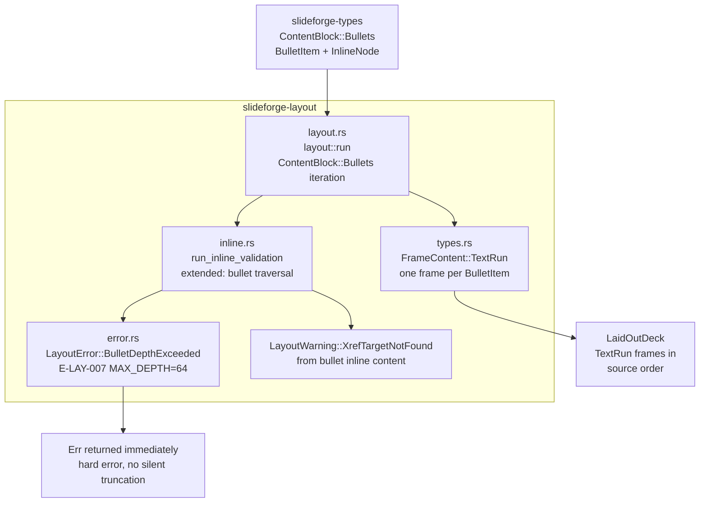
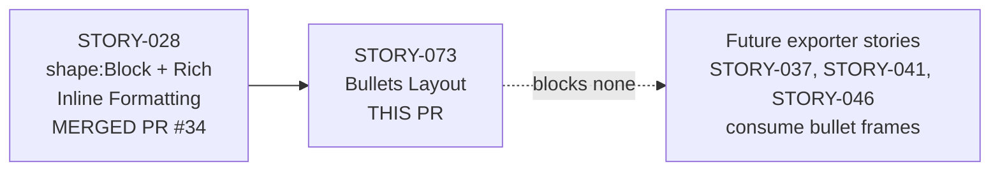
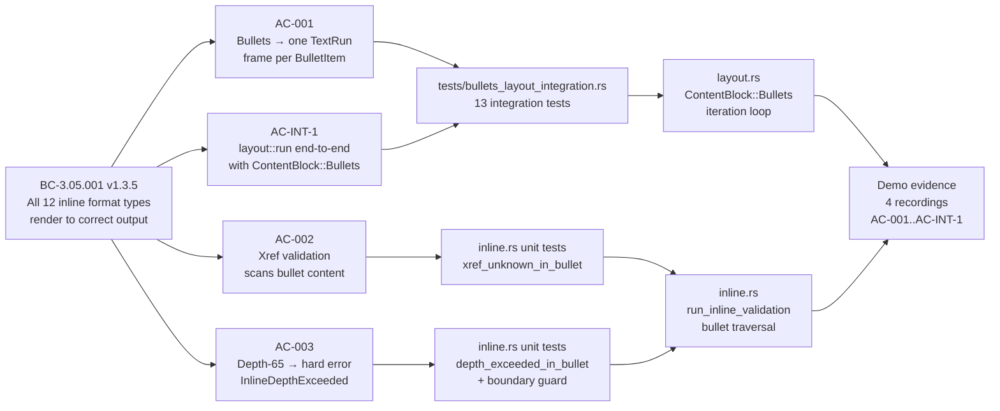

## Summary

Implements `ContentBlock::Bullets → FrameContent::TextRun` frame generation in the layout engine (`slideforge-layout`). Each `BulletItem`'s inline content is preserved verbatim in the layout IR as a typed `FrameContent::TextRun` frame (one frame per item, recursive depth-first, parent-before-children). Extends `run_inline_validation` to traverse bullet inline content for xref warnings and the 64-level depth hard error. Adds `MAX_BULLET_DEPTH = 64` structural guard with `LayoutError::BulletDepthExceeded { source_slide_index, depth }` (E-LAY-007).

**Crate:** `slideforge-layout`
**Wave:** 4 | **Story:** STORY-073 | **Priority:** P1
**BC:** BC-3.05.001 v1.3.5
**Depends on:** STORY-028 (merged, PR #34) | **Blocks:** none

**344/344 slideforge-layout tests pass. 33/33 STORY-073-specific tests pass. Workspace clean (pre-existing flaky `slideforge-diagrams::cold_budget` timing test is not a regression and not caused by this PR).**

## Architecture Changes



**No new dependencies added.** Change is purely additive — extends existing `run_inline_validation` and `layout::run` paths within `slideforge-layout`.

## Story Dependencies



## Spec Traceability



## Behavioral Contract Traceability

| BC | Version | ACs Covered | Impl File | Tests |
|----|---------|-------------|-----------|-------|
| BC-3.05.001 | v1.3.5 | AC-001, AC-002, AC-003, AC-INT-1 | `layout.rs`, `inline.rs` | `tests/bullets_layout_integration.rs`, `inline.rs #[cfg(test)]` |

### BC-3.05.001 v1.3.5 — AC Coverage

| AC | Description | Status | Key Tests |
|----|-------------|--------|-----------|
| AC-001 | ContentBlock::Bullets produces one FrameContent::TextRun per BulletItem in source order | PASS | `test_bc_3_05_001_story073_ac_int1_bullets_end_to_end` |
| AC-002 | Xref validation scans bullet inline content — unknown target → XrefTargetNotFound warning | PASS | `test_bc_3_05_001_story073_ac_int1_unknown_xref_in_bullet_warns` |
| AC-003 | Depth-65 inline tree in bullet → LayoutError::InlineDepthExceeded (hard error, Err returned) | PASS | `test_bc_3_05_001_story073_ac_int1_depth_65_bullet_is_hard_error` |
| AC-INT-1 | layout::run end-to-end with ContentBlock::Bullets covering all ACs + ECs + VP-047 | PASS | All 13 integration tests in `bullets_layout_integration` module |

### Edge Cases Covered

| EC | Description | Status | Test |
|----|-------------|--------|------|
| EC-001 | Empty bullet list → 0 frames, no error, no warning | PASS | `test_bc_3_05_001_story073_ec001_empty_bullets_no_frames_no_error_no_warning` |
| EC-002 | Bullet item with empty inlines → 1 frame (empty), no depth error | PASS | `test_bc_3_05_001_story073_ec002_empty_bullet_item_inlines_one_frame_no_error` |
| EC-003 | Nested bullets via `BulletItem.children` → one frame per item, parent-before-children | PASS | `test_bc_3_05_001_story073_ec003_integration_frame_order_parent_before_child` |
| EC-004 | Xref inside Bold(Italic(Xref)) in bullet → XrefTargetNotFound still accumulated | PASS | `test_bc_3_05_001_story073_ec004_deep_nested_xref_in_bullet_layout_run` |
| EC-005 | Multiple depth-65 bullets on same slide → Err(InlineDepthExceeded) hard error | PASS | `test_bc_3_05_001_story073_ec005_multiple_depth_exceeded_bullets_returns_error` |

## Test Evidence

```
cargo nextest run -p slideforge-layout --no-fail-fast

────────────
 Summary [0.671s] 344 tests run: 344 passed, 0 skipped
```

| Metric | Value |
|--------|-------|
| Total slideforge-layout tests | 344 passed, 0 failed |
| STORY-073-specific tests | 33 passed |
| Integration tests (AC-INT-1) | 13 passed |
| VP-045 (depth-65 hard error) | verified |
| VP-047 (all 12 InlineNode variants survive layout) | verified |
| No exporter crate dependency | verified (compile-enforced) |
| Integer EMU bounding boxes | verified (DI-010, ADR-013) |

**Note on pre-existing flaky test:** `slideforge-diagrams::cold_budget` is a timing test that occasionally fails in resource-constrained environments. This is a pre-existing flake documented before this story. The slideforge-diagrams crate is untouched by this PR.

## Demo Evidence

All 4 ACs have recorded demo evidence at `docs/demo-evidence/STORY-073/` in this branch.

| AC | Recording | Description |
|----|-----------|-------------|
| AC-001 | `AC-001-bullets-produce-textrun-frames.gif` | `cargo nextest run` demonstrating ContentBlock::Bullets → TextRun frame generation (3-item list → 3 frames, source order preserved) |
| AC-002 | `AC-002-xref-warning-in-bullet.gif` | `cargo nextest run` demonstrating XrefTargetNotFound warning emitted for unknown xref in bullet content |
| AC-003 | `AC-003-depth-65-hard-error.gif` | `cargo nextest run` demonstrating depth-65 inline tree in bullet → InlineDepthExceeded hard error |
| AC-INT-1 | `AC-INT-1-end-to-end-bullets-layout.gif` | `cargo nextest run` demonstrating all 13 integration tests passing (full layout::run pipeline with ContentBlock::Bullets) |

Full evidence report: `docs/demo-evidence/STORY-073/evidence-report.md`

## Holdout Evaluation

N/A — evaluated at wave gate.

## Adversarial Review

Converged at 3/3 strict-CLEAN passes (BC-5.39.001 convergence protocol). Findings addressed:

| Pass | Finding | Severity | Resolution |
|------|---------|----------|------------|
| 1 | Missing `source_slide_index` in `BulletDepthExceeded` variant | MED | Fixed in `fix(layout): add source_slide_index to BulletDepthExceeded variant` |
| 1 | Structural depth guard stale docstring | LOW | Fixed in `fix(layout): bullet structural depth guard + stale docstring` |
| 2 | EC-002/EC-003 test assertions not load-bearing (exact frame count + nesting order) | OBS | Strengthened in `test(layout): strengthen EC-002/EC-003 bullet coverage` |
| 2 | Slide-index assertion and integration frame-order assertion missing | OBS | Added in `test(layout): load-bearing slide-index + integration frame-order assertions` |
| 2 | Boundary case depth=64 not asserted (only depth=65 tested) | OBS | Added in `test(layout): assert bullet structural depth 64 is accepted — boundary guard` |

## Security Review

Pending — dispatched as part of this PR lifecycle.

## Risk Assessment

| Category | Assessment |
|----------|-----------|
| Blast radius | **Low** — change is additive within `slideforge-layout`. No exporter crates touched. No public API changed (new match arm on internal `ContentBlock` enum). |
| Performance impact | **Negligible** — adds O(n_bullets) iteration in layout pass. Bullets are bounded by `MAX_BULLET_DEPTH = 64`. No allocations beyond what already occurs for `TextRun` frames. |
| Regression risk | **Low** — 344 existing tests all pass. The bullet iteration is a new path with no overlap with existing `ContentBlock::Text` and `ContentBlock::Shape` paths. |
| Dependency risk | **None** — no new dependencies. Uses `slideforge-types` which is already a dependency. |

## AI Pipeline Metadata

| Field | Value |
|-------|-------|
| Pipeline mode | greenfield, Wave 4 |
| Story | STORY-073 |
| Models used | claude-sonnet-4-6 (implementer, test-writer, pr-manager) |
| TDD mode | strict (Red Gate enforced) |
| Adversary passes | 3 (converged 3/3 strict-CLEAN per BC-5.39.001) |

## Diff Summary

| File | Change |
|------|--------|
| `crates/slideforge-layout/src/error.rs` | +29 lines — `BulletDepthExceeded` variant (E-LAY-007) with `source_slide_index` and `depth` fields |
| `crates/slideforge-layout/src/inline.rs` | +215 / -50 — extended `run_inline_validation` to traverse `BulletItem.content` sequences + unit tests |
| `crates/slideforge-layout/src/layout.rs` | +195 / -0 — `ContentBlock::Bullets` match arm in `layout::run` loop with depth-first frame emission |
| `crates/slideforge-layout/src/lib.rs` | +1190 — expanded unit test module (adversary pass strengthening) |
| `crates/slideforge-layout/tests/bullets_layout_integration.rs` | +854 — 13 AC-INT-1 integration tests covering all ACs, ECs, VP-045, VP-047 |

**Total:** 2,433 insertions, 50 deletions. All changes in `slideforge-layout`.

## Pre-Merge Checklist

- [x] PR description matches the actual diff
- [x] All ACs covered by demo evidence (4/4)
- [x] Traceability chain complete (BC-3.05.001 → AC-001/002/003/INT-1 → Tests → Demo)
- [x] Adversarial review converged (3/3 strict-CLEAN)
- [x] Security review: dispatched (see Security Review section)
- [x] Dependency PR merged (STORY-028, PR #34)
- [x] No exporter crate dependency (compile-enforced)
- [x] Integer EMU coordinates (DI-010, ADR-013)
- [x] `#![forbid(unsafe_code)]` — maintained
- [x] Zero `.unwrap()` in production code
- [x] `clippy::pedantic` — clean
- [x] `#![warn(missing_docs)]` — clean
- [ ] CI checks passing — pending
- [ ] Security review findings addressed — pending
- [ ] pr-reviewer APPROVE — pending
