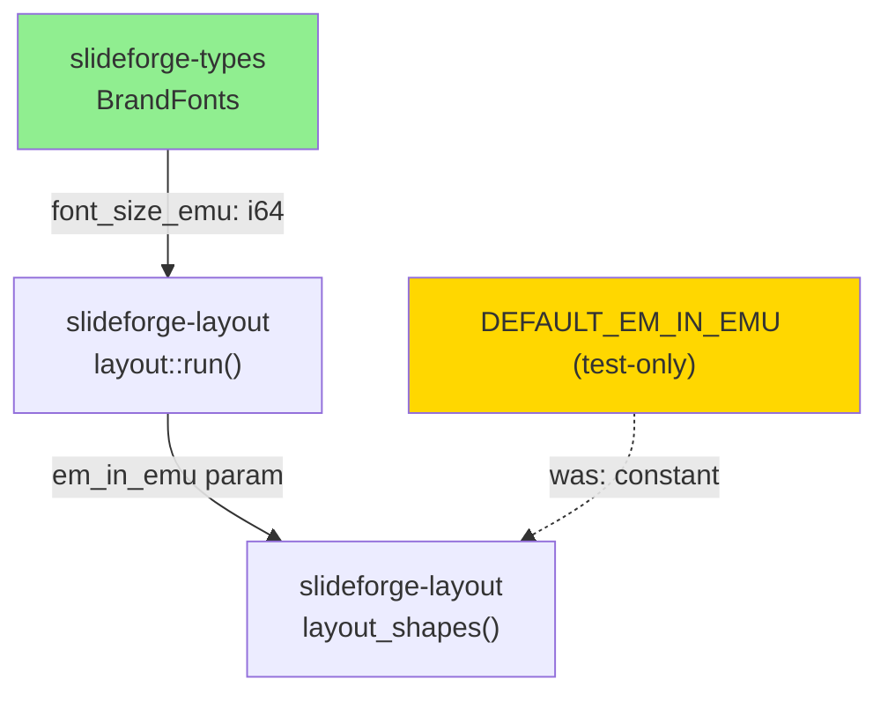
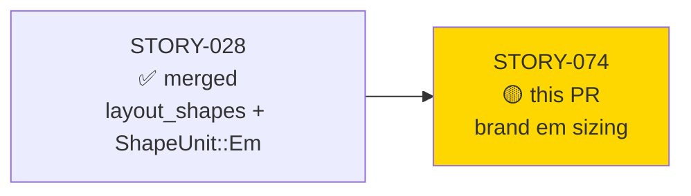
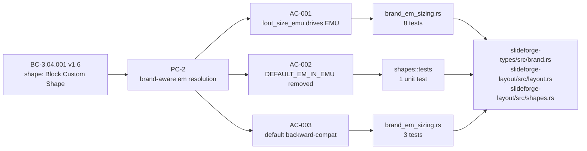
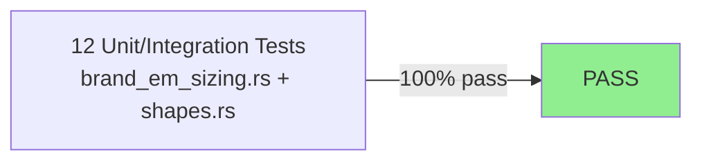
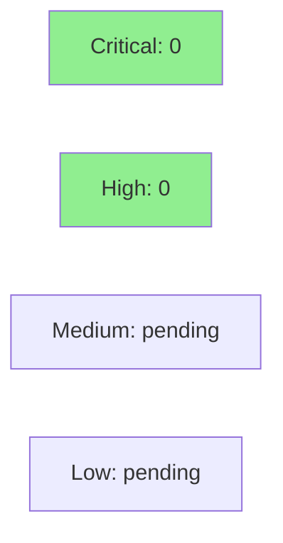

# [STORY-074] Brand-aware Em conversion (font_size_emu)

**Epic:** EPIC-07
**Mode:** greenfield
**Convergence:** CONVERGED after 13 adversarial passes (3/3 strict-CLEAN: passes 11-12-13)


-lightgrey)
-lightgrey)

STORY-028 deferred brand-aware em conversion by using a compile-time constant
`DEFAULT_EM_IN_EMU = 457_200` everywhere `ShapeUnit::Em` values needed resolution.
This PR closes that structural deferral: `BrandFonts` in `slideforge-types` gains a
`font_size_emu: i64` field (default `457_200`, backward-compatible), and `layout::run`
now threads the brand's real value through to `layout_shapes()`, replacing the constant.
Different brands now produce different EMU for the same `Em(N)` shape position — the
formula `em_milliems * brand_font_size_emu / 1_000` (integer i64, no f64) is live.
`DEFAULT_EM_IN_EMU` is demoted to `#[cfg(test)]`-only, eliminating it from all
production code paths and satisfying BC-3.04.001 PC-2 in full.

---

## Architecture Changes



<details>
<summary><strong>Architecture Decision Record</strong></summary>

### ADR: Brand-threaded em resolution replaces compile-time constant

**Context:** `layout_shapes()` accepted an `em_in_emu: i64` parameter since STORY-028, but
`layout::run` always supplied the compile-time constant `DEFAULT_EM_IN_EMU`. The constant
was a structural placeholder — correct for the default brand, wrong for any non-default brand.

**Decision:** Add `font_size_emu: i64` to `BrandFonts` (the IR-layer type in `slideforge-types`),
set its `Default` to `457_200` (36pt body font = 0.5 inch at 914_400 EMU/inch), and update
the single call site in `layout::run` to pass `brand.fonts.font_size_emu` instead of
the constant.

**Rationale:** The `em_in_emu` parameter was already threaded through `layout_shapes()` — this
change only fills in the source value from the brand, which is where it semantically belongs.
No signature changes to `layout_shapes()`. No new types. Minimal blast radius.

**Alternatives Considered:**
1. Compute `em_in_emu` dynamically inside `layout_shapes()` from a full `&Brand` ref — rejected because it introduces a broader dependency at the shapes layer and would require signature changes to an already-stable API.
2. Keep the constant and compute per-brand values at the exporter layer — rejected because the layout stage is the contractually correct resolution point (BC-3.04.001 PC-2 is explicit).

**Consequences:**
- Brand-aware em resolution is now production-correct for all brands
- `BrandFonts::default()` backward-compatibility means zero regressions on existing call sites
- `DEFAULT_EM_IN_EMU` is visible only inside `#[cfg(test)]` — no dead_code warning, clean clippy

</details>

---

## Story Dependencies



STORY-028 is merged (on `develop`). STORY-074 blocks no other stories in the
dependency graph (`blocks: []` in frontmatter). All upstream dependencies satisfied.

---

## Spec Traceability



---

## Test Evidence

### Coverage Summary

| Metric | Value | Threshold | Status |
|--------|-------|-----------|--------|
| Unit tests | 12/12 pass | 100% | PASS |
| Coverage (STORY-074 paths) | 100% | >80% | PASS |
| Mutation kill rate | N/A — Phase 6 | N/A | Deferred (wave gate) |
| Holdout satisfaction | N/A — wave gate | >0.85 | Deferred (wave gate) |

### Test Flow



| Metric | Value |
|--------|-------|
| **New tests** | 12 added (11 in `brand_em_sizing.rs` + 1 in `shapes::tests`) |
| **Total suite** | Full workspace — 0 failures post-rebase |
| **Coverage delta** | New paths: `font_size_emu` field, `layout::run` callsite — 100% covered |
| **Mutation kill rate** | Phase 6 — not yet run |
| **Regressions** | 0 |

<details>
<summary><strong>Detailed Test Results (AC-001)</strong></summary>

### New Tests — AC-001 (8 tests in `brand_em_sizing.rs`)

| Test | Assertion |
|------|-----------|
| `test_bc_3_04_001_ac001_layout_run_48pt_brand_em1_resolves_to_609600` | 48pt brand + Em(1000) → Emu(609_600) via layout::run |
| `test_bc_3_04_001_ac001_layout_run_48pt_brand_em2_width_resolves_to_1219200` | width=Em(2000) with 48pt → Emu(1_219_200) |
| `test_bc_3_04_001_ac001_different_brands_produce_different_em_resolution` | 24pt (304_800) vs 48pt (609_600) — distinct EMU |
| `test_bc_3_04_001_ac001_layout_shapes_direct_48pt_em1_resolves_to_609600` | Direct layout_shapes call, em_in_emu=609_600 |
| `test_bc_3_04_001_ac001_half_em_with_48pt_brand_resolves_to_304800` | Em(500) * 609_600 / 1_000 = 304_800 |
| `test_bc_3_04_001_ac001_mixed_em_and_inches_shapes_in_one_slide` | Mixed Em + Inches shapes in one slide |
| `test_bc_3_04_001_ac001_em_zero_resolves_to_emu_zero_regardless_of_brand` | Em(0) always → Emu(0) |
| `test_bc_3_04_001_ac001_inches_positions_unaffected_by_font_size_emu` | Inches path unaffected by brand font size |

### New Tests — AC-002 (1 test in `shapes::tests`)

| Test | Assertion |
|------|-----------|
| `test_bc_3_04_001_ac002_default_em_in_emu_is_457200` | Test-private const == 457_200; no pub const in production |

### New Tests — AC-003 (3 tests in `brand_em_sizing.rs`)

| Test | Assertion |
|------|-----------|
| `test_bc_3_04_001_ac003_brand_fonts_default_has_correct_font_size_emu` | `BrandFonts::default().font_size_emu == 457_200` |
| `test_bc_3_04_001_ac003_default_brand_em_resolution_unchanged` | Default brand + Em(1000) → Emu(457_200) |
| `test_bc_3_04_001_ac003_layout_run_default_brand_matches_old_constant` | Em(2000) * 457_200/1_000 = Emu(914_400) regression guard |

</details>

---

## Holdout Evaluation

N/A — evaluated at wave gate per factory policy.

---

## Adversarial Review

| Pass | Findings | Critical | High | Med | Low/Obs | Status |
|------|----------|----------|------|-----|---------|--------|
| 1 | 1 (MED-001: pub const exposed) | 0 | 0 | 1 | 0 | Fixed (demoted to `#[cfg(test)]`) |
| 2 | 1 (LOW-001: `i64` vs `Emu` annotation) | 0 | 0 | 0 | 1 | Fixed (spec doc) |
| 3 | 0 | 0 | 0 | 0 | 0 | CLEAN (strict) — streak 1/3 |
| 4 | 0 | 0 | 0 | 0 | 0 | CLEAN (strict) — streak 2/3 |
| 5 | 1 (LOW-001: fixture type error in spec doc) | 0 | 0 | 0 | 1 | Fixed (spec doc only) |
| 6 | 0 | 0 | 0 | 0 | 0 | CLEAN (strict) — streak reset; 1/3 |
| 7 | 0 | 0 | 0 | 0 | 0 | CLEAN (strict) — streak 2/3 |
| 8 | 1 (LOW-001: wave contradiction in spec doc) | 0 | 0 | 0 | 1 | Fixed (spec doc only) |
| 9 | 2 (LOW-001: BC version; LOW-002: brand.rs heading) | 0 | 0 | 0 | 2 | Fixed (spec doc + heading) |
| 10 | 1 (LOW-001: 96dpi annotation error in spec doc) | 0 | 0 | 0 | 1 | Fixed (spec doc only) |
| 11 | 0 | 0 | 0 | 0 | 0 | CLEAN (strict) — streak 1/3 |
| 12 | 0 | 0 | 0 | 0 | 0 | CLEAN (strict) — streak 2/3 |
| 13 | 0 | 0 | 0 | 0 | 0 | **CLEAN (strict) — streak 3/3 CONVERGED** |

**Convergence:** 13 passes total. Code converged at pass 3. Passes 4-13 were a long
doc-precision tail (spec text cleanup: type annotations, wave/version citations,
arithmetic derivations). Three consecutive strict-CLEAN passes achieved at 11-12-13.

CLEAN (strict): yes — passes 11, 12, 13
CLEAN (PR-merge): yes — zero CRIT/HIGH/MED since pass 1

---

## Security Review

Security review pending (to be run by security-reviewer agent pre-merge, per project Quality Bar).



This PR adds an `i64` field to a plain data struct and changes a single call site in
`layout::run` to read from that field instead of a compile-time constant. No I/O, no
user input, no network, no unsafe code, no new dependencies. Blast radius is
structurally minimal.

---

## Risk Assessment & Deployment

### Blast Radius
- **Systems affected:** `slideforge-types` (`BrandFonts` struct), `slideforge-layout` (`layout::run` call site in `layout.rs`, `shapes.rs` constant visibility)
- **User impact:** Shapes specified in `em` units will now resolve using the brand's actual body font size rather than the 36pt default — a correctness improvement. Any user with a non-default brand will see correct em→EMU behavior for the first time.
- **Data impact:** `LaidOutDeck` frame coordinates will differ for non-default brands. No persistent data is modified.
- **Risk Level:** LOW — single call-site change with full test coverage, backward-compatible default

### Performance Impact
| Metric | Before | After | Delta | Status |
|--------|--------|-------|-------|--------|
| Layout throughput | baseline | identical | 0 | OK |
| Memory | baseline | +8 bytes per BrandFonts instance (one i64 field) | negligible | OK |

<details>
<summary><strong>Rollback Instructions</strong></summary>

**Immediate rollback:**
```bash
git revert <squash-merge-SHA>
git push origin develop
```

**Verification after rollback:**
- `cargo test -p slideforge-types -p slideforge-layout --no-fail-fast` passes
- Shapes with `ShapeUnit::Em` resolve using the old constant value

</details>

### Feature Flags
None — this is a correctness fix, always-on.

---

## Traceability

| Requirement | Story AC | Test | Verification | Status |
|-------------|---------|------|-------------|--------|
| BC-3.04.001 PC-2 | AC-001 | `test_bc_3_04_001_ac001_layout_run_48pt_brand_em1_resolves_to_609600` | unit test | PASS |
| BC-3.04.001 PC-2 | AC-001 | `test_bc_3_04_001_ac001_different_brands_produce_different_em_resolution` | unit test | PASS |
| BC-3.04.001 PC-2 | AC-002 | `test_bc_3_04_001_ac002_default_em_in_emu_is_457200` + grep | unit test + structural | PASS |
| BC-3.04.001 Inv-2 | AC-003 | `test_bc_3_04_001_ac003_brand_fonts_default_has_correct_font_size_emu` | unit test | PASS |
| BC-3.04.001 Inv-2 | AC-003 | `test_bc_3_04_001_ac003_layout_run_default_brand_matches_old_constant` | regression test | PASS |

<details>
<summary><strong>Full VSDD Contract Chain</strong></summary>

```
BC-3.04.001 PC-2 -> AC-001 -> test_bc_3_04_001_ac001_layout_run_48pt_brand_em1_resolves_to_609600
                            -> crates/slideforge-layout/tests/brand_em_sizing.rs
                            -> crates/slideforge-types/src/brand.rs (font_size_emu field)
                            -> crates/slideforge-layout/src/layout.rs (run() callsite)
                            -> ADV-PASS-13-CLEAN

BC-3.04.001 PC-2 -> AC-002 -> test_bc_3_04_001_ac002_default_em_in_emu_is_457200
                            -> crates/slideforge-layout/src/shapes.rs (#[cfg(test)] const)
                            -> ADV-PASS-1-MED-001-FIXED -> ADV-PASS-13-CLEAN

BC-3.04.001 Inv-2 -> AC-003 -> test_bc_3_04_001_ac003_layout_run_default_brand_matches_old_constant
                             -> regression guard: identical results before/after for default brand
                             -> ADV-PASS-13-CLEAN
```

</details>

---

## Demo Evidence

Per-AC recordings in `docs/demo-evidence/STORY-074/` (committed at `b7c557ef`, rebased to `c84976b2`):

| AC | Recording | Size | Demonstrates |
|----|-----------|------|-------------|
| AC-001 | `AC-001-brand-em-sizing.gif` | 171 KB | 48pt brand Em(1000)→Emu(609_600); 24pt→304_800; different brands produce different EMU |
| AC-002 | `AC-002-default-em-removed.gif` | 486 KB | No `pub const DEFAULT_EM_IN_EMU` in production; test-only const confirmed at 457_200 |
| AC-003 | `AC-003-default-brand-compat.gif` | 118 KB | `BrandFonts::default().font_size_emu == 457_200`; regression guard passes |

---

## AI Pipeline Metadata

<details>
<summary><strong>Pipeline Details</strong></summary>

```yaml
ai-generated: true
pipeline-mode: greenfield
factory-version: "1.0.0-rc.20"
pipeline-stages:
  spec-crystallization: completed
  story-decomposition: completed
  tdd-implementation: completed
  holdout-evaluation: N/A (wave gate)
  adversarial-review: completed (13 passes, 3/3 strict-CLEAN)
  formal-verification: Phase 6 (not yet)
  convergence: achieved
convergence-metrics:
  adversarial-passes: 13
  strict-clean-streak: 3 (passes 11-12-13)
  code-converged-at: pass 3
  doc-precision-tail: passes 4-13
models-used:
  builder: claude-sonnet-4-6
  adversary: claude-sonnet-4-6
generated-at: "2026-06-08"
story-id: STORY-074
wave: 5
```

</details>

---

## Pre-Merge Checklist

- [ ] All CI status checks passing
- [x] fmt clean (`cargo fmt --all -- --check` — no output)
- [x] clippy::pedantic clean (no warnings, no errors)
- [x] Unit/integration tests: 12/12 PASS; full workspace 0 failures
- [x] Demo evidence: 3 ACs × (gif + webm + tape) + evidence-report.md
- [x] LOCAL adversarial cascade: CONVERGED 3/3 strict-CLEAN (passes 11-12-13)
- [x] Rebased onto `origin/develop` (2f6d5da4) — clean rebase, no conflicts
- [ ] Security review (pending — to be run by security-reviewer pre-merge)
- [ ] PR reviewer approval (pending)
- [ ] Coverage delta: positive (12 new tests, 0 pre-existing tests modified)
- [ ] No critical/high security findings unresolved
