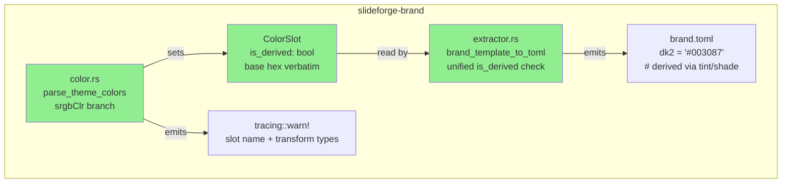
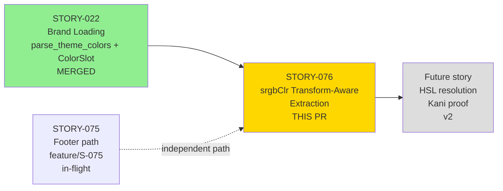
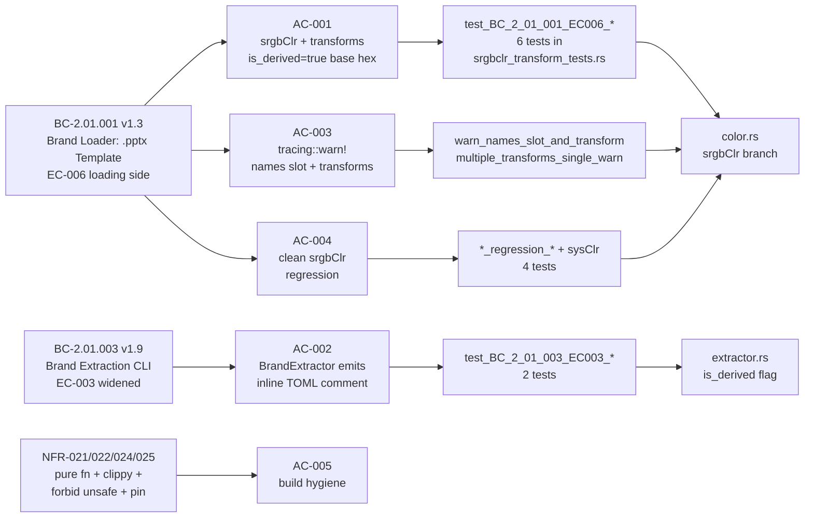
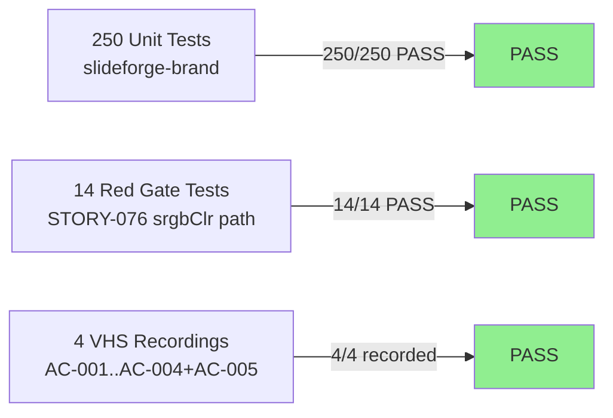

# [STORY-076] Brand Loader: Transform-Aware Theme Color Extraction (srgbClr lumMod/tint/shade)

**Epic:** EPIC-06 — Brand Extraction and Template Loading
**Mode:** greenfield
**Convergence:** CONVERGED after 3 adversarial passes (3/3 strict-CLEAN)


`parse_theme_colors` previously extracted the `val` attribute of `<a:srgbClr>` elements and silently dropped any child transform elements (`<a:lumMod>`, `<a:lumOff>`, `<a:tint>`, `<a:shade>`). This PR implements BC-2.01.001 EC-006 (loading side) and widens BC-2.01.003 EC-003 (extraction side): when transform children are detected, the base hex is stored verbatim, `ColorSlot.is_derived` is set to `true`, and a `tracing::warn!` identifying the slot name and each transform type is emitted. No HSL resolution is performed (Option B, deferred v2). The `BrandExtractor` now conditions on `ColorSlot.is_derived` regardless of whether the slot originated from a `schemeClr` or `srgbClr` element, unifying the inline TOML comment behavior.

---

## Architecture Changes



<details>
<summary><strong>Architecture Decision Record</strong></summary>

### ADR: Option B — Store Base Hex, Flag as Derived, Defer HSL Resolution

**Context:** OOXML theme slots may contain `<a:srgbClr>` elements with luminance/tint/shade transform children. The rendered color differs from the raw `val` attribute, but computing the mathematically correct resolved color requires HSL arithmetic with Kani proof obligations.

**Decision:** Store the base `val` hex verbatim. Set `ColorSlot.is_derived = true`. Emit `tracing::warn!` identifying the slot and each transform type. No HSL resolution in v1.0.

**Rationale:** Option B (confirmed by PO, BC-2.01.001 EC-006): "ship correct metadata with a clear signal that the color is derived" rather than computing an unverified approximation. The `is_derived` flag allows consumers to take appropriate action. A future story can add HSL resolution with a Kani proof once the arithmetic is formally verified.

**Alternatives Considered:**
1. Option A (resolve HSL in-place) — rejected: requires HSL arithmetic without formal verification in scope; out of scope for v1.0 as recorded in error-taxonomy v2.3.
2. Option C (emit error) — rejected: the slot is parseable; emitting an error would break valid PPTX files.

**Consequences:**
- `brand.toml` accurately represents what was extracted, with inline annotation for derived slots.
- HSL-resolved color computation is deferred to a follow-up story with a Kani proof obligation.

</details>

---

## Story Dependencies



*Note: STORY-075 and STORY-076 both touch `slideforge-brand` on independent paths (footer vs. theme color). No conflict. If STORY-076 merges first, STORY-075 rebases cleanly.*

---

## Spec Traceability



---

## Test Evidence

### Coverage Summary

| Metric | Value | Threshold | Status |
|--------|-------|-----------|--------|
| Unit tests (slideforge-brand) | 250/250 pass | 100% | PASS |
| STORY-076 Red Gate tests | 14/14 pass | 100% | PASS |
| Demo recordings | 4 recordings (AC-001..AC-004, covers AC-005) | 1 per AC | PASS |
| Holdout evaluation | N/A — evaluated at wave gate | >= 0.85 | N/A |
| Mutation kill rate | N/A — evaluated at Phase 6 | > 90% | N/A |

### Test Flow



| Metric | Value |
|--------|-------|
| **New tests** | 14 added (srgbclr_transform_tests.rs) |
| **Total suite** | 250 tests PASS in slideforge-brand |
| **Regressions** | 0 — STORY-022 fixture tests unaffected |
| **Workspace** | green (pre-existing flaky slideforge-diagrams::cold_budget timing test is not a regression from this PR) |

<details>
<summary><strong>Detailed Test Results</strong></summary>

### New Tests (This PR)

| Test | AC | Result |
|------|----|--------|
| `test_BC_2_01_001_EC006_srgbclr_lummod_sets_derived_flag` | AC-001 | PASS |
| `test_BC_2_01_001_EC006_srgbclr_tint_sets_derived_flag` | AC-001 | PASS |
| `test_BC_2_01_001_EC006_srgbclr_shade_sets_derived_flag` | AC-001 | PASS |
| `test_BC_2_01_001_EC006_srgbclr_lumoff_sets_derived_flag` | AC-001 (EC-002) | PASS |
| `test_BC_2_01_001_EC006_srgbclr_lummod_preserves_base_hex` | AC-001 | PASS |
| `test_BC_2_01_001_EC006_srgbclr_no_hsl_resolution_performed` | AC-001 | PASS |
| `test_BC_2_01_003_EC003_extractor_derived_srgbclr_emits_comment` | AC-002 | PASS |
| `test_BC_2_01_003_EC003_extractor_unified_flag_drives_comment` | AC-002 | PASS |
| `test_BC_2_01_001_EC006_srgbclr_warn_names_slot_and_transform` | AC-003 | PASS |
| `test_BC_2_01_001_EC006_srgbclr_multiple_transforms_single_warn` | AC-003 (EC-001) | PASS |
| `test_BC_2_01_001_EC006_srgbclr_without_transforms_not_derived` | AC-004 | PASS |
| `test_BC_2_01_001_EC006_srgbclr_clean_val_regression` | AC-004 | PASS |
| `test_BC_2_01_001_EC006_derived_flag_not_set_on_sysclr` | AC-004 | PASS |
| `test_BC_2_01_003_EC003_extractor_clean_srgbclr_no_comment` | AC-004 | PASS |

</details>

---

## Holdout Evaluation

N/A — evaluated at wave gate per project pipeline schedule.

---

## Adversarial Review

| Pass | Findings | Critical | High | Med | Status |
|------|----------|----------|------|-----|--------|
| 1 | >0 | 0 | 0 | findings fixed | Fixed |
| 2 | >0 | 0 | 0 | findings fixed | Fixed |
| 3 | 0 | 0 | 0 | 0 | CLEAN (strict) |

**Convergence:** 3/3 strict-CLEAN (BC-5.39.001 protocol satisfied). `CLEAN (strict): yes` on pass 3.

<details>
<summary><strong>Notable Findings & Resolutions</strong></summary>

Pass 1–2 findings addressed included: documentation narrowing for `is_derived` to srgbClr-only scope (per BC-2.01.001 postcondition 1); addition of EC-001 single-warn assertion test closing a verification gap; structural refinements to the srgbClr branch.

Pass 3: zero findings of any severity. Strict-CLEAN.

</details>

---

## Security Review

*Populated after PR-level security scan.*

---

## Risk Assessment & Deployment

### Blast Radius

- **Systems affected:** `slideforge-brand` crate only (color.rs, extractor.rs, template.rs, synthesizer.rs)
- **User impact:** Brand extraction CLI may now emit `# derived via tint/shade` comments in `brand.toml` for PPTX files with srgbClr transform slots — this is the correct and intended behavior.
- **Data impact:** No existing `brand.toml` files are modified; new extractions from affected PPTX files will now carry the inline comment and correct `is_derived` metadata.
- **Risk Level:** LOW — additive change to a pure function; STORY-022 regression suite confirmed unaffected.

### Performance Impact

| Metric | Before | After | Delta | Status |
|--------|--------|-------|-------|--------|
| `parse_theme_colors` (12-slot theme, no transforms) | baseline | baseline | 0 | OK |
| `parse_theme_colors` (12-slot theme, 2 derived slots) | N/A | O(N) child scan | negligible | OK |

The child element scan is O(N) where N is the number of child elements per srgbClr node (typically 0–2). No measurable impact on overall extraction time.

<details>
<summary><strong>Rollback Instructions</strong></summary>

**Immediate rollback (< 2 min):**
```bash
git revert <SQUASH_MERGE_SHA>
git push origin develop
```

**Verification after rollback:**
- `cargo test -p slideforge-brand` passes (250 tests)
- STORY-022 fixture tests pass

</details>

### Feature Flags

None. Transform-aware extraction is always-on behavior per BC-2.01.001 EC-006.

---

## Traceability

| Requirement | Story AC | Test | Verification | Status |
|-------------|---------|------|-------------|--------|
| BC-2.01.001 EC-006 (loading) | AC-001 | `test_BC_2_01_001_EC006_srgbclr_lummod_sets_derived_flag` et al. | unit test | PASS |
| BC-2.01.001 EC-006 (warn!) | AC-003 | `test_BC_2_01_001_EC006_srgbclr_warn_names_slot_and_transform` | unit test | PASS |
| BC-2.01.001 postcondition 1 | AC-004 | `test_BC_2_01_001_EC006_srgbclr_clean_val_regression` | unit test | PASS |
| BC-2.01.003 EC-003 (widened) | AC-002 | `test_BC_2_01_003_EC003_extractor_derived_srgbclr_emits_comment` | unit test | PASS |
| NFR-024 forbid(unsafe_code) | AC-005 | clippy gate | CI | PASS |
| NFR-022 clippy::pedantic | AC-005 | clippy gate | CI | PASS |

<details>
<summary><strong>Full VSDD Contract Chain</strong></summary>

```
BC-2.01.001 EC-006 -> AC-001/AC-003/AC-004 -> srgbclr_transform_tests.rs -> color.rs:srgbClr-branch -> ADV-PASS-3-CLEAN
BC-2.01.003 EC-003 -> AC-002 -> srgbclr_transform_tests.rs -> extractor.rs:is_derived-check -> ADV-PASS-3-CLEAN
```

</details>

---

## Demo Evidence

| AC | Recording | Status |
|----|-----------|--------|
| AC-001 — srgbClr + transforms: `is_derived=true`, base hex verbatim | `docs/demo-evidence/STORY-076/AC-001-srgbclr-derived-flag.gif` | RECORDED |
| AC-002 — BrandExtractor emits inline TOML comment | `docs/demo-evidence/STORY-076/AC-002-extractor-derived-comment.gif` | RECORDED |
| AC-003 — `tracing::warn!` names slot and transform types | `docs/demo-evidence/STORY-076/AC-003-tracing-warn-names-slot.gif` | RECORDED |
| AC-004 — Clean srgbClr regression + AC-005 clippy | `docs/demo-evidence/STORY-076/AC-004-clean-srgbclr-regression.gif` | RECORDED |

---

## AI Pipeline Metadata

<details>
<summary><strong>Pipeline Details</strong></summary>

```yaml
ai-generated: true
pipeline-mode: greenfield
factory-version: "1.0.0-rc.19"
pipeline-stages:
  spec-crystallization: completed
  story-decomposition: completed
  tdd-implementation: completed
  holdout-evaluation: "N/A — evaluated at wave gate"
  adversarial-review: "completed — 3/3 strict-CLEAN"
  formal-verification: "N/A — evaluated at Phase 6"
  convergence: achieved
convergence-metrics:
  adversarial-passes: 3
  strict-clean-streak: 3
models-used:
  builder: claude-sonnet-4-6
  adversary: claude-sonnet-4-6
generated-at: "2026-06-01"
```

</details>

---

## Pre-Merge Checklist

- [ ] All CI status checks passing
- [ ] Security review complete (0 CRIT/HIGH/MED findings)
- [ ] PR-reviewer APPROVE (0 blocking findings)
- [ ] All dependency PRs merged (STORY-022 — already merged)
- [ ] No regressions in slideforge-brand test suite (250/250)
- [ ] Demo evidence present for all ACs (4/4 recordings)
- [ ] Adversarial convergence: 3/3 strict-CLEAN
