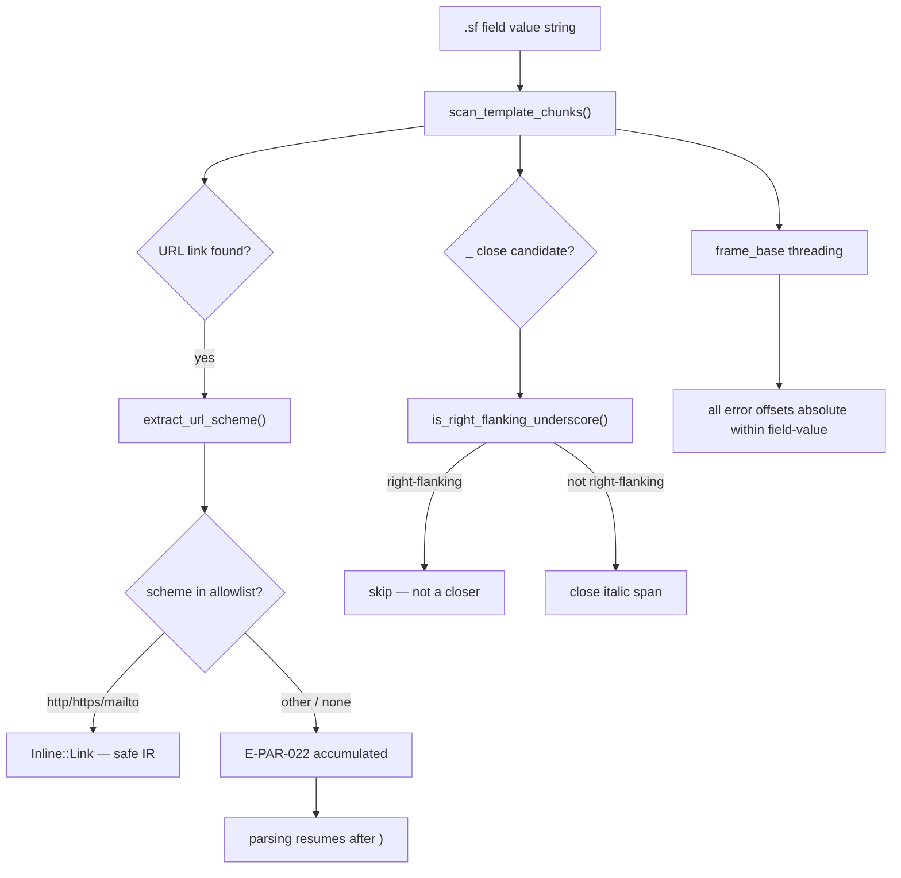
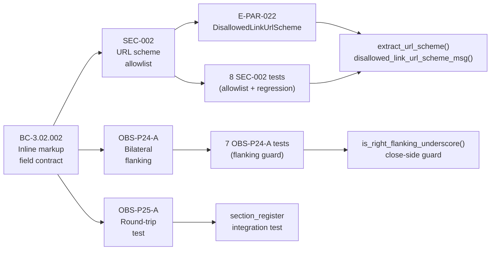

## Summary

Fix-PR for four human-authorized STORY-077 follow-ups, plus five cascade-found defects corrected during the local adversarial review. Targets `develop`. Branch `fix/story-077-followups` at `2ad9eabf`, based on `c8913cad` (current develop — no rebase needed).

**Scope:** `crates/slideforge-syntax` only — parser, inline-markup error path, and error taxonomy (spec-side committed separately to `factory-artifacts`). No new rendered output; test evidence substitutes for demo recordings (foundational parser error-handling).

---

## Changes Delivered

### 1. SEC-002 / E-PAR-022 — Link URL scheme allowlist at the parse boundary

`[text](url)` inline links now undergo scheme validation as they are parsed. Permitted schemes: `http`, `https`, `mailto` (case-insensitive). Every other scheme — including `javascript:`, `data:`, `vbscript:`, `file:` — and all scheme-less URLs (relative paths, bare anchors `#id`, URLs with no `:`) are rejected with a fatal `DisallowedLinkUrlScheme` error (E-PAR-022). Errors are accumulated (parsing continues past the link; multiple violations in one field all surface). The IR ships URL-safe: no disallowed-scheme link can reach the exporter.

Error message form:
```
E-PAR-022: Link URL scheme not permitted at <file>:<line>:<col>: '<scheme>'. Allowed: http, https, mailto.
```

Scheme `"(none)"` is reported when the URL has no `:` separator. Registered in error-taxonomy v2.13 (BC-3.02.002, DIR-077-002 §5, CAP-001).

### 2. OBS-P24-A — Italic bilateral flanking (DIR-077-002 §1, amended)

`_italic_` now enforces flanking on **both** sides via a single shared `is_right_flanking_underscore` predicate. A `_` that is right-flanking (preceded by a non-space, non-punctuation byte) cannot close an italic span. Word-internal underscores (`apply_file_path`, `_apply file_path here_`) neither open nor close italic. The previous guard existed only on the open side; the close side now applies the symmetric rule.

CommonMark §6.1 simplified model: a `_` close-candidate is right-flanking when the immediately preceding byte is not whitespace and not ASCII punctuation. Such a `_` is rejected as a closer; parsing continues without consuming it.

Regression guard: simple `_word_` italic remains fully functional.

### 3. OBS-P25-A — Real-source/eval round-trip integration test

A round-trip integration test in `crates/slideforge-syntax/tests/section_register_integration.rs` exercises the full parse→eval path through `SectionBlock` IR with inline-markup field values, consolidating AC-002 coverage with a real-source input rather than a synthetic stub.

### 4. Error-taxonomy v2.13 reconciliation (spec-side, `factory-artifacts`)

- E-PAR-022 allocated and registered (`DisallowedLinkUrlScheme`).
- E-PAR-012 re-registered (active) — the v1.1 retirement was incorrect; `unterminated_interpolation_msg()` has always emitted `"E-PAR-012"` and continues to do so.
- E-EVL-007–011 formally registered (were allocated in `crates/slideforge-eval/src/error.rs` but absent from the taxonomy table). No code changes; doc-only reconciliation removes the taxonomy debt note.

---

## Cascade-Found Defects (Local Adversarial Review, 7 Passes)

Five defects were found and fixed during the 7-pass local adversarial cascade before push. Disclosed per production-grade default (CLAUDE.md §1):

| ID | Description | Fix |
|----|-------------|-----|
| F-FU-P1-001 | Unclosed `_italic` whose only `_` candidate was right-flanked was silently accepted — no E-PAR-019 emitted. | Close-side bilateral guard now routes such cases through the existing unclosed-span E-PAR-019 path. |
| F-FU-P1-002 | E-PAR-022 recovery did not resume after `)` — a second disallowed link in the same field was silently dropped. | Accumulation loop now continues past `)` after emitting E-PAR-022; all violations in one field accumulate. |
| F-FU-P2-001 | EOF backstop gap: an unclosed inline span whose only candidate closer was consumed inside a nested code-span or link-URL was not reported (E-PAR-019 not emitted for `_`, `**`, `^`, `==`). Pre-existing sibling gap. | A backstop check at the end of the recursive call (after all candidates exhausted) emits E-PAR-019 exactly once when the span is genuinely unclosed. No-double-emit gate prevents a second emission if the closer was already found at depth. |
| F-FU-P3-001 | ALL inline-markup error byte offsets were relative to the current recursive frame, not absolute within the original field-value string. At nesting depth ≥ 2, every error offset (E-PAR-019 through E-PAR-022) was wrong. Pre-existing issue in the depth-≥2 span (also fixes the E-PAR-021 depth-cap offset). Human-authorized scope expansion. | `frame_base` threading: every recursive call receives the absolute byte offset of its slice start. Every error emit site uses `frame_base + local_pos`. Top-level call uses `frame_base = 0`. |
| F-FU-P4-001/002 | Test-rigor: the E-PAR-021 depth-cap test used a range assertion for the offset rather than an exact value; several at-offset comments were stale from pre-F-FU-P3-001. | Pinned to exact offset value; at-offset comments corrected. |

---

## Architecture Changes



---

## Spec Traceability



---

## Test Evidence

Test evidence substitutes for demo recordings: this PR delivers foundational parser error-handling with no new rendered output (same convention as STORY-077 / PR #49).

| Category | Count | Tests |
|----------|-------|-------|
| E-PAR-022 allowlist (SEC-002) | 8 | `test_SEC_002_javascript_scheme_rejected`, `test_SEC_002_data_scheme_rejected`, `test_SEC_002_relative_url_no_scheme_rejected`, `test_SEC_002_anchor_url_no_scheme_rejected`, `test_SEC_002_https_allowed_regression_guard`, `test_SEC_002_http_allowed_regression_guard`, `test_SEC_002_mailto_allowed_regression_guard`, `test_SEC_002_https_uppercase_case_insensitive_regression_guard` |
| OBS-P24-A bilateral flanking | 5 | `test_OBS_P24_A_italic_bilateral_flanking_internal_underscore_not_close`, `test_OBS_P24_A_simple_italic_word_still_works`, `test_OBS_P24_A_italic_a_b_closes_at_final_underscore`, `test_OBS_P24_A_snake_case_stays_literal_regression_guard` (+ close-guard test) |
| F-FU-P1-001 unclosed italic / right-flanked | 5 | `test_F_FU_P1_001_*` (5 cases) |
| F-FU-P1-002 accumulation recovery | 2 | `test_F_FU_P1_002_two_disallowed_links_both_errors_accumulated`, `test_F_FU_P1_002_single_disallowed_link_one_error_regression_guard` |
| F-FU-P2-001 EOF backstop | 8 | `test_F_FU_P2_001_italic_closer_inside_code_span_eof_backstop`, `_italic_closer_inside_link_url_eof_backstop`, `_bold_closer_inside_code_span_eof_backstop`, `_superscript_closer_inside_code_span_eof_backstop`, `_highlight_closer_inside_code_span_eof_backstop`, `_no_double_emit_simple_unclosed_italic`, `_backstop_does_not_fire_at_top_level_plain_text`, `_backstop_does_not_fire_when_closer_found`, `_backstop_does_not_fire_for_valid_italic`, `_italic_with_code_inside_valid_closer_no_error` |
| F-FU-P3-001 absolute offsets (depth 1/2/3) | 10 | `test_F_FU_P3_001_depth1_*`, `test_F_FU_P3_001_depth2_*`, `test_F_FU_P3_001_depth3_*`, E-PAR-021 depth-cap exact offset, E-PAR-022 nested absolute offset |
| F-FU-P4-001/002 pinned assertions | 2 | `test_F_FU_P3_001_E_PAR_021_depth_cap_offset_is_absolute` (exact value), stale-comment correction |
| OBS-P25-A round-trip | 1 | `section_register_integration` (real-source → eval path) |
| **Total new tests** | **~41** | |

**Pre-push gate (workspace, 2ad9eabf):**
- `cargo nextest run --workspace`: 2722 passed / 5 skipped / 0 failed
- `cargo clippy --workspace --all-targets --all-features -- -D warnings`: clean
- `cargo fmt --all -- --check`: clean
- `RUSTDOCFLAGS="-D warnings" cargo doc --workspace --no-deps`: clean
- **Unrelated flake (pre-existing, slideforge-diagrams untouched by this PR):** `test_cold_budget_under_200ms` / `normalize_under_budget` in `slideforge-diagrams` — timing-sensitive CI flake; both pass in isolation. This delta does not touch `slideforge-diagrams`.

**Local adversarial convergence:** BC-5.39.001 — 7 passes to 3/3 strict-CLEAN. Passes 5, 6, 7 clean at `2ad9eabf`.

---

## Scope Note

E-PAR-021 message-format cosmetic (the `at <file>:<line>:<col>` suffix style is inconsistent with the pattern established by E-PAR-022) is tracked as a separate minor follow-up. It is not in this PR.

---

## Risk Assessment

| Dimension | Assessment |
|-----------|------------|
| Blast radius | `crates/slideforge-syntax` only — parser and error path. No IR shape changes; no exporter touch. |
| Performance impact | Negligible — `extract_url_scheme` is O(len(URL)); `is_right_flanking_underscore` is O(1) single-byte lookup. Both are on the error/uncommon path for scheme-valid inputs. |
| Regression risk | Low — 41 load-bearing tests; all pre-existing tests in workspace pass. `frame_base` threading is additive (top-level call passes 0, matching prior behavior for depth-1). |
| Breaking change | None — new fatal errors for previously-silent invalid inputs (disallowed URL schemes, right-flanking unclosed italic). Existing valid `.sf` files are unaffected. |

---

## Pre-Merge Checklist

- [x] Branch targets `develop`
- [x] Head SHA `2ad9eabf` matches pushed branch
- [x] No rebase needed (based on `c8913cad`, current develop)
- [x] Workspace tests: 2722 passed / 0 failed
- [x] Clippy clean (`-D warnings`)
- [x] Rustfmt clean
- [x] Rustdoc clean (`-D warnings`)
- [x] Local adversarial cascade: 3/3 strict-CLEAN (BC-5.39.001)
- [x] Error-taxonomy v2.13 committed to `factory-artifacts`
- [x] Test evidence noted in lieu of demo recordings (no new rendered output)
- [ ] CI checks passing (awaiting)
- [ ] Security review (dispatched by orchestrator post-PR-create)
- [ ] PR review (dispatched by orchestrator post-PR-create)

---

## AI Pipeline Metadata

| Field | Value |
|-------|-------|
| Pipeline mode | Feature follow-up (fix-pr-delivery) |
| Story | STORY-077 follow-ups (human-authorized 2026-06-03) |
| Local adversarial passes | 7 (3/3 strict-CLEAN convergence) |
| Squash-merge model | 5 commits → 1 squash; PR title/body is the squash message source |
