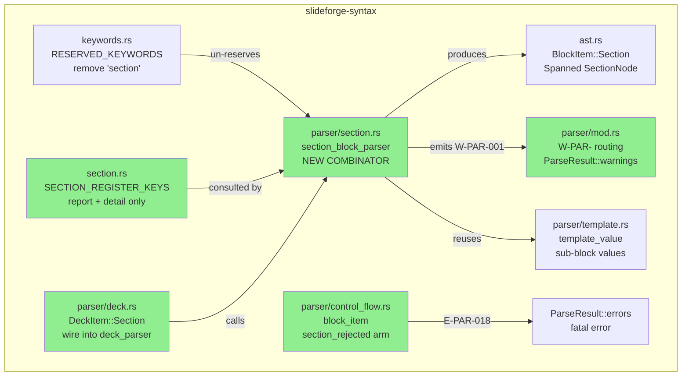
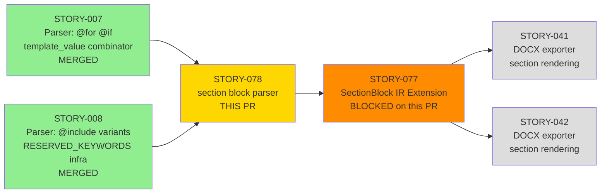
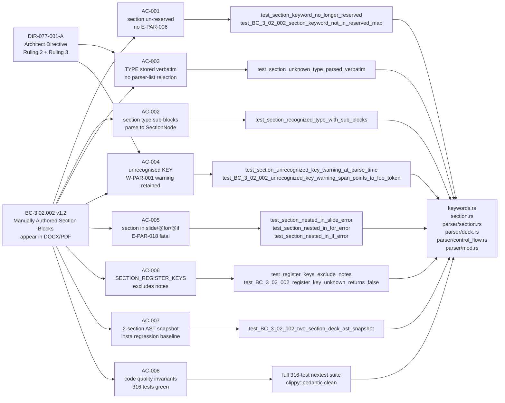
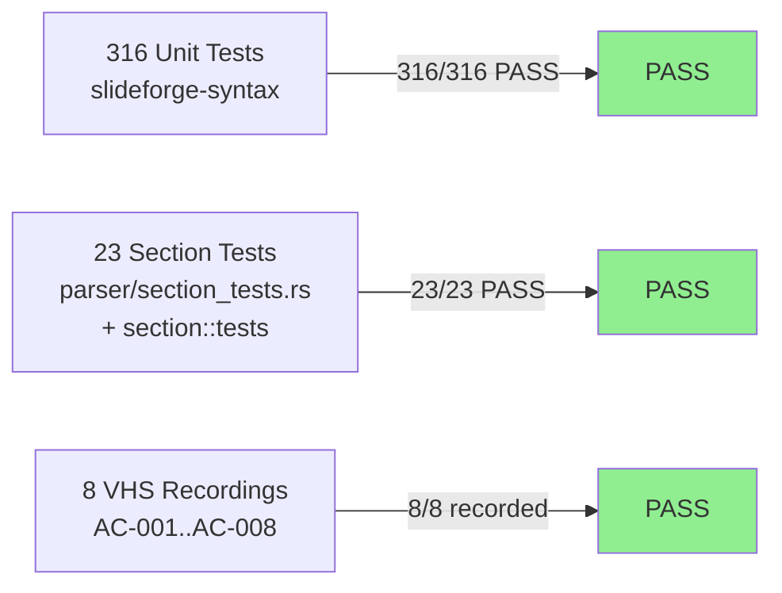

# [STORY-078] Parser: section block syntax (`section <type>:` with sub-blocks)

**Epic:** EPIC-02 — Parser Core
**Mode:** greenfield
**Convergence:** CONVERGED after 3 adversarial passes (3/3 strict-CLEAN)

Activates the `section` DSL keyword (previously E-PAR-006 reserved) and delivers the full `section_block_parser` combinator in `parser/section.rs`. A `section <type>:` block at the top level of a `.sf` file now produces a `SectionNode` in the AST with verbatim TYPE storage, typed sub-block field nodes, a non-fatal `W-PAR-001` warning for unrecognised sub-block keys (retained in AST), and a fatal `E-PAR-018` error when `section` appears inside a slide/`@for`/`@if` context. `SECTION_REGISTER_KEYS` is corrected to `["report", "detail"]` (excluding `"notes"` per DIR-077-001 §5). Error codes E-PAR-017, E-PAR-018, and W-PAR-001 are allocated in error-taxonomy v2.8 (factory-artifacts branch). This PR unblocks STORY-077 (SectionBlock IR extension).

---

## Architecture Changes

---

## Story Dependencies

*Note: STORY-077 (SectionBlock IR Extension) is blocked on this PR merging. This PR has no collision with in-flight PRs #44 (brand/srgbClr, `slideforge-brand`) or #45 (layout/ContentBlock, `slideforge-layout`) — they touch disjoint crates.*

---

## Spec Traceability

---

## Error Code Allocations (error-taxonomy v2.8)

| Code | Severity | Trigger | Notes |
|------|----------|---------|-------|
| `E-PAR-017` | FATAL | Reserved register name used without `:` suffix inside section sub-block (EC-006) | e.g. `report "text"` instead of `report: "text"` |
| `E-PAR-018` | FATAL | `section` keyword found inside slide/`@for`/`@if` context (not top-level) | BC-3.02.002 precondition 3 |
| `W-PAR-001` | WARNING (non-fatal) | Unrecognised sub-block key inside `section <type>:` block | Key retained in AST; warning visible before eval runs |

Error codes registered in error-taxonomy v2.8 on the `factory-artifacts` branch. Not duplicating codes E-PAR-015/016 (collision avoided via re-allocation in commit `16d2be8e`).

---

## Test Evidence

### Coverage Summary

| Metric | Value | Threshold | Status |
|--------|-------|-----------|--------|
| Unit tests (slideforge-syntax) | 316/316 pass | 100% | PASS |
| STORY-078 section-specific tests | 23/23 pass | 100% | PASS |
| Demo recordings | 8 recordings (AC-001..AC-008) | 1 per AC | PASS |
| Holdout evaluation | N/A — evaluated at wave gate | >= 0.85 | N/A |
| Mutation kill rate | N/A — evaluated at Phase 6 | > 90% | N/A |

### Test Flow

| Metric | Value |
|--------|-------|
| **New tests** | 23 added (section_tests.rs: 20 tests + section.rs: 3 tests) |
| **Total suite** | 316 tests PASS in slideforge-syntax, 1 skipped (pre-existing) |
| **Regressions** | 0 — all prior parser tests remain green |
| **Pre-existing flaky test** | `slideforge-diagrams::cold_budget` timing test — unrelated to this crate; may need re-run in CI |
| **Snapshot** | `slideforge_syntax__parser__section_tests__two_section_deck_ast_snapshot.snap` committed |

### Demo Evidence

Full per-AC recordings at `docs/demo-evidence/STORY-078/` (commit `291a6b72`):

| AC | Recording | Tests Driven |
|----|-----------|-------------|
| AC-001 | `AC-001-section-keyword-unreserved` | `test_section_keyword_no_longer_reserved`, `test_BC_3_02_002_section_keyword_not_in_reserved_map` |
| AC-002 | `AC-002-section-node-sub-blocks` | `test_section_recognized_type_with_sub_blocks` |
| AC-003 | `AC-003-verbatim-type-no-rejection` | `test_section_unknown_type_parsed_verbatim` |
| AC-004 | `AC-004-unrecognized-key-warning` | `test_section_unrecognized_key_warning_at_parse_time`, `test_BC_3_02_002_unrecognized_key_warning_span_points_to_foo_token` |
| AC-005 | `AC-005-section-in-slide-error` | `test_section_nested_in_slide_error`, `test_section_nested_in_for_error`, `test_section_nested_in_if_error` |
| AC-006 | `AC-006-register-keys-exclude-notes` | `test_register_keys_exclude_notes`, `test_BC_3_02_002_register_key_unknown_returns_false` |
| AC-007 | `AC-007-two-section-snapshot` | `test_BC_3_02_002_two_section_deck_ast_snapshot` |
| AC-008 | `AC-008-code-quality-full-suite` | Full 316-test nextest suite |

---

## Holdout Evaluation

N/A — evaluated at wave gate.

---

## Adversarial Review

CONVERGED: 3/3 strict-CLEAN passes completed. All findings resolved in-scope before this PR was opened. Final pass report in `.factory/cycles/STORY-078/`.

| Pass | Strict-CLEAN | PR-merge CLEAN | Findings | Fixed |
|------|-------------|----------------|----------|-------|
| Pass 1 | No | No | CRIT-1, CRIT-3, MED-1, OBS-2, OBS-3 | All fixed |
| Pass 2 | No | Yes | CRIT-code-collision | Fixed (error code reassignment) |
| Pass 3 | Yes | Yes | 0 | — |

---

## Security Review

Scope: pure parser library (`slideforge-syntax`). No I/O, no network, no file system access, no authentication, no cryptographic operations. Changes are:

- Keyword removal from a static PHF map
- New combinator functions (pure, no `unsafe`, no allocation of unbounded size)
- String formatting for diagnostic messages (no user-controlled format strings)

Attack surface delta: none. No new dependencies introduced. `#![forbid(unsafe_code)]` verified. Full security review will be dispatched by the orchestrator as a mandatory independent pass.

---

## Risk Assessment

| Dimension | Assessment |
|-----------|-----------|
| Blast radius | `slideforge-syntax` only; no downstream crate API changes |
| Behavioral change | `section` keyword now active (was E-PAR-006 reserved error); new `BlockItem::Section` AST variant |
| Performance impact | Negligible — adds one combinator arm to deck_parser; parser is not performance-critical |
| Breaking changes | None — `BlockItem::Section` variant was already present in AST (placeholder from STORY-008); match exhaustiveness is unchanged |
| Rollback risk | Low — pure addition to parser; removing the section arm would revert to E-PAR-006 behavior |

---

## AI Pipeline Metadata

| Field | Value |
|-------|-------|
| Pipeline mode | greenfield |
| Story wave | Wave 4 |
| Story points | 5 |
| Adversarial convergence | 3/3 strict-CLEAN |
| Error codes allocated | E-PAR-017, E-PAR-018, W-PAR-001 |
| Unblocks | STORY-077 (SectionBlock IR Extension) |

---

## Pre-Merge Checklist

- [x] PR description matches diff
- [x] All 8 ACs covered by demo evidence (1 recording each)
- [x] BC-3.02.002 traceability chain complete (BC -> AC -> Test -> Demo -> Code)
- [x] DIR-077-001-A Ruling 2 honoured (W-PAR-001 is parse-time, not eval-deferred)
- [x] DIR-077-001-A Ruling 3 honoured (TYPE stored verbatim, no parser-list check)
- [x] Error codes E-PAR-017/018/W-PAR-001 registered in error-taxonomy v2.8
- [x] `SECTION_REGISTER_KEYS` excludes `"notes"` per DIR-077-001 §5
- [x] `#![forbid(unsafe_code)]` — no unsafe introduced
- [x] Zero `.unwrap()` in non-test code
- [x] `clippy::pedantic` clean
- [x] `#![warn(missing_docs)]` — all new public items documented
- [x] No new Cargo dependencies
- [x] `Cargo.lock` consistent
- [x] Insta snapshot committed (`two_section_deck_ast_snapshot.snap`)
- [x] Demo evidence committed (commit `291a6b72`)
- [x] 3/3 strict-CLEAN adversarial convergence
- [x] Dependency check: STORY-007 (MERGED), STORY-008 (MERGED)
- [x] No collision with in-flight PRs #44 (brand) and #45 (layout)
- [ ] Independent security review (dispatched by orchestrator)
- [ ] Independent pr-reviewer pass (dispatched by orchestrator)
- [ ] CI green on develop rebase
- [ ] Human merge approval
