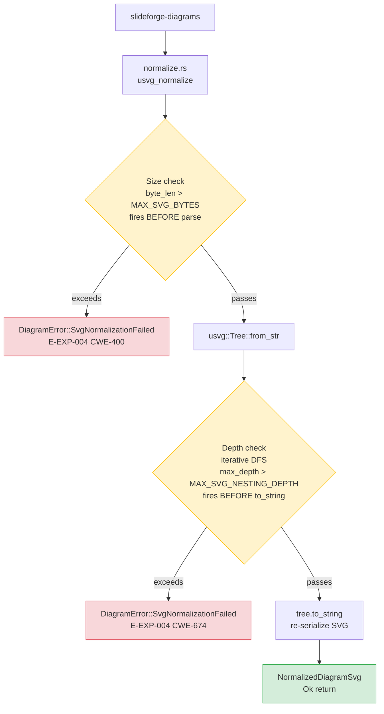
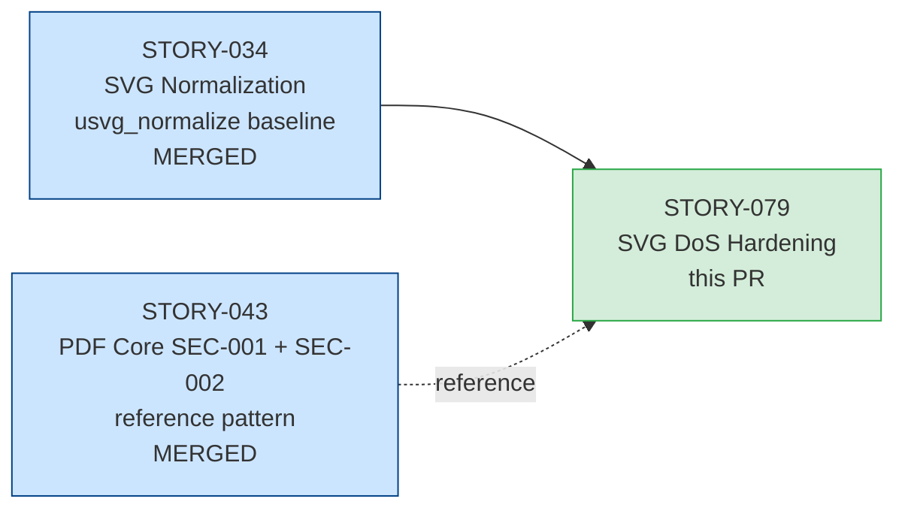
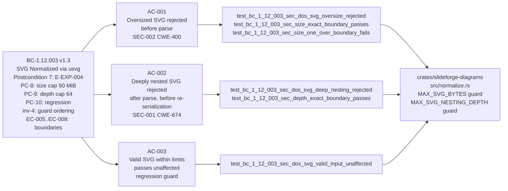

# feat(diagrams): STORY-079 SVG DoS hardening — SEC-001 nesting-depth + SEC-002 size guards

**Story:** STORY-079 — slideforge-diagrams: SVG DoS hardening — byte-size cap + nesting-depth guard
**Epic:** EPIC-12 (Diagrams)
**Wave:** 5 | **Priority:** P2 | **Points:** 3
**BC:** BC-1.12.003 v1.3 (SVG Normalized via usvg Before PPTX Embedding)
**Crate:** `slideforge-diagrams`
**Branch:** `feature/STORY-079` → `develop`

---

## Summary

Closes a CWE-400/CWE-674 resource-exhaustion vector in `crates/slideforge-diagrams/src/normalize.rs`.
The `usvg_normalize` function previously called `usvg::Tree::from_str` on externally-produced
Mermaid SVG without any size or nesting-depth guard. A compromised diagram renderer or malicious
`@data` source could exhaust heap (oversized payload) or stack (pathologically nested `<g>` tree)
before usvg returned an error.

This story mirrors the identical SEC-001/SEC-002 pattern already applied to `slideforge-pdf`
in STORY-043, completing the defense-in-depth requirement.

Key deliverables:
- **`MAX_SVG_BYTES = 50 MiB`** constant — byte-size cap fires **before** `usvg::Tree::from_str`
  (before any heap allocation proportional to SVG size). Returns `DiagramError::SvgNormalizationFailed`
  with E-EXP-004.
- **`MAX_SVG_NESTING_DEPTH = 64`** constant — iterative (stack-based) DFS over the parsed
  `usvg::Tree` via `Group::children()`. Fires **after** parse but **before** `tree.to_string()`.
  Returns `DiagramError::SvgNormalizationFailed` with E-EXP-004.
- `tracing::warn!` structured events on both rejection paths.
- Constants match `crates/slideforge-pdf/src/svg_embed.rs` exactly (defense-in-depth invariant).
- No new Cargo dependencies (standard library + existing `usvg`/`tracing`/`miette` only).

---

## Architecture Changes

**Guard ordering invariant (inv-4, BC-1.12.003 v1.3):** size guard MUST precede depth guard
MUST precede `font_db()` call. The font DB load (50–300ms) must never be paid for an oversized
or pathologically nested input.

---

## Story Dependencies

STORY-034 (merged, develop) established `usvg_normalize` and `RawDiagramSvg`. This story
adds guards to the existing function. STORY-043 (merged, develop) provided the reference
SEC-001/SEC-002 pattern. No unmerged dependencies.

---

## Spec Traceability

---

## Test Evidence

| Metric | Value |
|--------|-------|
| slideforge-diagrams tests | **117 passed, 0 failed, 0 skipped** |
| Exact-boundary tests | EC-005 (size=50MiB passes), EC-007 (depth=64 passes) verified |
| EC-006 (size=50MiB+1 fails), EC-008 (depth=65 fails) verified | yes |
| Non-identity-transform depth fixtures | yes — adversary Pass-2 OBS-1 addressed |
| clippy (pedantic + unwrap_used) | Clean — 0 warnings |
| rustfmt | Clean |
| Workspace clippy | Clean |
| Mutation testing | Phase 6 (formal hardening, not yet run) |
| Snapshot tests | N/A for security guard output (guards return errors, not SVG variants) |

All 117 tests pass in a single `cargo nextest run -p slideforge-diagrams --no-fail-fast` run.
The `cold_budget` test (test 117) passed in this run (138ms); it flakes intermittently
under heavy workspace load — this is a pre-existing condition on `develop` (STORY-080 fixes it).

---

## Demo Evidence

Three per-AC VHS terminal recordings at `docs/demo-evidence/STORY-079/`.

| Demo | AC | Description |
|------|----|-------------|
| `AC-001-oversize-svg-rejected` | AC-001 | nextest run of 3 size-cap tests: exact-boundary passes, +1-byte fails with E-EXP-004 |
| `AC-002-deep-nesting-rejected` | AC-002 | nextest run of 2 depth-cap tests: depth-64 passes, depth-65 fails with E-EXP-004 |
| `AC-003-valid-svg-passes` | AC-003 | nextest run of valid-input regression test: `simple_geometry_svg()` passes through unaffected |

**AC-001 — SEC-002: Oversized SVG rejected before parse**

**AC-002 — SEC-001: Deeply nested SVG rejected after parse**

**AC-003 — Valid SVG passes through unaffected**

---

## LOCAL Adversary Convergence Record

BC-5.39.001 protocol satisfied — 3/3 strict-CLEAN streak at passes 3/4/5. Total 5 passes.

| Pass | Findings | CLEAN (strict) | CLEAN (PR-merge) | Notes |
|------|----------|---------------|-----------------|-------|
| 1 | 1 MED, 1 LOW | no | no | MED-1: missing exact-boundary EC-005/EC-007 tests; LOW-1: depth fixture identity transform only |
| 2 | 1 OBS | no | yes | OBS-1: depth fixture should use non-identity transform to stress-test iterative DFS path |
| 3 | 0 | **yes** | yes | Streak 1/3 |
| 4 | 0 | **yes** | yes | Streak 2/3 |
| 5 | 0 | **yes** | yes | Streak 3/3 — **CONVERGED** |

Spec fixes applied during cascade (per CLAUDE.md Standing Rule — spec wins over code):
- **BC-1.12.003 v1.3:** Added inv-4 (guard ordering: size before depth before font_db), EC-005–EC-008 (exact boundary cases), postconditions PC-8 (size cap), PC-9 (depth cap), PC-10 (regression pass-through) — original inv-4 formulation corrected
- **error-taxonomy v2.26:** E-EXP-004 sibling accuracy fix — sibling entry was stale after STORY-034 added `SvgNormalizationFailed`
- **export-architecture v1.4:** root-at-1 depth counting convention documented for iterative DFS

---

## Holdout Evaluation

N/A — evaluated at wave gate (Wave 5 gate pending after all Wave 5 stories merge).

---

## Adversarial Review

LOCAL adversary cascade CONVERGED (see convergence table above). PR-level adversarial review
dispatched by orchestrator as part of PR lifecycle.

---

## Security Review

This PR IS a security fix (CWE-400 + CWE-674 DoS hardening). PR-level security review
dispatched by orchestrator as part of PR lifecycle (Step 4).

Security surface covered by this diff:
- Pre-parse byte-length guard (CWE-400 / resource exhaustion)
- Post-parse iterative depth guard (CWE-674 / uncontrolled recursion; guard is iterative — does not itself recurse)
- `tracing::warn!` structured events for both rejection paths (observability requirement)
- Error message non-vacuity: both E-EXP-004 messages include the measured value and the configured limit
- Constants match `slideforge-pdf` exactly (no split-brain security posture)

---

## Risk Assessment

| Risk | Classification | Mitigation |
|------|---------------|------------|
| Blast radius | Very Low — single file modified (`normalize.rs`); no API surface changes; `NormalizedDiagramSvg` contract unchanged | 117/117 tests pass including full regression suite |
| Performance | No regression for legitimate SVG — size check is `O(1)` byte comparison; depth check is `O(n)` node traversal on already-parsed tree | `test_bc_1_12_003_sec_dos_svg_valid_input_unaffected` proves no behavioral change |
| Supply chain | Zero new Cargo dependencies — standard library + existing workspace deps only | `Cargo.toml` for `slideforge-diagrams` unchanged |
| Platform | Pure safe Rust (no `unsafe`, no platform-specific code) | `#![forbid(unsafe_code)]` enforced workspace-wide |
| False positives | Boundaries are conservative (50 MiB, 64 levels) — real Mermaid output is <<1 MiB with <<20 nesting levels | Regression test with real Mermaid flowchart SVG fixture confirms no false positives |

---

## AI Pipeline Metadata

| Field | Value |
|-------|-------|
| Pipeline mode | Greenfield — Phase 3 TDD per-story delivery |
| Story delivery sub-workflow | stubs → Red Gate → TDD green → LOCAL adversary 3-CLEAN (5 passes) → demos → PR |
| Model | claude-sonnet-4-6 |
| Wave | 5 |

---

## Pre-Merge Checklist

- [x] PR description matches actual diff
- [x] All ACs covered by demo evidence (3 per-AC VHS recordings)
- [x] Traceability chain complete: BC-1.12.003 v1.3 → AC-001/002/003 → 6 security tests + 111 regression tests → demos
- [x] LOCAL adversary cascade converged: 3/3 strict-CLEAN (passes 3/4/5 of 5)
- [x] Pre-push gate clean: fmt + clippy(pedantic+unwrap_used) + nextest(117/117)
- [x] Worktree clean, base on origin/develop (cbebfd57) — no rebase needed
- [x] Dependency PRs merged: STORY-034 (usvg_normalize baseline) is on develop
- [x] cold_budget flake noted (pre-existing, STORY-080 fixes)
- [ ] Security review: dispatched by orchestrator (Step 4)
- [ ] AI PR-diff review: dispatched by orchestrator (Step 5)
- [ ] CI checks green (Step 6)
