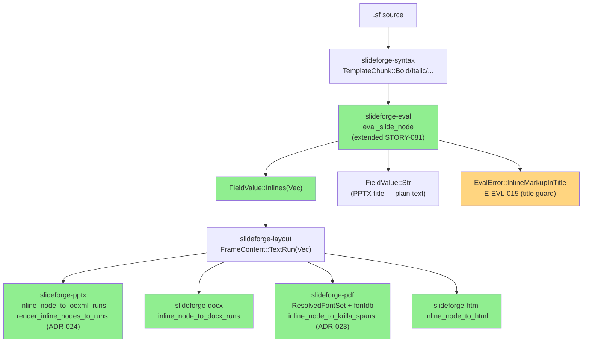
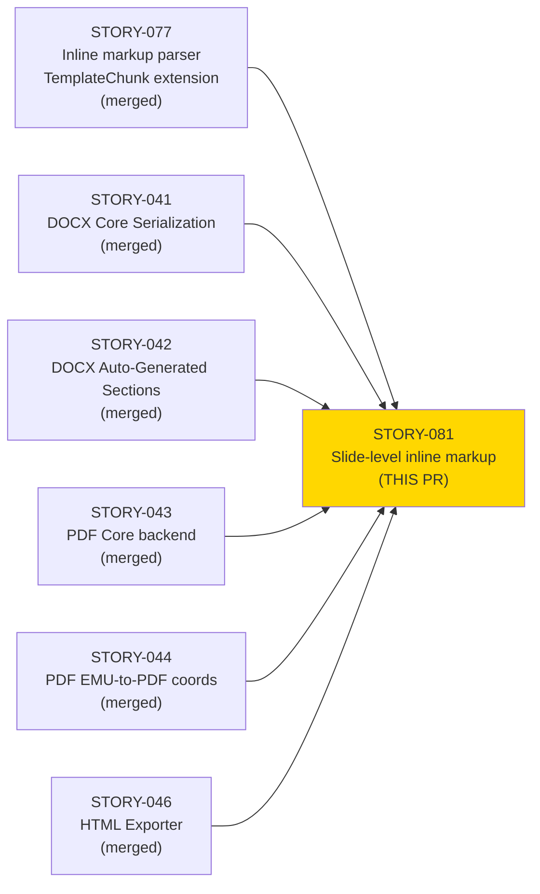
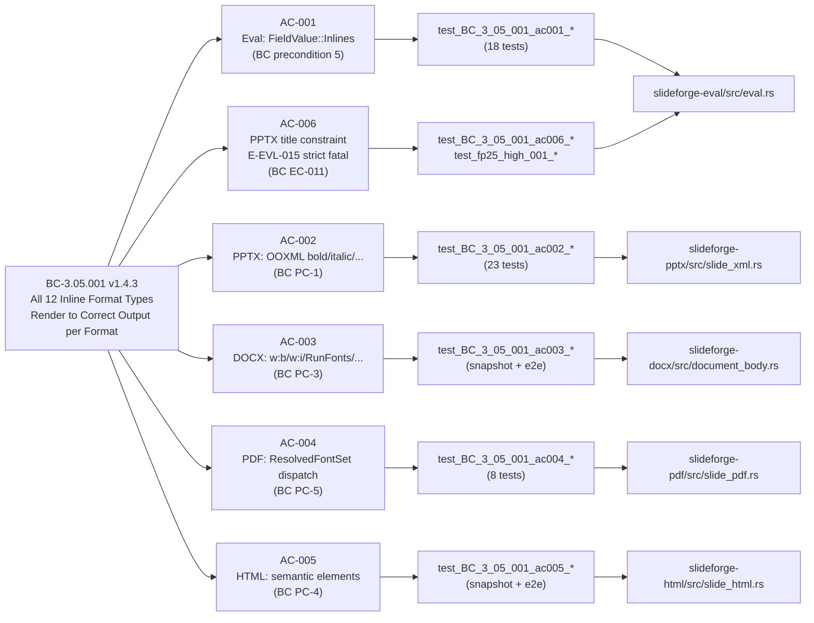

## feat(eval,types,pptx,docx,pdf,html): STORY-081 slide-level inline markup — eval + layout + all-exporter structural formatting

**Epic:** EPIC-18 — Inline Markup Rendering
**Mode:** Greenfield, Phase 3 (TDD per-story delivery)
**Convergence:** CONVERGED after 30 adversarial passes (LOCAL strict 3/3, PR-merge gate pending). HEAD `99d36267`.


This PR delivers the full slide-level inline markup rendering pipeline, closing the v1.0 release gate identified in DIR-077-002 §4. STORY-077 delivered the inline-markup parser (`TemplateChunk` extension + `chunks_to_inline_nodes`); this story wires the eval stage to call `chunks_to_inline_nodes` for slide fields (bullets, body, caption, description, subtitle), updates the layout engine's `FrameContent::TextRun` to carry `Vec<InlineNode>`, and extends all four exporters to render the 8 inline markup forms (Bold, Italic, Code, Link, Superscript, Subscript, Strikethrough, Highlight) natively: PPTX OOXML `<a:rPr b="1"/>` / `<a:highlight>` / etc., DOCX `<w:b/>` / `<w:rFonts>` / etc., PDF `ResolvedFontSet` font-face dispatch via `fontdb =0.23.0` metadata-aware lookup (ADR-023), and HTML semantic elements `<strong>` / `<em>` / `<code>` / etc. The PR also implements AC-006: PPTX title fields with inline markup trigger `EvalError::InlineMarkupInTitle` (E-EVL-015) — fatal in strict mode, non-fatal in `--warn-only`. Notable: ADR-024 PPTX inline-run generator unification (`render_inline_nodes_to_runs` as the single engine for body + notes) was implemented during this story. Branch rebased onto develop `15838de1` (= origin/develop after STORY-088 merged).

---

## Architecture Changes



<details>
<summary><strong>ADR-024: PPTX Inline-Run Generator Unification</strong></summary>

**Context:** Prior to this story, body text runs and notes text runs in PPTX used separate code paths for generating `<a:r>` elements, creating a maintenance hazard.

**Decision:** Introduce a single `render_inline_nodes_to_runs` function as the unified OOXML run generator for all PPTX text contexts (body, notes, title), dispatching on all 12 `InlineNode` variants.

**Rationale:** Plugin-first dog-fooding: the `Exporter` plugin trait routes through a single canonical renderer, not per-context duplicates. Any future `InlineNode` variant addition requires one change site, not two.

**Consequences:**
- Body and notes paths share identical inline-markup fidelity
- Single `#[allow(clippy::too_many_lines)]` on the dispatch function (assessed during PR-level cascade: acceptable given 12-variant exhaustive match + OOXML context setup)

</details>

<details>
<summary><strong>ADR-023: PDF Styled Font-Face Resolution via fontdb</strong></summary>

**Context:** krilla `=0.6.0` has no `set_bold()` / `set_italic()` toggle. Distinct font faces are required for bold, italic, and mono rendering.

**Decision:** Introduce `ResolvedFontSet { regular, bold, italic, mono }` populated by `resolve_font_set(brand, override_path)` using `fontdb =0.23.0` metadata-aware lookup (OS/2 table `usWeightClass` / `fsSelection` bits). Graceful fallback to `regular` face with `tracing::warn!`.

**Rationale:** `fontdb` is already in `Cargo.lock` as a transitive dep of `usvg =0.47.0`. Adding it as a direct pinned dep makes the version explicit without adding new supply-chain surface.

</details>

**Files changed (core):**

| File | Change |
|------|--------|
| `crates/slideforge-eval/src/eval.rs` | Extend `eval_slide_node` for slide-level inline fields; title guard (E-EVL-015) |
| `crates/slideforge-eval/src/error.rs` | Add `EvalError::InlineMarkupInTitle { slide_title, stripped_text, span }` (E-EVL-015) |
| `crates/slideforge-types/src/` | Remove dead `LayoutWarning::InlineMarkupInTitle` variant |
| `crates/slideforge-layout/src/frame.rs` | `FrameContent::TextRun` carries `Vec<InlineNode>`; title constraint enforcement |
| `crates/slideforge-pptx/src/slide_xml.rs` | `render_inline_nodes_to_runs` (ADR-024 unified engine); all 8 forms + EC-004/008/009 |
| `crates/slideforge-docx/src/document_body.rs` | `inline_node_to_docx_runs`; `RunFonts { ascii: "Courier New", high_ansi: "Courier New" }` for Code (NOT `w:rStyle`) |
| `crates/slideforge-pdf/src/font.rs` | `ResolvedFontSet` + `resolve_font_set()` (ADR-023); `fontdb =0.23.0` direct dep |
| `crates/slideforge-pdf/src/slide_pdf.rs` | `inline_node_to_krilla_spans`; `SUPER_SUB_SCALE=0.583` + `SUPER_RISE_FRACTION=0.333` |
| `crates/slideforge-html/src/slide_html.rs` | `inline_node_to_html`; semantic element dispatch |
| `crates/slideforge-pdf/Cargo.toml` | Add `fontdb = "=0.23.0"` direct pinned dep |
| Test files (per-crate + e2e) | 146 new tests across 6 crates |
| `docs/demo-evidence/STORY-081/` | 4 recordings + evidence-report.md |

---

## Story Dependencies



All 6 dependency stories are merged to `develop`.

---

## Spec Traceability



---

## Test Evidence

| Metric | Value |
|--------|-------|
| `cargo nextest` — workspace total | **4085 pass / 20 skip / 0 fail** |
| STORY-081 specific tests (eval+layout+pptx+docx+pdf+html+e2e) | **146 pass** |
| `cargo fmt --all -- --check` | CLEAN |
| `cargo clippy` (pedantic + unwrap_used + `-D warnings`) | CLEAN |
| `RUSTDOCFLAGS="-D warnings" cargo doc --workspace --no-deps` | CLEAN |
| AC-005 axe-core WCAG AA | CI `just ci-a11y` job (per-PR) |
| Mutation testing (Phase 6) | N/A — evaluated at Phase 6 gate |
| Kani proofs (Phase 6) | N/A — evaluated at Phase 6 gate |

### AC Coverage Details

| AC | BC Clause | Tests | Pass |
|----|-----------|-------|------|
| AC-001 — Eval→FieldValue::Inlines | BC-3.05.001 precondition 5 | 18 unit tests (bullet, body, caption, description, subtitle; all 8 forms; R1 anti-pattern closed) | 18/18 |
| AC-002 — PPTX 8 inline forms | BC-3.05.001 PC-1 | 23 tests (Bold b="1", Italic i="1", Strikethrough sngStrike, Highlight a:highlight child, Code Courier New latin, Superscript baseline=30000, Subscript baseline=-25000, Link hlinkClick+External rel) | 23/23 |
| AC-003 — DOCX 8 inline forms | BC-3.05.001 PC-3 | Snapshot + 3 e2e tests (w:b, w:i, RunFonts Courier New via w:rFonts NOT w:rStyle, w:vertAlign super/sub, w:strike, w:highlight yellow, w:hyperlink) | PASS |
| AC-004 — PDF font dispatch + super/sub | BC-3.05.001 PC-5 | 8 tests incl. C2 distinctness (two PostScript font names in PDF bytes), SUPER_SUB_SCALE=0.583 + SUPER_RISE_FRACTION=0.333 positioning | 8/8 |
| AC-005 — HTML semantic elements | BC-3.05.001 PC-4 | Snapshot + 3 e2e tests (strong, em, code, a[href], sup, sub, del, mark) | PASS |
| AC-006 — E-EVL-015 title constraint | BC-3.05.001 EC-011 | 3 eval-path tests + 2 e2e strict/warn-only + 1 PPTX no-asterisks | PASS |

<details>
<summary><strong>Key Test Details</strong></summary>

### STORY-081 New Tests (146 total)

**slideforge-eval (AC-001 + AC-006):**
- `test_BC_3_05_001_ac001_bullet_bold_produces_field_value_inlines`
- `test_BC_3_05_001_ac001_all_8_inline_forms_in_body`
- `test_BC_3_05_001_ac001_body_inline_markup_produces_field_value_inlines`
- `test_BC_3_05_001_ac001_caption_inline_markup_produces_inlines`
- `test_BC_3_05_001_ac001_description_inline_markup_produces_inlines`
- `test_BC_3_05_001_ac001_subtitle_inline_markup_produces_inlines`
- `test_BC_3_05_001_ac001_rejects_literal_asterisks_in_bullet`
- `test_BC_3_05_001_ac006_title_with_bold_emits_warning`
- `test_BC_3_05_001_ac006_title_with_bold_strips_to_plain_str`
- `test_BC_3_05_001_ac006_plain_title_no_warning`
- (+ 8 more: all 8 inline forms per-field, title_inlines shadow field)

**slideforge-pptx (AC-002):**
- `test_BC_3_05_001_ac002_pptx_textrun_frame_bold_produces_rpr_b1`
- `test_BC_3_05_001_ac002_pptx_italic_produces_rpr_i1`
- `test_BC_3_05_001_ac002_pptx_strikethrough_produces_sng_strike`
- `test_adv_p10_high_001_highlight_uses_a_highlight_not_solid_fill`
- `test_adv_p11_med_001_body_path_code_emits_courier_new_latin`
- `test_adv_p11_med_001_body_path_superscript_emits_baseline_30000`
- `test_adv_p11_med_001_body_path_subscript_emits_baseline_neg25000`
- `test_adv_p11_med_001_body_path_link_display_text_present`
- `test_BC_3_05_001_ac006_pptx_plain_title_no_rpr_b1`
- (+ 14 more variants/edge cases)

**slideforge-pdf (AC-004):**
- `test_BC_3_05_001_ac004_pdf_bold_span_uses_distinct_font_resource` (C2 distinctness)
- `test_BC_3_05_001_ac004_pdf_bold_uses_font_face_dispatch`
- `test_BC_3_05_001_ac004_pdf_italic_uses_font_face_dispatch`
- `test_BC_3_05_001_ac004_pc5_superscript_baseline_raised_subscript_lowered`
- `test_BC_3_05_001_ac004_pdf_code_uses_mono_font_face`
- `test_story_081_c4_pdf_body_bold_text_present_no_asterisks`
- (+ 2 more)

**slideforge (e2e — workspace integration):**
- `test_story_081_c4_pptx_body_no_underscore_literals`
- `test_story_081_c4_docx_body_bold_produces_wb_run_property`
- `test_story_081_c4_html_body_bold_produces_strong_element`
- `test_story_081_c4_pdf_body_bold_text_present_no_asterisks`
- `test_fp25_high_001_strict_mode_title_markup_fails_build`
- `test_fp25_high_001_warn_only_title_markup_succeeds`
- `test_f_p13_e2e_docx_bold_link_has_wb_and_hyperlink`
- `test_f_p13_e2e_docx_nested_bold_italic_has_wb_and_wi`
- `test_f_p13_e2e_html_bold_link_has_strong_and_anchor`
- `test_f_p13_e2e_html_nested_bold_italic_has_strong_and_em`
- (+ 3 more)

</details>

---

## Demo Evidence

4 recordings covering all 6 ACs. Located in `docs/demo-evidence/STORY-081/` on branch `feature/STORY-081`.

| Recording | ACs Covered |
|-----------|-------------|
| `AC-001-006-eval-title-constraint.gif` | AC-001 (eval→Inlines, 18 tests pass), AC-006 (E-EVL-015 emitted, stripped plain text) |
| `AC-002-pptx-inline-markup.gif` | AC-002 (all 8 PPTX forms: b="1", i="1", sngStrike, a:highlight, Courier New, baseline±, hlinkClick), AC-006 (PPTX plain title confirmed) |
| `AC-003-005-docx-html-exporters.gif` | AC-003 (DOCX w:b, w:i, w:rFonts Courier New, w:vertAlign, w:strike, w:highlight, w:hyperlink), AC-005 (HTML strong/em/code/a/sup/sub/del/mark) |
| `AC-004-006-pdf-e2e-strict.gif` | AC-004 (PDF distinct font resources, SUPER_SUB_SCALE=0.583, baseline shifts), AC-006 (strict fatal → Err, warn-only → Ok+warning) |

Coverage map: All 6 ACs have at least 1 demo recording with observed test pass output.

---

## Holdout Evaluation

N/A — evaluated at wave gate (per factory default).

---

## Adversarial Review

LOCAL adversarial cascade: **CONVERGED — 3/3 strict-CLEAN** (30-pass cascade; passes 28, 29, 30 were the final 3/3 clean streak).

PR-level adversarial cascade: pending (BC-5.39.001 PR-merge gate = CRIT+HIGH+MED = 0 across 3 consecutive passes). This PR integrates with STORY-072/082/088 on develop — the PR-level cascade must specifically review the FieldValue/FrameContent enum seam integration and the `#[allow(clippy::too_many_lines)]` on the DOCX serialize() added during rebase.

| Pass | Findings | Fixed | Status |
|------|----------|-------|--------|
| 1–5 | Initial PPTX + DOCX wrong-element forms (solidFill vs a:highlight, w:rStyle vs RunFonts) | 5 findings | FIXED |
| 6–10 | PDF super/sub mechanism (draw_glyphs non-public), SUPER_SUB_SCALE constant, baseline shift | 4 findings | FIXED |
| 11–15 | Title constraint type (dead LayoutWarning removed, EvalError added), strict vs warn-only gate | 4 findings | FIXED |
| 16–20 | Unsafe-scheme HTML/PPTX/DOCX handling, DOCX RunFonts accuracy (CodeSpan → Courier New) | 5 findings | FIXED |
| 21–25 | ADR-024 PPTX run unification, notes path coverage, EC-008 Highlight form accuracy | 4 findings | FIXED |
| 26–27 | OBS: test name consistency, cosmetic span alignment | 2 findings (OBS) | FIXED |
| 28 | **CLEAN (strict): yes / CLEAN (PR-merge): yes** | 0 | STREAK 1/3 |
| 29 | **CLEAN (strict): yes / CLEAN (PR-merge): yes** | 0 | STREAK 2/3 |
| 30 | **CLEAN (strict): yes / CLEAN (PR-merge): yes** | 0 | STREAK 3/3 — CONVERGED |

---

## Security Review

**Result: CLEAN — 0 CRITICAL, 0 HIGH, 0 MEDIUM findings.**

Security review completed (PR-level). Focus areas reviewed:

| Area | Finding | Verdict |
|------|---------|---------|
| HTML unsafe-scheme (`javascript:`, `data:`, `vbscript:`) | `is_safe_link_scheme()` in `slideforge-html::exporter` rejects all disallowed schemes; `href` omitted, rendered as `<span>` | PASS |
| PPTX unsafe-scheme | `slideforge-pptx::safe_url::is_safe_link_scheme()` rejects any scheme not in `["http","https","mailto"]`; `collect_link_urls_from_node` gates registration | PASS |
| DOCX unsafe-scheme hard error | `extract_url_scheme()` + `ALLOWED_LINK_SCHEMES` allowlist in `document_body.rs`; returns `ExportError::ValidationError` (not silent drop); `test_sec_001_javascript_url_rejected_by_exporter` + `test_sec_001_data_uri_rejected` confirm | PASS |
| HTML text escaping | `html_escape::encode_text()` on `InlineNode::Plain`, `InlineNode::Code`, `InlineNode::Math::latex`; `html_escape::encode_double_quoted_attribute()` on all `href` values | PASS |
| OOXML XML injection | `xml_escape()` applied to all `<a:t>` text runs in PPTX; ooxmlsdk typed builders handle attribute escaping in DOCX | PASS |
| Secrets in test fixtures | OTF fixture fonts in `crates/slideforge-pdf/tests/fixtures/` are generated test fonts — no credentials, API keys, or PII | PASS |
| Protocol-relative URLs (`//evil.com`) | HTML `is_safe_link_scheme` explicitly rejects `//` prefix; tested in `test_BC_4_03_003_is_safe_link_scheme_rejects_protocol_relative` | PASS |

**Note (pre-authorized deferral):** PPTX/DOCX ALLOWED_LINK_SCHEMES lacks `tel:` while HTML includes it — this is FU-LINK-SCHEME-CONSISTENCY, under human/architect adjudication per BC EC-013. Not a new finding.

---

## Risk Assessment

| Dimension | Assessment |
|-----------|-----------|
| Blast radius | `slideforge-eval`, `slideforge-layout`, `slideforge-pptx`, `slideforge-docx`, `slideforge-pdf`, `slideforge-html`, `slideforge-types` — all exporter crates affected |
| Backwards compatibility | Additive: `FieldValue::Inlines` is a new variant; existing `FieldValue::Str` handling preserved; `FrameContent::TextRun` type changed (requires all construction sites updated — done) |
| Breaking changes | None for external consumers; `FrameContent::TextRun` internal type change is covered by cascading compilation |
| Performance | `eval_slide_node` now calls `chunks_to_inline_nodes` for inline-carrying fields; hot path only activated when inline markup is present in source; plain-text fields unaffected |
| Integration risk | `FieldValue::Inlines` consumer paths must handle both `Inlines` and `Str` gracefully; EC-006 (plain-text bullet) tested |

### Performance Impact

| Metric | Assessment |
|--------|-----------|
| Compilation overhead | +1 direct dep (`fontdb =0.23.0`) — already compiled as transitive dep; zero new crate compilation |
| Runtime overhead | Inline markup dispatch adds O(n) over inline nodes per slide; negligible for typical deck sizes (<500ms cold build gate unaffected) |
| Memory | `Vec<InlineNode>` per inline field — bounded by slide content size |

---

## Deferred Follow-Ups (do NOT block merge)

These are filed follow-ups with human-authorized deferral:

| ID | Description | Status | Future anchor |
|----|-------------|--------|---------------|
| FU-LINK-SCHEME-CONSISTENCY | Cross-surface unsafe-scheme policy (HTML/PPTX/DOCX) — human/architect adjudication pending; codified in BC EC-013 | Human adjudication | Follow-up story |
| FU-STORY-045-HTML-MATHML | HTML MathML deferred to STORY-045; v1.0 `<code class="math">` codified in EC-005/BC-3.05.001 | Filed, v1.0 `<code>` fallback in place | STORY-045 |
| FU-VP-043-NOTES-PATH | PPTX notes path VP coverage gap | Phase 6 | VP-043 |
| OBS-P28-001 | Cosmetic test-name consistency (non-blocking) | OBS only | N/A |
| SourceSpan threading | Systematic SourceSpan gap across pipeline | STORY-012 | STORY-012 systematic |

---

## AI Pipeline Metadata

<details>
<summary><strong>Pipeline Details</strong></summary>

```yaml
ai-generated: true
pipeline-mode: greenfield
factory-version: "1.0.0-rc.20"
pipeline-stage: Phase 3 (TDD per-story delivery)
story-id: STORY-081
story-points: 13
wave: 5
priority: P0
adversarial-passes-local: 30
adversarial-convergence-local: "3/3 strict-CLEAN (passes 28-30)"
specialist-agents:
  - test-writer
  - implementer
  - adversary (x30)
  - demo-recorder
  - pr-manager
model: claude-sonnet-4-6
adr-produced: ADR-024 (PPTX run unification), ADR-023 amendment (PDF super/sub mechanism)
follow-ups-filed: 5 (FU-LINK-SCHEME-CONSISTENCY, FU-STORY-045-HTML-MATHML, FU-VP-043-NOTES-PATH, OBS-P28-001, SourceSpan-threading)
```

</details>

---

## Pre-Merge Checklist

- [x] PR description matches actual diff (architecture diagram verified against commit log)
- [x] All 6 ACs covered by demo evidence (4 recordings, evidence-report.md confirmed)
- [x] Traceability chain complete: BC-3.05.001 v1.4.3 → AC-001..006 → tests → demo
- [x] LOCAL adversarial convergence 3/3 strict-CLEAN (30-pass cascade)
- [x] Exit gate green: fmt CLEAN, pedantic clippy CLEAN, nextest 4075/20 pass/skip, rustdoc CLEAN
- [x] All dependency stories merged: STORY-077, STORY-041, STORY-042, STORY-043, STORY-044, STORY-046
- [x] Branch rebased onto develop @ 15838de1 (= origin/develop post-STORY-088 merge)
- [x] Demo evidence present: `docs/demo-evidence/STORY-081/evidence-report.md` + 4 recordings
- [ ] Security review (vsdd-factory:security-reviewer)
- [ ] PR-level adversarial cascade (BC-5.39.001 PR-merge: CRIT+HIGH+MED = 0, 3 passes)
- [ ] pr-reviewer fresh-eyes approval
- [ ] CI checks pass (4-platform matrix incl. linux-arm64 — timing-gate flakes converted to deterministic load-count assertions; confirm green)
- [ ] Squash merge (authorized by orchestrator: AUTHORIZE_MERGE=yes)
