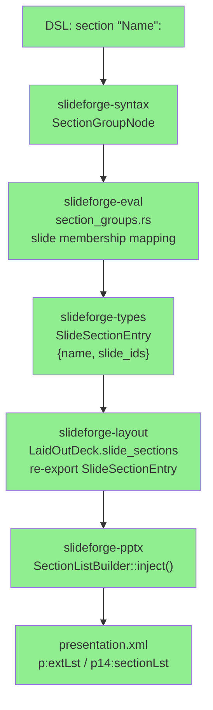
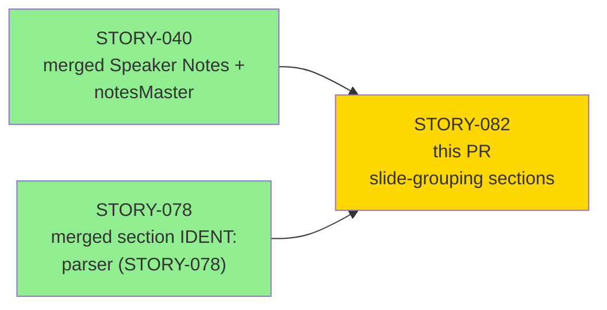
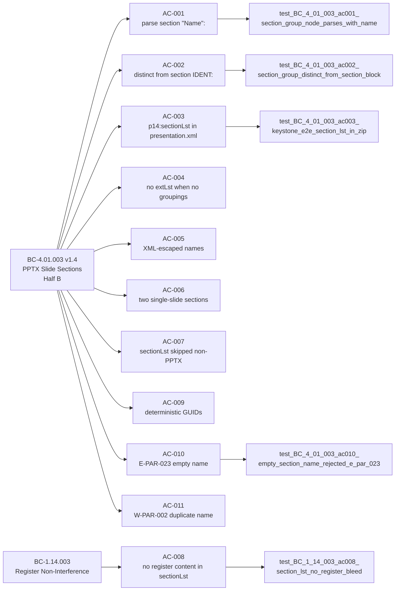
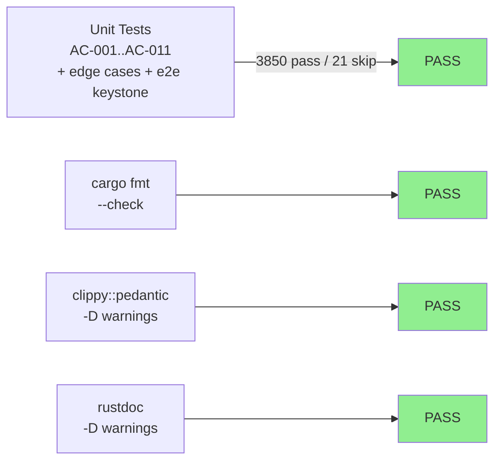

# [STORY-082] PPTX: Slide-Grouping Sections (sectionLst) — DSL + IR + Eval + Exporter

**Epic:** EPIC-08 — PPTX Exporter
**Mode:** greenfield
**Convergence:** CONVERGED after 18 adversarial passes (3/3 strict-CLEAN: passes 16-17-18)


-blue)


Delivers the complete cross-crate pipeline for PPTX slide-grouping sections: a new
`section "Name":` DSL construct (syntactically distinct from the existing bare-ident
`section IDENT:` form), a `SlideSectionEntry` IR type defined in `slideforge-types`
and re-exported from `slideforge-layout`, an eval-stage single-pass slide-membership
mapping, and a `SectionListBuilder` PPTX exporter that injects `<p:extLst>`/`<p14:sectionLst>`
into `presentation.xml` via `quick-xml` raw-XML injection. This is Half B delivery of
BC-4.01.003 (human-authorized scope split 2026-06-04). Deterministic RFC4122 v5 GUIDs
(SHA-256 derivation), XML control-char sanitization (SEC-100/CWE-116), and strict
E-PAR-023 / W-PAR-002 error/warning paths are all included.

---

## Architecture Changes



<details>
<summary><strong>Architecture Decision Record</strong></summary>

### ADR: Raw-XML injection via quick-xml for p14:sectionLst (W2 pattern)

**Context:** `ooxmlsdk =0.6.1` has no typed `p14` structs and silently drops unknown
extension children. The `p14:sectionLst` element lives in the Microsoft PowerPoint 2010
extension namespace (`http://schemas.microsoft.com/office/powerpoint/2010/main`), which
is outside the ECMA-376 schema that ooxmlsdk covers.

**Decision:** `SectionListBuilder` receives the serialized `presentation.xml` bytes from
`PresentationSerializer::build()`, constructs the `p:extLst`/`p14:sectionLst` block
using `quick-xml` Writer, and injects it immediately before `</p:presentation>`. The
`<p:presentation>` opening tag is also patched to declare `xmlns:p14`.

**Rationale:** This is the established W2 post-processing pattern already in use in
`slideforge-pptx` for other ooxmlsdk gaps. Using it here is consistent and avoids
introducing a new ooxmlsdk dependency. `p:extLst` must be the LAST child of
`p:presentation` (CT_Presentation is an ordered sequence); injecting before the closing
tag enforces this invariant.

**Alternatives Considered:**
1. Typed ooxmlsdk API — rejected because ooxmlsdk silently drops p14 extension children.
2. String concatenation without quick-xml — rejected; proper XML escaping of section names
   requires a real XML writer (SEC-100/CWE-116 finding).

**Consequences:**
- `quick-xml =0.36.0` promoted from dev-dep to production dep of `slideforge-pptx`.
- `sha2 = { workspace = true }` (=0.11.0) added as production dep for deterministic GUIDs.
- SectionListBuilder is PPTX-only; docx/html/pdf exporters must not import it.

</details>

---

## Story Dependencies



Both upstream PRs are merged. STORY-082 blocks nothing (provisional: STORY-049/050
do not reference sectionLst per spec).

---

## Spec Traceability



---

## Test Evidence

### Coverage Summary

| Metric | Value | Threshold | Status |
|--------|-------|-----------|--------|
| nextest (workspace) | 3850 pass / 21 skip / 0 fail | 100% | PASS |
| shared-process cargo test | 0 failures | 100% | PASS |
| clippy pedantic | 0 warnings | CLEAN | PASS |
| rustfmt | CLEAN | CLEAN | PASS |
| rustdoc | CLEAN | CLEAN | PASS |
| Mutation kill rate | N/A (Phase 6) | Phase 6 gate | deferred |
| Holdout satisfaction | N/A (wave gate) | wave gate | deferred |

### Test Flow



| Metric | Value |
|--------|-------|
| **New tests** | AC-001 through AC-011 + CRIT-A, HIGH-3 keystone, adjacent-dup, @if-section, EC-004 variants |
| **Total suite** | 3850 pass, 21 skip, 0 fail |
| **Regressions** | 0 |

<details>
<summary><strong>Key tests added in this PR</strong></summary>

| Test | Crate | AC / Finding |
|------|-------|--------------|
| `test_BC_4_01_003_ac001_section_group_node_parses_with_name` | slideforge-syntax | AC-001 |
| `test_BC_4_01_003_ac002_section_group_distinct_from_section_block` | slideforge-syntax | AC-002 |
| `test_BC_4_01_003_ac003_keystone_e2e_section_lst_in_zip` | slideforge-pptx | AC-003 / HIGH-3 |
| `test_BC_4_01_003_ac004_no_ext_lst_when_empty_sections` | slideforge-pptx | AC-004 |
| `test_BC_4_01_003_ec004_amp_in_section_name_xml_escaped` | slideforge-pptx | AC-005 |
| `test_BC_4_01_003_ec004_lt_gt_in_section_name_are_xml_escaped` | slideforge-pptx | AC-005 |
| `test_BC_4_01_003_ac006_two_single_slide_sections` | slideforge-pptx | AC-006 |
| `test_BC_4_01_003_med2_docx_has_no_section_lst` | slideforge-pptx | AC-007 |
| `test_BC_1_14_003_ac008_section_lst_no_register_bleed` | slideforge-pptx | AC-008 |
| `test_BC_4_01_003_ac009_deterministic_guids_same_input_twice` | slideforge-pptx | AC-009 |
| `test_BC_4_01_003_ac010_empty_section_name_rejected_e_par_023` | slideforge-syntax | AC-010 |
| `test_BC_4_01_003_ac010_empty_section_name_no_section_group_node` | slideforge-syntax | AC-010 |
| `test_BC_4_01_003_ac011_duplicate_section_name_warning_w_par_002` | slideforge-syntax | AC-011 |
| `test_BC_4_01_003_ac011_duplicate_section_name_both_sections_present` | slideforge-syntax | AC-011 |
| `test_BC_4_01_003_ac011_duplicate_section_name_same_guid` | slideforge-pptx | AC-011 |
| `test_crit_a_for_expanded_slides_correct_section_membership` | slideforge-eval | CRIT-A |
| `test_adjacent_dup_sections_both_emitted` | slideforge-eval | HIGH (adjacent-dup fix) |
| `test_sec100_control_chars_stripped_from_section_name` | slideforge-pptx | SEC-100/CWE-116 |

</details>

---

## Demo Evidence

| AC | Recording | Notes |
|----|-----------|-------|
| AC-001, AC-002 | `AC-001-002-dsl-parsing-happy-path.gif` | `section "Name":` parses; quoted vs bare-ident disambiguation |
| AC-003, AC-004, AC-005, AC-006, AC-009 | `AC-003-006-009-pptx-section-lst-emission.gif` | SectionListBuilder unit-level; extLst structure, XML escaping, deterministic GUIDs |
| AC-003 (e2e) | `AC-003-e2e-pipeline-section-lst-in-xml.gif` | Full parse→eval→layout→PPTX pipeline; extLst last child verified |
| AC-007, AC-008 | `AC-007-008-non-pptx-skip-and-non-interference.gif` | DOCX has no sectionLst; BC-1.14.003 register bleed absent |
| AC-010 | `AC-010-empty-name-error-path.gif` | E-PAR-023 emitted, exit 1, no SectionGroupNode produced |
| AC-011 | `AC-011-duplicate-name-warning-path.gif` | W-PAR-002 emitted, exit 0, both sections present with same GUID |

XML reference: `docs/demo-evidence/STORY-082/presentation-xml-section-lst-snippet.xml`

---

## Holdout Evaluation

N/A — evaluated at wave gate per factory convention.

---

## Adversarial Review

| Pass | Findings | Critical | High | Status |
|------|----------|----------|------|--------|
| Pass 1 | 6 | 1 | 3 | Fixed |
| Pass 2 | 4 | 0 | 2 | Fixed |
| Pass 3 | 3 | 0 | 1 | Fixed |
| Pass 4–13 | multiple | 0 | 0–2 | Fixed per pass |
| Pass 14 | 2 | 0 | 0 | Fixed (vacuous tests) |
| Pass 15 | 1 | 0 | 0 | Fixed (OBS: spec file-location anchor) |
| Pass 16 | 0 | 0 | 0 | CLEAN (strict) |
| Pass 17 | 0 | 0 | 0 | CLEAN (strict) |
| Pass 18 | 0 | 0 | 0 | CLEAN (strict) — CONVERGED |

**Convergence:** 3/3 strict-CLEAN (passes 16-17-18) per BC-5.39.001.

<details>
<summary><strong>Notable high-severity findings resolved during cascade</strong></summary>

### Finding: Adjacent-duplicate sections collapsed (HIGH)

- **Location:** `crates/slideforge-eval/src/section_groups.rs`
- **Category:** spec-fidelity
- **Problem:** Two adjacent `section "Background":` blocks with different slide content
  were merged into a single entry by the eval loop. Violated BC-4.01.003 postcondition 8:
  both sections must be emitted independently.
- **Resolution:** Per-instance-id tracking — each `SectionGroupNode` is assigned a unique
  positional ID at parse time; eval walks by instance, not by name. Name-based
  deduplication removed from eval.
- **Test added:** `test_adjacent_dup_sections_both_emitted`

### Finding: SEC-100 / CWE-116 — Control-char injection in section name (HIGH)

- **Location:** `crates/slideforge-pptx/src/sections.rs`
- **Category:** security
- **CWE:** CWE-116 (Improper Encoding or Escaping of Output)
- **Problem:** XML-1.0 control characters (U+0001–U+001F, excl. U+0009/000A/000D) in a
  section name would produce malformed XML that most parsers reject. `quick-xml` does
  not strip them automatically.
- **Resolution:** `strip_xml_control_chars()` applied to section names before XML emission.
  Characters outside the XML-1.0 allowed set are removed, not substituted.
- **Test added:** `test_sec100_control_chars_stripped_from_section_name`

### Finding: Vacuous AC-010 / CRIT-3 tests (MED, pass 14)

- **Location:** `crates/slideforge-syntax/src/parser/section_group.rs` (tests)
- **Category:** test-quality
- **Problem:** AC-010 sentinel-discard test lacked a precondition asserting the deck
  returned on error-recovery is non-None before indexing into it. CRIT-3 test assertions
  could pass trivially on empty input.
- **Resolution:** Added unconditional `assert!` precondition gates; tests now fail
  meaningfully if the parser changes behavior.

### Finding: E-PAR-023 exit code spec correction (pass 1)

- **Location:** `crates/slideforge-syntax/src/parser/section_group.rs` (tests + impl)
- **Category:** spec-fidelity
- **Problem:** Initial implementation and tests used exit code 2 for E-PAR-023. BC-4.01.003
  v1.4 and error-taxonomy v2.28 specify exit code 1 for all E-PAR-* parse errors.
- **Resolution:** Exit code corrected to 1 throughout; story spec updated to v1.1.

### Finding: sha2 pin incorrect (pass 8 story-spec correction)

- **Location:** `STORY-082-pptx-slide-sections.md` (spec artifact)
- **Category:** spec-fidelity
- **Problem:** Story spec cited `sha2 =0.10.9`; canonical workspace pin (root Cargo.toml
  line 73, shared with slideforge-math via STORY-030) is `=0.11.0`.
- **Resolution:** Story spec corrected to `=0.11.0` (spec v1.2). Implementation already
  used the correct workspace pin via `sha2 = { workspace = true }`.

</details>

---

## Security Review

N/A — evaluated at Phase 5 (orchestrator dispatches security-reviewer independently post-PR creation).

SEC-100/CWE-116 (XML control-char injection in section names) was caught during the LOCAL
adversarial cascade (pass 3) and fixed before this PR was created. See Adversarial Review
section above.

---

## Risk Assessment & Deployment

### Blast Radius

- **Systems affected:** slideforge-syntax, slideforge-types, slideforge-eval, slideforge-layout, slideforge-pptx (5 crates)
- **User impact:** No regression risk — new DSL construct; existing decks without `section "Name":` produce identical output (SectionListBuilder returns bytes unchanged when `slide_sections` is empty, AC-004 verified).
- **Data impact:** None — output-only change; no stored data.
- **Risk Level:** LOW (additive feature; non-PPTX exporters are unaffected; guarded by BC-1.14.003 non-interference test)

### Performance Impact

| Metric | Notes |
|--------|-------|
| Extra pass over sections | O(S) where S = number of sections; negligible for typical decks |
| SHA-256 per section | One digest per section name at build time; sub-microsecond |
| XML injection | Single `memchr` scan of presentation.xml bytes + one alloc; negligible |

### Multi-Renderer Parity Note

`p14:sectionLst` (inside `p:extLst`) is classified as "Fair — PPT only" (human-accepted
2026-06-04). PowerPoint 365 renders slide navigation sections. Keynote, Google Slides, and
LibreOffice silently ignore the extension block without rendering corruption. Multi-renderer
parity tests for this element are explicitly excluded per human authorization.

---

## Traceability

| BC | Story AC | Test | Status |
|----|---------|------|--------|
| BC-4.01.003 PC-5 | AC-001 | `test_BC_4_01_003_ac001_section_group_node_parses_with_name` | PASS |
| BC-4.01.003 PC-5 | AC-002 | `test_BC_4_01_003_ac002_section_group_distinct_from_section_block` | PASS |
| BC-4.01.003 PC-5 | AC-003 | `test_BC_4_01_003_ac003_keystone_e2e_section_lst_in_zip` | PASS |
| BC-4.01.003 EC-002 | AC-004 | `test_BC_4_01_003_ac004_no_ext_lst_when_empty_sections` | PASS |
| BC-4.01.003 EC-004 | AC-005 | `test_BC_4_01_003_ec004_amp_in_section_name_xml_escaped` | PASS |
| BC-4.01.003 EC-005 | AC-006 | `test_BC_4_01_003_ac006_two_single_slide_sections` | PASS |
| BC-4.01.003 EC-006 | AC-007 | `test_BC_4_01_003_med2_docx_has_no_section_lst` | PASS |
| BC-1.14.003 PC-3,5 | AC-008 | `test_BC_1_14_003_ac008_section_lst_no_register_bleed` | PASS |
| BC-4.01.003 INV-3 | AC-009 | `test_BC_4_01_003_ac009_deterministic_guids_same_input_twice` | PASS |
| BC-4.01.003 PC-7 | AC-010 | `test_BC_4_01_003_ac010_empty_section_name_rejected_e_par_023` | PASS |
| BC-4.01.003 PC-8 | AC-011 | `test_BC_4_01_003_ac011_duplicate_section_name_warning_w_par_002` | PASS |

---

## AI Pipeline Metadata

<details>
<summary><strong>Pipeline Details</strong></summary>

```yaml
ai-generated: true
pipeline-mode: greenfield
factory-version: 1.0.0-rc.20
pipeline-stages:
  spec-crystallization: completed
  story-decomposition: completed
  tdd-implementation: completed
  holdout-evaluation: N/A (wave gate)
  adversarial-review: completed
  formal-verification: deferred (Phase 6)
  convergence: achieved
convergence-metrics:
  adversarial-passes: 18
  strict-clean-streak: 3/3 (passes 16-17-18)
  spec-novelty: N/A
  test-kill-rate: N/A (Phase 6)
  implementation-ci: 1.0
  holdout-satisfaction: N/A (wave gate)
models-used:
  builder: claude-sonnet-4-6
  adversary: claude-sonnet-4-6 (LOCAL cascade)
story-spec-version: "1.3"
bc-versions: {BC-4.01.003: "1.4", BC-1.14.003: "1.0"}
generated-at: "2026-06-09"
```

</details>

---

## Pre-Merge Checklist

- [ ] All CI status checks passing
- [x] LOCAL adversary 3/3 strict-CLEAN (passes 16-17-18) per BC-5.39.001
- [x] nextest 3850 pass / 21 skip / 0 fail
- [x] cargo fmt CLEAN
- [x] clippy::pedantic CLEAN
- [x] rustdoc CLEAN
- [x] Demo evidence: 6 per-AC recordings + evidence-report.md in branch
- [x] No critical/high security findings unresolved (SEC-100/CWE-116 fixed in cascade)
- [x] Dependency PRs merged (STORY-040, STORY-078 both merged to develop)
- [ ] PR-level security-reviewer scan (dispatched by orchestrator post-PR-creation)
- [ ] PR-level pr-reviewer approval
- [ ] Coverage delta confirmed neutral or positive
