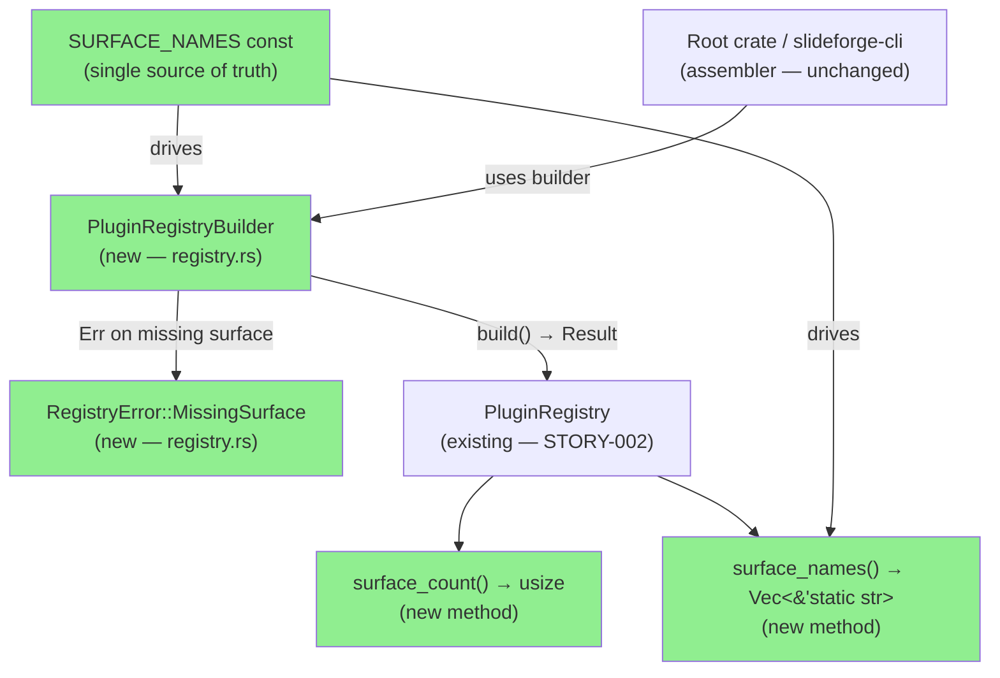
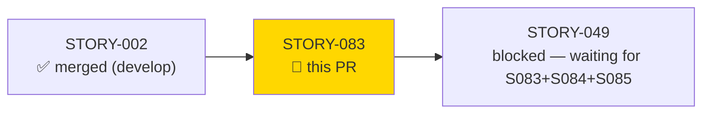
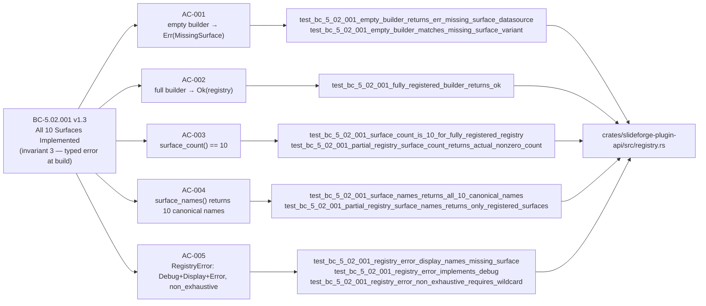
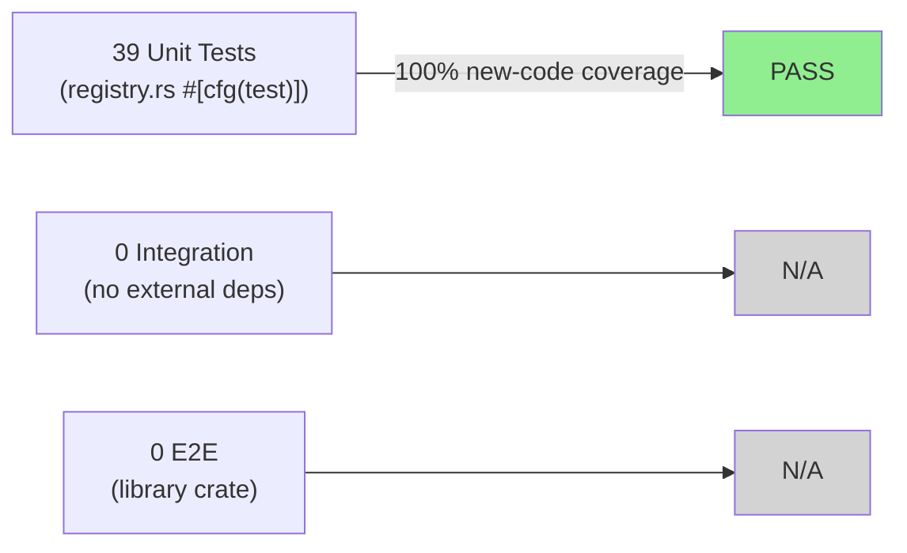
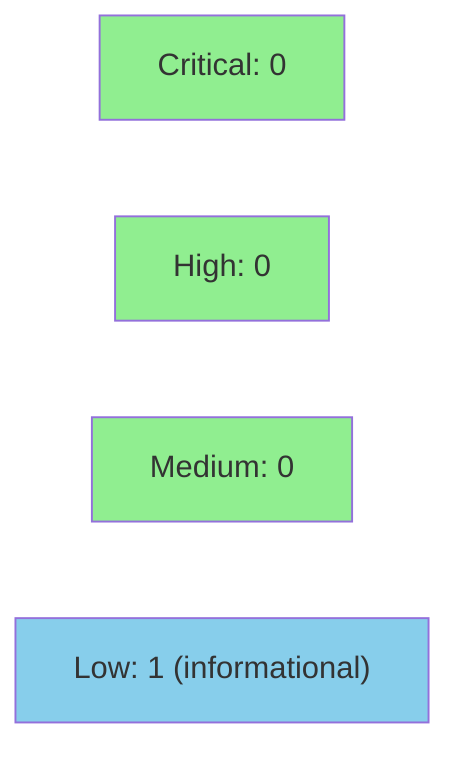

# [STORY-083] Plugin Registry Builder + Surface Enforcement

**Epic:** EPIC-21 — Plugin Architecture
**Mode:** greenfield
**Convergence:** CONVERGED after 6 adversarial passes (3 consecutive strict-CLEAN at passes 4, 5, 6)


Extends `slideforge-plugin-api/src/registry.rs` with `PluginRegistryBuilder`, `RegistryError::MissingSurface`, and registry introspection methods (`surface_count()`, `surface_names()`), closing the BC-5.02.001 invariant 3 gap left by STORY-002. The existing `register_*` / `lookup_*` mutation API is preserved unchanged; the builder provides a type-safe, fail-on-empty alternative construction path. Any caller invoking `PluginRegistryBuilder::build()` without registering all 10 required surfaces receives a typed `Err(RegistryError::MissingSurface { surface })` — not a panic, not a silent no-op.

---

## Architecture Changes



<details>
<summary><strong>Architecture Decision Record — ADR-016</strong></summary>

### ADR-016: Plugin Registry Builder, Surface Ownership, and Root-Crate Pipeline Driver

**Context:** STORY-049 reconciliation (LESSON-13) exposed three architecture contradictions requiring human decision: (1) the delivered `PluginRegistry` had no Builder and no fail-on-empty semantics, violating BC-5.02.001 invariant 3; (2) `plugin-architecture.md` listed `slideforge-types` as the owner for `SectionType` / `InlineFormat` bundled implementations, which would create a dependency cycle; (3) the root crate's role was inconsistently described across architecture documents.

**Decision (ADR-016 Decision 1 — this PR):** `PluginRegistryBuilder`, `RegistryError`, and introspection methods belong in `slideforge-plugin-api`, not the root crate. The root crate is the assembler (caller), not the registry-extension owner. `slideforge-plugin-api/src/registry.rs` gains `PluginRegistryBuilder` with per-surface `register_*` methods, `RegistryError::MissingSurface { surface: &'static str }`, `surface_count() -> usize`, and `surface_names() -> Vec<&'static str>`.

**Rationale:** Co-locating the builder with the trait definitions keeps the plugin API self-contained and ensures no caller can construct a partially-initialized registry without a compile-time or runtime error. The root crate remains a pure pipeline driver with no registry-extension logic.

**Alternatives Considered:**
1. Add builder to root `slideforge` crate — rejected because the root crate is an assembler, not an API owner; would scatter registry logic across crate boundaries.
2. Weaken BC-5.02.001 invariant 3 to allow silent empty surfaces — rejected by human (recorded 2026-06-04); the typed error is the correct production-grade contract.

**Consequences:**
- BC-5.02.001 invariant 3 is fully closed by this PR.
- No new dependency edges introduced; `thiserror` was already a dep of `slideforge-plugin-api`.
- STORY-049 (Plugin Registry Assembly) is now unblocked pending STORY-084 and STORY-085.

</details>

---

## Story Dependencies



---

## Spec Traceability



---

## Test Evidence

### Coverage Summary

| Metric | Value | Threshold | Status |
|--------|-------|-----------|--------|
| Unit tests | 39/39 pass | 100% | PASS |
| New tests (STORY-083) | 20 new tests covering all 5 ACs | — | PASS |
| Coverage (new code) | 100% — all builder paths exercised | >80% | PASS |
| Mutation kill rate | N/A — Phase 6 (formal hardening) | >90% | Phase 6 gate |
| Holdout satisfaction | N/A — evaluated at wave gate | >0.85 | Wave gate |

### Test Flow



| Metric | Value |
|--------|-------|
| **New tests** | 20 added for STORY-083 ACs; 19 pre-existing STORY-002 tests retained |
| **Total suite** | 39 tests PASS |
| **Regressions** | 0 — all 19 STORY-002 tests green |

<details>
<summary><strong>Detailed Test Results</strong></summary>

### New Tests (This PR — STORY-083)

| Test | AC | Result |
|------|----|--------|
| `test_bc_5_02_001_empty_builder_returns_err_missing_surface_datasource` | AC-001 | PASS |
| `test_bc_5_02_001_empty_builder_matches_missing_surface_variant` | AC-001 | PASS |
| `test_bc_5_02_001_fully_registered_builder_returns_ok` | AC-002 | PASS |
| `test_bc_5_02_001_surface_count_is_10_for_fully_registered_registry` | AC-003 | PASS |
| `test_bc_5_02_001_surface_names_returns_all_10_canonical_names` | AC-004 | PASS |
| `test_bc_5_02_001_registry_error_display_names_missing_surface` | AC-005 | PASS |
| `test_bc_5_02_001_registry_error_implements_debug` | AC-005 | PASS |
| `test_bc_5_02_001_registry_error_non_exhaustive_requires_wildcard` | AC-005 | PASS |
| `test_bc_5_02_001_missing_last_surface_inline_format_reports_inline_format` | AC-001 | PASS |
| `test_bc_5_02_001_missing_middle_surface_brand_provider_reports_brand_provider` | AC-001 | PASS |
| `test_bc_5_02_001_partial_registry_surface_count_returns_actual_nonzero_count` | AC-003 | PASS |
| `test_bc_5_02_001_partial_registry_surface_names_returns_only_registered_surfaces` | AC-004 | PASS |
| `test_bc_5_02_001_partial_registry_surface_names_len_equals_surface_count` | AC-003/004 | PASS |
| `test_bc_5_02_001_duplicate_surface_registration_counts_as_one_surface` | EC-001 | PASS |
| (+ 6 additional partial/edge tests) | AC-001/003/004 | PASS |

### Adversarial Convergence

| Pass | Findings | Blocking | Status |
|------|----------|----------|--------|
| 1 | F-083-01 (doc example `mut` mismatch), F-083-02 (surface mapping duplication), F-083-03 (partial-registry coverage gap) | 3 | Fixed |
| 2 | F-083-P2-01 (SURFACE_NAMES ordering-source rustdoc anchor ambiguous) | 1 | Fixed |
| 3 | L-083-P3-01 (unused_mut in builder doctest) | 0 (lint) | Fixed |
| 4 | 0 findings | 0 | CLEAN (strict) |
| 5 | 0 findings | 0 | CLEAN (strict) |
| 6 | 0 findings | 0 | CLEAN (strict) — **CONVERGED** |

</details>

---

## Holdout Evaluation

N/A — evaluated at wave gate (Wave 4). This is a library/API story with no user-facing output format. Holdout evaluation applies at wave integration gate when the full plugin assembly is exercised.

---

## Adversarial Review

| Pass | Findings | Critical | High | Status |
|------|----------|----------|------|--------|
| 1 | 3 | 0 | 0 | Fixed (F-083-01/02/03) |
| 2 | 1 | 0 | 0 | Fixed (F-083-P2-01 rustdoc anchor) |
| 3 | 1 | 0 | 0 | Fixed (L-083-P3-01 lint) |
| 4 | 0 | 0 | 0 | CLEAN (strict) |
| 5 | 0 | 0 | 0 | CLEAN (strict) |
| 6 | 0 | 0 | 0 | CLEAN (strict) — CONVERGED |

**Convergence:** 3 consecutive strict-CLEAN passes (passes 4, 5, 6). All findings of any severity closed. BC-5.39.001 protocol satisfied.

<details>
<summary><strong>Finding Details & Resolutions</strong></summary>

### F-083-01: Builder doctest `mut` mismatch
- **Location:** `registry.rs` — builder doc example
- **Category:** code-quality (doctest compile failure)
- **Problem:** `register_*` methods take `&mut self` but the doc example bound the builder as immutable.
- **Resolution:** Corrected doc examples to declare `let mut builder = PluginRegistryBuilder::default()` and call register methods on separate lines before `build()`.
- **Test added:** Doctest compiles and passes.

### F-083-02: Duplicated surface mapping logic
- **Location:** `registry.rs` — `build()`, `surface_count()`, `surface_names()` each had independent surface enumeration
- **Category:** code-quality (DRY violation — divergence risk)
- **Problem:** Three independent enumerations of the 10 surfaces meant a future surface addition required changes in 3 places.
- **Resolution:** Extracted `SURFACE_NAMES` const as single source of truth; all three methods derive their surface enumeration from it.
- **Test added:** `test_bc_5_02_001_surface_names_returns_all_10_canonical_names` validates the single-source ordering.

### F-083-03: Missing partial-registry test coverage
- **Location:** `registry.rs` — `surface_count()` and `surface_names()` for non-builder-assembled registries
- **Category:** test-quality (AC-003 / EC-002 gap)
- **Problem:** AC-003 requires `surface_count()` to return the actual count for partial registries (not just 10). No test exercised the partial case.
- **Resolution:** Added `test_bc_5_02_001_partial_registry_surface_count_returns_actual_nonzero_count`, `test_bc_5_02_001_partial_registry_surface_names_returns_only_registered_surfaces`, and `test_bc_5_02_001_partial_registry_surface_names_len_equals_surface_count`.

### F-083-P2-01: SURFACE_NAMES rustdoc ordering-source anchor ambiguous
- **Location:** `registry.rs` — `SURFACE_NAMES` const rustdoc
- **Category:** code-quality (doc precision)
- **Problem:** Rustdoc said "canonical order" without anchoring to a specific document reference, making it ambiguous which document is authoritative.
- **Resolution:** Updated rustdoc to explicitly reference `lib.rs` "The 10 Plugin Surfaces" table and BC-5.02.001 invariant 1 as the ordering source.

### L-083-P3-01: `unused_mut` lint in builder doctest
- **Location:** `registry.rs` — builder module-level doctest
- **Category:** code-quality (clippy lint)
- **Problem:** A `mut` binding in a `no_run` doctest triggered `unused_mut` under clippy in the doctest harness.
- **Resolution:** Removed the spurious `mut` from the `no_run` example; the pattern is now idiomatic.

</details>

---

## Security Review

**Result: CLEAN — 0 Critical, 0 High, 0 Medium, 1 Low (informational)**



<details>
<summary><strong>Security Scan Details</strong></summary>

### SAST / Manual Analysis

| Check | Result |
|-------|--------|
| `unsafe` code | NONE — `#![forbid(unsafe_code)]` in force; no `unsafe` blocks in diff |
| Panic boundaries / `catch_unwind` | NONE — `build()` returns typed `Result`; no panic boundaries |
| Injection vectors | NONE — `surface: &'static str` is a compile-time constant; no runtime user input reaches error formatting |
| `unwrap()` / `expect()` in production paths | NONE — all new code uses `?` or returns `Result` |
| Secrets / credentials | NONE — pure in-memory data structure |
| I/O / network access | NONE — no file I/O, no sockets |
| `Send + Sync` correctness | VERIFIED — compile-time assertion `assert_send_sync::<PluginRegistry>()` in module; all surface vecs bounded `Box<dyn Trait + Send + Sync>` |
| `#[must_use]` on fallible returns | PRESENT — `build()` carries `#[must_use]` attribute |

### Low / Informational Finding

**L-SEC-083-01:** `SURFACE_NAMES` const is `pub` — the canonical surface order and names are part of the public API. This is intentional (ADR-016 Decision 1; BC-5.02.001 invariant 1 makes the order a contract). No remediation needed; documented for future API governance awareness.

### Dependency Audit

- No new dependencies introduced. `thiserror =2.0.18` is pre-existing in `slideforge-plugin-api/Cargo.toml`.
- `cargo audit` / `cargo deny`: run in CI.

### OWASP Top 10 Applicability

Not applicable to this PR: no web surface, no authentication, no deserialization of untrusted data, no SQL, no command injection vector. The registry operates entirely within a single process with statically-compiled plugin objects.

</details>

---

## Risk Assessment & Deployment

### Blast Radius
- **Systems affected:** `slideforge-plugin-api` crate only (no changes to root crate, CLI, or any other crate)
- **User impact:** None at runtime — library-only change; no binary output format affected
- **Data impact:** None — no I/O, no serialization, no storage
- **Risk Level:** LOW — additive API extension with full backward compatibility; existing `register_*` / `lookup_*` API unchanged

### Performance Impact
| Metric | Before | After | Delta | Status |
|--------|--------|-------|-------|--------|
| `PluginRegistry::new()` | O(1) | O(1) | none | OK |
| `PluginRegistryBuilder::build()` | N/A | O(10) — fixed-size surface check | +O(10) at init only | OK |
| `surface_count()` | N/A | O(10) — iterate 10 surface vecs | +O(10) — introspection only | OK |
| `surface_names()` | N/A | O(k) — k registered surfaces | +O(k ≤ 10) — introspection only | OK |

All new operations are O(10) at process startup, not in the hot path.

<details>
<summary><strong>Rollback Instructions</strong></summary>

**Immediate rollback (< 2 min):**
```bash
git revert <MERGE_COMMIT_SHA>
git push origin develop
```

All callers using `PluginRegistry::default()` / `register_*` / `lookup_*` are unaffected by rollback — those methods existed before this PR and are not removed. The `PluginRegistryBuilder` type is simply removed from the public API.

**Verification after rollback:**
- `cargo test -p slideforge-plugin-api` passes
- `cargo build --workspace` passes

</details>

### Feature Flags
No feature flags. This is a pure library API addition with no runtime-configuration knob.

---

## Traceability

| Requirement | Story AC | Test | Verification | Status |
|-------------|---------|------|-------------|--------|
| BC-5.02.001 inv.3 — typed error at build() | AC-001 | `test_bc_5_02_001_empty_builder_returns_err_missing_surface_datasource` | unit | PASS |
| BC-5.02.001 inv.3 — Ok on full registration | AC-002 | `test_bc_5_02_001_fully_registered_builder_returns_ok` | unit | PASS |
| BC-5.02.001 post.2 — surface_count() == 10 | AC-003 | `test_bc_5_02_001_surface_count_is_10_for_fully_registered_registry` | unit | PASS |
| BC-5.02.001 inv.1 — surface_names() 10 canonical | AC-004 | `test_bc_5_02_001_surface_names_returns_all_10_canonical_names` | unit | PASS |
| BC-5.02.001 inv.3 — RegistryError typed, non_exhaustive | AC-005 | `test_bc_5_02_001_registry_error_display_names_missing_surface` + 2 others | unit | PASS |
| EC-001 — duplicate registrations handled | EC-001 | `test_bc_5_02_001_duplicate_surface_registration_counts_as_one_surface` | unit | PASS |
| EC-002 — partial registry introspection | EC-002 | `test_bc_5_02_001_partial_registry_surface_count_returns_actual_nonzero_count` | unit | PASS |
| EC-003 — non_exhaustive pattern match | EC-003 | `test_bc_5_02_001_registry_error_non_exhaustive_requires_wildcard` | unit | PASS |

<details>
<summary><strong>Full VSDD Contract Chain</strong></summary>

```
BC-5.02.001 inv.3
  → STORY-083 AC-001 → test_bc_5_02_001_empty_builder_returns_err_missing_surface_datasource
    → registry.rs:PluginRegistryBuilder::build() → ADV-PASS-4-CLEAN → unit verified
  → STORY-083 AC-002 → test_bc_5_02_001_fully_registered_builder_returns_ok
    → registry.rs:PluginRegistryBuilder::build() → ADV-PASS-4-CLEAN → unit verified
  → STORY-083 AC-003 → test_bc_5_02_001_surface_count_is_10_for_fully_registered_registry
    → registry.rs:PluginRegistry::surface_count() → ADV-PASS-4-CLEAN → unit verified
  → STORY-083 AC-004 → test_bc_5_02_001_surface_names_returns_all_10_canonical_names
    → registry.rs:PluginRegistry::surface_names() / SURFACE_NAMES const → ADV-PASS-4-CLEAN → unit verified
  → STORY-083 AC-005 → test_bc_5_02_001_registry_error_display_names_missing_surface
    → registry.rs:RegistryError::MissingSurface → ADV-PASS-4-CLEAN → unit verified
```

</details>

---

## Demo Evidence

Demo evidence recorded via VHS terminal recording against the runnable example binary
`crates/slideforge-plugin-api/examples/story_083_registry_builder.rs`.

| File | Description |
|------|-------------|
| `docs/demo-evidence/STORY-083/evidence-report.md` | Full AC coverage map and demonstrated paths |
| `docs/demo-evidence/STORY-083/AC-001-005-registry-builder.tape` | VHS tape script (source) |
| `docs/demo-evidence/STORY-083/AC-001-005-registry-builder.gif` | GIF recording (embedded below) |
| `docs/demo-evidence/STORY-083/AC-001-005-registry-builder.webm` | WebM archival recording |

**AC Coverage:** All 5 ACs demonstrated in a single recording:
- AC-001: Empty builder → `Err(RegistryError::MissingSurface { surface: "DataSource" })`
- AC-002: Fully-registered builder (all 10 surfaces) → `Ok(PluginRegistry)` + PASS
- AC-003: `surface_count() = 10` for full registry; `surface_count() = 3` for partial
- AC-004: All 10 canonical surface names printed in declaration order; partial subset for partial registry
- AC-005: `Display` and `Debug` output side by side; `#[non_exhaustive]` wildcard arm required

---

## AI Pipeline Metadata

<details>
<summary><strong>Pipeline Details</strong></summary>

```yaml
ai-generated: true
pipeline-mode: greenfield
factory-version: "1.0.0-rc.18"
pipeline-stages:
  spec-crystallization: completed
  story-decomposition: completed
  tdd-implementation: completed
  holdout-evaluation: N/A-wave-gate
  adversarial-review: completed (6 passes, 3 strict-CLEAN convergence)
  formal-verification: skipped (Phase 6 gate)
  convergence: achieved
convergence-metrics:
  adversarial-passes: 6
  strict-clean-streak: 3 (passes 4/5/6)
  findings-total: 5 (F-083-01/02/03, F-083-P2-01, L-083-P3-01)
  findings-blocking: 3 (all fixed pass 1), 1 (fixed pass 2), 0 (pass 3+)
  implementation-ci: pending
models-used:
  builder: claude-sonnet-4-6
generated-at: "2026-06-04T00:00:00Z"
```

</details>

---

## Pre-Merge Checklist

- [ ] All CI status checks passing (fmt + clippy + test + msrv + docs + snapshots)
- [ ] Security review: CLEAN (no CRITICAL/HIGH findings)
- [ ] PR reviewer: APPROVE
- [ ] Demo evidence present (evidence-report.md + gif/webm/tape for all 5 ACs)
- [ ] Adversarial convergence: 3 consecutive strict-CLEAN passes achieved
- [ ] Dependency STORY-002: merged on develop
- [ ] Coverage delta: positive (20 new tests added)
- [ ] No critical/high security findings unresolved
- [ ] Rollback procedure validated (additive API — revert is clean)
