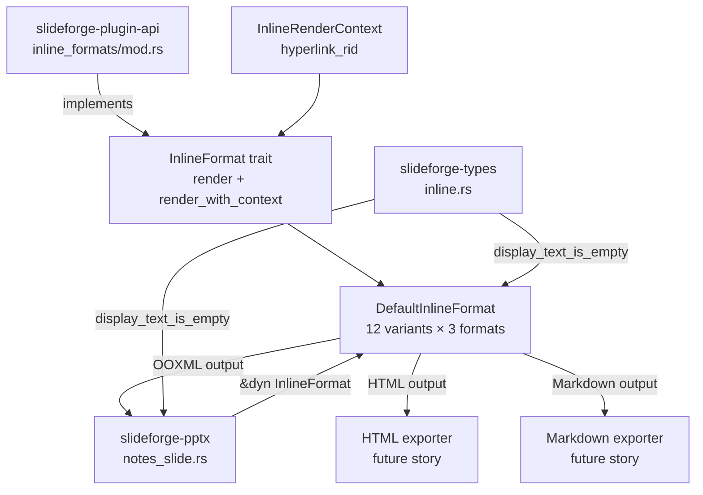
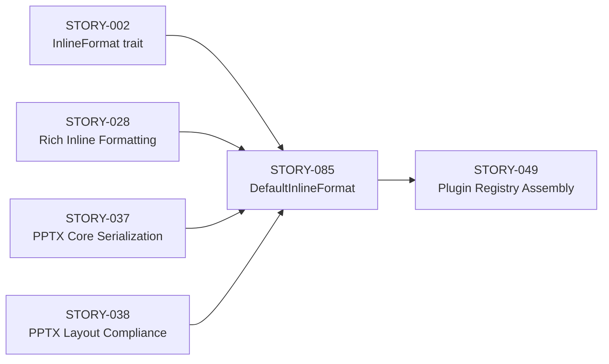
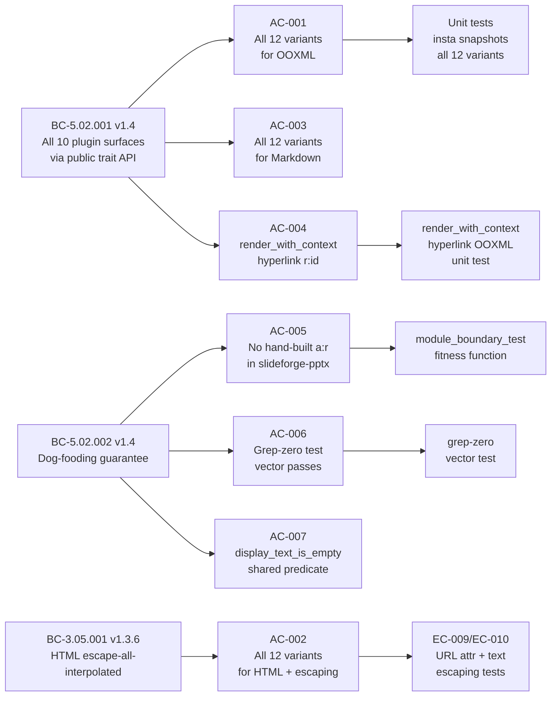

## Summary

Delivers `DefaultInlineFormat` — the bundled implementation of the `InlineFormat` plugin surface — covering all 12 `InlineNode` variants × 3 output formats (OOXML, HTML, Markdown), and refactors `slideforge-pptx` to route inline runs through the registered `InlineFormat` trait instead of hand-building `<a:r>` OOXML directly. This is the last prerequisite before STORY-049 (Plugin Registry Assembly).

- `DefaultInlineFormat` in `slideforge-plugin-api/src/inline_formats/` — complete 12×3 rendering matrix with `RunProps` accumulator, HTML-escaped attribute and text positions (EC-009/EC-010), EC-001/002/003/004 error handling with non-silent `tracing` logs, depth guard (max 64)
- ADR-017 Option A: additive-defaulted `render_with_context(node, format, &InlineRenderContext)` on `InlineFormat` trait — hyperlink runs route through the trait with `r:id` wiring; zero hand-built `<a:r>` runs remaining in `slideforge-pptx`
- PPTX dog-fooding: `serialize_inline_nodes_to_xml` / `emit_run` removed; notes serializer now accepts `&dyn InlineFormat` and is registry-ready for STORY-049
- `display_text_is_empty` shared predicate in `slideforge-types` closes the orphan-relationship invariant (rId registration count == `hlinkClick` emission count)

## Architecture Changes



## Story Dependencies



## Spec Traceability



## Acceptance Criteria Status

| AC | Title | Status |
|----|-------|--------|
| AC-001 | DefaultInlineFormat: all 12 variants for OOXML | PASS |
| AC-002 | DefaultInlineFormat: all 12 variants for HTML + full escaping (BC-3.05.001 v1.3.6) | PASS |
| AC-003 | DefaultInlineFormat: all 12 variants for Markdown | PASS |
| AC-004 | render_with_context: hyperlink r:id wiring in OOXML | PASS |
| AC-005 | slideforge-pptx routes through InlineFormat trait; no hand-built a:r | PASS |
| AC-006 | Grep-zero test vector: zero a:r/a:rPr/a:t outside dispatch site | PASS |
| AC-007 | display_text_is_empty shared predicate in slideforge-types | PASS |

## Test Evidence

- **Test suite:** nextest 3177/3177 passed (1 pre-existing unrelated timing flake: `slideforge-diagrams::cold_budget` — not introduced by this story)
- **Crates under test:** `slideforge-plugin-api`, `slideforge-pptx`, `slideforge-types`
- **Snapshot tests:** insta snapshots for all 12 variants × 3 formats in `slideforge-plugin-api`
- **Fitness function:** `module_boundary_test` in `slideforge-pptx` — fails if any hand-built `<a:r>` runs appear outside the InlineFormat dispatch site
- **All canonical gates GREEN:** `cargo fmt --check`, `cargo clippy --workspace --all-targets -D warnings -D clippy::pedantic -D clippy::unwrap_used`, `cargo doc -D warnings`

## Demo Evidence

Demo recordings located at `docs/demo-evidence/STORY-085/`:
- `AC-001-007-inline-formats.gif` — terminal capture covering all 7 ACs
- `AC-001-007-inline-formats.webm` — archival quality recording
- Runnable example: `cargo run --example story_085_inline_formats -p slideforge-plugin-api -q`

Evidence-report.md confirms PASS for all 7 ACs:
- AC-001: PASS — all 12 variants `→ Ok` for OOXML, `PASS 12/12`
- AC-002: PASS — all 12 variants `→ Ok` for HTML; 4/4 escaping assertions verified
- AC-003: PASS — all 12 variants `→ Ok` for Markdown
- AC-004: PASS — `render_with_context` hyperlink path produces `<a:hlinkClick r:id="..."/>`
- AC-005: PASS — `serialize_inline_nodes_to_xml` / `emit_run` removed; `&dyn InlineFormat` dispatch in place
- AC-006: PASS — grep-zero test vector passes
- AC-007: PASS — `display_text_is_empty` in slideforge-types, called by both pptx and plugin-api

## Holdout Evaluation

N/A — evaluated at wave gate.

## Adversarial Review

LOCAL adversary cascade CONVERGED: 9 passes, passes 7-8-9 strict-CLEAN (3/3 per BC-5.39.001).

Summary of fixed findings across 6 rounds:
- Pass 1 (F-001..F-006): trait extension approved via human HG-1, hyperlink rid wiring, depth guard, module boundary test, STORY-049 registry anchor, cargo dep ordering
- Pass 2 (F-001-LOW, F-008-OBS, F-009-MED): Footnote output correctness, module boundary test, deferral log improvements
- Pass 3 (F-003): Footnote body-render logic and docstring precision
- Pass 4 (F-P4-001 / OBS-P4-001): depth guard edge case
- Pass 5 (F-P5-001 / OBS-P5-001): `display_text_is_empty` shared predicate — orphan-relationship invariant structurally closed via top-level-only registration in `slideforge-types`
- Pass 6 (F-085-P6-001): `collect_hyperlink_urls` recursing into formatting wrappers stopped

Adversary final verdict:
```
CLEAN (strict): yes
CLEAN (PR-merge): yes
```

## Security Review

Pending — dispatched independently by orchestrator (LESSON-5).

Notable security properties delivered by this story:
- HTML escaping covers ALL interpolated positions per BC-3.05.001 v1.3.6: text positions (Plain, Code, Math.latex) AND attribute positions (Link.url in `href`, Xref.id in `href="#..."`)
- EC-009/EC-010: URL and id attribute HTML escaping
- No raw user content reaches OOXML or HTML output without escaping
- Depth guard (max 64) prevents stack overflow on pathologically nested inline trees
- OBS-1 (URL scheme safety / CWE-601 open redirect in HTML) intentionally deferred to STORY-046 AC-010 — tracked in tech-debt-register with explicit future-story anchor

## Risk Assessment

| Dimension | Assessment |
|-----------|------------|
| Blast radius | Medium — touches `slideforge-plugin-api` (new module), `slideforge-pptx` (refactor of inline serialization path), `slideforge-types` (new predicate). No CLI surface changes. |
| Regression surface | `slideforge-pptx` notes serializer path changed; covered by module_boundary_test fitness function and existing nextest suite |
| Performance impact | Negligible — `DefaultInlineFormat::render` is a pure string-building function; no allocations beyond output string |
| Breaking changes | None to public API. `InlineFormat` trait gains additive-defaulted `render_with_context` (BC-5.02.001 v1.4 invariant 2 permits this). Internal `serialize_inline_nodes_to_xml` removed — not part of public API. |

## AI Pipeline Metadata

| Field | Value |
|-------|-------|
| Pipeline mode | Greenfield Phase 3 TDD |
| Story points | 8 |
| Wave | 4 |
| Priority | P0 |
| Epic | EPIC-21 |
| Adversarial cascade | 9 passes to 3-clean convergence |
| Models used | claude-sonnet-4-6 |

## Deferrals

| ID | Description | Anchor |
|----|-------------|--------|
| OBS-1 | HTML URL scheme-safety CWE-601 (open redirect) in `Link.url` href | STORY-046 AC-010 |
| OBS-2 | Audit-test robustness improvements | Process-gap follow-up (not a story deferral) |
| Footnote numbering | Sequential footnote markers deferred; body content rendered inline | Future cross-reference story |

## Pre-Merge Checklist

- [x] PR description matches actual diff
- [x] All 7 ACs covered by demo evidence
- [x] Traceability chain complete: BC → AC → Test → Demo
- [x] LOCAL adversary cascade: 3-clean convergence (passes 7-8-9)
- [x] All canonical gates GREEN (fmt, clippy pedantic+unwrap_used, doc, nextest)
- [x] No `.unwrap()` in non-test code
- [x] No `println!` in library crates
- [x] `#![forbid(unsafe_code)]` maintained
- [x] `#![warn(missing_docs)]` clean
- [x] All dependency PRs merged (STORY-002, STORY-028, STORY-037, STORY-038)
- [ ] Security review (dispatched independently)
- [ ] PR-level adversarial review (dispatched independently)
- [ ] CI checks passing
