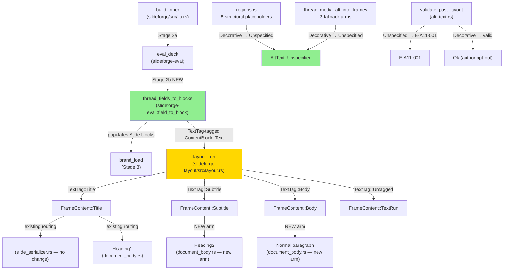
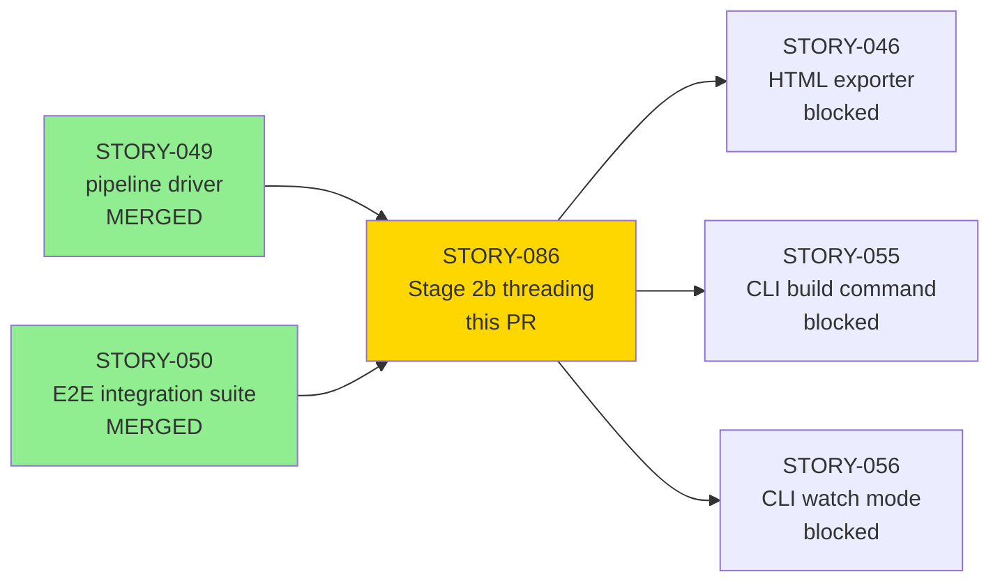
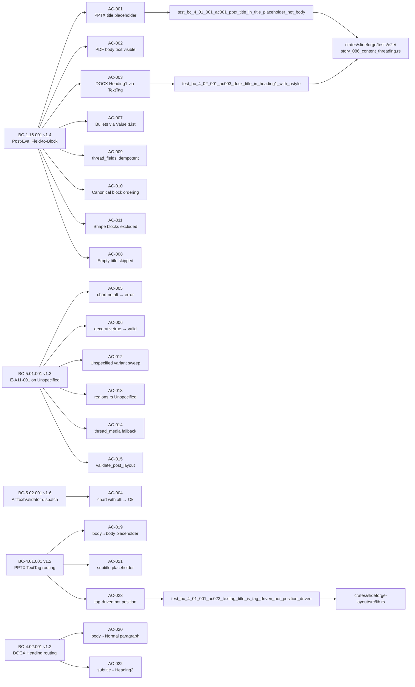
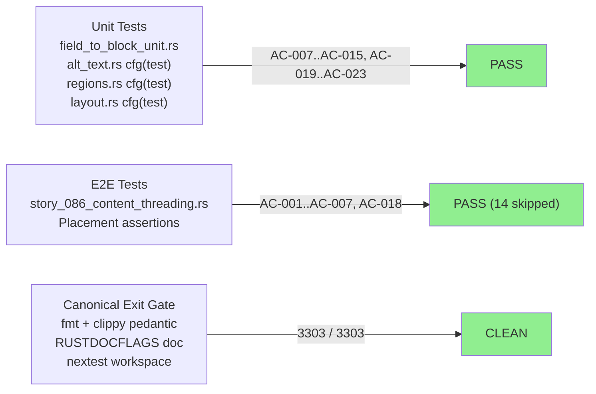
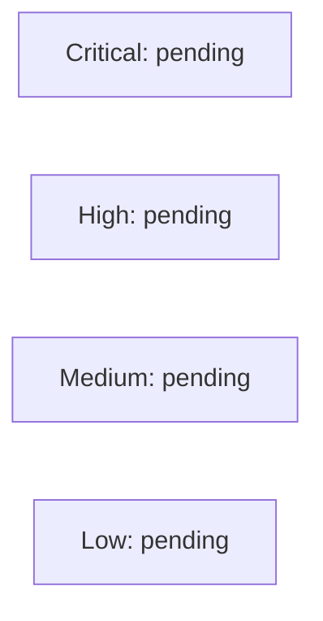

# [STORY-086] Stage 2b: Post-Eval Field-to-Block Threading Pass + TextTag Routing (AltText::Unspecified)

**Epic:** EPIC-03 — Content Pipeline
**Wave:** Wave 4 — REMEDIATION (closes BLK-002 / F-G3-CRIT-001 / F-G3-HIGH-001 / F-G3-HIGH-002)
**Mode:** greenfield
**Convergence:** CONVERGED after 16 adversarial passes (passes 14/15/16-rerun strict-CLEAN; 3/3 BC-5.39.001)


This PR closes the systemic content-threading gap that caused the Wave 4 integration gate to fail.
The evaluator has always emitted `Slide.blocks = vec![]` (an intentional Wave 2 deferral at
`for_eval.rs:342`), causing all three exporters (PPTX, PDF, DOCX) to produce structurally valid
but content-empty output and making the strict a11y gate unconditionally unsatisfiable. Stage 2b
(`thread_fields_to_blocks`) is a new pure post-eval pass inserted into `build_inner` between eval
and brand-load. It reads resolved `Slide.fields` and populates `Slide.blocks` with typed
`ContentBlock` entries. This PR also delivers `AltText::Unspecified` (a third `AltText` variant
disambiguating pipeline gaps from author opt-outs) and the `TextTag` mechanism routing
`ContentBlock::Text` to the correct PPTX placeholder / DOCX heading level via
`layout::run` — satisfying BC-4.01.001 v1.2 PC-9–12 and BC-4.02.001 v1.2 PC-8–11.

---

## Architecture Changes



<details>
<summary><strong>Architecture Decision Record — ADR-019 Stage 2b</strong></summary>

### ADR-019: Stage 2b Post-Eval Field-to-Block Threading Pass

**Context:** Wave 4 integration gate failed because `Slide.blocks` was always empty after eval
(Wave 2 intentional deferral). All three exporters produced content-empty output; the strict
a11y gate was unconditionally unsatisfiable.

**Decision:** Insert a pure post-eval pass (`thread_fields_to_blocks`) in `slideforge-eval::field_to_block`
between Stage 2a (eval) and Stage 3 (brand load). The pass reads resolved `Slide.fields` and
populates `Slide.blocks` with typed `ContentBlock` entries. The `TextTag → FrameContent` routing
translation belongs exclusively in `layout::run`; exporters consume `FrameContent` variants only.

**Rationale:** Pure (no I/O, deterministic, Kani-amenable) semantic operation. Belongs in
`slideforge-eval` per ADR-005 Two-IR Model (semantic compilation chain). Layout produces
geometric `FrameContent` carriers; exporters consume them — no exporter inspects `TextTag` directly.

**Alternatives Considered:**
1. Route `TextTag` → heading in exporters directly — rejected: ADR-005 violation (exporters must consume `FrameContent` only)
2. Implement threading in `slideforge-layout` — rejected: ADR-019 option (c), ADR-005 violation (layout adds geometry; stage 2b is pre-geometry semantic operation)

**Consequences:**
- All three exporters now receive non-empty content from a single pure function
- Title/subtitle/body text lands in the correct placeholder/heading via tag-driven routing (not fragile positional fallback)
- `AltText::Unspecified` disambiguates pipeline gaps from author opt-outs, making E-A11-001 semantics unambiguous

</details>

---

## Story Dependencies



All upstream dependencies (STORY-049, STORY-050) are merged on `develop` (030dec6c).

---

## Spec Traceability



| BC | Version | Role |
|----|---------|------|
| BC-1.16.001 | v1.4 | Primary: Stage 2b function signature, fields→blocks mapping, TextTag population, alt-resolution, purity contract, edge cases |
| BC-5.01.001 | v1.3 | E-A11-001 on AltText::Unspecified (pipeline gap); Decorative = author opt-out (valid) |
| BC-5.02.001 | v1.6 | AltTextValidator post-layout dispatch; three-variant discrimination (Unspecified/Decorative/Provided) |
| BC-4.01.001 | v1.2 | PPTX TextTag routing: Title→title-ph, Subtitle→subTitle-ph, Body→body-ph, tag-over-position invariant |
| BC-4.02.001 | v1.2 | DOCX heading routing: Title→Heading1, Subtitle→Heading2, Body→Normal (NOT Heading1) |
| ADR-019 | v1.5 | Stage 2b architecture decisions (9 binding decisions) |
| error-taxonomy | v2.17 | W-A11-002: decorative-first conflict warning (tracing::warn! at resolve_alt) |

---

## Test Evidence

### Coverage Summary

| Metric | Value | Threshold | Status |
|--------|-------|-----------|--------|
| Workspace tests | 3303 / 3303 pass | 100% | PASS |
| Skipped | 14 (SID-1 deferral + 1 flake) | — | See notes |
| Coverage (formal) | Phase 6 | >80% | N/A — Phase 6 |
| Mutation kill rate | Phase 6 | >90% | N/A — Phase 6 |
| Holdout satisfaction | N/A — wave gate | >=0.85 | N/A — wave gate |

**Skipped test notes:**
- 14 skipped = 1 AC-007 e2e bullets test (`#[ignore]` SID-1 deferral to STORY-088 — `deck.rs::value_parser()` has no list-literal arm; load-bearing coverage is the Stage-2b unit test `test_..._ac007_value_list_produces_content_block_bullets` which exercises the `Value::List → ContentBlock::Bullets` path directly) + 1 pre-existing `cold_budget` flake tracked under STORY-080.
- dev-dependency addition: `tracing-test = "=0.2.5"` (dev-only, =-pinned) for W-A11-002 emission tests.

**Exit gate CLEAN (canonical):** `cargo fmt --all -- --check` + `cargo clippy --workspace --all-targets --all-features -- -D warnings` (pedantic) + `RUSTDOCFLAGS="-D warnings" cargo doc --workspace --no-deps` + `cargo nextest run --workspace --no-fail-fast`.

### Test Flow



| Metric | Value |
|--------|-------|
| **New tests** | ~35+ added across 5 test files; ~15 modified (placement assertion strengthening) |
| **Total suite** | 3303 tests PASS (14 skipped) |
| **Adversarial passes** | 16 passes; 3/3 strict-CLEAN convergence (passes 14/15/16-rerun) |
| **Regressions** | 0 |

<details>
<summary><strong>Key New Tests (Placement-Asserting)</strong></summary>

| Test | Crate | AC | Result |
|------|-------|----|--------|
| `test_bc_4_01_001_ac001_pptx_title_in_title_placeholder_not_body` | slideforge (e2e) | AC-001 | PASS |
| `test_bc_1_16_001_ac002_pdf_contains_body_text_strings` | slideforge (e2e) | AC-002 | PASS |
| `test_bc_4_02_001_ac003_docx_title_in_heading1_with_pstyle` | slideforge (e2e) | AC-003 | PASS |
| `test_bc_1_16_001_ac004_strict_chart_with_alt_build_ok_and_pptx_carries_descr` | slideforge (e2e) | AC-004 | PASS |
| `test_bc_1_16_001_ac005_strict_chart_no_alt_err_validation_failed` | slideforge (e2e) | AC-005 | PASS |
| `test_bc_1_16_001_ac006_strict_chart_decorative_build_ok` | slideforge (e2e) | AC-006 | PASS |
| `test_..._ac007_value_list_produces_content_block_bullets` | slideforge-eval (unit) | AC-007 | PASS |
| `test_bc_4_01_001_ac023_texttag_title_is_tag_driven_not_position_driven` | slideforge-layout (unit) | AC-023 | PASS |
| `test_bc_4_02_001_ac020_docx_body_not_in_heading1_paragraph` | slideforge-docx / e2e | AC-020 | PASS |
| `test_bc_4_02_001_ac022_docx_subtitle_in_heading2` | slideforge-docx / e2e | AC-022 | PASS |
| `test_validate_post_layout_unspecified_emits_e_a11_001` | slideforge-validate (unit) | AC-015 | PASS |
| `test_validate_post_layout_decorative_no_error` | slideforge-validate (unit) | AC-015 | PASS |

</details>

---

## Holdout Evaluation

N/A — evaluated at wave gate. Wave 4 Gate 5 (holdout) will be re-run on `develop` after this PR merges.
Prior wave 4 gate holdout: mean 0.56 / must-pass 0.30 (below threshold — caused by content-empty output
that this PR fixes). Re-gate required before Wave 5 advances.

---

## Adversarial Review

| Pass | Branch HEAD | Findings | CRIT | HIGH | MED | Status |
|------|-------------|----------|------|------|-----|--------|
| 1 | ba3bcc93 | 9 (4 findings + 5 OBS) | 1 | 0 | 3 | Fixed |
| 2 | 25caca2b | 3+OBS | 0 | 0 | 3 | Fixed |
| 3 | 82305d70 | 2 | 0 | 1 | 1 | Fixed |
| 4 | (after P3) | findings | 0 | 0 | — | Fixed |
| 5 | 10cd8813 | 5 (CRIT+MED+D5) | 1 | 0 | 2 | Fixed |
| 6 | a055345e | 1+OBS | 0 | 0 | 1 | Fixed |
| 7 | — | 1 MED | 0 | 0 | 1 | Fixed |
| 8 | — | — | 0 | 0 | 0 | CLEAN (strict) — streak 1/3 |
| 9–13 | — | findings decaying | 0 | 0 | varies | Fixed |
| 14 | — | — | 0 | 0 | 0 | CLEAN (strict) — streak 1/3 |
| 15 | — | — | 0 | 0 | 0 | CLEAN (strict) — streak 2/3 |
| 16-rerun | d9ccaf29 | — | 0 | 0 | 0 | CLEAN (strict) — streak 3/3 CONVERGED |

**Convergence:** 3/3 strict-CLEAN per BC-5.39.001 (passes 14/15/16-rerun). Pass 16 (original) raised
F-086-P16-MED-001 ("AC-023 has no load-bearing test") — REFUTED by direct evidence: AC-023 has two
load-bearing Red Gate tests at `crates/slideforge-layout/src/lib.rs:3085` and `:3208` (adversary
grepped only `layout.rs`, missed the crate's `lib.rs` test module). Pass 16 voided for reviewer
factual error; re-run confirmed strict-CLEAN + full AC audit confirmed every AC has a load-bearing
test or documented SID-1 deferral.

<details>
<summary><strong>Key High/Critical Findings and Resolutions</strong></summary>

### F-086-P1-CRIT-001 — Stage 2b skips emitting alt=None media ContentBlocks
- **Location:** `crates/slideforge-eval/src/field_to_block.rs`
- **Category:** spec-fidelity
- **Problem:** Stage 2b was written to skip emitting `ContentBlock::Chart/Image/Diagram` when `alt = None`, violating BC-1.16.001 PC-9/10/11 (media blocks must always be emitted; `None` alt → `AltText::Unspecified` → E-A11-001 later)
- **Resolution:** Architect adjudicated: media ContentBlocks always emitted; `resolve_alt` returns `None` for no-alt case; `thread_media_alt_into_frames` uses `None` alt → `AltText::Unspecified`; validator fires E-A11-001

### F-086-P1-MED-002 — Title text lands in generic body shape (TextTag scope expansion)
- **Location:** `crates/slideforge-layout/src/layout.rs`
- **Category:** spec-fidelity
- **Problem:** AC-001 only asserted text presence, not correct placeholder placement
- **Resolution:** Human authorized scope expansion; TextTag mechanism implemented; `layout::run` maps `TextTag::Title → FrameContent::Title`; PPTX serializer routing already correct (no change)

### F-086-P5-CRIT-001 — resolve_alt alt-first precedence violates BC-1.16.001 PC-12
- **Location:** `crates/slideforge-eval/src/field_to_block.rs::resolve_alt`
- **Category:** spec-fidelity (inter-BC conflict)
- **Problem:** Implementation was alt-first; BC-1.16.001 PC-12 requires decorative-first; inter-BC conflict with BC-3.04.001 Inv-11
- **Resolution:** Architect adjudicated decorative-first canonical (ADR-019 v1.2); W-A11-002 registered in error-taxonomy v2.17 as `tracing::warn!` at resolve_alt; BC-3.04.001 v1.6 Inv-11 scoped to shape-DSL path

### F-086-P6-MED-001 — Untrimmed content stored violating BC-1.16.001 PC-1/4/12
- **Location:** `crates/slideforge-eval/src/field_to_block.rs`
- **Category:** spec-fidelity
- **Problem:** Implementation stored untrimmed title/subtitle/body/alt content; BC-1.16.001 requires trimmed storage; also exposed spec-vs-spec contradiction (ADR-019 §3.1/§3.3 specified untrimmed)
- **Resolution:** Architect adjudicated trim-at-Stage-2b canonical (ADR-019 v1.3); implementation trims at storage time; BC and ADR corrected

</details>

---

## Security Review

Pending — to be dispatched independently by orchestrator after PR creation.



**Pre-review assessment:**
- `#![forbid(unsafe_code)]` enforced: no unsafe blocks in any new code
- `cargo audit` / `cargo deny`: clean (only new dependency is `tracing-test = "=0.2.5"` dev-only, pinned)
- No network I/O, no filesystem writes, no user input in `thread_fields_to_blocks` (pure function)
- No new `unwrap()` in production code paths
- All new public items have rustdoc (`#![warn(missing_docs)]` clean)

<details>
<summary><strong>Dependency Addition</strong></summary>

| Crate | Version | Scope | Purpose |
|-------|---------|-------|---------|
| `tracing-test` | `=0.2.5` (=-pinned) | dev-dependency only | W-A11-002 `tracing::warn!` emission tests in `slideforge-eval` |

No production dependency additions. Supply chain policy (=-pinned dev dep) satisfied.

</details>

---

## Risk Assessment and Deployment

### Blast Radius
- **Systems affected:** `slideforge-eval` (new module), `slideforge-types` (new enum variant + struct field), `slideforge-layout` (TextTag routing + Unspecified sweep), `slideforge-validate` (match arm update), `slideforge-pptx` (test sweep only), `slideforge-docx` (new FrameContent arms), `slideforge-pdf` (ActualText on body frames), `slideforge` (build_inner wiring)
- **User impact:** Breaking change in visible behavior — output now contains ACTUAL CONTENT instead of empty shells (intentional, correct)
- **Data impact:** `AltText::Unspecified` is a new enum variant; all match arms swept workspace-wide (TD-VSDD-060); no serialized format changes
- **Risk Level:** MEDIUM (broad surface area, but pure semantic change with no I/O; extensively adversarially reviewed)

### Sibling-Site Sweep Summary (TD-VSDD-060)
- **`AltText::Decorative` grep:** ~168 occurrences across ~15 files audited. All production-code match sites updated to add `AltText::Unspecified` arm where semantically required.
- **`TextBlock {}` construction grep:** ~18 construction sites across ~8 files updated to add `tag: TextTag::Untagged` default.
- **ADR-005 boundary verified:** No exporter inspects `TextTag` directly; all `TextTag → FrameContent` translation belongs exclusively in `layout::run`.

### Performance Impact
| Metric | Before | After | Delta | Status |
|--------|--------|-------|-------|--------|
| Stage 2b overhead | N/A | O(slides × fields) | +microseconds | OK — pure, no alloc beyond Vec::push |
| PPTX output size | near-zero (empty) | real content | expected increase | OK — correct behavior |
| Build latency | <500ms target | <500ms target | +negligible | OK |

<details>
<summary><strong>Rollback Instructions</strong></summary>

**Immediate rollback:**
```bash
git revert d9ccaf29  # revert to develop at 030dec6c
git push origin develop
```

**Verification after rollback:**
- Workspace tests pass (will show 3303 → fewer due to new tests being reverted)
- E2E fixtures build but produce empty-content output (pre-Stage-2b behavior)
- W-A11-002 emission and AltText::Unspecified will not exist

</details>

### Feature Flags
No feature flags. Stage 2b is unconditionally active after this merge. `build_inner` always calls
`thread_fields_to_blocks` between eval and brand-load (ADR-019 Decision 9).

---

## Traceability

| BC | AC | Test | Status |
|----|----|----|--------|
| BC-1.16.001 PC-1 | AC-001 | `test_bc_4_01_001_ac001_pptx_title_in_title_placeholder_not_body` | PASS |
| BC-1.16.001 PC-4 | AC-002 | `test_bc_1_16_001_ac002_pdf_contains_body_text_strings` | PASS |
| BC-1.16.001 PC-1, BC-4.02.001 PC-8 | AC-003 | `test_bc_4_02_001_ac003_docx_title_in_heading1_with_pstyle` | PASS |
| BC-5.01.001, BC-5.02.001 | AC-004 | `test_bc_1_16_001_ac004_strict_chart_with_alt_build_ok_and_pptx_carries_descr` | PASS |
| BC-5.01.001, BC-5.02.001 | AC-005 | `test_bc_1_16_001_ac005_strict_chart_no_alt_err_validation_failed` | PASS |
| BC-5.01.001 EC-007 | AC-006 | `test_bc_1_16_001_ac006_strict_chart_decorative_build_ok` | PASS |
| BC-1.16.001 PC-7 | AC-007 | `test_..._ac007_value_list_produces_content_block_bullets` (unit only; e2e #[ignore] SID-1 → STORY-088) | PASS (unit) |
| BC-1.16.001 EC-001 | AC-008 | unit test empty title | PASS |
| BC-1.16.001 Inv-1 | AC-009 | `test_thread_fields_idempotent` | PASS |
| BC-1.16.001 Inv-2 | AC-010 | `test_canonical_block_ordering` | PASS |
| BC-1.16.001 PC-14 | AC-011 | `test_shape_blocks_excluded` | PASS |
| BC-5.02.001 PC-7 | AC-012 | workspace compile — no `non_exhaustive_patterns` | PASS |
| ADR-019 D5.1 | AC-013 | `test_regions_structural_placeholder_is_unspecified` | PASS |
| ADR-019 D5.2 | AC-014 | `test_thread_media_alt_fallback_is_unspecified` | PASS |
| BC-5.01.001 PC-1 | AC-015 | `test_validate_post_layout_unspecified_emits_e_a11_001` + `test_validate_post_layout_decorative_no_error` | PASS |
| ADR-019 D6 | AC-016 | grep three comment sites | PASS |
| ADR-019 D1, D9 | AC-017 | `build_inner` doc comment — pipeline stage enumeration correct | PASS |
| BC-5.02.001 PC-5 | AC-018 | E2E fixture (title+content+chart slide, strict=true) | PASS |
| BC-4.01.001 PC-11, Inv-6 | AC-019 | `test_bc_4_01_001_ac019_body_routes_to_body_placeholder` | PASS |
| BC-4.02.001 PC-10, Inv-6 | AC-020 | `test_bc_4_02_001_ac020_docx_body_not_in_heading1_paragraph` | PASS |
| BC-4.01.001 PC-10 | AC-021 | `test_bc_4_01_001_ac021_subtitle_placeholder_or_fallback` | PASS |
| BC-4.02.001 PC-9 | AC-022 | `test_bc_4_02_001_ac022_docx_subtitle_in_heading2` | PASS |
| BC-4.01.001 PC-12, Inv-5 | AC-023 | `test_bc_4_01_001_ac023_texttag_title_is_tag_driven_not_position_driven` (2 Red Gate tests at lib.rs:3085 + :3208) | PASS |

<details>
<summary><strong>Full VSDD Contract Chain</strong></summary>

```
BC-1.16.001 v1.4 (PC-1..15) -> Stage 2b (field_to_block.rs) -> ADV-PASS-16-rerun-CLEAN
BC-4.01.001 v1.2 (PC-9..12) -> layout::run TextTag routing -> ADV-PASS-16-rerun-CLEAN
BC-4.02.001 v1.2 (PC-8..11) -> document_body.rs new arms -> ADV-PASS-16-rerun-CLEAN
BC-5.01.001 v1.3 (Inv-2) -> AltText::Unspecified -> E-A11-001 -> ADV-PASS-16-rerun-CLEAN
BC-5.02.001 v1.6 (PC-7) -> three-variant AltText discrimination -> ADV-PASS-16-rerun-CLEAN
ADR-019 v1.5 (D1-D9) -> Stage 2b architecture -> ADV-PASS-16-rerun-CLEAN
error-taxonomy v2.17 (W-A11-002) -> resolve_alt tracing::warn! -> ADV-PASS-16-rerun-CLEAN
BLK-002 -> CLOSES (content-empty output) -> STORY-086 MERGE
F-G3-CRIT-001 -> CLOSES (empty blocks) -> STORY-086 MERGE
F-G3-HIGH-001 -> CLOSES (a11y unsatisfiable) -> STORY-086 MERGE
F-G3-HIGH-002 -> CLOSES (AltText::Decorative false-positive) -> STORY-086 MERGE
```

</details>

---

## Demo Evidence

| Recording | Covered ACs | Format |
|-----------|-------------|--------|
| `docs/demo-evidence/STORY-086/AC-001-019-023-text-routing` | AC-001, AC-003, AC-019, AC-023 — PPTX title-ph routing, DOCX Heading1/Heading2, tag-driven invariant | GIF + WebM + VHS tape |
| `docs/demo-evidence/STORY-086/AC-002-pdf-content` | AC-002, AC-018 — PDF body text visible, E2E Wave 4 Gate 3 re-pass | GIF + WebM + VHS tape |
| `docs/demo-evidence/STORY-086/AC-004-005-006-alt-text-a11y` | AC-004, AC-005, AC-006, AC-007 — chart with/without/decorative alt; bullets unit test | GIF + WebM + VHS tape |

**Remaining ACs (AC-007 through AC-023 not covered by GIF recordings) are covered by:**
- Unit tests in `crates/slideforge-eval/tests/field_to_block_unit.rs` (AC-007 unit path, AC-008..AC-011)
- Unit tests in `crates/slideforge-validate/src/alt_text.rs` `#[cfg(test)]` (AC-012..AC-015)
- Unit tests in `crates/slideforge-layout/src/lib.rs` `#[cfg(test)]` (AC-013, AC-014, AC-023)
- E2E tests in `crates/slideforge/tests/e2e/story_086_content_threading.rs` (AC-018..AC-022)

All 23 ACs have at least one load-bearing test or a documented SID-1 deferral (AC-007 e2e path → STORY-088).
See `docs/demo-evidence/STORY-086/evidence-report.md` for full coverage map.

---

## AI Pipeline Metadata

<details>
<summary><strong>Pipeline Details</strong></summary>

```yaml
ai-generated: true
pipeline-mode: greenfield
factory-version: "1.0.0-rc.20"
pipeline-stages:
  spec-crystallization: completed
  story-decomposition: completed
  tdd-implementation: completed (STORY-086)
  holdout-evaluation: N/A (wave gate)
  adversarial-review: completed (16 passes, 3/3 strict-CLEAN)
  formal-verification: Phase 6
  convergence: achieved (BC-5.39.001)
convergence-metrics:
  adversarial-passes: 16
  strict-clean-streak: "3/3 (passes 14/15/16-rerun)"
  spec-novelty: decayed to zero (pass 16 refuted on factual grounds)
  implementation-ci: CLEAN (fmt + pedantic clippy + RUSTDOCFLAGS doc + nextest)
  workspace-tests: "3303/3303 pass, 14 skipped"
models-used:
  builder: claude-sonnet-4-6
  adversary: claude-sonnet-4-6
generated-at: "2026-06-06"
wave: 4-REMEDIATION
closes-findings: [BLK-002, F-G3-CRIT-001, F-G3-HIGH-001, F-G3-HIGH-002]
```

</details>

---

## Pre-Merge Checklist

- [ ] All CI status checks passing
- [x] 3303/3303 workspace tests pass locally (canonical exit gate CLEAN)
- [x] LOCAL adversarial cascade converged 3/3 strict-CLEAN (passes 14/15/16-rerun)
- [x] Demo evidence recorded (3 VHS recordings + evidence-report.md, 23 ACs mapped)
- [x] All dependency PRs merged (STORY-049 PR #60, STORY-050 PR #61)
- [x] TD-VSDD-060 sibling-site sweep complete (~168 AltText::Decorative hits audited; ~18 TextBlock construction sites updated)
- [x] ADR-005 boundary verified (no exporter inspects TextTag directly)
- [x] `#![forbid(unsafe_code)]` — no unsafe blocks in new code
- [x] Zero `.unwrap()` in production code paths
- [x] `#![warn(missing_docs)]` satisfied — all new public items have rustdoc
- [ ] Security reviewer findings resolved (pending independent dispatch)
- [ ] PR reviewer APPROVE (pending independent dispatch)
- [ ] Coverage delta positive or neutral
- [ ] No critical/high security findings unresolved
