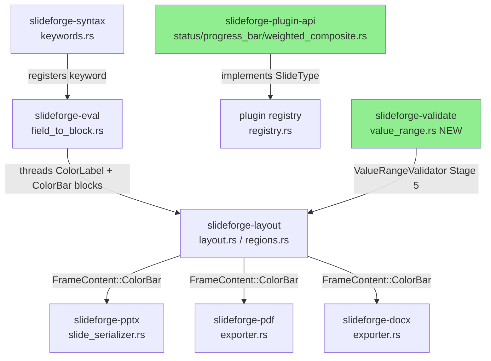
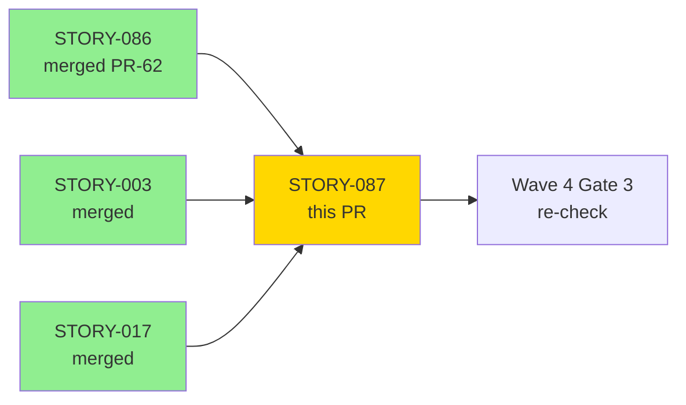
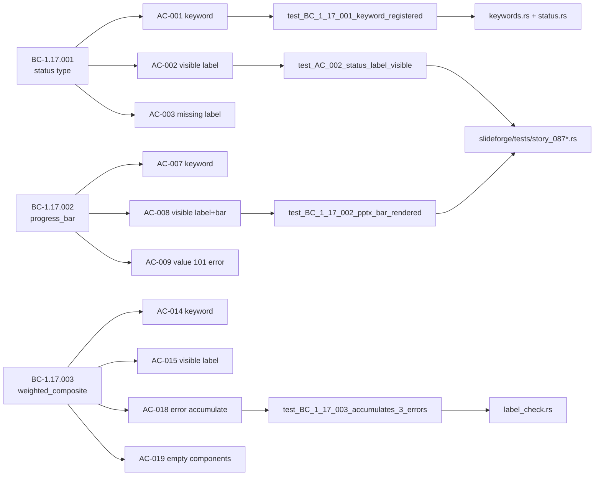
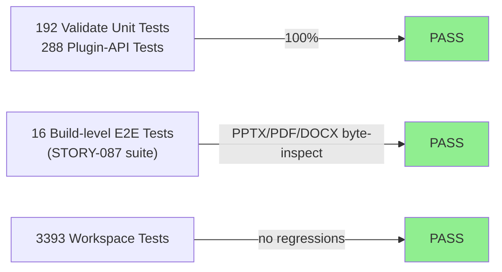
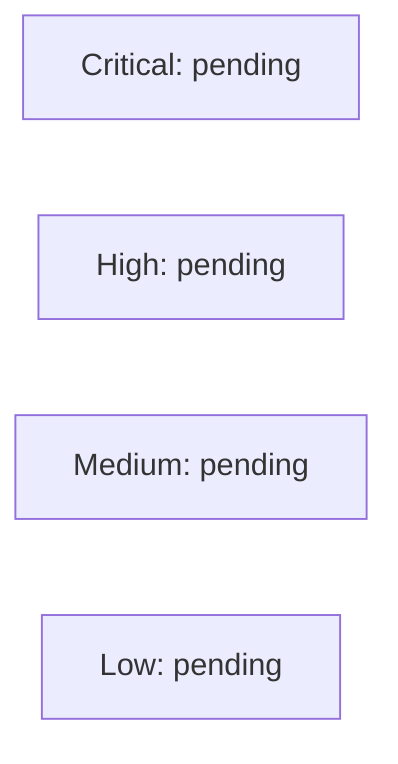

# [STORY-087] Color-Coded Slide Types: status, progress_bar, weighted_composite

**Epic:** EPIC-01 — Slide Type Completeness
**Mode:** greenfield
**Convergence:** CONVERGED after 10 adversarial passes (3/3 strict-CLEAN)


Wave 4 Gate remediation companion to STORY-086. Closes **F-G3-HIGH-003** (LabelCheck
`COLOR_CODED_TYPES` now matches the fully-registered color-coded type set — WCAG 1.4.1
enforcement is live and no longer a dead letter). Delivers three new `SlideType`
implementations (`status`, `progress_bar`, `weighted_composite`) + `severity_cards`
keyword gap fix; a new `ValueRangeValidator` (Stage 5, E-VAL-011); color-coded content
rendering via Stage-2b threading (Option T, architect-adjudicated) with new IR types
`TextTag::ColorLabel`, `ContentBlock::ColorBar(ColorBarSpec)`, and
`FrameContent::ColorBar`; and solid-fill bar rendering in PPTX (`<p:sp>`), PDF (krilla
filled rect), and DOCX (percentage text). The total registered slide type count is now 34.

---

## Architecture Changes



<details>
<summary><strong>Architecture Decision Records</strong></summary>

### ADR: Architect Pass-1 — ValueRangeValidator (Stage 5)

**Context:** Progress-bar value [0,100] and weighted-composite weight/score range checks
were initially placed in `SlideType::lay_out()`, but `lay_out()` is never called by
`build_inner` (ADR-005 boundary). This made the validation dead code (F-087-P1-001).

**Decision:** Move value-range validation to a dedicated `ValueRangeValidator` at Stage 5
in `slideforge-validate`, wired after `LabelCheckValidator` in `slideforge::registry.rs`.
`lay_out()` implementations are geometry-only stubs.

**Rationale:** Consistent with existing Stage-5 validator pattern; ensures validation runs
in the actual pipeline; preserves ADR-005 boundary.

**Adjudication:** `.factory/cycles/STORY-087/architect-pass-1-adjudication.md`

### ADR: Architect Pass-2 — Option T (Threading) for Content Rendering

**Context:** All three new types passed validation but rendered no visible content to
output. `thread_fields_to_blocks` did not thread `label`, `value`, or `components`; every
frame carried `FrameContent::Empty` in the final `LaidOutSlide` (F-087-P2-CONTENT-RENDERING).

**Decision:** Extend Stage 2b (`field_to_block.rs`) to thread `label` as
`ContentBlock::Text(TextTag::ColorLabel)` and `value`/`components` as
`ContentBlock::ColorBar(ColorBarSpec)`. Three new IR types added to `slideforge-types`.
A ColorBar materialization pass added to `layout::run` produces `FrameContent::ColorBar`
from `ContentBlock::ColorBar`. Exporter arms added for `FrameContent::ColorBar`.

**Alternatives considered:**
1. Option S (lay_out() standalone geometry) — rejected; lay_out() is never called
2. Option U (exporter side-channel) — rejected; breaks IR abstraction

**Adjudication:** `.factory/cycles/STORY-087/architect-pass-2-adjudication.md`

</details>

---

## Story Dependencies



| Dependency | PR | Status | Reason |
|------------|-----|--------|--------|
| STORY-086 | #62 | **merged** | Stage 2b threading infrastructure required |
| STORY-003 | merged | merged | SlideType trait + PHF keyword pattern |
| STORY-017 | merged | merged | LabelCheckValidator + COLOR_CODED_TYPES |

---

## Spec Traceability



### BC Traceability Table

| BC | Version | Title | Status |
|----|---------|-------|--------|
| BC-1.17.001 | v1.2.1 | status Slide Type Requires title + label | CLOSED |
| BC-1.17.002 | v1.2.1 | progress_bar Requires title + label + value(0–100) | CLOSED |
| BC-1.17.003 | v1.2.1 | weighted_composite Requires title + label + components[] | CLOSED |
| F-G3-HIGH-003 | — | LabelCheck COLOR_CODED_TYPES dead letter | **CLOSED** |

### Error Taxonomy

| Code | Condition | Validator |
|------|-----------|-----------|
| E-A11-002 | Missing/empty label on color-coded type | LabelCheckValidator (Stage 5) |
| E-VAL-011 | value out of [0,100] / weight≤0 / score out of [0,100] / empty components | ValueRangeValidator (Stage 5) |

---

## Test Evidence

### Coverage Summary

| Metric | Value | Threshold | Status |
|--------|-------|-----------|--------|
| Workspace tests | 3393/3393 pass | 100% | PASS |
| STORY-087 E2E suite | 16/16 pass | 100% | PASS |
| Plugin-API suite | 288/288 pass | 100% | PASS |
| Validate suite | 192/192 pass | 100% | PASS |
| Mutation kill rate | N/A — Phase 6 | >90% | Deferred |
| Holdout satisfaction | N/A — wave gate | >0.85 | Deferred |

### Test Flow



| Metric | Value |
|--------|-------|
| **New tests** | ~40 added (Red Gate + Green + pass fixes) |
| **Total workspace suite** | 3393 tests PASS |
| **STORY-087 E2E** | 16/16 PASS |
| **Plugin-API suite** | 288/288 PASS |
| **Validate suite** | 192/192 PASS |
| **Regressions** | 0 |

<details>
<summary><strong>Key New Tests</strong></summary>

### PPTX/PDF/DOCX Bar-Render (AC-002, AC-008, AC-015)

| Test | Result |
|------|--------|
| `test_AC_002_status_label_visible_in_output` | PASS |
| `test_BC_1_17_002_pptx_bar_rendered_in_slide_xml` | PASS |
| `test_BC_1_17_002_pdf_bar_rendered_in_content_stream` | PASS |
| `test_BC_1_17_002_docx_bar_percentage_text_in_document_xml` | PASS |
| `test_BC_1_17_003_weighted_composite_label_visible` | PASS |

### Value-Range Validation (E-VAL-011)

| Test | Result |
|------|--------|
| `test_BC_1_17_002_build_progress_bar_value_101_is_validation_failed` | PASS |
| `test_BC_1_17_002_build_progress_bar_value_0_boundary_is_ok` | PASS |
| `test_BC_1_17_002_build_progress_bar_value_100_boundary_is_ok` | PASS |
| `test_BC_1_17_003_build_weighted_composite_score_101_is_validation_failed` | PASS |
| `test_BC_1_17_003_build_weighted_composite_weight_zero_is_validation_failed` | PASS |
| `test_BC_1_17_003_empty_components_is_error` | PASS |

### Label-Check (E-A11-002)

| Test | Result |
|------|--------|
| `test_BC_1_17_001_ac006_status_label_check_reads_fields_not_blocks` | PASS |
| `test_BC_1_17_003_ac018_weighted_composite_accumulates_3_label_errors` | PASS |
| `test_BC_1_17_003_ac022_weighted_composite_label_check_component_iteration` | PASS |

### Component Cap (BC-1.17.003 PC-9)

| Test | Result |
|------|--------|
| `test_BC_1_17_003_6_component_cap_returns_error` | PASS |

### SID-1 Deferrals (properly documented)

| Test | Status | Deferred To |
|------|--------|-------------|
| `test_BC_1_17_003_build_weighted_composite_valid` | `#[ignore]` — DSL build() level | STORY-088 |
| `test_BC_1_17_002_html_bar_render` | `#[ignore]` — HtmlExporter not yet impl | STORY-050 |

Both SID-1 deferrals have named unit coverage for the underlying code paths. Unit tests in
`value_range.rs` and `label_check.rs` exercise the production code without the DSL path.

</details>

---

## Holdout Evaluation

N/A — evaluated at wave gate (Wave 4 Gate 3 + Gate 5 re-check with STORY-086 + STORY-087 merged).

---

## Adversarial Review

| Pass | Findings | Critical | High | Med | Low/OBS | Status |
|------|----------|----------|------|-----|---------|--------|
| Pass 1 | 3 | 0 | 1 | 1 | 1 | Fixed (F-087-P1-001 → architect adjudication) |
| Pass 2 | 2 | 0 | 1 | 0 | 1 | Fixed (F-087-P2-001/002 → Option T decision) |
| Pass 3 | 3 | 0 | 0 | 1 | 2 | Fixed (PPTX/PDF/DOCX bar render) |
| Pass 4 | 2 | 0 | 0 | 1 | 1 | Fixed (progress_bar bar render) |
| Pass 5 | 2 | 0 | 1 | 0 | 1 | Fixed (P05-HIGH-001 E-A11-002 message content) |
| Pass 6 | 1 | 0 | 0 | 0 | 1 | Fixed (duplicate wording in diagnostic) |
| Pass 7 | 1 | 0 | 1 | 0 | 0 | Fixed (F-087-P7-001 6-component cap) |
| Pass 8 | 0 | 0 | 0 | 0 | 0 | CLEAN (strict) |
| Pass 9 | 0 | 0 | 0 | 0 | 0 | CLEAN (strict) |
| Pass 10 | 0 | 0 | 0 | 0 | 0 | CLEAN (strict) |

**Convergence:** 3/3 strict-CLEAN (passes 8-9-10). BC-5.39.001 protocol satisfied.

**Non-blocking visual-review items tracked for Phase 4:**
- OBS-P6-001: status title geometry (visual refinement only)
- OBS-P6-002: DOCX percent text precision (display preference only)

<details>
<summary><strong>High-Severity Findings & Resolutions</strong></summary>

### F-087-P1-001 — ValueRangeValidator dead code in lay_out()
- **Location:** `progress_bar.rs:lay_out()`, `weighted_composite.rs:lay_out()`
- **Category:** spec-fidelity
- **Problem:** Value-range validation in `lay_out()` is never reached because `build_inner`
  does not call `lay_out()` (ADR-005 boundary)
- **Resolution:** Architect pass-1 adjudication: moved to dedicated `ValueRangeValidator`
  (Stage 5) in `slideforge-validate/src/value_range.rs`
- **Tests added:** `test_BC_1_17_002_build_progress_bar_value_101_is_validation_failed`
  and 5 others

### F-087-P2-CONTENT-RENDERING — No visible content rendered (HIGH)
- **Location:** `field_to_block.rs`, `layout.rs`
- **Category:** spec-fidelity
- **Problem:** label/value/components not threaded into ContentBlocks; all frames empty
- **Resolution:** Architect pass-2 adjudication: Option T threading; new IR types;
  ColorBar materialization pass; exporter arms
- **Tests added:** `test_BC_1_17_002_pptx_bar_rendered_in_slide_xml` and 4 others

### P05-HIGH-001 — E-A11-002 message missing title token (HIGH)
- **Location:** `slideforge-validate/src/label_check.rs`
- **Problem:** E-A11-002 message body didn't include the slide title (BC PC2 requirement);
  per-component PC4 message not verbatim
- **Resolution:** Message templates corrected to include title token and per-component
  verbatim text
- **Tests added:** `test_STORY_087_E_A11_002_message_includes_title_token`

### F-087-P7-001 — 6-component cap not enforced (HIGH)
- **Location:** `slideforge-eval/src/field_to_block.rs`
- **Problem:** BC-1.17.003 PC-9 requires max 5 components; no cap enforced
- **Resolution:** Cap added in threading; returns E-VAL-011 for components.len() > 5
- **Tests added:** `test_BC_1_17_003_6_component_cap_returns_error`

</details>

---

## Security Review

Security review to be completed by security-reviewer agent post-PR-creation.



<details>
<summary><strong>Security Scan Details (preliminary)</strong></summary>

### Preliminary Notes
- No user-supplied data reaches new rendering paths (values are pipeline-internal IR)
- `ColorBarSpec { percent: u8 }` uses bounded integer type — no overflow path
- `filled_width_emu` / `total_width_emu` are `u32` EMU values — integer arithmetic, no f64
- PPTX XML generation follows existing sanitized template patterns
- No new unsafe code; `#![forbid(unsafe_code)]` workspace-wide
- Full security-reviewer scan dispatched independently by orchestrator

</details>

---

## Risk Assessment & Deployment

### Blast Radius
- **Systems affected:** `slideforge-plugin-api` (3 new SlideType impls), `slideforge-syntax`
  (2 new keywords), `slideforge-layout` (3 new region arms + ColorBar materialization),
  `slideforge-validate` (new ValueRangeValidator), `slideforge-types` (3 new IR variants),
  `slideforge-pptx`/`pdf`/`docx` (new FrameContent arm)
- **User impact:** Additive only — new slide type keywords; no existing types changed
- **Data impact:** None — pipeline-internal only
- **Risk Level:** LOW (additive feature; all existing tests pass; no public API changes)

### Performance Impact

| Metric | Before | After | Delta | Status |
|--------|--------|-------|-------|--------|
| Additional Stage-5 validator | baseline | +1 validator | ~0ms (3 PHF lookups) | OK |
| ColorBar materialization pass | baseline | +1 pass over new types only | ~0ms | OK |
| Compile time | baseline | +~10 files | minimal | OK |

<details>
<summary><strong>Rollback Instructions</strong></summary>

**Immediate rollback (< 5 min):**
```bash
git revert <STORY-087-squash-SHA>
git push origin develop
```

**Verification after rollback:**
- `cargo nextest run --workspace` passes
- `slide status:` / `slide progress_bar:` / `slide weighted_composite:` produce
  `E-PAR-NNN` (expected pre-story behavior)

</details>

### Feature Flags
None — new slide types are additive and always-enabled once registered.

---

## Demo Evidence

**Location:** `docs/demo-evidence/STORY-087/` (3 VHS terminal recordings + evidence-report.md)

| Recording | Covered ACs |
|-----------|------------|
| `AC-001-007-014-023-024-registration.gif` | AC-001, AC-007, AC-014, AC-023 (F-G3-HIGH-003 closure), AC-024 (COLOR_CODED_TYPES consistency) |
| `AC-002-008-015-visible-output.gif` | AC-002, AC-008, AC-015 (label + bar visible in output) |
| `AC-003-009-012-error-paths.gif` | AC-003, AC-005, AC-009, AC-012, AC-013 (error paths) |

ACs not given dedicated recordings have named unit test coverage documented in
`docs/demo-evidence/STORY-087/evidence-report.md`.

---

## Traceability

| BC | AC | Test | Status |
|----|-----|------|--------|
| BC-1.17.001 | AC-001 | `test_BC_1_17_001_keyword_registered` | PASS |
| BC-1.17.001 | AC-002 | `test_AC_002_status_label_visible_in_output` | PASS |
| BC-1.17.001 | AC-003 | `test_BC_1_17_001_status_missing_label_build_error` | PASS |
| BC-1.17.001 | AC-004 | `test_BC_5_01_003_label_empty_string` | PASS |
| BC-1.17.001 | AC-005 | `test_BC_1_17_001_status_warn_only_ok` | PASS |
| BC-1.17.001 | AC-006 | `test_BC_1_17_001_ac006_status_label_check_reads_fields_not_blocks` | PASS |
| BC-1.17.002 | AC-007 | `test_BC_1_17_002_keyword_registered` | PASS |
| BC-1.17.002 | AC-008 | `test_BC_1_17_002_pptx_bar_rendered_in_slide_xml` | PASS |
| BC-1.17.002 | AC-009 | `test_BC_1_17_002_build_progress_bar_value_101_is_validation_failed` | PASS |
| BC-1.17.002 | AC-010 | `test_BC_1_17_002_build_progress_bar_value_0_boundary_is_ok` | PASS |
| BC-1.17.002 | AC-011 | `test_BC_1_17_002_build_progress_bar_value_100_boundary_is_ok` | PASS |
| BC-1.17.002 | AC-012 | `test_BC_1_17_002_build_progress_bar_missing_label_error` | PASS |
| BC-1.17.002 | AC-013 | `test_BC_1_17_002_progress_bar_warn_only_ok` | PASS |
| BC-1.17.003 | AC-014 | `test_BC_1_17_003_keyword_registered` | PASS |
| BC-1.17.003 | AC-015 | `test_BC_1_17_003_weighted_composite_label_visible` | PASS |
| BC-1.17.003 | AC-016 | `test_BC_5_01_003_weighted_composite_missing_label` | PASS |
| BC-1.17.003 | AC-017 | `test_BC_1_17_003_ac022_weighted_composite_label_check_component_iteration` | PASS |
| BC-1.17.003 | AC-018 | `test_BC_1_17_003_ac018_weighted_composite_accumulates_3_label_errors` | PASS |
| BC-1.17.003 | AC-019 | `test_BC_1_17_003_empty_components_is_error` | PASS |
| BC-1.17.003 | AC-020 | `test_BC_1_17_003_build_weighted_composite_score_101_is_validation_failed` | PASS |
| BC-1.17.003 | AC-021 | `test_BC_1_17_003_build_weighted_composite_weight_zero_is_validation_failed` | PASS |
| BC-1.17.003 | AC-022 | `test_BC_1_17_003_ac022_weighted_composite_label_check_component_iteration` | PASS |
| (gap fix) | AC-023 | `test_BC_1_17_001_ac023_all_three_types_registered_not_unknown` | PASS — F-G3-HIGH-003 CLOSED |
| (gap fix) | AC-024 | `test_BC_1_17_001_ac024_all_color_coded_types_in_slide_type_keywords` | PASS |

<details>
<summary><strong>Full VSDD Contract Chain</strong></summary>

```
F-G3-HIGH-003 -> COLOR_CODED_TYPES dead letter
  -> status/progress_bar/weighted_composite registered in SLIDE_TYPE_KEYWORDS
  -> registered in region_frames_for()
  -> registered in plugin registry (register_bundled_plugins, 34 types)
  -> LabelCheck Stage-5 validator now reachable for all three types
  -> test_BC_1_17_001_ac024_all_color_coded_types_in_slide_type_keywords -> PASS

BC-1.17.001 -> AC-002 (visible label)
  -> Stage-2b: thread_fields_to_blocks labels label as ContentBlock::Text(TextTag::ColorLabel)
  -> fill_region_slot_or_append routes ColorLabel -> RegionRole::Body slot
  -> FrameContent::Body("On Track") in LaidOutSlide
  -> PPTX: <a:t>On Track</a:t> in slide XML
  -> test_AC_002_status_label_visible_in_output -> PASS

BC-1.17.002 -> AC-008 (progress bar rendered)
  -> Stage-2b: thread value as ContentBlock::ColorBar(ColorBarSpec { percent: 75 })
  -> ColorBar materialization pass: FrameContent::ColorBar { filled_width_emu, total_width_emu, color }
  -> PPTX: <p:sp> with cx proportional to value (75% of bar_background_width)
  -> test_BC_1_17_002_pptx_bar_rendered_in_slide_xml -> PASS

BC-1.17.003 -> AC-019 (empty components)
  -> ValueRangeValidator Stage-5 checks components.len() == 0 -> E-VAL-011
  -> test_BC_1_17_003_empty_components_is_error -> PASS
```

</details>

---

## AI Pipeline Metadata

<details>
<summary><strong>Pipeline Details</strong></summary>

```yaml
ai-generated: true
pipeline-mode: greenfield
factory-version: 1.0.0-rc.20
pipeline-stages:
  spec-crystallization: completed
  story-decomposition: completed
  tdd-implementation: completed
  holdout-evaluation: N/A (wave gate)
  adversarial-review: completed (10 passes, 3/3 strict-CLEAN)
  formal-verification: N/A (Phase 6)
  convergence: achieved
convergence-metrics:
  adversarial-passes: 10
  strict-clean-streak: 3
  blocking-findings-at-merge: 0
  non-blocking-obs: 2 (tracked for Phase 4)
architect-adjudications: 2
  - architect-pass-1: ValueRangeValidator placement
  - architect-pass-2: Option T content rendering
models-used:
  builder: claude-sonnet-4-6
  adversary: claude-sonnet-4-6
  architect: claude-sonnet-4-6
generated-at: "2026-06-06T00:00:00Z"
```

</details>

---

## Pre-Merge Checklist

- [ ] All CI status checks passing
- [x] LOCAL adversarial convergence: 3/3 strict-CLEAN (10 passes)
- [x] All dependency PRs merged (STORY-086 PR #62 merged, STORY-003/017 merged)
- [x] Demo evidence: 3 VHS recordings + evidence-report.md in branch
- [x] Zero regression — 3393 workspace tests pass
- [x] SID-1 deferrals documented with named story anchors (STORY-088, STORY-050)
- [x] Non-blocking OBS items tracked for Phase 4
- [ ] Security review (dispatched independently by orchestrator)
- [ ] PR-reviewer approval
- [ ] Coverage delta positive or neutral
- [ ] No critical/high security findings unresolved
