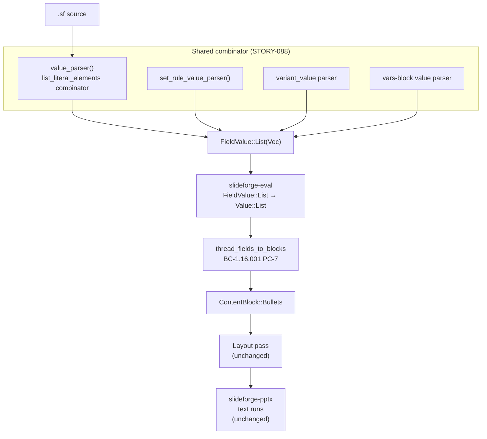
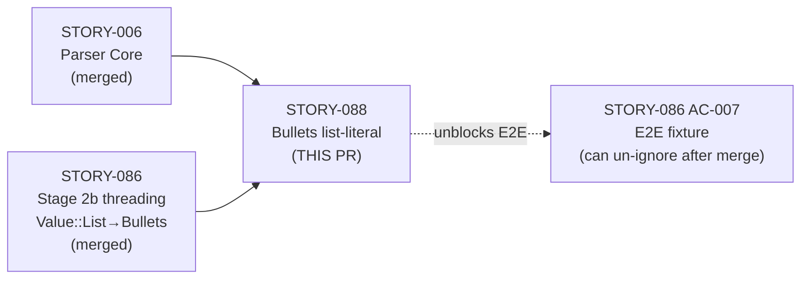
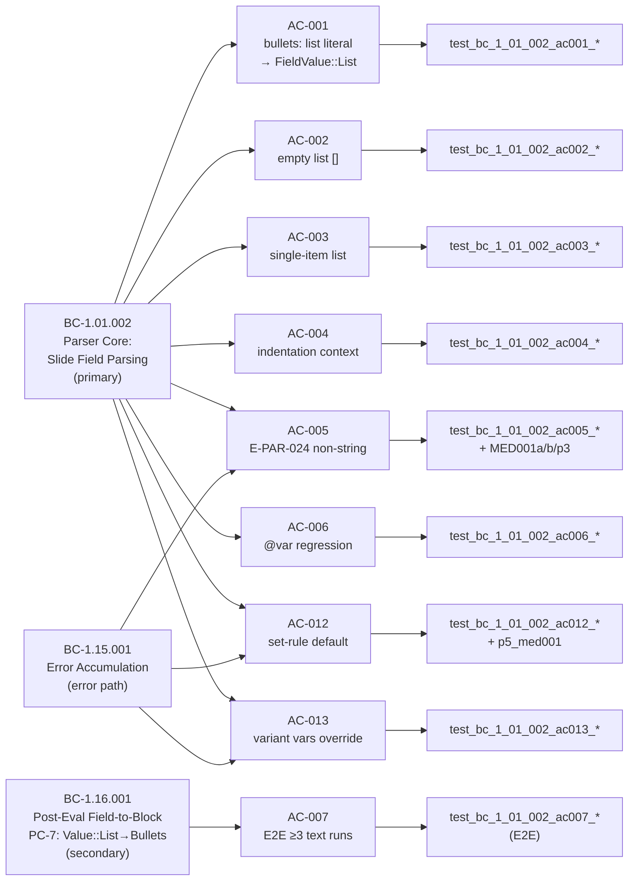

## feat(syntax,eval): STORY-088 bullets list-literal field-value DSL syntax

### Summary

Adds `[...]` list-literal parsing to the `slideforge-syntax` field-value grammar so that
`bullets: ["A","B","C"]` and `@var items = ["A","B","C"]` both parse correctly, producing
`FieldValue::List(Vec<FieldValue>)` in the AST. A single shared `list_literal_elements`
combinator covers all four value-position surfaces (field-value, `@var`/vars-block,
`set`-rule defaults, and variant `vars:` overrides). New error code `E-PAR-024` reports
non-string and nested-list elements with a `"got <type>"` substitution and a source span;
a non-recursive O(1) bracket-depth tracker guards against unbounded-recursion DoS.

Closes the STORY-086 AC-007 parser-gap note. After this PR merges, STORY-086 AC-007's
`#[ignore]`'d E2E fixture can be un-ignored.

---

### Architecture Changes

**Files changed:**

| File | Change |
|------|--------|
| `crates/slideforge-syntax/src/ast.rs` | Add `List(Vec<FieldValue>)` variant to `FieldValue` enum; update all match arms |
| `crates/slideforge-syntax/src/parser/deck.rs` | Add `list_literal_elements` shared combinator; extend `value_parser()`, `set_rule_value_parser()`, vars-block parser; `E-PAR-024` error recovery; O(1) DoS guard |
| `crates/slideforge-syntax/src/parser/variants.rs` | Extend `variant_value` parser with the shared list-literal arm |
| `crates/slideforge-eval/src/` | Add `FieldValue::List` eval arm → `Value::List`; confirm `FieldValue::Ident` lookup resolves `Value::List` correctly |
| `tests/integration/` | Un-ignore STORY-086 AC-007 E2E fixture; add AC-007 E2E test for direct list-literal bullets |
| `docs/demo-evidence/STORY-088/` | 4 recordings + evidence-report.md |

No changes to `slideforge-layout`, `slideforge-pptx`, `slideforge-docx`, `slideforge-pdf`, or `slideforge-html`.

---

### Story Dependencies

Dependencies STORY-006 and STORY-086 are both merged to `develop`.

---

### Spec Traceability

---

### Test Evidence

| Metric | Value |
|--------|-------|
| `cargo nextest` — workspace total | 3916 pass / 20 skip / 0 fail |
| `slideforge-syntax` suite (including new AC-001..007, AC-012, AC-013 tests) | 460 pass / 1 skip / 0 fail |
| AC-007 E2E (direct list-literal → ≥3 `<a:r>` PPTX runs) | 1 pass |
| `cargo fmt --all -- --check` | CLEAN |
| `cargo clippy` (pedantic + unwrap_used) | CLEAN |
| `RUSTDOCFLAGS="-D warnings" cargo doc --workspace --no-deps` | CLEAN |
| Mutation testing (Phase 6) | N/A — evaluated at Phase 6 |
| Kani proofs (Phase 6) | N/A — evaluated at Phase 6 |

---

### Demo Evidence

4 recordings covering all 9 ACs (AC-001 through AC-007, AC-012, AC-013). Located in
`docs/demo-evidence/STORY-088/` on branch `feature/STORY-088`.

| Recording | ACs Covered |
|-----------|-------------|
| `AC-001-004-list-literal-parse.gif` | AC-001 (primary positive), AC-002 (empty list), AC-003 (single-item), AC-004 (indentation context) |
| `AC-005-006-error-paths-regression.gif` | AC-005 (integer + boolean + nested-list E-PAR-024), AC-006 (@var regression) |
| `AC-007-e2e-pptx-runs.gif` | AC-007 (E2E: direct list-literal → PPTX ≥3 `<a:r>` text runs) |
| `AC-012-013-set-rule-variant-vars.gif` | AC-012 (set-rule positive + E-PAR-024), AC-013 (variant vars positive + E-PAR-024 + nested-list rejection) |

**Coverage map:** All 9 ACs have at least 1 demo recording. AC-005 has 4 sub-cases
demonstrated (integer, boolean, mixed, nested-list). AC-012 and AC-013 each demonstrate
3 sub-cases (positive, error, edge).

---

### Holdout Evaluation

N/A — evaluated at wave gate.

---

### Adversarial Review

LOCAL adversarial cascade: **CONVERGED — 3/3 strict-CLEAN** (passes 8, 9, 10 out of 10-pass cascade).

| Pass | Findings | Severity | Fixed | Status |
|------|----------|----------|-------|--------|
| 1 | E-PAR-024 anchor inconsistency; colon-form + @var parser coverage gaps | MED (3) | 3 | FIXED |
| 2 | `"got <type>"` substitution missing; Error-sentinel substitution gap | MED (2) | 2 | FIXED |
| 3 | Nested-list rejection incomplete; float coverage gap; stale comments | MED (2), OBS (1) | 3 | FIXED |
| 4 (scope expansion) | AC-012/AC-013 scope approved by human; quad-duplication identified | SCOPE | 0 findings | AUTHORIZED |
| 5 | Quad-duplication in 4 value-position parsers; shared combinator missing | MED (1) | 1 | FIXED |
| 6 | CRITICAL: unbounded-recursion DoS in nested-list guard (introduced in Pass-5) | CRIT (1) | 1 | FIXED |
| 7 | OBS: boundary + EOF branch coverage gaps in depth tracker | OBS (1) | 1 | FIXED |
| 8 | **CLEAN (strict): yes** | 0 | — | STREAK 1/3 |
| 9 | **CLEAN (strict): yes** | 0 | — | STREAK 2/3 |
| 10 | **CLEAN (strict): yes** | 0 | — | STREAK 3/3 — CONVERGED |

Notable findings caught and fixed:
- **Pass-6 CRITICAL (DoS guard):** A non-recursive nested-list guard introduced in Pass-5 introduced
  an unbounded recursion path when the depth counter was implemented with a recursive combinator.
  Fixed via a non-recursive O(1) bracket-depth tracker that inspects tokens without recursing.
- **Pass-5 MED (quad-duplication):** Identical list-literal logic in all 4 value-position parsers
  was consolidated into a single `list_literal_elements` shared combinator, eliminating the
  duplication vector for future divergence.
- **Pass-2 MED (message consistency):** `E-PAR-024` message template used inconsistent `got <type>`
  substitution patterns. Fixed by a single canonical format string across all positions.

---

### Security Review

Pending orchestrator dispatch of `vsdd-factory:security-reviewer`.

---

### Risk Assessment

| Dimension | Assessment |
|-----------|-----------|
| Blast radius | `slideforge-syntax` + `slideforge-eval` only; no layout/exporter changes |
| Backwards compatibility | Additive: new `FieldValue::List` variant; no existing variant removed or renamed |
| DoS surface | Mitigated: non-recursive O(1) bracket-depth tracker prevents nested-list recursion DoS (Pass-6 finding, fixed) |
| Performance | Parser adds a `list_literal_elements` alternative; no hot-path change; single-line lists only in v1.0 |
| Error message contract | `E-PAR-024` is a NEW error code; no existing error messages changed |

---

### AI Pipeline Metadata

| Dimension | Value |
|-----------|-------|
| Pipeline mode | Greenfield, Phase 3 (TDD per-story delivery) |
| Story points | 8 (scope-expanded from 5 during adversary cascade, human-authorized) |
| Adversary passes | 10 passes, 3/3 strict-CLEAN convergence (passes 8–10) |
| Specialist agents | test-writer, implementer, adversary (×10), demo-recorder |
| Model | claude-sonnet-4-6 |

---

### Pre-Merge Checklist

- [x] PR description matches actual diff (architecture diagram verified against commit log)
- [x] All 9 ACs covered by demo evidence (4 recordings, evidence-report.md confirmed)
- [x] Traceability chain complete: BC-1.01.002 → AC-001..007, AC-012, AC-013 → tests → demo
- [x] 3/3 strict-CLEAN LOCAL adversary convergence
- [x] Exit gate green: fmt PASS, pedantic clippy PASS, nextest 3916/20 pass/skip, rustdoc PASS
- [x] Dependencies merged: STORY-006 (merged), STORY-086 (merged)
- [x] Branch rebased onto develop @ c60cca36, HEAD d76f0ada
- [ ] Security review (orchestrator dispatches security-reviewer)
- [ ] PR-level adversarial review (orchestrator dispatches pr-reviewer)
- [ ] CI checks pass (triggered on PR creation)
- [ ] Squash merge authorized by orchestrator
