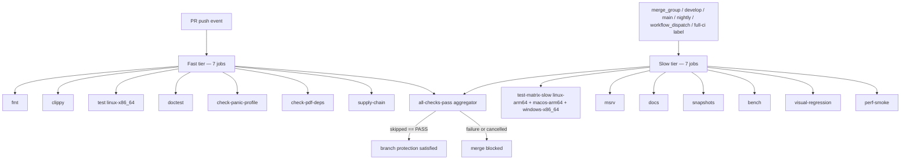
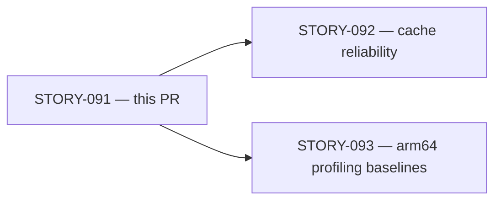
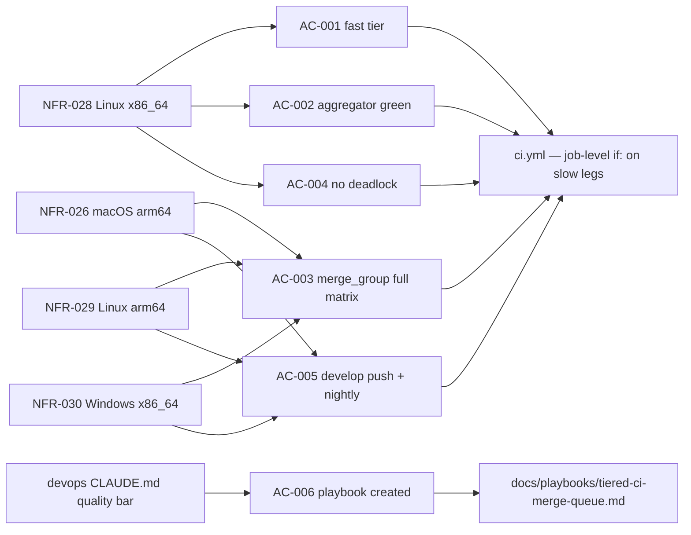

## Summary

Restructures `.github/workflows/ci.yml` to implement tiered CI triggers, removing the
3 slow platform legs (linux-arm64, macos-arm64, windows-x86_64) from the per-PR critical
path. Adds `merge_group:` trigger so GitHub merge queue validates the full 4-platform
matrix before any commit lands on `develop`. Creates `docs/playbooks/tiered-ci-merge-queue.md`
as the portable design rationale + ops guide.

- **Fast tier (every PR push):** 7 jobs — `fmt`, `clippy`, `test (linux-x86_64)`, `doctest`, `check-panic-profile`, `check-pdf-deps`, `supply-chain` (~6-8 min directional)
- **Slow tier (merge_group / develop / main / nightly / workflow_dispatch / full-ci label):** 7 jobs — `test-matrix-slow` (linux-arm64, macos-arm64, windows-x86_64), `msrv`, `docs`, `snapshots`, `bench`, `visual-regression`, `perf-smoke`
- **Aggregator unchanged:** `CI / all-checks-pass` remains the single required status check; treats `skipped` as PASS — no deadlock

Story: STORY-091, Epic: EPIC-19 (CI/CD Infrastructure), Wave 5, 5 pts, spec v1.4

**IMPORTANT EXPECTATION FOR THIS PR:** This PR itself is a PR push event, so only the 7
fast jobs + `all-checks-pass` will execute. The 7 slow jobs will show as `skipped`. That
is the designed AC-001/AC-002 behavior — not a CI failure.

## Acceptance Criteria

| AC | Description | Verification Status |
|----|-------------|-------------------|
| AC-001 | Per-PR push runs only 7 fast legs; slow legs skipped | PASS (local: job-tier classification script confirmed 7 fast / 7 slow) — wall-clock below |
| AC-002 | `all-checks-pass` reports green when slow legs skipped | PASS (local: 3-payload Python simulation: success+skipped→exit 0, failure→exit 1, cancelled→exit 1) |
| AC-003 | `merge_group` event runs full matrix; 6-combo gate byte-identical at all 7 slow-job sites | PASS (local: pattern match 7/7 IDENTICAL at lines 294, 345, 370, 398, 444, 495, 575) |
| AC-004 | No `paths`/`paths-ignore` in ci.yml; only `all-checks-pass` required | PASS (local: zero grep matches for `paths:` or `paths-ignore:` anywhere in ci.yml; playbook §4 documents branch protection instruction) |
| AC-005 | Develop push + nightly schedule trigger full matrix | PASS (local: `on:` block + 7 slow-job `if:` sites cover combos 2/4/5; schedule default-branch constraint documented in ci.yml header + playbook §6) |
| AC-006 | `docs/playbooks/tiered-ci-merge-queue.md` created with required sections | PASS (local: file 17,869 bytes; all 5 required sections (a)-(e) + schedule constraint + maintainer checklist + edge cases) |
| Overall | `actionlint` clean | PASS (exit code 0, actionlint 1.7.12) |

**AC-001 wall-clock (measured on this PR): TBD — to be recorded when CI completes**

## Tiering Design

### Architecture



### 6-combo full-tier gate (byte-identical at 7 slow-job sites)

```yaml
if: >
  github.event_name == 'merge_group' ||
  github.event_name == 'schedule' ||
  github.event_name == 'workflow_dispatch' ||
  (github.event_name == 'push' && (github.ref == 'refs/heads/develop' || github.ref == 'refs/heads/main')) ||
  (github.event_name == 'pull_request' &&
   contains(github.event.pull_request.labels.*.name, 'full-ci'))
```

| Combo | Trigger | Purpose |
|-------|---------|---------|
| 1 | `merge_group` | Full matrix before commit lands on develop — primary NFR-026/029/030 gate |
| 2 | `schedule` | Nightly full matrix on main — toolchain/env drift detection |
| 3 | `workflow_dispatch` | Manual full-matrix trigger via `gh workflow run` (closes ci-workflow-analyzer #3) |
| 4 | `push` to develop | Post-merge full-matrix safety net on develop |
| 5 | `push` to main | Full matrix on release merges (closes ci-workflow-analyzer #5) |
| 6 | PR with `full-ci` label | Developer opt-in on-demand full matrix |

## Story Dependencies



`depends_on: []` — no upstream story prerequisites.
`blocks: [STORY-092, STORY-093]` — cache warm-path and arm64 timing baselines should be measured against the tiered baseline.

## Spec Traceability



Note: NFR-027 (macOS x86_64) is NOT covered by ci.yml — `test (macos-x86_64)` / macos-13
leg was removed from ci.yml before this story due to chronic runner availability issues.
Intel macOS binary coverage is `release.yml`'s responsibility.

## Test Evidence

This is a CI configuration story (`tdd_mode: facade`). There are no Rust unit tests.
Verification is structural (static analysis + logic simulation):

| Evidence | Result |
|----------|--------|
| Job tier classification (7 fast / 7 slow count) | PASS |
| Aggregator Python simulation — payload 1 (success+skipped) | PASS — exit 0 |
| Aggregator Python simulation — payload 2 (test failure) | PASS — exit 1 |
| Aggregator Python simulation — payload 3 (cancelled) | PASS — exit 1 |
| 6-combo expression byte-identity scan (7/7 sites) | PASS — all IDENTICAL |
| `paths:`/`paths-ignore:` grep | PASS — zero matches |
| `actionlint` (1.7.12) | PASS — exit 0 |

Full evidence: `.factory/demos/STORY-091-demo-evidence.md` (factory-artifacts @ 8279a0b3)

## Adversarial Convergence Record

LOCAL adversarial cascade: **10 passes total, 3/3 strict-CLEAN convergence (passes 8, 9, 10)**

| Pass | Findings | CLEAN (strict) | CLEAN (PR-merge) | Notes |
|------|----------|----------------|-----------------|-------|
| 1 | F-091-P1-001 | no | no | Header-comment expression copy drift |
| 2 | 0 | yes | yes | — |
| 3 | 0 | yes | yes | — |
| 4 | F-091-P4-001 | no | no | workflow_dispatch + main push missing from 6-combo gate |
| 5 | 0 | yes | yes | — |
| 6 | 0 | yes | yes | — |
| 7 | F-091-P7-001 | no | no | Header-comment expression copy drift (reopened after spec v1.3 bump) |
| 8 | 0 | **yes** | **yes** | Streak 1/3 |
| 9 | 0 | **yes** | **yes** | Streak 2/3 |
| 10 | 0 | **yes** | **yes** | Streak 3/3 — **CONVERGED** |

Findings closed: F-091-P1-001, F-091-P4-001, F-091-P5-001, F-091-P7-001
Spec bumped: v1.0 → v1.4 during cascade (v1.1 remove-uncertainty pass; v1.2 EC-002 correction; v1.3 6-combo alignment; v1.4 4-platform matrix reconciliation)

## Holdout Evaluation

N/A — evaluated at wave gate (no product behavioral contracts; CI-infra story anchored to NFRs only)

## Security Review

Pending — dispatched separately by orchestrator per LESSON-5.

## Risk Assessment

| Dimension | Assessment |
|-----------|-----------|
| Blast radius | CI workflow only — no source crates, no Cargo.toml, no Rust code changed |
| Performance impact | Positive: removes 3 slow legs (~22-min arm64, ~15-min macOS, ~20-min Windows) from per-PR critical path |
| Regression risk | Low: aggregator logic unchanged; `skipped`-as-pass semantics verified against 3 payloads |
| Deadlock risk | Low: zero `paths:`/`paths-ignore:` in ci.yml (verified); aggregator uses `if: always()` |
| Platform coverage | Unchanged: all 4 platforms still validated before any commit lands on develop (via merge_group) |

**Trade-off (deliberate):** Platform-specific bugs surface at merge-queue time, not at first
PR push. Acceptable because (a) full matrix still runs before any commit lands on `develop`,
(b) nightly cron provides additional safety net, (c) per-PR wall-clock win is the single
largest available improvement. Documented in playbook §5.

## Post-Merge Repo Settings Follow-Up (required after merge)

The tiered CI design requires these GitHub repo settings to be configured on `develop`
**after this PR merges**. Currently, NO branch protection exists on `develop`.

1. **Enable branch protection on `develop`** — GitHub Settings > Branches > Add rule for `develop`
2. **Set required status check:** `all-checks-pass` (bare context name — NOT `CI / all-checks-pass`; see playbook §4 for the API distinction)
3. **Enable merge queue** on the `develop` branch protection rule
4. **Do NOT add any slow leg** (e.g., `test (linux-arm64)`, `test (windows-x86_64)`) as a required check — that recreates the deadlock

Full `gh api` commands for steps 1-4 are in `docs/playbooks/tiered-ci-merge-queue.md` §4.

## Changed Files

| File | Change |
|------|--------|
| `.github/workflows/ci.yml` | Added `merge_group:` + `workflow_dispatch:` + nightly `schedule:` to `on:` block; added `pull_request.types: [opened, synchronize, reopened, labeled]`; added 6-combo full-tier `if:` to 7 slow jobs; verified aggregator `skipped`-as-pass logic; added header comment block for schedule/default-branch constraint |
| `docs/playbooks/tiered-ci-merge-queue.md` | New file: 17,869 bytes, 8 sections — design rationale, exact `if:` expression, deadlock anti-pattern, branch protection instructions, trade-off, schedule constraint, maintainer checklist, edge cases |

## Pre-Merge Checklist

- [x] LOCAL adversarial cascade: 3/3 strict-CLEAN (passes 8-9-10 of 10)
- [x] All ACs verified locally (structural evidence in `.factory/demos/STORY-091-demo-evidence.md`)
- [x] `actionlint` clean (exit 0)
- [x] No Rust code changed; no `cargo fmt`/`cargo clippy` regressions possible
- [x] Demo evidence pointer present
- [x] Spec traceability complete (NFR-026..030 → AC → implementation)
- [x] Adversarial convergence record included
- [ ] Security review (dispatched separately — orchestrator LESSON-5)
- [ ] PR-level adversarial review (dispatched separately — orchestrator LESSON-5)
- [ ] AC-001 wall-clock recorded (pending CI run completion)
- [ ] Post-merge repo settings configured (develop branch protection + merge queue)
