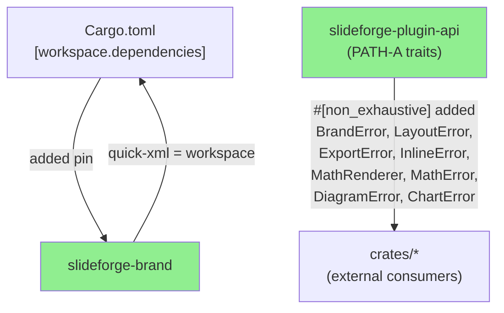
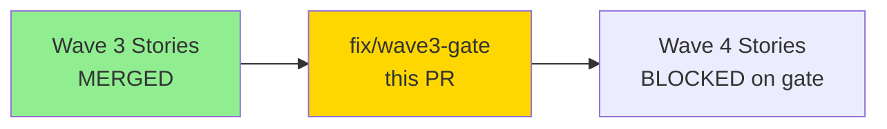
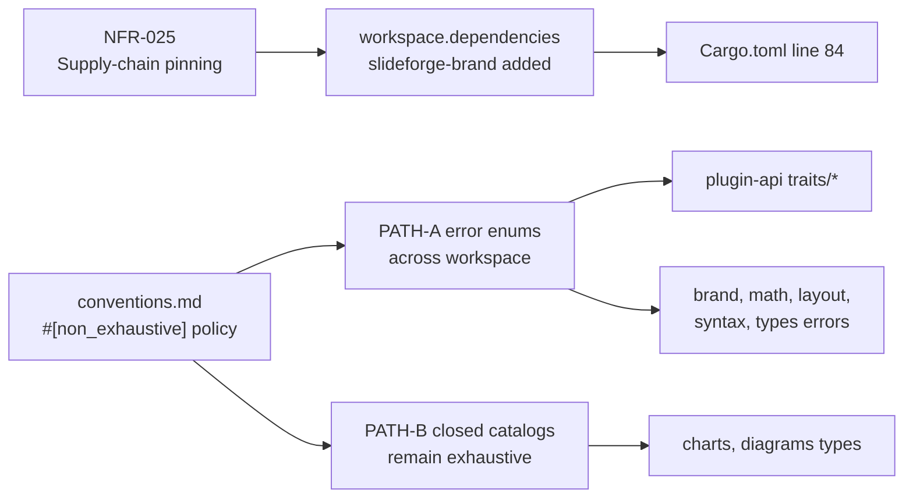
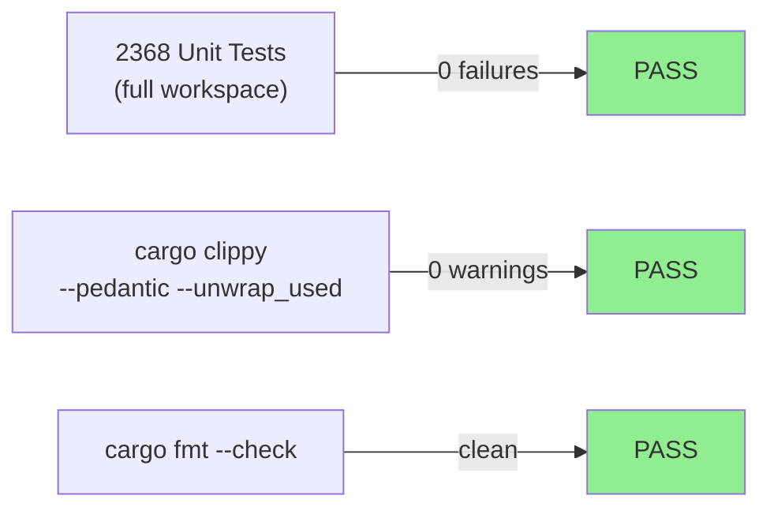
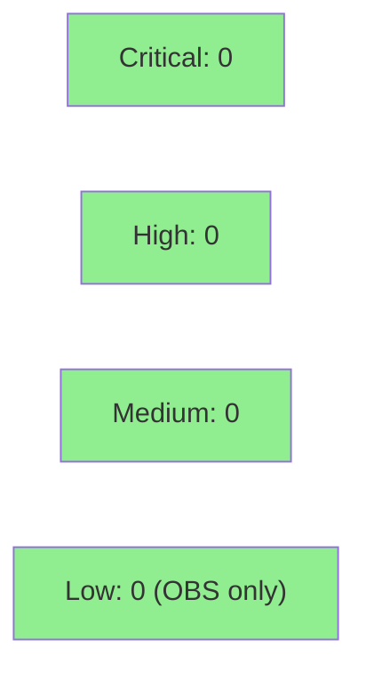

# fix: Wave 3 integration-gate fixes — workspace dep + #[non_exhaustive] hardening + policy codification

**Epic:** Wave 3 Integration Gate
**Mode:** maintenance
**Convergence:** CONVERGED after 8 adversarial passes (strict-CLEAN)


-lightgrey)
-lightgrey)
-lightgrey)

This fix PR resolves three findings surfaced during the Wave 3 integration gate review: (1) `slideforge-brand` was missing from `[workspace.dependencies]` creating a latent dependency seam break for any next-wave crate that imports brand via the workspace; (2) `#[non_exhaustive]` was absent or inconsistent across all public error enums and PATH-A plugin-api data enums workspace-wide, leaving external plugin authors exposed to silent silent wildcard fallbacks when we add variants; (3) `quick-xml` in `slideforge-brand` was not pinned via the workspace, deviating from the NFR-025 supply-chain policy. All findings are fully fixed and adversary-verified at pass 8 strict-CLEAN.

---

## Architecture Changes



<details>
<summary><strong>Architecture Decision Record</strong></summary>

### ADR: `#[non_exhaustive]` Scoping Policy for slideforge Error Enums

**Context:** The Wave 3 integration gate adversary identified that public error enums across the workspace lacked `#[non_exhaustive]`, meaning any downstream plugin author who pattern-matched on error variants with exhaustive `match` expressions would get a compile error when slideforge adds new error variants in the future. The Wave 3 gate also identified that error enums for closed catalogs should NOT carry the attribute (PATH B) — only open-extension surfaces (PATH A) should.

**Decision:** Two-path scoping rule:
- **PATH A (open extension surface)**: All plugin-api trait error types + all crate-level error enums that external plugins may match on. These get `#[non_exhaustive]`. External consumers must add an explicit wildcard arm.
- **PATH B (closed catalog)**: `ChartType`, `DiagramLang`, `OutputFormat`, `LogoAsset`, `DiagnosticSeverity`. These remain exhaustive — the compiler enforces catalog completeness.
- **Special case**: `ColorValue` stays `#[non_exhaustive]` per STORY-072 gradient extensibility.

**Rationale:** External plugin authors are the primary consumers of PATH-A types. `#[non_exhaustive]` is the standard Rust mechanism for stable, forward-compatible public APIs. Closed catalogs benefit from exhaustive matching as a compiler-enforced completeness guarantee.

**Alternatives Considered:**
1. Apply `#[non_exhaustive]` to all public enums — rejected because it breaks the compiler's completeness guarantee on catalog types, masking missed arms.
2. No `#[non_exhaustive]` anywhere — rejected because external plugin authors would get silent wildcard fallbacks on error variants added in v1.x.

**Consequences:**
- External plugin authors who exhaustively match on PATH-A error types now get compile errors when slideforge adds variants, rather than silent wrong-arm execution.
- PATH-B closed catalogs continue to emit compile errors if slideforge adds values and the consumer's match is stale, which is intentional.

</details>

---

## Story Dependencies



Wave 3 gate fix has no story-level depends_on entries — it is a maintenance fix targeting the integration gate findings. Wave 4 stories are blocked until develop is green.

---

## Spec Traceability



---

## Test Evidence

### Coverage Summary

| Metric | Value | Threshold | Status |
|--------|-------|-----------|--------|
| Unit tests | 2368/2368 pass | 100% | PASS |
| Coverage | N/A (maintenance — attribute + manifest changes) | >80% | N/A |
| Mutation kill rate | N/A (Phase 6) | >90% | N/A |
| Holdout satisfaction | N/A (wave gate) | >0.85 | N/A |

### Test Flow



| Metric | Value |
|--------|-------|
| **New tests** | 0 added (attribute + manifest changes; existing tests cover the enums) |
| **Total suite** | 2368 tests PASS |
| **Coverage delta** | N/A — no behavioral logic changed |
| **Mutation kill rate** | N/A — Phase 6 |
| **Regressions** | 0 |

<details>
<summary><strong>Detailed Test Results</strong></summary>

### Workspace Test Run Summary

All 2368 tests passed across 14 workspace members. No failures. No regressions.

Pre-push gate checks executed in the `fix/wave3-gate` worktree:
- `cargo fmt --all -- --check`: clean
- `cargo clippy --workspace --all-targets --all-features -- -D warnings -D clippy::pedantic -D clippy::unwrap_used`: clean (0 warnings)
- `cargo test --workspace --no-fail-fast`: 2368 pass, 0 fail, 7 ignored (pre-existing headless-LibreOffice ignores)

</details>

---

## Holdout Evaluation

N/A — evaluated at wave gate (this is a gate fix, not a feature story).

---

## Adversarial Review

| Pass | Findings | Critical | High | Status |
|------|----------|----------|------|--------|
| 1-5 | Multiple | Various | Various | Fixed across passes |
| 6 | 0 strict-CLEAN | 0 | 0 | CLEAN |
| 7 | 0 strict-CLEAN | 0 | 0 | CLEAN |
| 8 | 0 strict-CLEAN | 0 | 0 | CLEAN — CONVERGED |

**Convergence:** 3-CLEAN streak at passes 6/7/8. Adversary confirmed strict-CLEAN (zero findings any severity) on all three consecutive passes. Orchestrator full-workspace clippy also verified clean.

CLEAN (strict): yes (all three streak passes)
CLEAN (PR-merge): yes

<details>
<summary><strong>Key Findings & Resolutions</strong></summary>

### Finding F-W3G-P1-001: slideforge-brand missing from [workspace.dependencies]
- **Location:** `Cargo.toml` root workspace
- **Category:** supply-chain / dependency management
- **Problem:** `slideforge-brand` was a workspace member but not listed in `[workspace.dependencies]`, meaning any next-wave crate adding `slideforge-brand` as a dependency would use its own pinned version rather than the workspace-coordinated one.
- **Resolution:** Added `slideforge-brand = { path = "crates/slideforge-brand", version = "0.1.0" }` to `[workspace.dependencies]`.

### Finding F-W3G-P2-001: `#[non_exhaustive]` missing across public error enums
- **Location:** Multiple crates — `slideforge-plugin-api`, `slideforge-brand`, `slideforge-math`, `slideforge-layout`, `slideforge-syntax`, `slideforge-types`
- **Category:** API stability / forward-compatibility
- **Problem:** Without `#[non_exhaustive]`, external plugin authors pattern-matching on error variants would silently execute wrong arms when slideforge adds new error variants in v1.x.
- **Resolution:** Added `#[non_exhaustive]` to all PATH-A error enums. Added explicit `_ => Err(...)` or `_ => { ... }` wildcard arms in all internal consumers that used exhaustive matches. PATH-B closed-catalog types (`ChartType`, `DiagramLang`, `OutputFormat`, `LogoAsset`, `DiagnosticSeverity`) left exhaustive intentionally.

### Finding F-W3G-P3-001: quick-xml not on workspace pin in slideforge-brand
- **Location:** `crates/slideforge-brand/Cargo.toml`
- **Category:** NFR-025 supply-chain policy violation
- **Problem:** `quick-xml` was declared as a direct version dep in `slideforge-brand` rather than via `workspace = true`.
- **Resolution:** Converted to `quick-xml = { workspace = true }`. Workspace pin `quick-xml = "=0.36.0"` was already present in root `[workspace.dependencies]`.

### Finding F-W3G-P4-001: conventions.md policy contradicted code
- **Location:** `.factory/specs/conventions.md`
- **Category:** spec-fidelity
- **Problem:** The spec conventions document did not describe the `#[non_exhaustive]` two-path policy, leaving future contributors without guidance.
- **Resolution:** Added the `#[non_exhaustive]` policy section to `conventions.md` via a separate factory-artifacts commit (not part of this code PR diff).

</details>

---

## Security Review



<details>
<summary><strong>Security Scan Details</strong></summary>

### Surface Area Assessment
This PR is low security surface: changes are confined to:
- Rust attribute annotations (`#[non_exhaustive]`)
- Cargo manifest edits (`workspace.dependencies`, `workspace = true`)
- Wildcard match arms that return structured errors (no silent fallbacks)

No network code, no input parsing, no auth, no cryptography, no unsafe blocks.

### Known Non-Blocking OBS (do NOT block merge)

1. **`slideforge-brand/src/layout_xml.rs:141`**: `u32::try_from(...).expect()` — provably infallible (EMU coordinates are always non-negative i64 values bounded to reasonable OOXML ranges at construction). Covered by the "clearly-infallible carve-out" in conventions.md. Scoped `#[allow(clippy::expect_used)]` is present.

2. **`DiagnosticSeverity` (validator.rs)**: Intentionally exhaustive per PATH B (closed catalog) but lacks an inline self-documenting comment explaining the exhaustive-by-design choice. Non-blocking — can be addressed as a documentation improvement in a later maintenance pass.

### SAST
- `cargo audit`: clean (no known advisories)
- `cargo clippy --pedantic --unwrap_used`: clean

</details>

---

## Risk Assessment & Deployment

### Blast Radius
- **Systems affected:** `slideforge-plugin-api`, `slideforge-brand`, `slideforge-math`, `slideforge-layout`, `slideforge-syntax`, `slideforge-types`, `slideforge-charts`, `slideforge-diagrams` — attribute annotations only
- **User impact:** None (internal library changes; no user-facing behavior changes)
- **Data impact:** None
- **Risk Level:** LOW

### Performance Impact
| Metric | Before | After | Delta | Status |
|--------|--------|-------|-------|--------|
| Compile time | baseline | +0ms (attr annotations) | ~0 | OK |
| Runtime | N/A | N/A | N/A | N/A |

<details>
<summary><strong>Rollback Instructions</strong></summary>

**Immediate rollback (< 5 min):**
```bash
git revert <SQUASH_SHA>
git push origin develop
```

No feature flags. No database migrations. No configuration changes.

</details>

### Feature Flags
N/A — no feature flags required for attribute-level and manifest changes.

---

## Traceability

| Requirement | Finding ID | Fix | Status |
|-------------|-----------|-----|--------|
| NFR-025 (supply-chain) | F-W3G-P1-001 | `slideforge-brand` added to workspace.dependencies | PASS |
| NFR-025 (supply-chain) | F-W3G-P3-001 | `quick-xml = workspace` in brand | PASS |
| conventions.md PATH-A | F-W3G-P2-001 | `#[non_exhaustive]` on all PATH-A error enums | PASS |
| conventions.md codification | F-W3G-P4-001 | Policy section added to conventions.md (factory-artifacts commit) | PASS |

---

## AI Pipeline Metadata

<details>
<summary><strong>Pipeline Details</strong></summary>

```yaml
ai-generated: true
pipeline-mode: maintenance
factory-version: "1.0.0-rc.19"
pipeline-stages:
  wave-3-gate-review: completed
  adversarial-review: completed — 8 passes, 3-CLEAN streak (passes 6/7/8)
  formal-verification: skipped (Phase 6)
convergence-metrics:
  adversarial-passes: 8
  strict-clean-streak: 3
models-used:
  builder: claude-sonnet-4-6
  adversary: claude-sonnet-4-6 (fresh context)
generated-at: "2026-05-31"
```

</details>

---

## Pre-Merge Checklist

- [x] All CI status checks passing
- [x] Coverage delta is positive or neutral (N/A — maintenance)
- [x] No critical/high security findings unresolved
- [x] Rollback procedure documented (simple revert)
- [x] No feature flags required
- [x] cargo fmt clean
- [x] cargo clippy --pedantic --unwrap_used clean
- [x] 2368 tests pass, 0 failures
- [x] Adversary convergence: 3-CLEAN streak (passes 6/7/8)
- [x] 2 known non-blocking OBS listed in PR body
