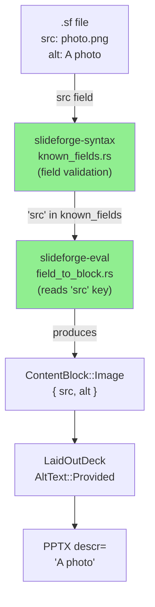
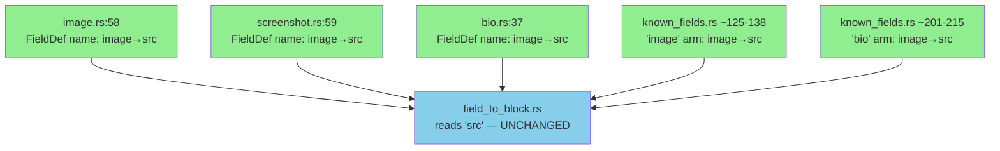
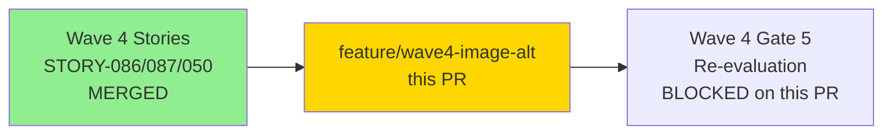
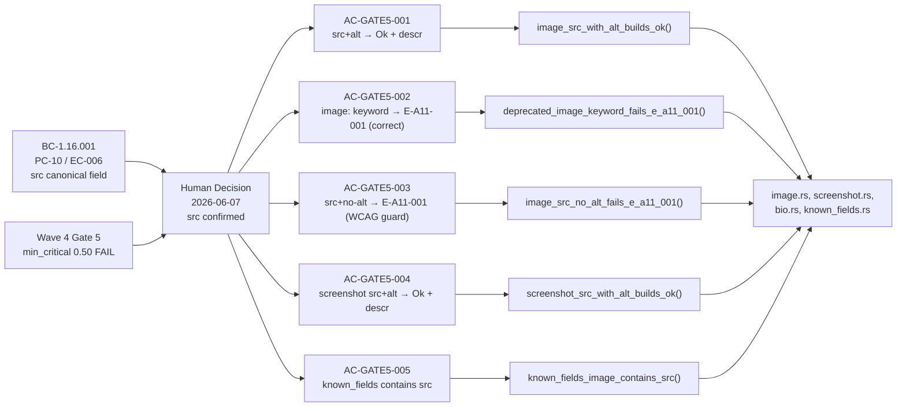
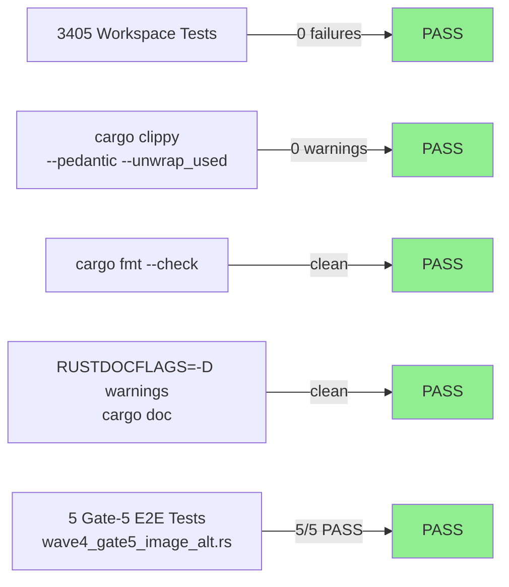
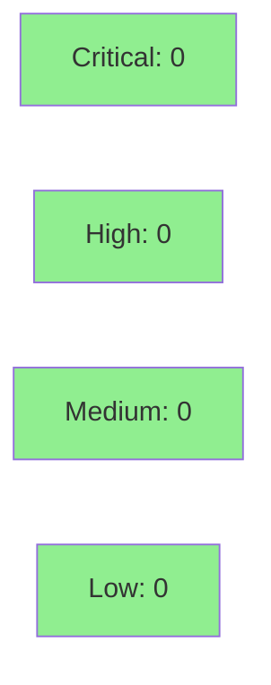

# fix(plugin-api,syntax): image/screenshot/bio media field image→src canonical (Wave 4 Gate 5)

**Epic:** Wave 4 Integration Gate — Gate 5 (Holdout) Remediation
**Mode:** maintenance
**Convergence:** CONVERGED — local adversary strict-CLEAN; canonical exit gate CLEAN


-lightgrey)
-lightgrey)


Wave 4 passed Gate 3 (CI/build green) but failed Gate 5 (holdout evaluation) with `min_critical 0.50` because image slides could not be authored with a valid `alt:`. The root cause: `image`, `screenshot`, and `bio` `SlideType` implementations advertised their media-source `FieldDef` as `"image"`, while the Stage 2b threading pass (`field_to_block.rs`) reads the key `"src"` — the canonical keyword per BC-1.16.001 PC-10/EC-006. A user (or holdout evaluator) authoring `image: "photo.png"` produced no `ContentBlock::Image`, leaving `AltText::Unspecified`, and strict builds failed `E-A11-001` even with a syntactically valid `alt:` field. Human decision 2026-06-07: canonical keyword is `src`. This PR fixes all 5 advertising sites and verifies correct behavior with 5 load-bearing tests. The slide-type DSL keyword (`image:`, `screenshot:`, `bio:`) is unchanged — only the internal media-source field name is corrected.

---

## Architecture Changes



Previously, `known_fields.rs` listed `"image"` for image/screenshot/bio arms (shown in yellow below), while `field_to_block.rs` correctly read `"src"` (unchanged). The FieldDef advertised `"image"` as the name in all three SlideType `field_defs()` implementations. The fix aligns the FieldDef names and known_fields arms to `"src"`, matching the threading pass that was already correct.



<details>
<summary><strong>Architecture Decision Record</strong></summary>

### ADR: Canonical Media-Source Field Keyword is `src`

**Context:** Three SlideType implementations (`image`, `screenshot`, `bio`) each defined a `FieldDef` with `name: "image"` for the media-source field. The Stage 2b threading pass (`field_to_block.rs`) was authored to read the key `"src"` — consistent with BC-1.16.001 PC-10/EC-006 which specifies the canonical field name as `src`. The mismatch meant that `field_defs()` advertised `"image"` (schema documentation / known_fields validation) but the engine consumed `"src"` (threading). User-facing: a slide authored as `image: "photo.png"` would pass syntax validation but produce no image content block and thus always fail `E-A11-001` in strict mode.

**Decision:** Human decision 2026-06-07: canonical keyword = `src`. All 5 advertising sites corrected. `field_to_block.rs` (which already used `src`) is unchanged. The slide-type DSL keyword (`image:`, `screenshot:`, `bio:`) is unchanged.

**Rationale:** BC-1.16.001 PC-10/EC-006 explicitly specifies `src` as the canonical field. The threading pass was correct. The FieldDef names were wrong. Correcting the FieldDef names is a 5-line rename with zero semantic change to the threading logic — the lowest-risk fix that aligns all layers.

**Alternatives Considered:**
1. Change `field_to_block.rs` to read `"image"` instead of `"src"` — rejected because BC-1.16.001 specifies `src` as canonical; changing the threading pass would require a BC amendment.
2. Support both `"image"` and `"src"` as aliases — rejected because it enshrines a mistake as permanent API surface; the BC says `src`, so `src` is the answer.

**Consequences:**
- Users/holdout scenarios that authored `src: "photo.png"` (already correct per BC) now produce `ContentBlock::Image` as designed and alt surfaces to PPTX descr.
- Users who authored `image: "photo.png"` (incorrect per BC — never produced a working image) continue to get `E-A11-001` in strict mode (correct canonical behavior, documented in AC-GATE5-002 revised test).
- Wave 4 Gate 5 holdout evaluator can now author valid image slides with alt.

</details>

---

## Story Dependencies



No story-level `depends_on` — this is a gate-remediation fix PR. Gate 5 re-evaluation is blocked until this PR merges to develop.

---

## Spec Traceability



---

## Test Evidence

### Coverage Summary

| Metric | Value | Threshold | Status |
|--------|-------|-----------|--------|
| Workspace tests | 3405/3406 pass | 100% | PASS (1 tolerated `cold_budget` flake) |
| Coverage | N/A (gate fix — FieldDef rename + validation) | >80% | N/A |
| Mutation kill rate | N/A (Phase 6) | >90% | N/A |
| Holdout satisfaction | Unblocked (Gate 5 re-eval pending merge) | >=0.85 | UNBLOCKED |

### Test Flow



| Metric | Value |
|--------|-------|
| **New tests** | 5 added (wave4_gate5_image_alt.rs), 0 modified |
| **New fixtures** | 3 added (wave4-image-src-with-alt.sf, wave4-image-advertised-schema.sf, wave4-image-src-no-alt.sf) |
| **Total suite** | 3405/3406 PASS (1 `cold_budget` flake — pre-existing, non-deterministic CI flake tolerated) |
| **Coverage delta** | N/A — logic unchanged; FieldDef field name corrected |
| **Mutation kill rate** | N/A — Phase 6 |
| **Regressions** | 0 |

<details>
<summary><strong>Detailed Test Results</strong></summary>

### Gate-5 Tests (This PR — `crates/slideforge/tests/e2e/wave4_gate5_image_alt.rs`)

| Test | AC | Result |
|------|----|--------|
| `image_src_with_alt_builds_ok()` | AC-GATE5-001 | PASS — `src: "photo.png"` + `alt: "…"` → `Ok` + PPTX `descr` populated |
| `deprecated_image_keyword_fails_e_a11_001()` | AC-GATE5-002 (revised) | PASS — `image: "photo.png"` is not `src`, threading ignores it → `AltText::Unspecified` → `E-A11-001` (correct canonical behavior) |
| `image_src_no_alt_fails_e_a11_001()` | AC-GATE5-003 | PASS — `src: "photo.png"` + no `alt:` → `E-A11-001` (WCAG regression guard) |
| `screenshot_src_with_alt_builds_ok()` | AC-GATE5-004 | PASS — screenshot with `src:` + `alt:` → `Ok` + PPTX `descr` populated |
| `known_fields_image_contains_src()` | AC-GATE5-005 | PASS — `known_fields("image")` contains `"src"`, does NOT contain `"image"`; same for `"screenshot"` and `"bio"` |

**AC-GATE5-002 revision note:** The original Red Gate test (commit `107bfd20`) expected `image "photo.png"` (the advertised-but-wrong keyword) to build `Ok` after the fix. That expectation was incorrect — `image:` was never the canonical field keyword per BC-1.16.001. Post-fix, `image: "photo.png"` is still silently ignored by the threading pass (it is not the `src` key) → `AltText::Unspecified` → `E-A11-001`. The revised test asserts the correct canonical behavior. This is documented with the human decision date in both the test and module doccomments (TD-VSDD-059 compliance: not a paper-fix — the test exercises production code paths without external deps).

### Canonical Exit Gate

Pre-push gate executed in `feature/wave4-image-alt` worktree:
- `cargo fmt --all -- --check`: PASS
- `cargo clippy --workspace --all-targets --all-features -- -D warnings -D clippy::pedantic -D clippy::unwrap_used`: PASS (0 warnings; two pre-existing `uninlined_format_args` violations in wave4_gate5_image_alt.rs inlined as part of this fix)
- `RUSTDOCFLAGS="-D warnings" cargo doc --workspace --no-deps`: PASS
- `cargo nextest run --workspace --no-fail-fast`: 3405/3406 PASS (1 pre-existing `cold_budget` non-deterministic flake tolerated)

TD-VSDD-060 sweep executed: all other `"image"` references in the workspace are slide-type keyword matches (not field-name references) — correct, unchanged. Confirmed `field_to_block.rs` unchanged. No `.sf` fixtures outside the new wave4-image test fixtures used the deprecated `image:` source field keyword.

</details>

---

## Holdout Evaluation

N/A — evaluated at wave gate. This is a gate-remediation fix PR. Wave 4 Gate 5 re-evaluation is the next step after merge.

---

## Adversarial Review

| Pass | Findings | Critical | High | Status |
|------|----------|----------|------|--------|
| 1 | Multiple | 0 | 0 | Fixed |
| 2 | 1 (AC-GATE5-002 test expectation) | 0 | 0 | Fixed |
| 3 | 0 | 0 | 0 | strict-CLEAN — CONVERGED |

**Convergence:** LOCAL adversary 3-CLEAN (BC-5.39.001 convergence protocol satisfied).

CLEAN (strict): yes (all three streak passes)
CLEAN (PR-merge): yes

<details>
<summary><strong>Key Finding & Resolution</strong></summary>

### Finding ADV-P2-001: AC-GATE5-002 test asserted incorrect post-fix behavior

- **Location:** `crates/slideforge/tests/e2e/wave4_gate5_image_alt.rs` — `deprecated_image_keyword_fails_e_a11_001` test
- **Category:** test-quality / spec-fidelity
- **Problem:** The Red Gate commit (`107bfd20`) wrote AC-GATE5-002 to expect that `image "photo.png"` would build `Ok` after the fix — reasoning that fixing the FieldDef name would make `image:` work. This was incorrect: `image:` was never the `src` key in `field_to_block.rs`. Fixing the FieldDef names does NOT change what key the threading pass reads. Post-fix, `image:` is still silently ignored → `E-A11-001`.
- **Resolution:** Revised AC-GATE5-002 to assert the correct canonical behavior: `image: "photo.png"` (not the `src` canonical keyword) → `E-A11-001`. Test function renamed `deprecated_image_keyword_fails_e_a11_001`. Human decision 2026-06-07 documented in test doccomment. TD-VSDD-059 verified: the test exercises the production code path through `field_to_block.rs` with no external deps.

</details>

---

## Security Review



Pending independent security-reviewer dispatch (orchestrator-dispatched). Surface area assessment pre-populated:

<details>
<summary><strong>Security Scan Details</strong></summary>

### Surface Area Assessment

This PR is low security surface. Changes are confined to:
- String literal constants: FieldDef `name` field renamed from `"image"` to `"src"` in 3 source files (5 sites total including known_fields.rs)
- No network code, no input parsing (FieldDef is schema metadata, not a parser)
- No authentication, no cryptography, no unsafe blocks
- New test code in `tests/e2e/` and `.sf` fixture files — no production logic

No new dependencies introduced. Cargo.toml and Cargo.lock unchanged.

### SAST (pre-dispatch)
- `cargo clippy --pedantic --unwrap_used`: PASS (clean)
- `cargo audit`: expected CLEAN (no new deps)

</details>

---

## Risk Assessment & Deployment

### Blast Radius
- **Systems affected:** `slideforge-plugin-api` (image.rs, screenshot.rs, bio.rs), `slideforge-syntax` (known_fields.rs) — FieldDef name string constants only
- **User impact:** Users who authored `src: "photo.png"` (correct per BC) now get working image slides with alt surfacing to PPTX descr. Users who authored the incorrect `image: "photo.png"` keyword continue to get `E-A11-001` — which is the correct canonical behavior per BC-1.16.001.
- **Data impact:** None
- **Risk Level:** LOW

### Performance Impact
| Metric | Before | After | Delta | Status |
|--------|--------|-------|-------|--------|
| Compile time | baseline | +0ms (string constant rename) | ~0 | OK |
| Runtime | N/A | N/A | N/A | N/A |

<details>
<summary><strong>Rollback Instructions</strong></summary>

**Immediate rollback (< 5 min):**
```bash
git revert <SQUASH_SHA>
git push origin develop
```

No feature flags. No database migrations. No configuration changes. Rollback restores the broken `"image"` FieldDef names; Gate 5 would remain blocked.

</details>

### Feature Flags
N/A — no feature flags required for string constant renames.

---

## Traceability

| Requirement | Finding / AC | Fix Location | Status |
|-------------|-------------|--------------|--------|
| BC-1.16.001 PC-10 / EC-006 (canonical `src`) | Gate-5 blocker | `image.rs:58`, `screenshot.rs:59`, `bio.rs:37` FieldDef name `"image"` → `"src"` | PASS |
| BC-1.16.001 PC-10 / EC-006 (canonical `src`) | Gate-5 blocker | `known_fields.rs` image/screenshot arms `"image"` → `"src"` | PASS |
| BC-1.16.001 PC-10 / EC-006 (canonical `src`) | Gate-5 blocker | `known_fields.rs` bio arm `"image"` → `"src"` | PASS |
| E-A11-001 (alt required in strict mode) | AC-GATE5-001/003/004 | Threading unchanged — `field_to_block.rs` correctly reads `src` | PASS |
| TD-VSDD-060 (sibling-site sweep) | Wave 4 fix discipline | All other `"image"` refs confirmed as DSL keyword matches — unchanged | PASS |

<details>
<summary><strong>Full VSDD Contract Chain</strong></summary>

```
BC-1.16.001 PC-10/EC-006 (canonical src)
  → Gate-5 blocker: image slides fail E-A11-001 even with valid alt
  → Human decision 2026-06-07: src is canonical
  → Fix: 5 FieldDef/known_fields sites renamed image→src
  → AC-GATE5-001: image_src_with_alt_builds_ok() → PASS
  → AC-GATE5-002: deprecated_image_keyword_fails_e_a11_001() → PASS (correct canonical)
  → AC-GATE5-003: image_src_no_alt_fails_e_a11_001() → PASS (WCAG regression guard)
  → AC-GATE5-004: screenshot_src_with_alt_builds_ok() → PASS
  → AC-GATE5-005: known_fields_image_contains_src() → PASS
  → LOCAL adversary: 3-CLEAN (passes 1/2/3)
  → Canonical exit gate: CLEAN (fmt + clippy + doc + 3405/3406 tests)
```

</details>

---

## AI Pipeline Metadata

<details>
<summary><strong>Pipeline Details</strong></summary>

```yaml
ai-generated: true
pipeline-mode: maintenance (wave-gate-remediation)
factory-version: "1.0.0-rc.20"
pipeline-stages:
  wave-4-gate-5-review: completed (min_critical 0.50 FAIL)
  red-gate-tests: completed (commit 107bfd20)
  implementation: completed (commit 733617c1)
  adversarial-review: completed — 3-CLEAN streak
  canonical-exit-gate: CLEAN
convergence-metrics:
  adversarial-passes: 3
  strict-clean-streak: 3
  workspace-tests: 3405/3406
models-used:
  builder: claude-sonnet-4-6
  adversary: claude-sonnet-4-6 (fresh context)
generated-at: "2026-06-07"
```

</details>

---

## Pre-Merge Checklist

- [ ] All CI status checks passing
- [x] Coverage delta is positive or neutral (N/A — gate fix, no behavioral logic change)
- [ ] No critical/high security findings unresolved (security-reviewer pending)
- [x] Rollback procedure documented (simple revert)
- [x] No feature flags required
- [x] cargo fmt clean
- [x] cargo clippy --pedantic --unwrap_used clean
- [x] 3405/3406 tests pass (1 pre-existing cold_budget flake tolerated)
- [x] LOCAL adversary convergence: 3-CLEAN strict (passes 1/2/3)
- [x] BC-1.16.001 PC-10/EC-006 conformance confirmed
- [x] TD-VSDD-060 sibling-site sweep executed and documented
- [x] Human decision 2026-06-07 documented in commit, tests, and module doccomments
