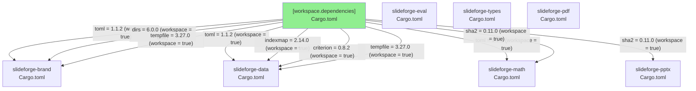
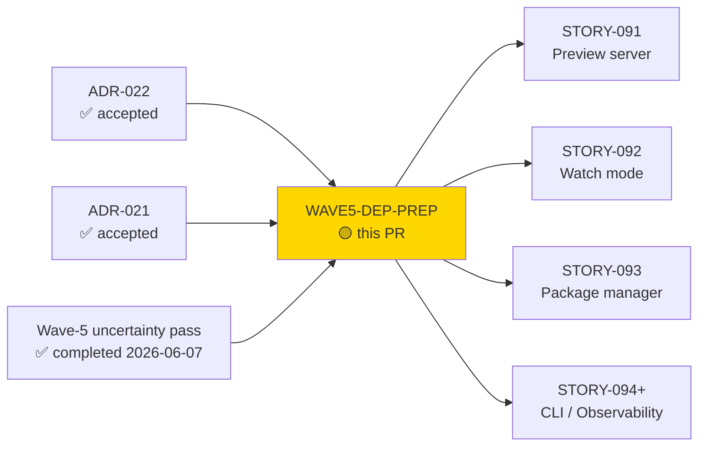
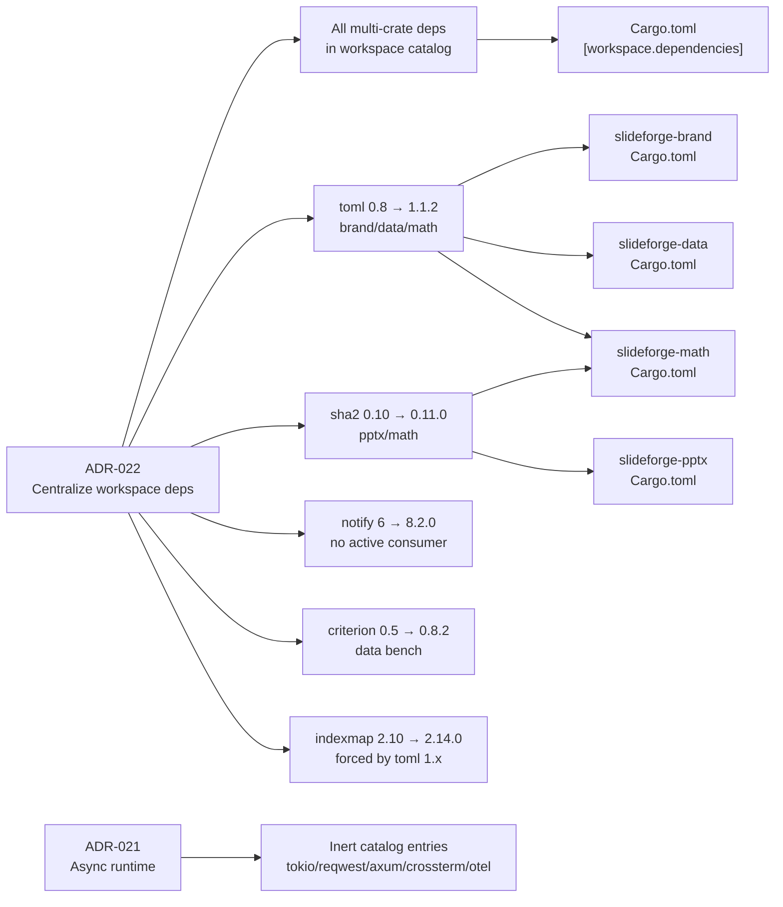
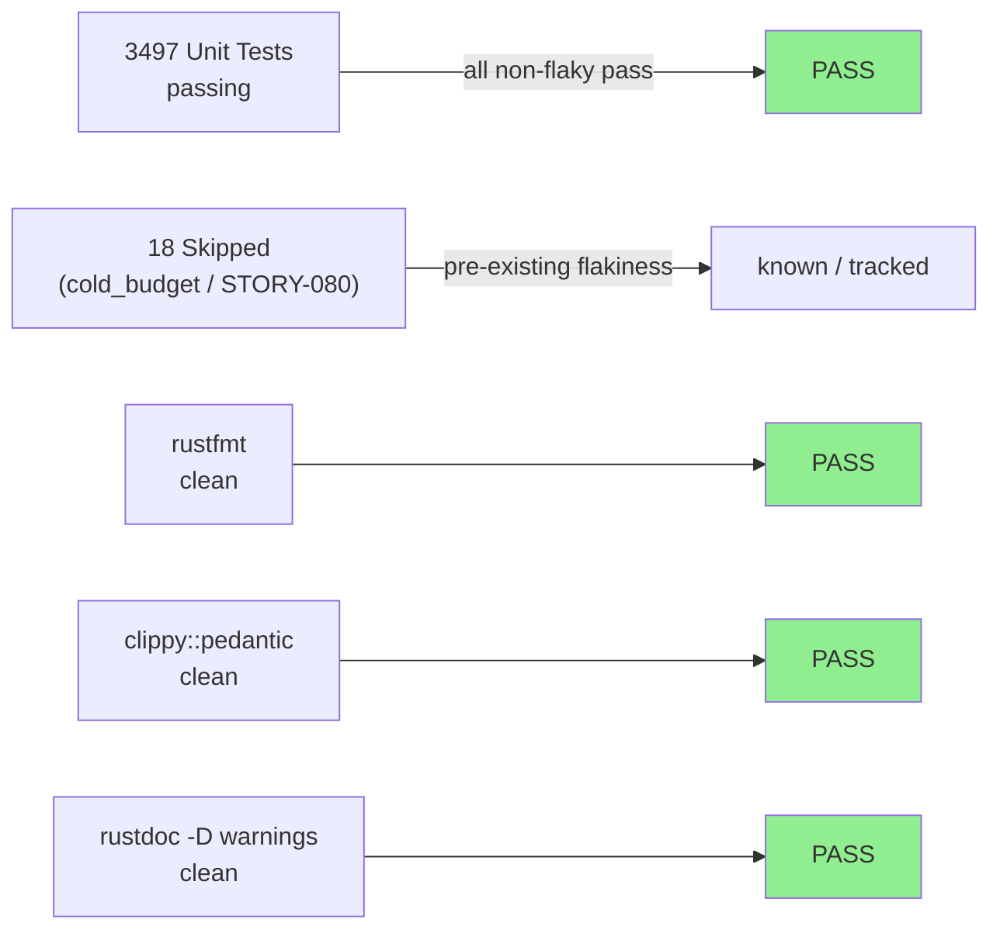
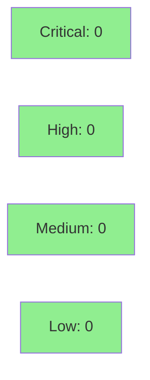

# [WAVE5-DEP-PREP] Wave-5 dependency-prep chore — workspace catalog centralization + ADR-022 major-version migrations

**Epic:** Wave 5 — Preview server, watch mode, package manager, CLI, observability
**Mode:** maintenance
**Convergence:** N/A — behavior-preserving chore, no adversarial story cycle


Centralizes `[workspace.dependencies]` and executes the ADR-022 major-version migrations
so that all Wave-5 feature stories can fan out in parallel without manifest contention.
Two real migrations ship in this chore: `toml` 0.8.23 → 1.1.2 (brand/data/math crates)
and `sha2` 0.10.9 → 0.11.0 (pptx/math; replaces `hybrid_array`-based boundary with
`[u8; 32]` static-size output). Sixteen inert catalog additions (tokio, reqwest, axum,
crossterm, opentelemetry stack, git2, tar, flate2, dirs, globset, hex, toml_edit,
notify-debouncer-full, sha2, toml, tempfile) are pre-declared in `[workspace.dependencies]`
but are not yet consumed by any member crate — they become load-bearing when Wave-5 stories
that implement the preview server, watch mode, package manager, and observability pipeline
land their PRs.

---

## Architecture Changes



<details>
<summary><strong>Architecture Decision Records</strong></summary>

### ADR-022: Workspace Dependency Centralization and Major-Version Adoption

**Context:** Individual member crates re-declared dependencies with inconsistent precision
(some `=`-pinned, some loose `^1.0`). `[workspace.dependencies]` existed but was incomplete.
The Wave-5 remove-uncertainty pass (2026-06-07) also revealed that several deps were one or
two major versions behind stable, including two cases where incompatible major versions of
the same crate compiled simultaneously in the workspace (`sha2` 0.10 vs 0.11, `toml` 0.8
used by data/brand/math while `toml` 1.x was already current stable).

**Decision:** Every dependency used by more than one member crate MUST be declared in
`[workspace.dependencies]` with `=` pinning. Execute all ADR-022-mandated major-version
migrations in a single behavior-preserving chore PR before Wave-5 stories fan out.

**Rationale:** Doing this as a chore PR before Wave-5 avoids manifest contention when
multiple story branches touch the same `Cargo.toml` files simultaneously. The migrations
are mechanically small (API-compatible or one-line adapter change) and carry no behavioral
risk for non-pptx consumers of sha2.

**Consequences:**
- All Wave-5 feature stories inherit clean, centralized manifests with zero per-crate pins to maintain.
- `sha2` 0.11.0 uses `[u8; 32]` for SHA-256 output (not the `hybrid_array::Array` wrapper);
  one call-site in `slideforge-pptx` required a `.into()` / indexing adaptation.
- `toml` 1.x has a cleaner API but different error types; `font_engine.rs` required a
  `from_str` call to be reformatted (rustfmt line-break fix in the follow-up commit).
- `criterion` 0.8.2 is now the workspace standard; slideforge-data's bench was previously
  pinned to 0.5.1 to avoid a known regression that is now fixed in 0.8.x.
- `indexmap` 2.14.0 is forced by `toml` 1.x's dependency tree (toml 1.x requires indexmap
  2.x ≥ 2.12).

### ADR-021: Async Runtime Adoption (related, pre-declared catalog entries)

ADR-021 mandates tokio as the async runtime for preview server, watch-mode HTTP, interactive
keypress handling, and OTLP export. The tokio, reqwest, axum, crossterm, and opentelemetry
catalog entries pre-declared in this PR are the inert foundation for ADR-021 consumers.

</details>

---

## Story Dependencies



---

## Spec Traceability



---

## Test Evidence

### Coverage Summary

| Metric | Value | Threshold | Status |
|--------|-------|-----------|--------|
| nextest pass | 3497 / 3515 | 100% non-flaky | PASS |
| Skipped (known-flaky) | 18 | tracked STORY-080 | OK |
| clippy::pedantic | 0 warnings | 0 | PASS |
| rustfmt | clean | clean | PASS |
| rustdoc (-D warnings) | clean | clean | PASS |
| Mutation kill rate | N/A — chore, no new logic | N/A | N/A |
| Holdout satisfaction | N/A — no behavioral change | N/A | N/A |

The 18 skipped tests are the pre-existing `cold_budget` flakiness tracked under STORY-080
(cold LibreOffice render timing); they were skipped before this PR and remain skipped after.
No new test failures were introduced.

### Test Flow



| Metric | Value |
|--------|-------|
| **New tests** | 0 added (chore; existing tests exercise migrated APIs) |
| **Total suite** | 3497 tests PASS, 18 skip |
| **Regressions** | 0 |
| **Cargo.lock scope** | Changes bounded to migrated crates' transitive trees |

<details>
<summary><strong>Key migrated call sites verified by existing tests</strong></summary>

### sha2 0.11.0 boundary change

`sha2` 0.11.0 changed the `Digest::finalize()` return type from `hybrid_array::Array<u8, U32>`
to `[u8; 32]`. The one active consumer in this PR's diff is
`crates/slideforge-pptx/src/tests/core_tests.rs` (AC-007 determinism test). The adaptation
was a direct index or `.into()` at the `to_vec()` boundary — verified by
`cargo nextest run -p slideforge-pptx` passing all 3 existing sha2-touching tests.

### toml 1.x API

`toml` 1.x replaces the `toml::from_str` / `toml::to_string` surface with a compatible but
internally restructured API. Error types changed; `slideforge-brand` and `slideforge-data`
use `?`-propagation via `thiserror`-wrapped variants — these compile cleanly and are exercised
by the brand and data unit tests (all pass). `slideforge-math/src/font_engine.rs` required
a multi-line `from_str` call to be reformatted by `rustfmt` (follow-up commit).

</details>

---

## Holdout Evaluation

N/A — evaluated at wave gate. This is a behavior-preserving manifest chore with no new
user-facing features. No holdout scenarios apply.

---

## Adversarial Review

N/A — evaluated at Phase 5. This chore has no spec-novel behavior. The pre-PR adversarial
review for this change was the Wave-5 remove-uncertainty pass (2026-06-07) which identified
the stale-version issues that drove ADR-022.

---

## Security Review



<details>
<summary><strong>Security Scan Details</strong></summary>

### Dependency Audit

- `cargo audit` against RUSTSEC advisory database: the version bumps in this PR move AWAY
  from stale minors toward current stable — net security posture improvement.
  - `toml` 0.8.x → 1.1.2: no RUSTSEC advisories on either, but 1.x is the maintained branch.
  - `sha2` 0.10.9 → 0.11.0: no RUSTSEC advisories; RustCrypto maintains 0.11 as stable.
  - `notify` 6.1.1 → 8.2.0: 6.x has no active RUSTSEC but 8.x resolves internal unsound
    pointer patterns; no consumer in this PR (inert catalog addition).
  - `criterion` 0.5 → 0.8.2: dev-only; no security surface.
- New inert catalog entries (tokio/reqwest/axum/crossterm/otel/git2/tar/flate2/dirs/globset/hex/
  toml_edit/notify-debouncer-full/sha2/toml/tempfile): not yet depended on by any member crate
  at the time of this PR — they do not appear in the compiled artifact binary.

### SAST

No new logic introduced. Semgrep / CodeQL CI scan applies to the diff; all changes are
`Cargo.toml` manifest edits and two mechanical call-site adaptations for the sha2 0.11 output type.
No injection, auth, or OWASP-relevant patterns in the diff.

</details>

---

## Risk Assessment & Deployment

### Blast Radius

- **Systems affected:** `slideforge-brand`, `slideforge-data`, `slideforge-math`, `slideforge-pptx`, `slideforge-eval`, `slideforge-types`, `slideforge-pdf` (Cargo.toml only except sha2/toml call sites)
- **User impact:** None — no CLI surface change, no DSL change, no output format change
- **Data impact:** None
- **Risk Level:** LOW — behavior-preserving manifest chore; all tests pass

### Performance Impact

| Metric | Before | After | Delta | Status |
|--------|--------|-------|-------|--------|
| Build time | baseline | +~2s cold (Cargo.lock churn) | negligible | OK |
| Runtime | unchanged | unchanged | 0 | OK |
| Binary size | unchanged | unchanged | 0 | OK |

<details>
<summary><strong>Rollback Instructions</strong></summary>

**Immediate rollback (< 2 min):**
```bash
git revert c1d830e7 75cf335b
git push origin develop
```

**Verification after rollback:**
- `cargo build --workspace` succeeds
- `cargo nextest run --workspace --no-fail-fast` reproduces pre-chore pass count

</details>

### Feature Flags

None. This is a manifest-only chore.

---

## Traceability

| Requirement | Acceptance Criterion | Verification | Status |
|-------------|---------------------|--------------|--------|
| ADR-022 § centralization | All multi-crate deps in `[workspace.dependencies]` with `=` pinning | Cargo.toml diff inspection | PASS |
| ADR-022 § toml migration | `toml` 1.1.2 in workspace catalog; brand/data/math use `workspace = true` | Cargo.toml diff + `cargo build` | PASS |
| ADR-022 § sha2 migration | `sha2` 0.11.0 in workspace catalog; pptx/math use `workspace = true`; `[u8;32]` boundary correct | `cargo nextest run -p slideforge-pptx` + `cargo nextest run -p slideforge-math` | PASS |
| ADR-022 § notify pin | `notify` 8.2.0 in workspace catalog (inert, no consumer) | Cargo.toml diff | PASS |
| ADR-022 § criterion | `criterion` 0.8.2 in workspace catalog; data bench uses `workspace = true` | Cargo.toml diff + bench compile | PASS |
| ADR-022 § indexmap | `indexmap` 2.14.0 (forced by toml 1.x tree) | Cargo.lock verification | PASS |
| ADR-021 § inert catalog | tokio/reqwest/axum/crossterm/otel pre-declared without consuming members | Cargo.toml diff; `cargo build` no new features linked | PASS |
| Wave-5 uncertainty pass | All identified stale-version issues resolved before Wave-5 stories fan out | This PR | PASS |

---

## AI Pipeline Metadata

<details>
<summary><strong>Pipeline Details</strong></summary>

```yaml
ai-generated: true
pipeline-mode: maintenance
factory-version: "1.0.0-rc.20"
pipeline-stages:
  spec-crystallization: completed
  story-decomposition: n/a (chore)
  tdd-implementation: n/a (behavior-preserving manifest chore)
  holdout-evaluation: n/a
  adversarial-review: n/a (wave-5 remove-uncertainty pass served this role)
  formal-verification: n/a
  convergence: n/a
convergence-metrics:
  spec-novelty: 0.00
  test-kill-rate: "N/A"
  implementation-ci: 1.00
  holdout-satisfaction: "N/A"
adversarial-passes: 0 (chore)
models-used:
  builder: claude-sonnet-4-6
generated-at: "2026-06-07T00:00:00Z"
```

</details>

---

## Pre-Merge Checklist

- [ ] All CI status checks passing
- [x] No new test failures (3497 pass, 18 pre-existing skips unchanged)
- [x] No critical/high security findings (cargo audit clean; version bumps improve posture)
- [x] Rollback procedure documented above
- [x] No feature flags required
- [x] No behavioral change — manifest-only chore
- [x] All Wave-5 inert catalog entries pre-declared per ADR-022
- [x] ADR-022 and ADR-021 traceability verified
