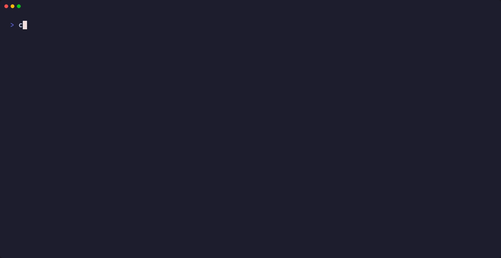
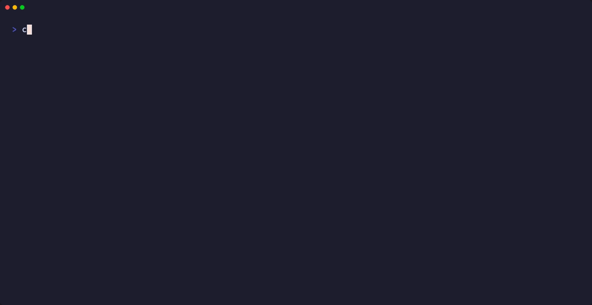
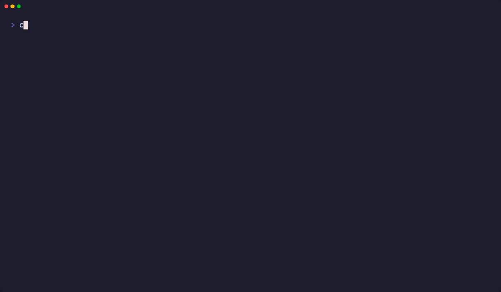

# Demo Evidence Report — STORY-076

**Story:** STORY-076 — Brand Loader: Transform-Aware Theme Color Extraction (srgbClr lumMod/tint/shade)
**Crate:** `slideforge-brand`
**Convergence:** 3/3 strict-CLEAN adversarial passes
**Recording method:** VHS terminal recordings (library/test-harness style — internal crate, no CLI surface)
**Recorded:** 2026-06-01

---

## Coverage Summary

| AC | Description | Recording | Tests Covered | Status |
|----|-------------|-----------|---------------|--------|
| AC-001 | srgbClr + transforms: `is_derived=true`, base hex verbatim, no HSL | `AC-001-srgbclr-derived-flag` | 6 tests | PASS |
| AC-002 | BrandExtractor emits `# derived via tint/shade; may not match exact color` for `is_derived=true` | `AC-002-extractor-derived-comment` | 2 tests | PASS |
| AC-003 | `tracing::warn!` names slot and each transform type (single warn for multiple transforms) | `AC-003-tracing-warn-names-slot` | 2 tests | PASS |
| AC-004 | Clean srgbClr: `is_derived=false`, no warning, no comment (STORY-022 regression) | `AC-004-clean-srgbclr-regression` | 4 tests | PASS |
| AC-005 | `forbid(unsafe_code)`, clippy clean | `AC-004-clean-srgbclr-regression` (clippy run at end) | clippy pass | PASS |

---

## Recordings

### AC-001 — srgbClr with transforms: is_derived=true, base hex stored verbatim

**File:** `AC-001-srgbclr-derived-flag.gif` / `.webm`
**Tape:** `AC-001-srgbclr-derived-flag.tape`
**Traces to:** BC-2.01.001 EC-006 (loading side)

**What it shows:**
- `test_BC_2_01_001_EC006_srgbclr_lummod_sets_derived_flag` — `<a:srgbClr val="003087"><a:lumMod val="75000"/>` sets `is_derived=true`
- `test_BC_2_01_001_EC006_srgbclr_tint_sets_derived_flag` — `<a:tint val="50000"/>` child triggers `is_derived=true`
- `test_BC_2_01_001_EC006_srgbclr_shade_sets_derived_flag` — `<a:shade val="60000"/>` child triggers `is_derived=true`
- `test_BC_2_01_001_EC006_srgbclr_lumoff_sets_derived_flag` — `<a:lumOff val="20000"/>` child triggers `is_derived=true` (EC-002)
- `test_BC_2_01_001_EC006_srgbclr_lummod_preserves_base_hex` — base hex is `#003087`, NOT the luminance-modulated `#002465` (Option B honored)
- `test_BC_2_01_001_EC006_srgbclr_no_hsl_resolution_performed` — three base colors confirmed verbatim with no HSL math applied

**6 tests: 6 passed**



---

### AC-002 — BrandExtractor emits inline TOML comment for derived slots

**File:** `AC-002-extractor-derived-comment.gif` / `.webm`
**Tape:** `AC-002-extractor-derived-comment.tape`
**Traces to:** BC-2.01.003 EC-003 (widened — srgbClr OR schemeClr origin)

**What it shows:**
- `test_BC_2_01_003_EC003_extractor_derived_srgbclr_emits_comment` — end-to-end: PPTX with `dk2 srgbClr + lumMod` → extracted `brand.toml` contains `dk2 = "#003087" # derived via tint/shade; may not match exact color`; the comment appears on the `dk2` line; the resulting TOML is still valid and parseable
- `test_BC_2_01_003_EC003_extractor_unified_flag_drives_comment` — directly exercises `brand_template_to_toml` with a synthetic `BrandTemplate` where `dk2` has `ColorValue::Hex + is_derived=true`; confirms the extractor branches on the flag regardless of whether origin was `schemeClr` or `srgbClr`

**2 tests: 2 passed**



---

### AC-003 — tracing::warn! names slot and transform types (single message)

**File:** `AC-003-tracing-warn-names-slot.gif` / `.webm`
**Tape:** `AC-003-tracing-warn-names-slot.tape`
**Traces to:** BC-2.01.001 EC-006 observability requirement

**What it shows:**
- `test_BC_2_01_001_EC006_srgbclr_warn_names_slot_and_transform` — a `tracing::warn!` subscriber captures the warning message; asserts it contains both `"dk2"` (slot name) and `"lumMod"` (transform type), matching the spec example: `"slot dk2: srgbClr has lumMod child (val=75000); base color #003087 stored with is_derived=true"`
- `test_BC_2_01_001_EC006_srgbclr_multiple_transforms_single_warn` — with both `lumMod` and `tint` present (EC-001): exactly ONE warning is emitted (not two), and that single message contains both `"lumMod"` and `"tint"`

**2 tests: 2 passed**


---

### AC-004 — Clean srgbClr regression (STORY-022 fixtures unaffected)

**File:** `AC-004-clean-srgbclr-regression.gif` / `.webm`
**Tape:** `AC-004-clean-srgbclr-regression.tape`
**Traces to:** BC-2.01.001 postcondition 1 (no regression to clean srgbClr extraction)

**What it shows:**
- `test_BC_2_01_001_EC006_srgbclr_without_transforms_not_derived` — `<a:srgbClr val="FF0000"/>` (self-closing, no children) → `is_derived=false`, correct hex `#FF0000`
- `test_BC_2_01_001_EC006_srgbclr_clean_val_regression` — full 12-slot STORY-022 fixture: all slots have `is_derived=false`, 0 warnings, canonical hex values intact (`#000000`, `#003087`, `#0066CC`, `#551A8B`)
- `test_BC_2_01_001_EC006_derived_flag_not_set_on_sysclr` — `sysClr` slot: `is_derived=false` (sysClr is not a transform)
- `test_BC_2_01_003_EC003_extractor_clean_srgbclr_no_comment` — clean PPTX extraction: brand.toml `[colors]` section contains no `# derived` comments on any line
- Clippy pass (`cargo clippy -p slideforge-brand -- -D warnings`) — confirms `forbid(unsafe_code)` and pedantic lint gate (AC-005)

**4 tests: 4 passed + clippy: 0 warnings**



---

## Error-Path Coverage

| Scenario | Covered by | Expected behavior |
|----------|-----------|-------------------|
| srgbClr with invalid hex val (e.g., `"00FF"`) | `color.rs` pre-existing tests (FINDING-003) | No `is_derived` set; falls back to `MissingColorSlot` warning |
| schemeClr with transforms — unchanged path | EC-004; `sysClr` regression test; color.rs existing tests | `is_derived` already set by STORY-022 schemeClr branch; no change |
| srgbClr with multiple transforms (EC-001) | AC-003 tape: `multiple_transforms_single_warn` | Single `warn!` listing all transform types; `is_derived=true` once |

---

## Test Suite Summary

All 14 STORY-076 Red Gate tests pass. All 250 `slideforge-brand` tests pass (including STORY-022 regression suite).

```
cargo nextest run -p slideforge-brand -E 'test(srgbclr)' --no-fail-fast
Summary: 14 tests run: 14 passed, 236 skipped

cargo nextest run -p slideforge-brand --no-fail-fast
Summary: 250 tests run: 250 passed, 0 skipped
```

---

## Artifact Index

| File | Type | AC(s) |
|------|------|-------|
| `AC-001-srgbclr-derived-flag.gif` | VHS GIF | AC-001 |
| `AC-001-srgbclr-derived-flag.webm` | VHS WebM | AC-001 |
| `AC-001-srgbclr-derived-flag.tape` | VHS script | AC-001 |
| `AC-002-extractor-derived-comment.gif` | VHS GIF | AC-002 |
| `AC-002-extractor-derived-comment.webm` | VHS WebM | AC-002 |
| `AC-002-extractor-derived-comment.tape` | VHS script | AC-002 |
| `AC-003-tracing-warn-names-slot.gif` | VHS GIF | AC-003 |
| `AC-003-tracing-warn-names-slot.webm` | VHS WebM | AC-003 |
| `AC-003-tracing-warn-names-slot.tape` | VHS script | AC-003 |
| `AC-004-clean-srgbclr-regression.gif` | VHS GIF | AC-004, AC-005 |
| `AC-004-clean-srgbclr-regression.webm` | VHS WebM | AC-004, AC-005 |
| `AC-004-clean-srgbclr-regression.tape` | VHS script | AC-004, AC-005 |
| `evidence-report.md` | This file | all |
