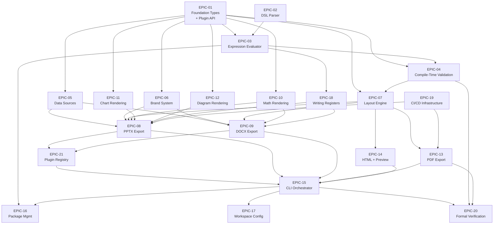

# Story Dependency Graph — slideforge v1.0

> This document defines the story-level dependency DAG. A topological sort
> assigns each story to a wave. Stories in the same wave may execute in parallel.
> The dependency graph is validated acyclic — cargo enforces this for crate deps,
> and the story-level DAG is verified below by topological sort.

### Reading This Document

- **Story file `depends_on`** = authoritative direct dependencies (what must complete before this story starts)
- **Story file `blocks`** = informational advisory, best-effort. May contain both direct and near-transitive entries. NOT authoritative for ordering. The `depends_on` field is the SOLE authoritative source for implementation sequencing.
- **Graph table "Depends On"** = matches story file `depends_on` (direct only)
- **Graph table "Blocks"** = best-effort informational field showing downstream stories affected by this story's completion. Contains a MIX of direct dependents and near-transitive dependents (1-2 hops). NOT authoritative for ordering — use story file `depends_on` exclusively for scheduling decisions. This column exists for blast-radius awareness only.
- **Authoritative source for implementation ordering**: story file `depends_on` frontmatter

---

## Mermaid DAG (High-Level by Epic)



---

## Story-Level Dependency Table

Stories are numbered STORY-NNN within their epic. The story IDs below are
canonical — individual story files use these exact IDs.

### Wave 1 Stories (no dependencies)

| Story ID | Epic | Title | Depends On | Blocks |
|----------|------|-------|------------|--------|
| STORY-001 | EPIC-01 | IR Core Types (Deck, Slide, Value, ContentBlock) | — | STORY-002, STORY-003, STORY-004, STORY-005, STORY-006, STORY-007, STORY-008, STORY-009, STORY-010 |
| STORY-002 | EPIC-01 | Plugin Trait API (all 10 surfaces) | STORY-001 | STORY-003, STORY-049, STORY-050 |
| STORY-003 | EPIC-01 | 31 SlideType Implementations | STORY-001, STORY-002 | STORY-026, STORY-049, STORY-050 |
| STORY-004 | EPIC-01 | Value System + 11-Level Precedence + EMU Types | STORY-001 | STORY-011, STORY-012, STORY-014 |
| STORY-005 | EPIC-02 | Lexer + Mode-Based Tokenization | STORY-001 | STORY-006, STORY-007, STORY-008, STORY-009, STORY-010 |
| STORY-006 | EPIC-02 | Core Parser: Deck, Slide, Fields, Indentation | STORY-005 | STORY-007, STORY-008, STORY-009, STORY-010 |
| STORY-007 | EPIC-02 | Parser: @for, @if/@elif/@else, {{ expr }} | STORY-005, STORY-006 | STORY-011, STORY-012 |
| STORY-008 | EPIC-02 | Parser: @include, variants:, set rules, aliases | STORY-005, STORY-006, STORY-007 | STORY-011, STORY-013 |
| STORY-009 | EPIC-02 | Parser: math delimiters, shape:, DSL versioning, diagnostics | STORY-005, STORY-006, STORY-007, STORY-008 | STORY-029 |
| STORY-010 | EPIC-02 | Error Accumulation + Diagnostic Infrastructure | STORY-005, STORY-006, STORY-007, STORY-008, STORY-009 | STORY-055 |
| STORY-051 | EPIC-19 | CI: fmt + clippy + nextest (5-platform matrix) | — | — |
| STORY-052 | EPIC-19 | CI: Visual Regression (LibreOffice + SSIM/PSNR) | STORY-051 | STORY-037, STORY-040 |
| STORY-053 | EPIC-19 | CI: Supply-Chain Audit (cargo audit + deny + SBOM) | STORY-051 | STORY-054 |
| STORY-054 | EPIC-19 | CI: Release Pipeline + Signed Artifacts + Reproducible Builds | STORY-051, STORY-053 | — |

> **CI story scheduling note:** CI stories (STORY-051-054) run in parallel with code
> stories. The Wave 1 gate requires ALL stories including CI to pass before Wave 2
> starts. This is enforced by the wave gate, NOT by story-level dependencies. STORY-051
> has no `blocks:` entries because the wave-gate mechanism (not story-level deps) ensures
> CI is green before feature stories in Wave 2 begin.

### Wave 2 Stories (depend on Wave 1)

| Story ID | Epic | Title | Depends On | Blocks |
|----------|------|-------|------------|--------|
| STORY-011 | EPIC-03 | Expression Evaluator: {{ expr }}, Arithmetic, Pipe Filters | STORY-001, STORY-005, STORY-006, STORY-010 | STORY-012, STORY-014, STORY-018, STORY-035 |
| STORY-012 | EPIC-03 | Variable Scoping + @for Evaluation + Termination Proof | STORY-011 | STORY-013, STORY-014, STORY-035 |
| STORY-013 | EPIC-03 | @if/@elif/@else Evaluation + @include Cycle Detection | STORY-012 | STORY-018, STORY-035 |
| STORY-014 | EPIC-03 | Type System: No Implicit Coercion + ${{ seq }} Disambiguation | STORY-011, STORY-012 | STORY-066, STORY-067 |
| STORY-015 | EPIC-04 | Alt Text Enforcement (BC-5.01.001-002) | STORY-001, STORY-002, STORY-010 | STORY-016, STORY-017, STORY-037, STORY-039, STORY-043, STORY-045, STORY-046, STORY-068 |
| STORY-016 | EPIC-04 | Canvas Overflow + Zero-Slide + Strict/Warn-Only Mode | STORY-015 | STORY-017, STORY-026, STORY-055, STORY-068 |
| STORY-017 | EPIC-04 | Color-Coded Label + WCAG Contrast Enforcement | STORY-016 | STORY-039, STORY-043, STORY-045, STORY-046, STORY-055, STORY-068 |

### Wave 3 Stories (depend on Wave 2)

| Story ID | Epic | Title | Depends On | Blocks |
|----------|------|-------|------------|--------|
| STORY-018 | EPIC-05 | DataSource: JSON/CSV/YAML/TOML File Loading | STORY-001, STORY-011 | STORY-019, STORY-020, STORY-021 |
| STORY-019 | EPIC-05 | DataSource: HTTP/HTTPS + SSRF Allowlist | STORY-018 | STORY-021 |
| STORY-020 | EPIC-05 | DataSource: Excel (.xlsx) + SQLite | STORY-018 | STORY-021 |
| STORY-021 | EPIC-05 | DataSource: --offline Flag + Error Handling | STORY-019, STORY-020 | STORY-055, STORY-056 |
| STORY-022 | EPIC-06 | Brand Loading: .pptx/.docx Template Extraction | STORY-001 | STORY-023, STORY-024, STORY-025, STORY-037, STORY-038 |
| STORY-023 | EPIC-06 | Brand Synthesis: brand.toml → 31 Layouts + 12 OOXML Slots | STORY-022 | STORY-024, STORY-037, STORY-038, STORY-039, STORY-040 |
| STORY-024 | EPIC-06 | Brand Extraction CLI (slideforge extract-brand) | STORY-022, STORY-023 | STORY-057 |
| STORY-025 | EPIC-06 | Per-Slide brand_overlay: (No Master Switch Invariant) | STORY-022, STORY-023 | STORY-037, STORY-038 |
| STORY-026 | EPIC-07 | Core Layout: Deck → LaidOutDeck, EMU System | STORY-001, STORY-003, STORY-011, STORY-015, STORY-016 | STORY-027, STORY-028, STORY-037, STORY-038, STORY-039, STORY-040, STORY-041, STORY-043, STORY-044, STORY-045, STORY-046, STORY-047, STORY-048, STORY-069 |
| STORY-027 | EPIC-07 | Layout: Document Section Generation (DOCX) | STORY-026 | STORY-041, STORY-042 |
| STORY-028 | EPIC-07 | Layout: shape: Block + Rich Inline Formatting | STORY-026 | STORY-037, STORY-038, STORY-043, STORY-046 |
| STORY-029 | EPIC-10 | Math Parser: $...$ / $$...$$ + @{var} + OMML Output | STORY-001, STORY-005, STORY-009 | STORY-030, STORY-037, STORY-038, STORY-041 |
| STORY-030 | EPIC-10 | Math: MathML (HTML) + Path-Based (PDF) Output | STORY-029 | STORY-043, STORY-044, STORY-046, STORY-047 |
| STORY-031 | EPIC-11 | Chart Renderer: bar/line/pie/scatter/area/histogram/stacked-bar | STORY-001, STORY-002, STORY-011 | STORY-032, STORY-037, STORY-043, STORY-046 |
| STORY-032 | EPIC-11 | Chart: Empty Data Error-Slide Placeholder | STORY-031, STORY-016 | STORY-037, STORY-046 |
| STORY-033 | EPIC-12 | Diagram Renderer: Mermaid → PPTX-Safe SVG (mermaid-rs-renderer) | STORY-001, STORY-002 | STORY-034, STORY-037, STORY-043, STORY-046 |
| STORY-034 | EPIC-12 | SVG Normalization via usvg + Performance Gate (< 200ms cold, < 10ms warm) | STORY-033 | STORY-037, STORY-043, STORY-046 |

### Wave 4 Stories (depend on Wave 3)

| Story ID | Epic | Title | Depends On | Blocks |
|----------|------|-------|------------|--------|
| STORY-035 | EPIC-18 | Writing Register Routing in Evaluator (notes/report/detail) | STORY-011, STORY-012, STORY-013 | STORY-036, STORY-037, STORY-040, STORY-041, STORY-042 |
| STORY-036 | EPIC-18 | Register-Aware Rendering: No Content Bleed Invariant | STORY-035 | STORY-037, STORY-041 |
| STORY-037 | EPIC-08 | PPTX Core Serialization: ooxmlsdk 0.6.1 + ZIP Assembly | STORY-023, STORY-026, STORY-034, STORY-035, STORY-036 | STORY-038, STORY-039, STORY-040, STORY-049, STORY-050 |
| STORY-038 | EPIC-08 | PPTX Layout Compliance: Placeholder Inheritance + Slide IDs + Layouts | STORY-037, STORY-023 | STORY-039, STORY-040, STORY-049, STORY-050 |
| STORY-039 | EPIC-08 | PPTX Accessibility Metadata: alt text, lang, WCAG contrast | STORY-038, STORY-015 | STORY-049, STORY-050 |
| STORY-040 | EPIC-08 | PPTX: Speaker Notes + notesMaster1.xml + handoutMaster1.xml | STORY-038, STORY-035 | STORY-049, STORY-050 |
| STORY-041 | EPIC-09 | DOCX Core Serialization: report register + ooxmlsdk | STORY-026, STORY-035, STORY-036, STORY-077 | STORY-042, STORY-049, STORY-050 |
| STORY-042 | EPIC-09 | DOCX: Auto-Generated Document Sections | STORY-041, STORY-027, STORY-077 | STORY-049, STORY-050 |
| STORY-077 | EPIC-18 | SectionBlock IR Extension: FieldValue body + section-level register routing | STORY-006, STORY-007, STORY-008, STORY-011, STORY-012, STORY-013, STORY-027 | STORY-041, STORY-042 |
| STORY-043 | EPIC-13 | PDF Core: pdf-writer + krilla + SlideTagEngine | STORY-026, STORY-034 | STORY-044, STORY-045, STORY-049, STORY-050 |
| STORY-044 | EPIC-13 | PDF: EMU-to-PDF Coordinate Mapping + Y-Axis Flip | STORY-043 | STORY-045, STORY-049, STORY-050 |
| STORY-045 | EPIC-13 | PDF: PDF/UA-1 Tagging + veraPDF CI Gate | STORY-043, STORY-044 | STORY-049, STORY-050 |
| STORY-083 | EPIC-21 | Plugin Registry Builder + Surface Enforcement | STORY-002 | STORY-049 |
| STORY-084 | EPIC-21 | Bundled SectionType Implementations | STORY-002, STORY-042, STORY-077 | STORY-049 |
| STORY-085 | EPIC-21 | Bundled DefaultInlineFormat + PPTX OOXML Dog-Fooding Refactor | STORY-002, STORY-028, STORY-037, STORY-038 | STORY-049 |
| STORY-049 | EPIC-21 | Plugin Registry Assembly (root crate) | STORY-002, STORY-003, STORY-015, STORY-016, STORY-017, STORY-018, STORY-019, STORY-020, STORY-021, STORY-022, STORY-023, STORY-029, STORY-031, STORY-033, STORY-034, STORY-037, STORY-038, STORY-039, STORY-040, STORY-041, STORY-042, STORY-043, STORY-044, STORY-045, STORY-083, STORY-084, STORY-085 | STORY-050 |
| STORY-050 | EPIC-21 | End-to-End Integration Test Suite (all formats, all slide types) | STORY-049 | STORY-055 |

### Wave 5 Stories (depend on Wave 4)

| Story ID | Epic | Title | Depends On | Blocks |
|----------|------|-------|------------|--------|
| STORY-089 | EPIC-01 | FieldDef Type Annotation + validate_fields E-VAL-104 Enforcement | — (all deps merged: STORY-003 Wave 1, STORY-086 Wave 4) | — |
| STORY-046 | EPIC-14 | Static HTML Exporter: WCAG AA via axe-core | STORY-026, STORY-034, STORY-049 | STORY-047, STORY-048 |
| STORY-047 | EPIC-14 | Web Preview Server: axum + WebSocket + SVG Canvas | STORY-046 | STORY-048 |
| STORY-048 | EPIC-14 | Web Preview: Live Reload + Accessibility (ARIA, keyboard nav) | STORY-047 | — |
| STORY-055 | EPIC-15 | CLI: build command + miette error rendering | STORY-010, STORY-049, STORY-050 | STORY-056, STORY-057, STORY-058, STORY-059 |
| STORY-056 | EPIC-15 | CLI: watch mode + notify integration + incremental rebuild | STORY-055, STORY-047 | — |
| STORY-057 | EPIC-15 | CLI: init scaffolding + extract-brand command | STORY-055, STORY-024 | — |
| STORY-058 | EPIC-15 | CLI: --json/--quiet/--verbose flags + NO_COLOR + non-TTY | STORY-055 | — |
| STORY-059 | EPIC-15 | CLI: Criterion performance benchmarks (NFR-001, NFR-002) | STORY-055, STORY-056 | — |
| STORY-060 | EPIC-16 | Package: install + sf.lock + SHA-256 integrity | STORY-055 | STORY-061, STORY-062, STORY-063 |
| STORY-061 | EPIC-16 | Package: @import resolution in evaluator | STORY-060, STORY-013 | — |
| STORY-062 | EPIC-16 | Package: remove + list + missing lock warning | STORY-060 | — |
| STORY-063 | EPIC-16 | Package: verify (SHA-256 checksum audit) | STORY-060 | — |
| STORY-064 | EPIC-17 | Workspace: slideforge.toml [workspace] + build --workspace | STORY-055 | STORY-065 |
| STORY-065 | EPIC-17 | Workspace: .sfconfig cascade + config explain provenance | STORY-064 | — |

| STORY-082 | EPIC-08 | PPTX: Slide-Grouping Sections (sectionLst) — DSL + IR + Eval + Exporter | STORY-040, STORY-078 | — |

### Wave 6 Stories (Phase 6 Formal Verification)

| Story ID | Epic | Title | Depends On | Blocks |
|----------|------|-------|------------|--------|
| STORY-066 | EPIC-20 | Kani Proofs: slideforge-syntax (VP-001, VP-003, VP-009, VP-014) | STORY-005, STORY-006, STORY-007, STORY-008, STORY-009, STORY-010 | — |
| STORY-067 | EPIC-20 | Kani Proofs: slideforge-eval (VP-004, VP-005, VP-010, VP-015) | STORY-011, STORY-012, STORY-013, STORY-014 | — |
| STORY-068 | EPIC-20 | Kani Proofs: slideforge-validate (VP-002, VP-007, VP-008) | STORY-015, STORY-016, STORY-017, STORY-043, STORY-044 | — |
| STORY-069 | EPIC-20 | Proptest Suites: brand (VP-012) + pptx (VP-013) + layout (VP-011) | STORY-023, STORY-026, STORY-037 | — |
| STORY-070 | EPIC-20 | Kani Proofs: slideforge-pdf (VP-006) | STORY-043, STORY-044 | — |
| STORY-071 | EPIC-20 | Fuzz Harnesses + cargo-mutants Integration (VP-014, VP-015) | STORY-005, STORY-006, STORY-007, STORY-008, STORY-009, STORY-010, STORY-011, STORY-012, STORY-013, STORY-014, STORY-066, STORY-067 | — |

---

## Canonical Story ID Table (Fully Sequential)

> This is the authoritative mapping. Story files are named `STORY-NNN-[short].md`.

| Story ID | Epic | Short Title | Wave | Priority | Est. Points |
|----------|------|------------|------|---------|-------------|
| STORY-001 | EPIC-01 | ir-core-types | 1 | P0 | 5 |
| STORY-002 | EPIC-01 | plugin-trait-api | 1 | P0 | 5 |
| STORY-003 | EPIC-01 | slide-type-impls | 1 | P0 | 8 |
| STORY-004 | EPIC-01 | value-system-emu | 1 | P0 | 5 |
| STORY-005 | EPIC-02 | lexer-tokenization | 1 | P0 | 5 |
| STORY-006 | EPIC-02 | parser-core | 1 | P0 | 8 |
| STORY-007 | EPIC-02 | parser-control-flow | 1 | P0 | 8 |
| STORY-008 | EPIC-02 | parser-includes-variants | 1 | P0 | 8 |
| STORY-009 | EPIC-02 | parser-math-shape-version | 1 | P0 | 5 |
| STORY-010 | EPIC-02 | error-accumulation-infra | 1 | P0 | 5 |
| STORY-011 | EPIC-03 | expr-evaluator-core | 2 | P0 | 8 |
| STORY-012 | EPIC-03 | scoping-for-iteration | 2 | P0 | 8 |
| STORY-013 | EPIC-03 | conditional-include-cycle | 2 | P0 | 5 |
| STORY-014 | EPIC-03 | type-system-no-coercion | 2 | P0 | 5 |
| STORY-015 | EPIC-04 | alt-text-enforcement | 2 | P0 | 5 |
| STORY-016 | EPIC-04 | canvas-overflow-validation | 2 | P0 | 5 |
| STORY-017 | EPIC-04 | wcag-contrast-label-check | 2 | P0 | 5 |
| STORY-018 | EPIC-05 | datasource-file-formats | 3 | P0 | 5 |
| STORY-019 | EPIC-05 | datasource-http-ssrf | 3 | P0 | 8 |
| STORY-020 | EPIC-05 | datasource-excel-sqlite | 3 | P0 | 5 |
| STORY-021 | EPIC-05 | datasource-offline-errors | 3 | P0 | 3 |
| STORY-022 | EPIC-06 | brand-load-extraction | 3 | P0 | 5 |
| STORY-023 | EPIC-06 | brand-synthesis-layouts | 3 | P0 | 13 |
| STORY-024 | EPIC-06 | brand-extract-cli | 3 | P0 | 3 |
| STORY-025 | EPIC-06 | brand-overlay-per-slide | 3 | P1 | 3 |
| STORY-026 | EPIC-07 | layout-core-emu | 3 | P0 | 8 |
| STORY-027 | EPIC-07 | layout-docx-sections | 3 | P0 | 5 |
| STORY-028 | EPIC-07 | layout-shape-inline | 3 | P1 | 5 |
| STORY-029 | EPIC-10 | math-parser-omml | 3 | P1 | 8 |
| STORY-030 | EPIC-10 | math-mathml-pdf | 3 | P1 | 5 |
| STORY-031 | EPIC-11 | chart-renderer-core | 3 | P1 | 8 |
| STORY-032 | EPIC-11 | chart-empty-data | 3 | P1 | 3 |
| STORY-033 | EPIC-12 | diagram-mermaid-render | 3 | P1 | 8 |
| STORY-034 | EPIC-12 | diagram-svg-normalize-perf | 3 | P1 | 5 |
| STORY-035 | EPIC-18 | register-routing-eval | 4 | P0 | 5 |
| STORY-036 | EPIC-18 | register-no-bleed-invariant | 4 | P0 | 5 |
| STORY-037 | EPIC-08 | pptx-core-serialization | 4 | P0 | 13 |
| STORY-038 | EPIC-08 | pptx-layout-compliance | 4 | P0 | 8 |
| STORY-039 | EPIC-08 | pptx-a11y-metadata | 4 | P0 | 8 |
| STORY-040 | EPIC-08 | pptx-notes-sections-masters | 4 | P0 | 3 |
| STORY-041 | EPIC-09 | docx-core-serialization | 4 | P0 | 8 |
| STORY-042 | EPIC-09 | docx-auto-sections | 4 | P0 | 5 |
| STORY-043 | EPIC-13 | pdf-core-backend | 4 | P0 | 8 |
| STORY-044 | EPIC-13 | pdf-coordinate-mapping | 4 | P0 | 5 |
| STORY-045 | EPIC-13 | pdf-ua1-tagging-verapdf | 4 | P0 | 5 |
| STORY-046 | EPIC-14 | html-exporter-wcag | 5 | P0 | 8 |
| STORY-047 | EPIC-14 | preview-server-websocket | 5 | P1 | 8 |
| STORY-048 | EPIC-14 | preview-live-reload-a11y | 5 | P1 | 8 |
| STORY-049 | EPIC-21 | plugin-registry-assembly | 4 | P0 | 5 |
| STORY-050 | EPIC-21 | e2e-integration-tests | 4 | P0 | 8 |
| STORY-051 | EPIC-19 | ci-matrix-lint | 1 | P0 | 5 |
| STORY-052 | EPIC-19 | ci-visual-regression | 1 | P0 | 5 |
| STORY-053 | EPIC-19 | ci-supply-chain-audit | 1 | P0 | 5 |
| STORY-054 | EPIC-19 | ci-release-pipeline | 1 | P0 | 8 |
| STORY-055 | EPIC-15 | cli-build-command | 5 | P0 | 8 |
| STORY-056 | EPIC-15 | cli-watch-mode | 5 | P0 | 8 |
| STORY-057 | EPIC-15 | cli-init-extract-brand | 5 | P0 | 5 |
| STORY-058 | EPIC-15 | cli-flags-nocolor | 5 | P0 | 5 |
| STORY-059 | EPIC-15 | cli-criterion-benchmarks | 5 | P0 | 5 |
| STORY-060 | EPIC-16 | pkg-install-lock | 5 | P1 | 8 |
| STORY-061 | EPIC-16 | pkg-import-resolution | 5 | P1 | 5 |
| STORY-062 | EPIC-16 | pkg-remove-list | 5 | P1 | 3 |
| STORY-063 | EPIC-16 | pkg-verify-integrity | 5 | P1 | 3 |
| STORY-064 | EPIC-17 | workspace-build | 5 | P1 | 5 |
| STORY-065 | EPIC-17 | workspace-sfconfig-explain | 5 | P1 | 5 |
| STORY-066 | EPIC-20 | kani-syntax (VP-001, VP-003, VP-009, VP-014) | 6 | P0 | 8 |
| STORY-067 | EPIC-20 | kani-eval | 6 | P0 | 8 |
| STORY-068 | EPIC-20 | kani-validate-pdf | 6 | P0 | 8 |
| STORY-069 | EPIC-20 | proptest-brand-pptx-layout | 6 | P0 | 5 |
| STORY-070 | EPIC-20 | kani-pdf | 6 | P0 | 5 |
| STORY-071 | EPIC-20 | fuzz-mutants | 6 | P0 | 8 |
| STORY-072 | EPIC-07 | shape-gradient-fills | 5 | P2 | 3 |
| STORY-073 | EPIC-07 | bullets-layout | 4 | P1 | 5 |
| STORY-074 | EPIC-07 | brand-em-sizing | 5 | P2 | 3 |
| STORY-075 | EPIC-06 | brand-loader-footer-detection | 4 | P1 | 3 |
| STORY-076 | EPIC-06 | brand-srgbclr-transform-extraction | 4 | P1 | 3 |
| STORY-077 | EPIC-18 | section-block-ir-extension | 4 | P0 | 13 |
| STORY-078 | EPIC-02 | parser-section-block-syntax | 4 | P0 | 5 |
| STORY-079 | EPIC-12 | diagrams-svg-dos-hardening | 5 | P2 | 3 |
| STORY-080 | EPIC-19 | deflake-cross-platform-tests | 5 | P2 | 3 |
| STORY-081 | EPIC-18 | slide-level-inline-markup | 5 | P0 | 13 |
| STORY-082 | EPIC-08 | pptx-slide-sections | 5 | P0 | 5 |
| STORY-083 | EPIC-21 | plugin-registry-builder | 4 | P0 | 3 |
| STORY-084 | EPIC-21 | bundled-section-types | 4 | P0 | 3 |
| STORY-085 | EPIC-21 | bundled-inline-formats | 4 | P0 | 8 |
| STORY-086 | EPIC-03 | slide-field-to-block-threading | 4 | P0 | 21 |
| STORY-087 | EPIC-01 | color-coded-slide-types | 4 | P1 | 13 |
| STORY-088 | EPIC-02 | bullets-list-literal-dsl-syntax | 5 | P1 | 8 |
| STORY-089 | EPIC-01 | field-value-type-validation | 5 | P0 | 8 |

> Note: Stories STORY-051 through STORY-054 are the EPIC-19 CI stories (Wave 1).
> Stories STORY-055 through STORY-059 are EPIC-15 CLI stories (Wave 5).
> Stories STORY-060 through STORY-063 are EPIC-16 package management stories (Wave 5).
> Stories STORY-064 through STORY-065 are EPIC-17 workspace configuration stories (Wave 5).
> Stories STORY-066 through STORY-071 are EPIC-20 formal verification stories (Wave 6).

---

## Topological Sort Validation

The following is the verified topological ordering (wave assignment computed by
depth-first search on the dependency graph).

```
Wave 1 (no prerequisites):
  STORY-001, STORY-002, STORY-003, STORY-004,   ← EPIC-01
  STORY-005, STORY-006, STORY-007, STORY-008, STORY-009, STORY-010,  ← EPIC-02
  STORY-051, STORY-052, STORY-053, STORY-054    ← EPIC-19

Wave 2 (prereqs all in Wave 1):
  STORY-011, STORY-012, STORY-013, STORY-014,   ← EPIC-03
  STORY-015, STORY-016, STORY-017               ← EPIC-04

Wave 3 (prereqs all in Waves 1-2):
  STORY-018, STORY-019, STORY-020, STORY-021,   ← EPIC-05
  STORY-022, STORY-023, STORY-024, STORY-025,   ← EPIC-06
  STORY-026, STORY-027, STORY-028,              ← EPIC-07
  STORY-029, STORY-030,                         ← EPIC-10
  STORY-031, STORY-032,                         ← EPIC-11
  STORY-033, STORY-034                          ← EPIC-12

Wave 4 (prereqs all in Waves 1-3):
  STORY-035, STORY-036, STORY-077,              ← EPIC-18
  STORY-037, STORY-038, STORY-039, STORY-040,   ← EPIC-08
  STORY-041, STORY-042,                         ← EPIC-09
  STORY-043, STORY-044, STORY-045,              ← EPIC-13
  STORY-073, STORY-075, STORY-076,              ← EPIC-06/07 (pulled-in P1)
  STORY-078,                                    ← EPIC-02 (Batch A prerequisite)
  STORY-083, STORY-084, STORY-085,              ← EPIC-21 Batch C prerequisites (LESSON-13)
  STORY-049, STORY-050,                         ← EPIC-21 (depend on 083+084+085)
  STORY-086, STORY-087                          ← EPIC-03/01 (Wave 4 remediation + pull-in)

Wave 5 (prereqs all in Waves 1-4):
  STORY-089,                                    ← EPIC-01 (slot 1 — independent, zero Wave 5 deps; Wave-4 follow-up (d))
  STORY-046, STORY-047, STORY-048,              ← EPIC-14
  STORY-055, STORY-056, STORY-057, STORY-058, STORY-059,  ← EPIC-15
  STORY-060, STORY-061, STORY-062, STORY-063,   ← EPIC-16
  STORY-064, STORY-065,                         ← EPIC-17
  STORY-072, STORY-074, STORY-079, STORY-080,   ← EPIC-07/12/19 (deferred surfaces)
  STORY-081, STORY-082, STORY-088              ← EPIC-18/08/02 (follow-up stories)

Wave 6 (prereqs all in Waves 1-5):
  STORY-066, STORY-067, STORY-068, STORY-069, STORY-070, STORY-071  ← EPIC-20
```

Cycle check: PASS. The above is a valid topological order. No story appears before
its dependencies. The dependency graph is a DAG.

---

## BC-to-Stories Traceability Matrix

| BC-S.SS.NNN | Stories | Coverage |
|-------------|---------|---------|
| BC-1.01.001 | STORY-006 | Full |
| BC-1.01.002 | STORY-006 | Full |
| BC-1.01.003 | STORY-005 | Full |
| BC-1.01.004 | STORY-008 | Full |
| BC-1.01.005 | STORY-009 | Full |
| BC-1.01.006 | STORY-009 | Full |
| BC-1.02.001 | STORY-011 | Full |
| BC-1.02.002 | STORY-011 | Full |
| BC-1.02.003 | STORY-004, STORY-014 | Full |
| BC-1.02.004 | STORY-014 | Full |
| BC-1.02.005 | STORY-012 | Full |
| BC-1.03.001 | STORY-018 | Full |
| BC-1.03.002 | STORY-019 | Full |
| BC-1.03.003 | STORY-018 | Full |
| BC-1.03.004 | STORY-021 | Full |
| BC-1.03.005 | STORY-019 | Full |
| BC-1.03.006 | STORY-020 | Full |
| BC-1.03.007 | STORY-020 | Full |
| BC-1.04.001 | STORY-007, STORY-012 | Full |
| BC-1.04.002 | STORY-012 | Full |
| BC-1.04.003 | STORY-012 | Full |
| BC-1.05.001 | STORY-007, STORY-013 | Full |
| BC-1.05.002 | STORY-013 | Full |
| BC-1.06.001 | STORY-008 | Full |
| BC-1.06.002 | STORY-013 | Full |
| BC-1.06.003 | STORY-008 | Full |
| BC-1.06.004 | STORY-061 | Full |
| BC-1.07.001 | STORY-008 | Full |
| BC-1.07.002 | STORY-008, STORY-012 | Full |
| BC-1.07.003 | STORY-008 | Full |
| BC-1.07.004 | STORY-008 | Full |
| BC-1.07.005 | STORY-008 | Full |
| BC-1.08.001 | STORY-008, STORY-012 | Full |
| BC-1.08.002 | STORY-008, STORY-012 | Full |
| BC-1.08.003 | STORY-008, STORY-012 | Full |
| BC-1.09.001 | STORY-008, STORY-009 | Full |
| BC-1.09.002 | STORY-008 | Full |
| BC-1.10.001 | STORY-029 | Full |
| BC-1.10.002 | STORY-029 | Full |
| BC-1.10.003 | STORY-029, STORY-030 | Full |
| BC-1.11.001 | STORY-031 | Full |
| BC-1.11.002 | STORY-032 | Full |
| BC-1.12.001 | STORY-033 | Full |
| BC-1.12.002 | STORY-033 | Full |
| BC-1.12.003 | STORY-034 | Full |
| BC-1.13.001 | STORY-009 | Full |
| BC-1.14.001 | STORY-035 | Full |
| BC-1.14.002 | STORY-035 | Full |
| BC-1.14.003 | STORY-035, STORY-077, STORY-082 | Full (slide-level: STORY-035; section-level: STORY-077; sectionLst non-interference: STORY-082 AC-008) |
| BC-1.14.004 | STORY-035, STORY-036 | Full (invariant 3 unit test: STORY-035 AC-008; integration: STORY-036) |
| BC-1.15.001 | STORY-010, STORY-055, STORY-058 | Full |
| BC-1.15.002 | STORY-010, STORY-055 | Full |
| BC-1.15.003 | STORY-010, STORY-016, STORY-055 | Full |
| BC-2.01.001 | STORY-022 | Full |
| BC-2.01.002 | STORY-023 | Full |
| BC-2.01.003 | STORY-024 | Full |
| BC-2.01.004 | STORY-023 | Full |
| BC-2.01.005 | STORY-023 | Full |
| BC-2.01.006 | STORY-022 | Full |
| BC-2.02.001 | STORY-025 | Full |
| BC-2.02.002 | STORY-025 | Full |
| BC-3.01.001 | STORY-003 | Full |
| BC-3.01.002 | STORY-003 | Full |
| BC-3.01.003 | STORY-003 | Full |
| BC-3.02.002 | STORY-027, STORY-077 | Full (auto-generated sections: STORY-027; manually authored section IR extension + register routing: STORY-077) — STORY-081 re-anchored to BC-3.05.001 v1.4.0 (human ruling 2026-06-09; slide-level markup belongs to inline-formatting BC, not section-block BC) |
| BC-3.02.001 | STORY-027 | Full |
| BC-3.03.001 | STORY-016 | Full |
| BC-3.03.002 | STORY-016 | Full |
| BC-3.03.003 | STORY-016 | Full |
| BC-3.03.004 | STORY-016 | Full |
| BC-3.04.001 | STORY-028 | Full |
| BC-3.04.002 | STORY-009 | Full |
| BC-3.05.001 | STORY-028, STORY-081 | Full (original rich inline formatting: STORY-028; slide-level inline markup re-anchored from BC-3.02.002: STORY-081, per human ruling 2026-06-09; BC-3.05.001 amended to v1.4.0 with slide-level field scope + per-exporter matrix + HI-1..HI-5 hyperlink invariants) |
| BC-4.01.001 | STORY-037 | Full |
| BC-4.01.002 | STORY-052 | Full |
| BC-4.01.003 | STORY-040 (Half A: speaker notes + master), STORY-082 (Half B: sectionLst) | Full — human-authorized scope split 2026-06-04 |
| BC-4.01.004 | STORY-039 | Full |
| BC-4.01.005 | STORY-038 | Full |
| BC-4.01.006 | STORY-040 | Full |
| BC-4.02.001 | STORY-041 | Full |
| BC-4.02.002 | STORY-042 | Full |
| BC-4.03.001 | STORY-045 | Full |
| BC-4.03.002 | STORY-043 | Full |
| BC-4.03.003 | STORY-046 | Full |
| BC-4.03.004 | STORY-047 | Full |
| BC-4.03.005 | STORY-044 | Full |
| BC-5.01.001 | STORY-015 | Full |
| BC-5.01.002 | STORY-015 | Full |
| BC-5.01.003 | STORY-017 | Full |
| BC-5.01.004 | STORY-017 | Full |
| BC-5.01.005 | STORY-017, STORY-039 | Full |
| BC-5.02.001 | STORY-002, STORY-083, STORY-084, STORY-085, STORY-049 | Full |
| BC-5.02.002 | STORY-002, STORY-085, STORY-049 | Full |
| BC-5.03.001 | STORY-060 | Full |
| BC-5.03.002 | STORY-061 | Full |
| BC-5.03.003 | STORY-060 | Full |
| BC-5.03.004 | STORY-062 | Full |
| BC-5.03.005 | STORY-062 | Full |
| BC-5.03.006 | STORY-063 | Full |
| BC-5.04.001 | STORY-064 | Full |
| BC-5.04.002 | STORY-065 | Full |
| BC-5.04.003 | STORY-065 | Full |
| BC-5.05.001 | STORY-056 | Full |
| BC-5.05.002 | STORY-056 | Full |
| BC-5.05.003 | STORY-056 | Full |
| BC-5.05.004 | STORY-056 | Full |
| BC-5.05.005 | STORY-048 | Full |
| BC-5.06.001 | STORY-057 | Full |
| BC-5.06.002 | STORY-057 | Full |
| BC-3.06.001 | STORY-026 | Full |
| BC-3.06.002 | STORY-026 | Full |
| BC-3.06.003 | STORY-026 | Full |

**Coverage result: 112/112 BCs covered. Zero orphan BCs.**
(BC-3.02.002 now covered by STORY-027 + STORY-077; BC-1.14.003 now covered by STORY-035 + STORY-077 + STORY-082; BC-1.14.004 now covered by STORY-035 + STORY-036 — updated 2026-05-31 per architect directive F-002. BC-4.01.003 Half A covered by STORY-040, Half B covered by STORY-082 — updated 2026-06-04 per human-authorized scope split.)

---

## VP-to-Stories Traceability Matrix

| VP-NNN | Stories Exercising It | BC Source | Tool | Phase |
|--------|----------------------|-----------|------|-------|
| VP-001 | STORY-005, STORY-066 | BC-1.01.003 | Kani | P6 |
| VP-002 | STORY-015, STORY-068 | BC-5.01.001 | Kani | P6 |
| VP-003 | STORY-012, STORY-066 | BC-1.04.003 | Kani | P6 |
| VP-004 | STORY-014, STORY-067 | BC-1.02.003 | Kani | P6 |
| VP-005 | STORY-011, STORY-067 | BC-1.02.001 | Kani | P6 |
| VP-006 | STORY-044, STORY-070 | BC-4.03.005 | Kani | P6 |
| VP-007 | STORY-017, STORY-068 | BC-4.01.004, BC-4.03.003 | Kani | P6 |
| VP-008 | STORY-015, STORY-068 | BC-5.01.001 | Kani | P6 |
| VP-009 | STORY-006, STORY-066 | BC-1.01.001 | proptest | P3 |
| VP-010 | STORY-012, STORY-067 | BC-1.02.005 | proptest | P3 |
| VP-011 | STORY-026, STORY-069 | DI-009, DI-012 | proptest | P3 |
| VP-012 | STORY-023, STORY-069 | BC-2.01.002 | proptest | P3 |
| VP-013 | STORY-037, STORY-069 | BC-4.01.001 | proptest | P3 |
| VP-014 | STORY-005, STORY-066, STORY-071 | BC-1.01.001 | fuzz/Kani | P6 |
| VP-015 | STORY-011, STORY-067, STORY-071 | BC-1.02.001 | fuzz | P6 |

**Coverage result: 15/15 VPs covered. Zero orphan VPs.**

---

## NFR-to-Stories Traceability Matrix

| NFR-NNN | Stories Implementing It | Validation Method |
|---------|------------------------|------------------|
| NFR-001 | STORY-059 | criterion benchmark in CI |
| NFR-002 | STORY-059 | criterion benchmark in CI |
| NFR-003 | STORY-034 | unit benchmark (Criterion) |
| NFR-004 | STORY-034 | unit benchmark (Criterion) |
| NFR-005 | STORY-059 | criterion benchmark in CI |
| NFR-006 | STORY-059 | CI memory profiling |
| NFR-007 | STORY-052 | CI visual regression (SSIM) |
| NFR-008 | STORY-052 | CI visual regression (PSNR) |
| NFR-009 | STORY-052 | CI PNG count check |
| NFR-010 | STORY-052 | Manual phase-gate |
| NFR-011 | STORY-052 | Visual regression diff |
| NFR-012 | STORY-045 | veraPDF --flavour ua1 gate |
| NFR-013 | STORY-046, STORY-048 | @axe-core/playwright on CI |
| NFR-014 | STORY-039 | Snapshot test inspection |
| NFR-015 | STORY-039 | PPTX linter test (custom) |
| NFR-016 | STORY-053 | cargo audit on every PR |
| NFR-017 | STORY-053 | cargo deny on every PR |
| NFR-018 | STORY-063 | Unit test checksum verification |
| NFR-019 | STORY-019 | Unit + integration test |
| NFR-020 | STORY-054 | CI release job check |
| NFR-021 | STORY-051 | cargo clippy --unwrap_used |
| NFR-022 | STORY-051 | cargo clippy -D warnings |
| NFR-023 | STORY-051 | RUSTDOCFLAGS="-D warnings" cargo doc |
| NFR-024 | STORY-001 | cargo clippy (compile-level) |
| NFR-025 | STORY-051 | grep Cargo.toml for unpinned deps |
| NFR-026 | STORY-051 | CI matrix: macos-14 |
| NFR-027 | STORY-051 | CI matrix: macos-13 |
| NFR-028 | STORY-051 | CI matrix: ubuntu-latest |
| NFR-029 | STORY-051 | CI matrix: ubuntu-24.04-arm |
| NFR-030 | STORY-051 | CI matrix: windows-latest |
| NFR-031 | STORY-054 | reproducible-build CI job |
| NFR-032 | STORY-055 | tracing instrumentation audit |
| NFR-033 | STORY-058 | JSON output unit test |
| NFR-034 | STORY-050 | holdout-evaluator Phase 4 |
| NFR-035 | STORY-050 | holdout-evaluator Phase 4 |

**Coverage result: 35/35 NFRs covered.**

---

## Edge Case Coverage Matrix

| Source | EC/Error ID | Description | Story | AC/EC Reference |
|--------|-------------|-------------|-------|----------------|
| DEC-001 | DEC-001 | Empty @for collection | STORY-012 | AC covering BC-1.04.002 |
| DEC-002 | DEC-002 | Missing field on data access | STORY-018 | AC covering BC-1.03.003 |
| DEC-003 | DEC-003 | Circular @include chain | STORY-008, STORY-013 | AC covering BC-1.01.004, BC-1.06.002 |
| DEC-004 | DEC-004 | Variant precedence chain | STORY-008 | AC covering BC-1.07.002 |
| DEC-005 | DEC-005 | Brand.* in set rules evaluated after brand loading | STORY-008 | AC covering BC-1.08.003 |
| DEC-006 | DEC-006 | @include with variable path reports resolved path | STORY-008 | AC covering BC-1.06.003 |
| DEC-007 | DEC-007 | HTTP data source failure in watch mode | STORY-056 | AC covering BC-5.05.002 |
| DEC-008 | DEC-008 | decorative: true opts out of alt | STORY-015 | AC covering BC-5.01.002 |
| DEC-009 | DEC-009 | ${{ seq }} as text, not math | STORY-014 | AC covering BC-1.02.004 |
| DEC-010 | DEC-010 | Var name collides with slide type keyword | STORY-009 | AC covering BC-1.01.006 |
| DEC-011 | DEC-011 | Zero-slide deck | STORY-016 | AC covering BC-3.03.004 |
| DEC-012 | DEC-012 | Variant excludes all slides | STORY-008 | AC covering BC-1.07.005 |
| DEC-013 | DEC-013 | Canvas overflow EMU estimate | STORY-016 | AC covering BC-3.03.001 |
| DEC-014 | DEC-014 | Chart with empty data | STORY-032 | AC covering BC-1.11.002 |
| DEC-015 | DEC-015 | Invalid Mermaid syntax | STORY-033 | AC covering BC-1.12.002 |
| DEC-016 | DEC-016 | brand.toml missing color slots | STORY-023 | AC covering BC-2.01.004 |
| DEC-017 | DEC-017 | Lexical scoping nested @for | STORY-012 | AC covering BC-1.02.005 |
| DEC-018 | DEC-018 | Watch mode HTTP schema change | STORY-056 | AC covering BC-5.05.003 |
| DEC-019 | DEC-019 | @import not in sf.lock | STORY-061 | AC covering BC-5.03.002 |
| DEC-020 | DEC-020 | --variant flag with undefined variant | STORY-008 | AC covering BC-1.07.004 |

**Coverage result: 20/20 DEC edge cases covered. Zero orphan edge cases.**

---

## Gap Register

One gap was identified and resolved during the STORY-035 adversarial review pass
(2026-05-31). It is recorded here with its resolution target.

| Gap ID | Level | Source | Clause/Item | Justification | Resolution Target |
|--------|-------|--------|-------------|---------------|-------------------|
| GAP-001 | L2 | BC-3.02.002 postcondition 1 / EC-004 | Section-level `detail:` / `report:` sub-block content routing to `RegisteredContent` — descoped from STORY-035 because `SectionBlock.body: OrderedMap<Arc<str>, Value>` cannot carry `FieldValue::Inlines`. A plain-string workaround violates evaluate-stage routing invariant (BC-1.14.003 invariant 1). | STORY-077 (Wave 4 Batch A) |
| GAP-001 | L2 | STORY-035 EC-003 | Standalone `section detail:` with no parent slide → `Detail` entry on section node — descoped from STORY-035 for same IR-limitation reason. | STORY-077 (Wave 4 Batch A) — AC-006 delivers this behavior |

---

## Longest Wave-Sequential Path

The longest dependency chain through the story graph (critical path by wave-sequential
depth). Note: Wave 6 stories (STORY-066-071) have a shallow structural dependency depth
(approximately 7 hops from STORY-001) but are placed in Wave 6 by scheduling policy to
ensure implementation completeness before formal verification begins. Their wave-6
placement is a deliberate scheduling choice, not a consequence of deep structural
dependency.

```
STORY-001 (types)
  → STORY-005 (lexer)
    → STORY-006 (parser core)
      → STORY-007 (parser control flow)
        → STORY-008 (parser includes)
          → STORY-009 (parser math/shape)
            → STORY-010 (error infra)
              → STORY-011 (eval core)  [via STORY-001, STORY-005, STORY-006, STORY-010]
                → STORY-012 (for iteration)
                  → STORY-013 (if/include)
                    → STORY-035 (register routing)  [via STORY-011, STORY-012, STORY-013]
                      → STORY-036 (register bleed invariant)
                        → STORY-037 (pptx core)  [via STORY-023, STORY-026, STORY-034, STORY-035, STORY-036]
                          → STORY-038 (pptx layout)
                            → STORY-040 (pptx notes/sections)  [via STORY-038, STORY-035]
                              → STORY-049 (plugin registry)
                                → STORY-050 (e2e tests)
                                  → STORY-055 (cli build)  [via STORY-010, STORY-049, STORY-050]
                                    → STORY-056 (watch mode)  [via STORY-055, STORY-047]
                                      → STORY-059 (benchmarks)  [via STORY-055, STORY-056]
                                        → STORY-066 (kani-syntax) [P6]
```

Longest wave-sequential path: ~18 hops, terminating at STORY-059. No story on this
path can be deferred without delaying subsequent waves. The chain through STORY-066
adds ~1 more hop for the formal verification wave, but STORY-066's actual structural
depth from STORY-001 via the parser chain is only ~7 hops — its Wave 6 position is
enforced by scheduling policy (Wave 5 gate PASS required), not structural dependency depth.
